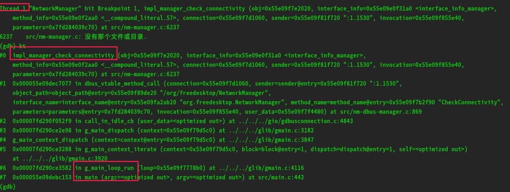
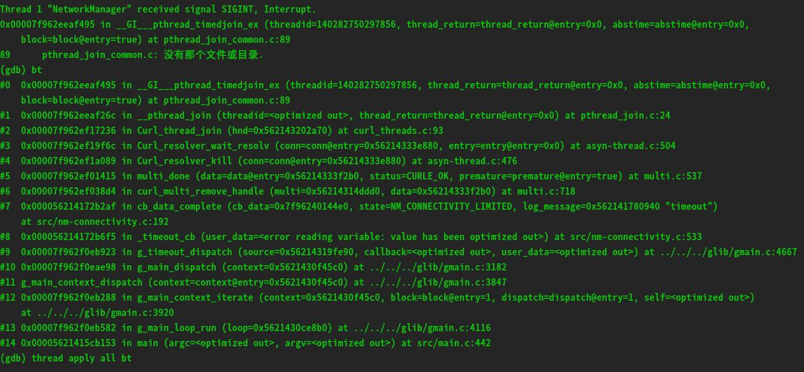
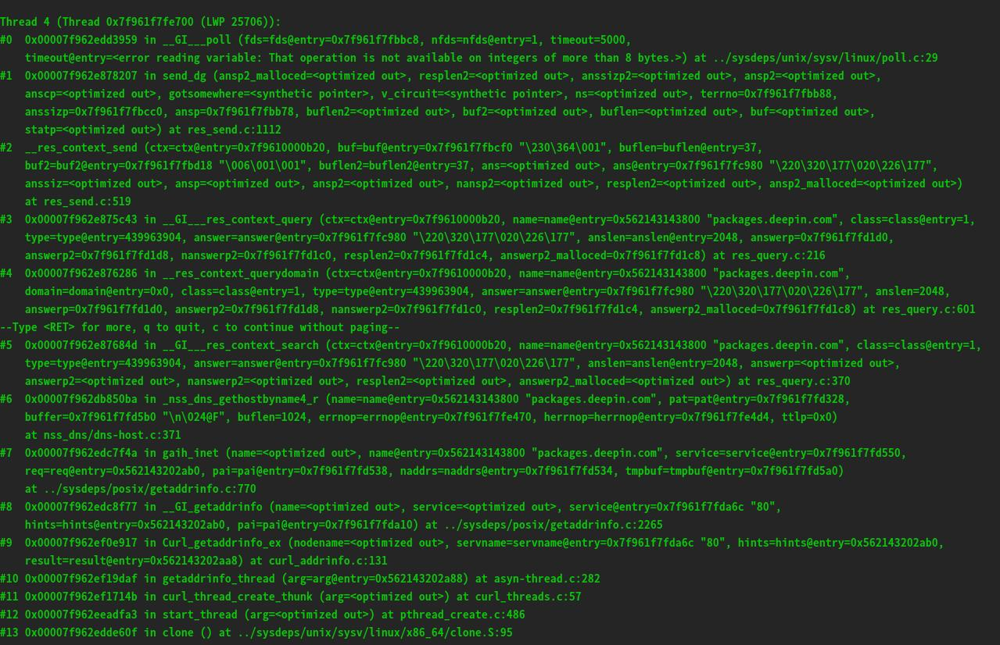
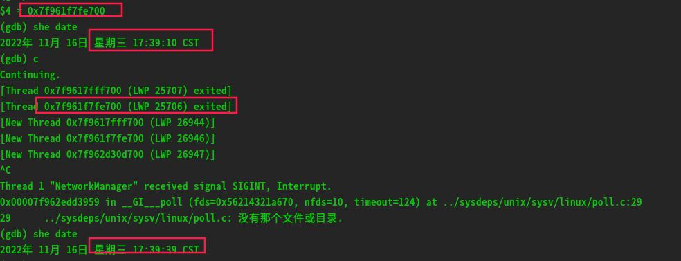

#   记一次nm卡死的问题

问题描述：工行1042镜像，控制中心有线网路连接配置自定义ip后，高概率卡死。

问题分析：
1、控制中心初步分析是调用nm的dbus接口阻塞。

我们先使用gdb来跟踪一下nm的dbus接口调用流程：
以nm的CheckConnectivity接口为例，在代码中的实际调用是impl_manager_check_connectivity：使用gdb跟踪
```sh
sudo gdb a $(pidof NetworkManager)
b impl_manager_check_connectivity
c
```

由此可以发现nm的dbus接口调用是nm的main主线程执行的。g_main_loop_run是主事件循环函数，这个函数是在nm的主线程执行的。

2、当问题发生时我们查看nm堆栈发现：

可以发现主线程并没有执行dbus接口的调用，而是阻塞等待一个线程的执行threadid=140282750297856
```
(gdb) p/x 140282750297856
$1 = 0x7f961f7fe700
```

3、我们来看看0x7f961f7fe700 这个线程在干啥，为啥会阻塞主线程

我们先选择继续执行看看这个进程啥时候会退出

可以发现这个线程卡了很长时间，我们回过头来看看这个线程在干啥：
```
0x00007f962db850ba in _nss_dns_gethostbyname4_r (name=name@entry=0x562143143800 "packages.deepin.com", pat=pat@entry=0x7f961f7fd328
```
分析得知这是在做dns解析域名