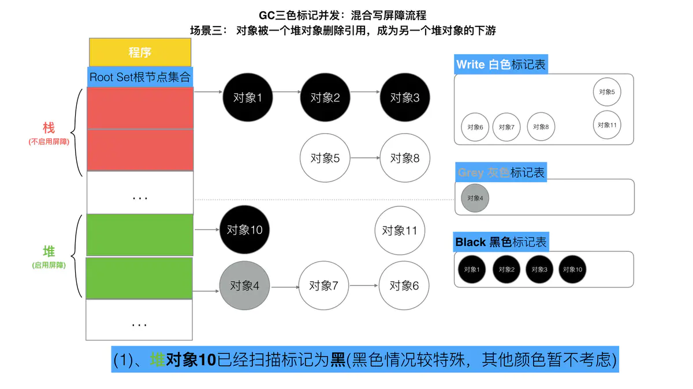
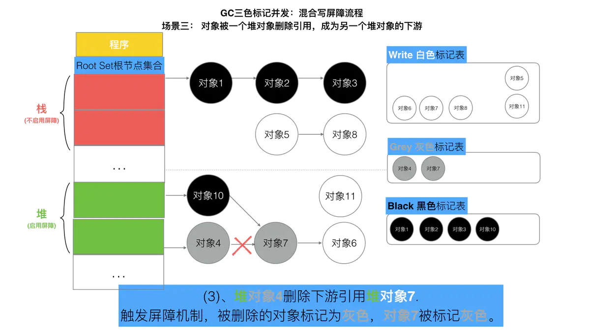

# Golang三色标记、混合写屏障GC模式图文全分析

垃圾回收(Garbage Collection,简称GC)是编程语言中提供的自动的内存管理机制，自动释放不需要的对象，让出存储器资源，无需程序员手动调用。

Golang中的垃圾回收主要应用三色标记法，GC过程和其他用户goroutine可并发运行，但需要一定时间的STW(stop the world)，STW的过程中，CPU不执行用户代码，全部用于垃圾回收，这个过程影响很大，golang 进行了多次迭代优化来解决这个问题。

## O、内容提纲
本文将系统的详细介绍Golang中GC的全分析过程，包括垃圾回收的方式递进。

内容包括：
- Go V1.3之前的标记-清除(mark-sweep)算法
- Go V1.3之前的标记-清除(mark-sweep)的缺点
- Go V1.5的三色并发标记法
- Go V1.5的三色标记法为什么需要STW
- Go V1.5的三色标记为什么需要屏障机制("强-弱三色不变式"、插入屏障、删除屏障)
- Go V1.8混合写屏障机制
- Go V1.8混合写屏障机制的全场景分析

## 一、Go V1.3之前的标记-清除(mark-sweep)算法
此算法主要有两个主要的步骤：
- 标记(mark phase)
- 清除(sweep phase)

### 第一步，暂停程序业务逻辑，找出不可达对象，然后做上标记。第二步，回收标记好的对象。

操作非常简单，但是有一点需要注意：mark and sweep算法执行的时候，需要程序暂停！即STW(Stop The World)。也就是说这段时间，程序会卡在那。


### 第二步，开始标记，程序找出它所有可达对象，并做上标记，如下图所示:


### 第三步，标记完了之后，然后开始清除未标记的对象，结果如下：


### 第四步，停止暂停，让程序继续跑。然后循环重复这个过程，知道process程序生命周期结束。

## 二、Go V1.3之前的标记-清除(mark-sweep)的缺点
- STW，stop the world；让程序暂停，程序出现卡顿(重要问题)。
- 标记需要扫描整个heap
- 清除数据会产生heap碎片

所以Go V1.3版本之前就是以上来实施的，流程就是


Go V1.3做了简单的优化，将STW提前，减少了STW暂停的时间，如下图所示：


> 这里面最重要的问题就是：mark-and-sweep算法会暂停整个程序。
>
> Go是如何面对并解决这个问题的呢？接下来Go V1.5版本就用三色标记法来优化这个问题。

## 三、 Go V1.5的三色标记发
三色标记法实际上就是通过三个阶段的标记来确定清楚的对象有哪些，我们来看一下具体的过程。

### 第一步，就是只要创建新的对象，默认的颜色都是标记为白色。

这里面需要注意的是，所谓程序，则是一些对象的根节点集合。

### 第二步，每次GC回收开始，然后从根节点遍历对象，把遍历的对象从白色集合放到灰色集合中。

### 第三步，遍历灰色节点，将灰色节点引用的对象从白色集合放入灰色集合，之后将灰色集合放入到黑色集合中。

### 第四步，重复第三步，直到灰色中无任何对象。


### 第五步，回收所有的白色标记的对象，也就是回收垃圾。

以上便是三色标记法，不难看出，我们上面已经清楚的体现了三色标记法的特性，那么又是如何实现并行的呢？

> Go是如何解决标记-清除(mark and sweep)算法中的卡顿(stw，stop the world)问题的呢？

## 四、没有STW的三色标记法
我们还是基于上面的三色标记法来说，它是一定要依赖STW的，因为如果不暂停程序，程序修改逻辑改变引用对象，这种动作如果在标记阶段做出了修改，会影响标记的正确性。我们举一个场景。

如果三色标记法，标记过程不使用STW将会发生什么？


可以看出，有两个问题，在三色标记发中，是不希望发生的：
- 条件1：一个白色对象被黑色对象引用（白色被挂载黑色下）
- 条件2：灰色对象与它之间的可达关系的白色对象遭到破话(灰色对象丢了该白色对象)

当以上两个条件同时满足时，就会出现对象丢失现象！

当然如果上述的白色对象3，如果它还有很多下游对象的话，也会一并清理掉。

为了防止这种现象的发生，最简单的方式就是STW，直接禁止掉其他用户程序对对应引用的干扰，但是STW的过程有明显的资源浪费，对所有的用户程序都有很大影响，如何能保证对象不丢失的情况下合理的尽可能的提高GC效率，减少STW的时间呢？

答案就是，那么我们只要使用一个机制，来破坏上面的两个条件就可以了。

## 五、屏障机制
我们让GC回收器，满足下面两种情况之一时，可保对象不丢失，所以引出两种方式。
### (1)"强-弱"三色不变式
- “强”三色不变式
不存在黑色对象引用到白色对象的指针。


- “弱” 三色不变式
所有被黑色对象引用的白色对象都处于灰色对象的保护状态。

为了遵循上述两种方式，Golang团队初步得到了如下具体的两种屏障方式“插入屏障”，“删除屏障”。

### (2)插入屏障
具体操作：在A对象引用B对象的时候，B对象被标记位灰色。(将B挂在A下游，B必须被标记会灰色)

满足：强三色不变式。(不存在黑色对象引用白色对象的情况了，因为白色对象会被强制变成灰色)

伪代码如下：
```
添加下游对象(当前下游对象slot, 新下游对象ptr) {   
  //1
  标记灰色(新下游对象ptr)   
  
  //2
  当前下游对象slot = 新下游对象ptr                   
}
```

场景：
```
A.添加下游对象(nil, B)   //A 之前没有下游， 新添加一个下游对象B， B被标记为灰色
A.添加下游对象(C, B)     //A 将下游对象C 更换为B，  B被标记为灰色
```

这段伪码逻辑就是写屏障。我们知道，黑色对象的内存槽有两种位置，栈和堆，栈空间的特点是容量小，但是要求响应速度快，因为函数调用弹出频繁使用，所以插入屏障机制，在栈空间中不使用，而仅仅在堆空间中使用。

接下来，我们用几张图，来模拟整个详细的过程：


但是如果栈不添加，当全部三色标记扫描之后，栈上有可能依然会存在白色对象被引用的情况(如上图的对象9)，所以要对栈重新进行三色标记扫描，但是这次为了对象不丢失，要对本次标记扫描启动stw暂停，直到栈空间的三色标记结束。


最后将栈和堆空间扫描剩余部分的全部白色节点清除，这次STW大约的时间在10~100ms之间。


### (3) 删除屏障
具体操作：被删除的对象，如果自身为白色或者灰色，那么被标记为灰色。

满足：若三色不变式(保护灰色对象到白色对象的路径不会断)
伪代码：
```
添加下游对象(当前下游对象slot， 新下游对象ptr) {
  //1
  if (当前下游对象slot是灰色 || 当前下游对象slot是白色) {
        标记灰色(当前下游对象slot)     //slot为被删除对象， 标记为灰色
  }
  
  //2
  当前下游对象slot = 新下游对象ptr
}
```
场景：
```
A.添加下游对象(B, nil)   //A对象，删除B对象的引用。  B被A删除，被标记为灰(如果B之前为白)
A.添加下游对象(B, C)       //A对象，更换下游B变成C。   B被A删除，被标记为灰(如果B之前为白)
```
接下来，我用几张图，来模拟一个详细的过程。


这种方式的回收精度低，一个对象即使被删除了，最后一个指向它的指针也依旧可以活过这一轮，在下一轮GC中被清理调。

## 六、Go V1.8混合写屏障机制
插入写屏障和删除写屏障的短板：
- 插入写屏障：结束时需要STW重新扫描栈，标记栈上引用的白色对象的存活；
- 删除写屏障：回收精度低，GC开始时STW扫描堆栈来记录初始快照，这个过程会保护开始时刻的所有存活的对象。

Go V1.8版本引入了混合写屏障机制，避免了对栈的re-scan的过程，极大的减少了STW的时间。结合了两者的优点。

### (1) 混合写屏障规则
具体操作：
1、GC开始将栈上的对象全部扫描并标记位黑色(之后不在进行第二次扫描，无效STW)
2、GC期间，任何在站上创建的对象，都标记位黑色
3、被删除的对象标记位灰色。
4、被添加的对象标记位灰色。

满足：变形的弱三色不变式:
```
添加下游对象(当前下游对象slot, 新下游对象ptr) {
    //1 
        标记灰色(当前下游对象slot)    //只要当前下游对象被移走，就标记灰色
    
    //2 
    标记灰色(新下游对象ptr)
        
    //3
    当前下游对象slot = 新下游对象ptr
}
```
> 这里，我们注意，屏障技术不是在栈上应用，因为要保证栈的运行效率。

### (2)混合写屏障的具体场景分析
接下来，我们用几张图，来模拟整个详细过程。

> 注意，混合写屏障只是一种屏障机制，所以只是当程序运行GC的时候，才会触发这种机制。

GC开始：扫描栈区，将可达对象标记位黑色。


### 场景一：对象被一个堆对象删除引用，成为栈对象的下游
伪代码：
```
//前提：堆对象4->对象7 = 对象7；  //对象7 被 对象4引用
栈对象1->对象7 = 堆对象7；  //将堆对象7 挂在 栈对象1 下游
堆对象4->对象7 = null；    //对象4 删除引用 对象7
```


### 场景二：对象被一个栈对象引用，成为另一个栈对象的下游
伪代码:
```
new 栈对象9；
对象8->对象3 = 对象3；      //将栈对象3 挂在 栈对象9 下游
对象2->对象3 = null；      //对象2 删除引用 对象3
```


### 场景三：对象被一个堆对象删除引用，称为另一个堆对象的下游
伪代码：
```
堆对象10->对象7 = 堆对象7；       //将堆对象7 挂在 堆对象10 下游
堆对象4->对象7 = null；         //对象4 删除引用 对象7
```




### 场景四：对象从一个栈对象删除引用，称为另一个对象的下游
```
堆对象10->对象7 = 堆对象7；       //将堆对象7 挂在 堆对象10 下游
堆对象4->对象7 = null；         //对象4 删除引用 对象7
```


Golang中的混合写屏障满足弱三色不变式，结合了删除写屏障和插入写屏障的有点，只需要在开始时并发扫描各个goroutine的栈，使其变黑并一直保持，这个过程不需要STW，而标记结束后，因为栈在扫描后使用是黑色的，也无需进行re-scan了，减少了STW的时间。

### 七、总结
以上便是Golang的GC全部标记-清除逻辑及场景演示全过程。

Go V1.3 普通标记清除法，整个过程需要启动STW，效率极低。

Go V1.5 三色标记法，堆空间启动写屏障，栈空间不启动，全部扫描之后，需要重新扫描一次栈(需要STW)，效率普通。

Go V1.8 三色标记法，混合写屏障机制，栈空间不启动，堆空间启动。整个过程几乎不需要STW，效率极高。