# Golang调度器GPM原理与调度全分析

> 该文章主要详细具体的介绍Goroutine调度器过程及原理，可以对Go调度器的详细过程有一个清晰的理解。

第一章：Golang调度器的由来
第二章：Goroutine调度器的GMP模型及思想
第三章：Goroutine调度场景过程全图文解析

## 一、Goroutine 调度器的由来？
### (1)单进程时代不需要调度器
我们知道，一切的软件都是跑在操作系统之上的，真正用来干活的是CPU。早期操作系统每个程序就是一个进程，知道一个程序执行完，才能进行下一个进程，就是“单进程时代”。

一切的程序只能串行发生。
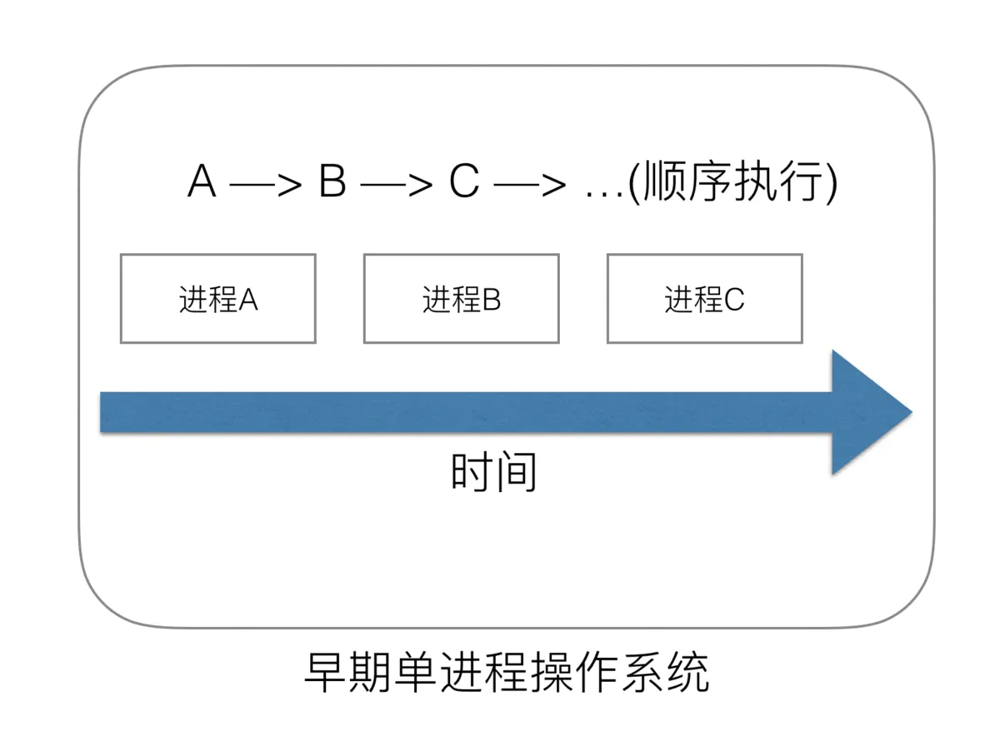
早期单进程操作系统，面临2个问题：
1. 单一的执行流程，计算机只能一个任务一个任务处理。
2. 进程阻塞所带来的的CPU时间浪费。

那么能不能有多个进程来宏观一起执行多个任务呢？

后来操作系统就具有了最早的并发能力：多进程并发，当一个进程阻塞的时候，切换到另外等待执行的进程，这样就能尽量把CPU利用起来，CPU就不浪费了。

### (2)多进程/线程时代有了调度的需求
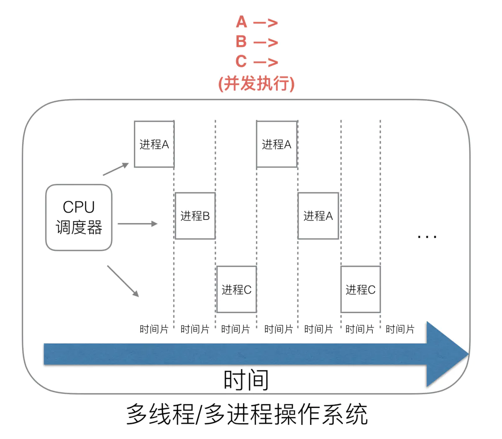
在多进程多线程的操作系统中，就解决了阻塞的问题，因为一个进程阻塞CPU可以立即切换到其他进程中执行，而且调度CPU的算法可以保证在运行的进程都可以被分配到CPU的运行时间片。这样从宏观来看，似乎多个进程是在同时被运行。

但新的问题又出现了，进程拥有太多的资源，进程的创建、切换、销毁，都会占用很长的时间，CPU虽然利用起来了，但是如果进程过多，CPU有很大的一部分都被用来进行进程调度了。

### 怎么才能提高CPU利用率呢？

但是对于Linux操作系统来讲，CPU对进程的态度和线程的态度是一样的。
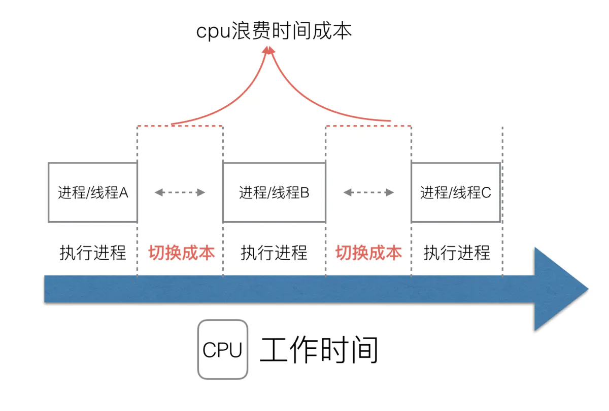

很明显，CPU调度切换的是进程和线程。尽管线程看起来很美好，单实际上多线程开发设计会变得更加复杂，要考虑很多同步竞争等问题，如锁、竞争冲突等。

### (3)携程来提高CPU利用率
多进程、多线程已经提高了系统的并发能力，但是在当今互联网高并发场景下，为每个任务都创建一个线程是不是现实的，因为会消耗巨大的内存（进程虚拟内存会占用4G，而线程也需要大约4MB）。

大量的进程/线程出现了新的问题
- 高内存占用
- 调度的高消耗CPU

好了，然后工程师们就发现，其实一个线程分为内核态和用户态线程。
一个用户态现场必须要绑定一个内核态进程，但是CPU并不知道有用户态线程的存在，它只知道它运行的是一个内核态线程。
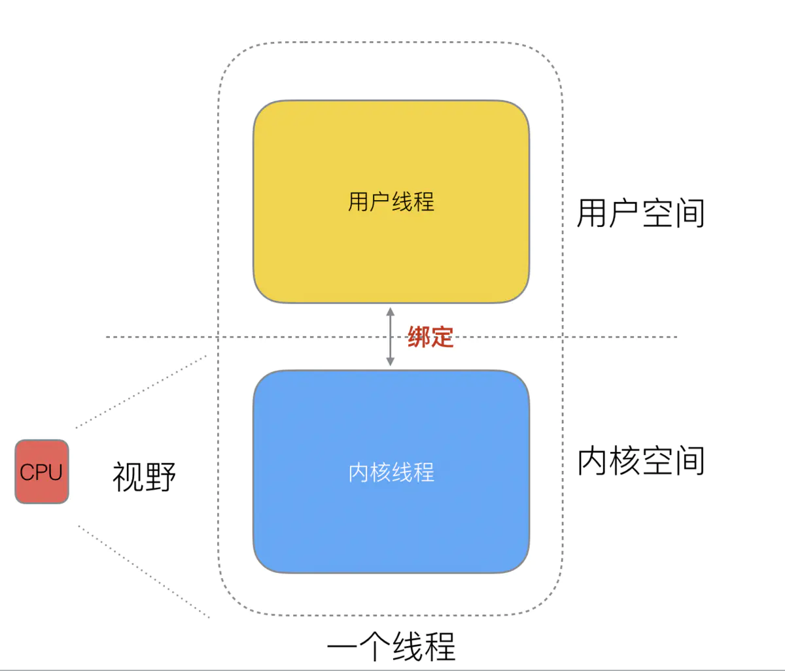
这样我们再细化分类一下，内核线程依然叫"线程"，用户态线程叫协程。

看到这里，我们就要开脑洞了，既然一个协程绑定一个线程，那么能不能多个协程绑定一个线程呢。

之后，我们就看到了协程和线程的映射关系。

> N:1关系

N个协程绑定一个线程，有点就是协程在用户态即完成切换，不会陷入到内核态，这种切换非常轻量快速。但是也有个很大的缺点，1个进程的所有协程都绑定到一个线程上。

缺点：
- 某个进程用不了硬件的多核加速的能力
- 一个某个协程阻塞，造成线程阻塞，本进程的其他协程都无法执行了，根本就没有并发的能力了。
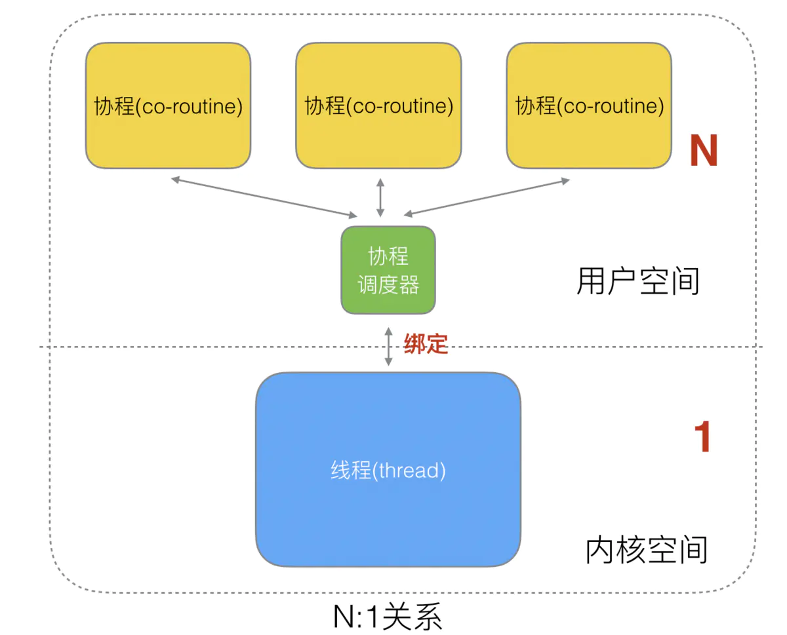

> 1:1关系

一个协程绑定一个线程，这种最容易实现。协程的调度都由CPU完成了，不存在N:1缺点。

缺点：
- 协程的创建、删除和切换的代价都由CPU完成，有点略显昂贵了。
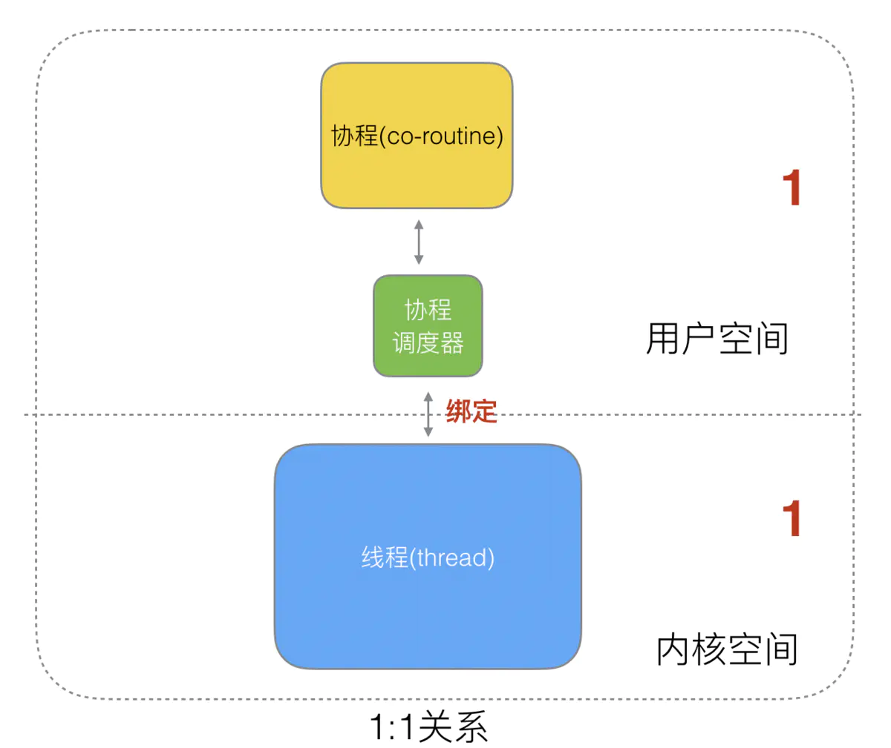

> M：N

M个协程绑定1个线程，是N:1和1：1类型的结合，克服了以上2个模型的缺点，但是实现起来最为复杂。
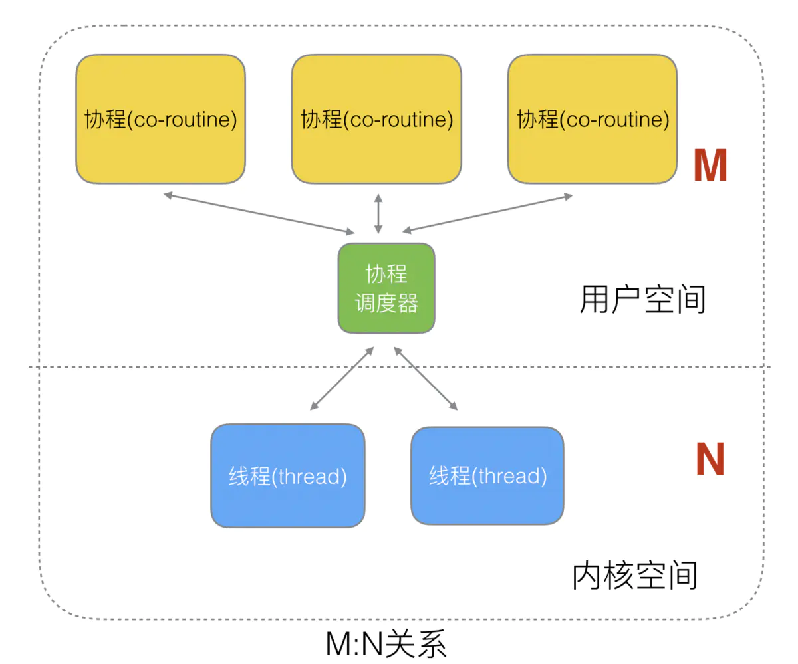

协程跟线程是有区别的，线程是由CPU调度是抢占式的，协程是由用户态调度是协作式的，一个协程让出CPU后，才能执行下一个协程。

### (4)Go 语言的协程Goroutine
Go 为了提供更容易使用的并发的方法，使用Goroutine和channel。goroutine来自协程的概念，让一组可复用的函数运行在一组线程之上，即使有线程阻塞，该线程的其他协程也可以被runtime调度，转移到其他可运行的线程上。最关键的是，程序员看不到这些底层细节，这就降低了编程的难度，提供了更容易的并发。

Go中，协程被称为goroutine，它非常轻量，一个goroutine只占了几KB，并且这几KB就足够goroutine运行完，这就能在有限的内存空间内支持大量的goroutine，支持了更多的并发。虽然一个goroutine的栈只占了几KB，但实际是可以伸缩的，如果需要更多的内容，runtime会自动位goroutine分配。

goroutine特点：
- 占用内存更小（几KB）；
- 调度更灵活(runtime调度)；

### (5)被抛弃的goroutine调度器
好了，既然我们知道了协程和线程的关系，那么最关键的一点就是调度协程的调度器的实现了。

Go目前使用的调度器就是2012年重新设计的，因为之前的调度器性能存在问题，所以使用4年就被放弃了，那么我们先来分析一下被废弃的调度器是如何运作的？

> 大部分文章都是会用G来表示Goroutine，用M来表示线程，那么我们也会用这种表达的对应关系。
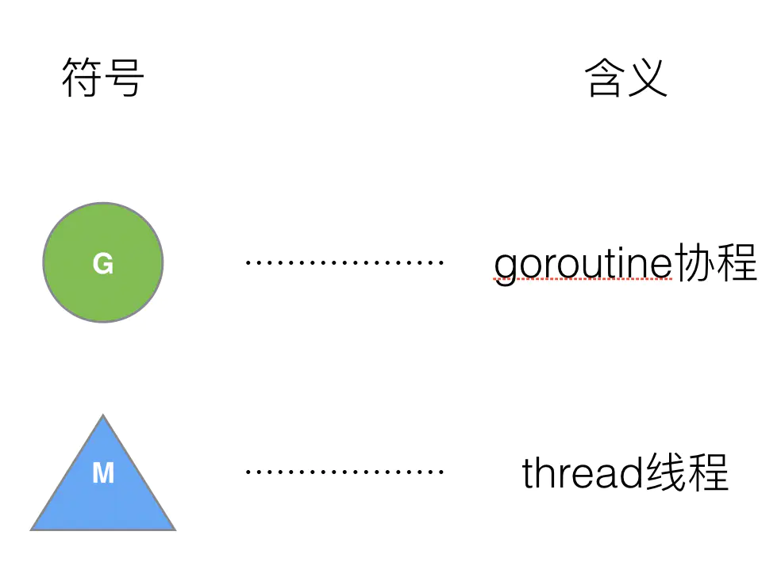

下面我们来看看被废弃的golang调度器是如何实现的？
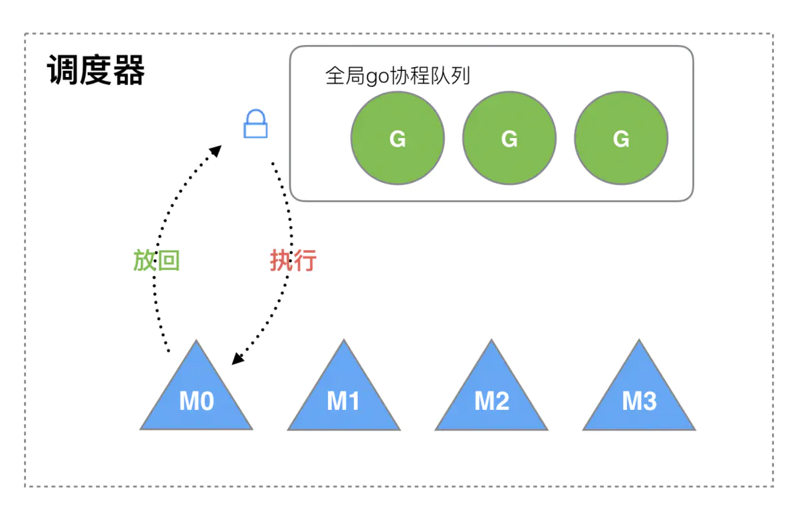

M想要执行、放回G都必须访问全局队列，并且M有多个，即多个线程访问同一资源需要加锁进行同步互斥。所以全局G队列是有互斥锁进行保护的。

老调度器的缺点：
1、创建、销毁、调度G都需要每个M获取锁，这就形成了激烈的锁竞争。
2、M转移G会造成延迟和额外的负载。比如当G中包含创建新协程的时候，M创建了G'，为了继续执行G'，需要把G'交给M'执行，也造成了很差的局部性，因为G和G'是相关的，最好放在M上执行，而不是放在其他M上。
3、系统调度(CPU 在M之间切换)导致频繁切换阻塞和取消阻塞操作增加了开销。

## 二、Goroutine调度器的GPM模型的设计思想。
面对之前调度器的问题，Go设计了新的调度器。

在新的调度器中，出列M(thread)和G(goroutine),有引入了P(processor)。
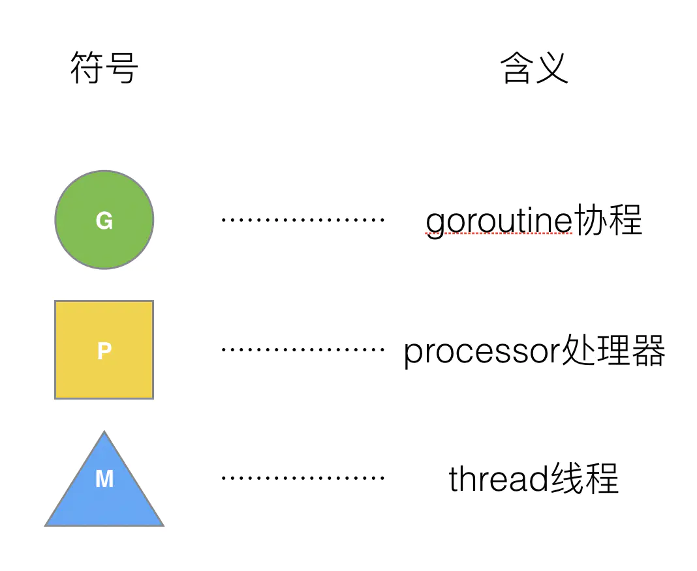

Processor,它包含了运行goroutine的资源，如果线程想运行goroutine，必须先获取P，P中还包含了可运行的G队列。

### (1) GMP模型
在Go中，线程是运行goroutine的实体，调度器的功能是把可运行的goroutine分配到工作线程中。
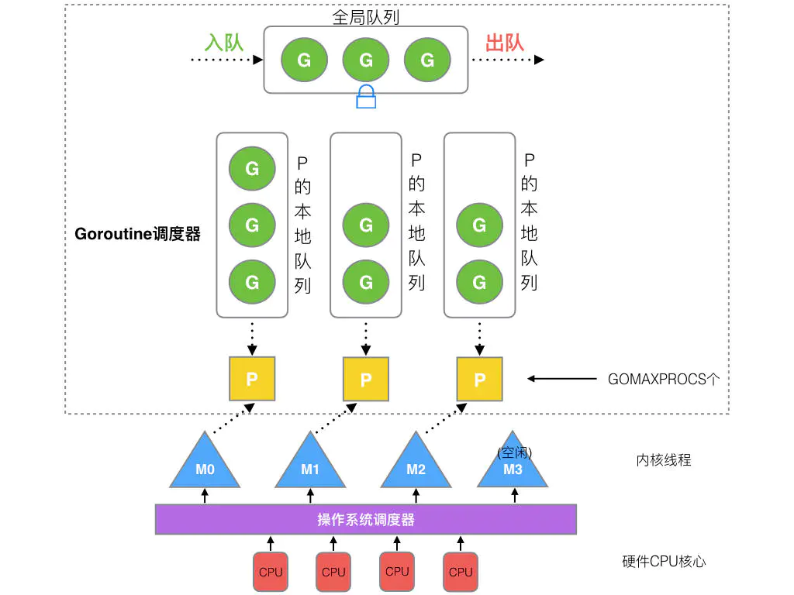
1. 全局队列：存放着运行的G。
2. P的本地队列：同全局队列类似，存放的也是等待运行的G，存的数量有限，不超过256个。新建G'时，G'优先加入到本地队列，如果队列满了，则会把本地队列中一半的G移动到全局队列中。
3. P列表：所有的P都在程序启动的时候创建，并保存到数组中，最多有GOMAXPROCS(可配置)个。
4. M：线程想运行任务就得获得P，从P的本地队列中获取G，P队列为空，M也会参数从全局队列拿一批G到P的本地队列，或者从其他P的本地队列偷一半到自己P的本地队列。M运行G，G执行后，M会从P获取下一个G，不断重复下去。

Goroutine调度器和OS调度器是通过M结合起来的，每个M都代表一个内核线程，OS调度器负责把内核线程分配到CPU的核上执行。

> 有关P和M的数量

1. P的数量
- 由启动时环境变量$GOMAXPROCS或者由runtime的方法GOMAXPROCS()决定。意味着程序执行的任意时刻都只有$GOMAXPROCS个Goroutine在执行。

2. M的数量
- Go语言本身的限制：go程序启动时，会设置M的最大值，默认10000，但是内核很难支持这么多的线程数，所以这个限制可以忽略。
- runtime/debug 中的SetMaxThread函数，设置M的最大数量。
- 一个M阻塞了，会创建新的M。

M与P的数据没有绝对关系，一个M阻塞，P就会去创建或切换另一个M，所以，即使P的数量为1，也很有可能会创建很多个M出来。

> P和M何时会被创建

1. P何时创建： 在确定了P的最大数量n后，运行时系统会根据这个数量创建n个P。
2. M何时创建：没有足够的M来关联P并运行其中的可运行的G。比如所有的M此时都阻塞了，而P中还有很多就绪任务，就回去寻找空闲的M，而没有空闲的，就会去创建新的M。

### (2) 调度器的设计策略
复用线程：避免频繁创建线程、销毁线程，而是对线程的复用。

1. work stealing机制
当本线程无可运行的G时，尝试从其他线程绑定的P中偷取G，而不是销毁线程。

2. hand off机制
当本线程因为G进行系统调度阻塞时，线程释放绑定的P，把P转移给其他空闲的线程执行。

利用并行：在coroutine中要等待一个协程主动让出CPU才执行下一个协程，在Go中，一个Goroutine最多占用CPU10ms，防止其他Goroutine被饿死，这就是Goroutine不同于Cotoutine的地方。

全局G队列：在新的调度器中依然有全局G队列，但是功能已经弱化了，当M执行work stealing从其他P偷不到G时，它可以从全局G队列获取G。

### (3) go func()调度流程

从上图我们可以分析出几个结论：
1. 我们通过go func()来创建一个Goroutine；
2. 有两个存储G的队列，一个是局部调度器P的本地队列，一个是全局队列。新建的G会先保存在P的本地队列中，如果P的本地队列满了，会将P的本地队列中的一般Go保存到全局队列中。
3. G只能运行在M中，一个M必须持有一个P，M与P的关系的是1:1的关系，M会从P的本地队列弹出一个可执行状态的G来执行，如果P的本地队列为空，则会向其他的P队列偷取一半可执行的G来执行。
4. 一个M调度G执行的过程是一个循环机制。
5. 当M执行一个G时候发生了syscall或者阻塞，M会阻塞，如果当前有一些G在执行，runtime会把这个线程M从P中摘除，然后再从M的空闲队列或者新建一个线程来服务与这个P。
6. 当M系统调度结束的时候，这个G会尝试获取一个空闲的P执行，并放入到P的本地队列，如果获取不到P，那么这个线程会变成休眠状态，加入到休眠队列中，然后这个会被放入到全局队列中。

## 三、Go调度器场景过程全解析
### (1)场景1
P拥有G1，M1获取P后开始运行G1，G1使用go func()创建了G2，为了局部性G2优先加入到P1的本地队列。
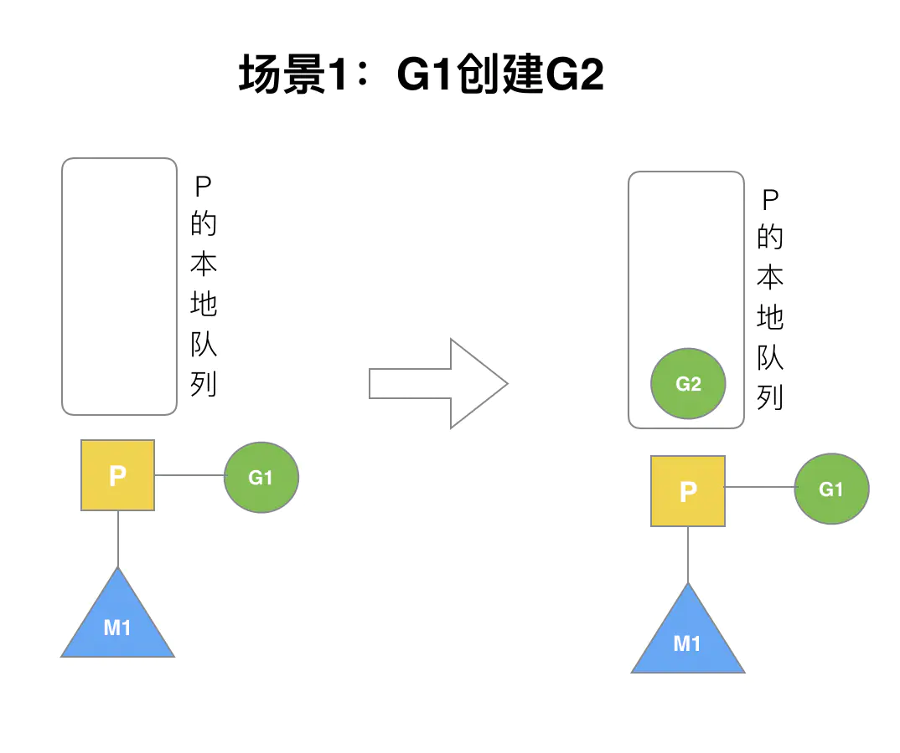

### (2)场景2
G1运行完成后(函数：goexit)，M上运行的Goroutine切换位G0，G0负责调度时协程的切换(函数：schedule)。从P的本地队列取G2，从G0切换的G2，并开始运行G2(函数：execute)。实现了线程M1的复用。
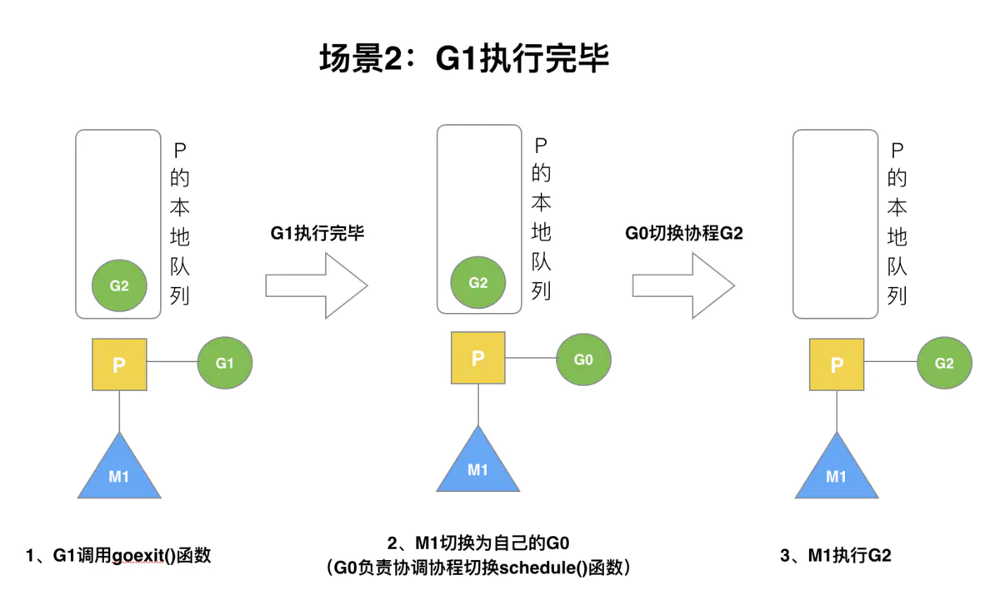

### (3)场景3
假设每个P的本地队列只能存3个G，G2要创建6个G，前3个G(G3,G4,G5)已经加入P1的本地队列，P1本地队列满了。
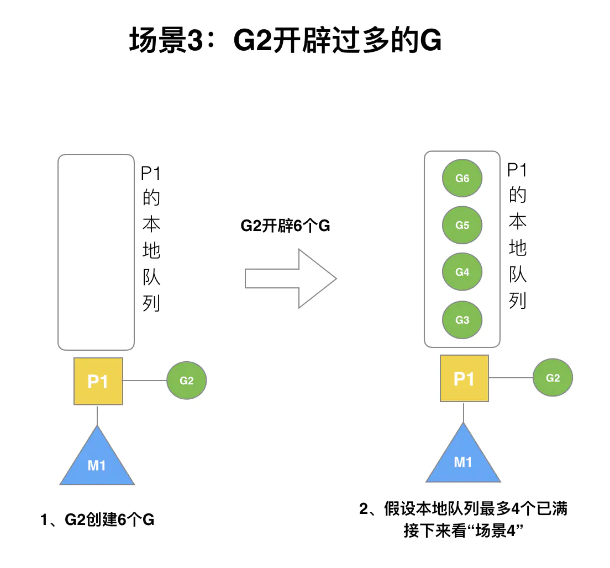

### (4)场景4
G2在创建G7的时候，发现P1的本地队列已经满了，需要执行负载均衡(把P1中本地队列中前一半的G，还有新创建的G转移到全局队列)

> (实现中并不一定是新的G，如果G是G2之后就执行，会被保存在本地队列，利用某个老的G替换新的G加入全局队列)

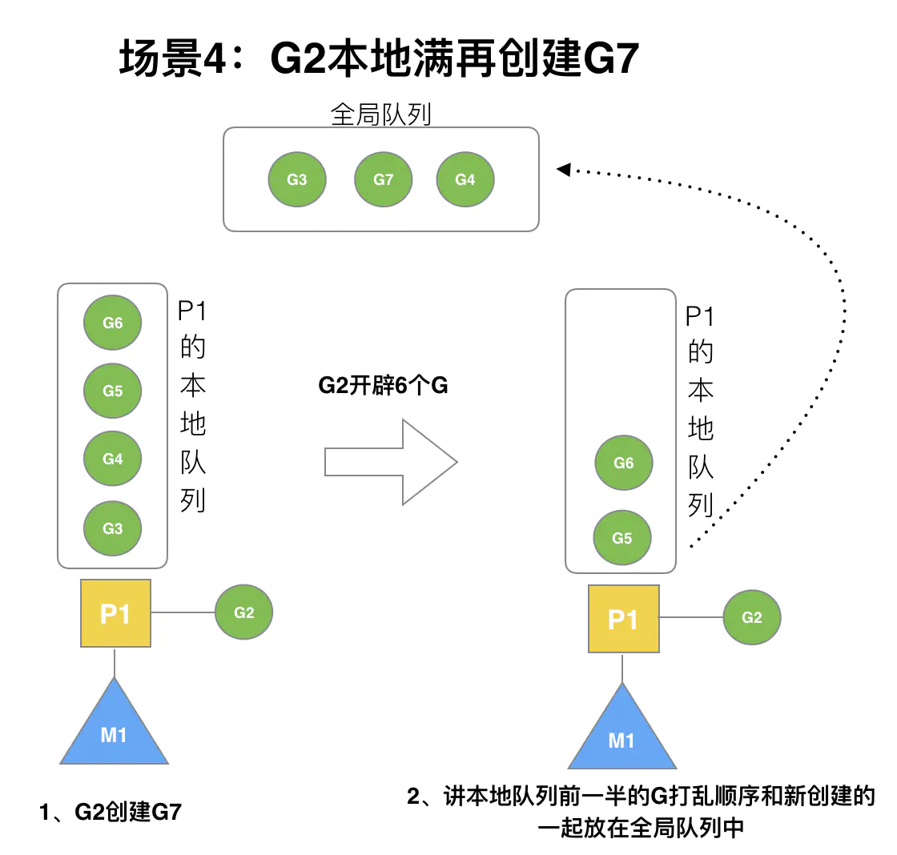
这些G被转移到全局队列时，会被打乱顺序。所以G3,G4,G7被转移到全局队列。

### (5)场景5
G2创建G8时，P1的本地队列未满，所以G8会被加入到本地队列。
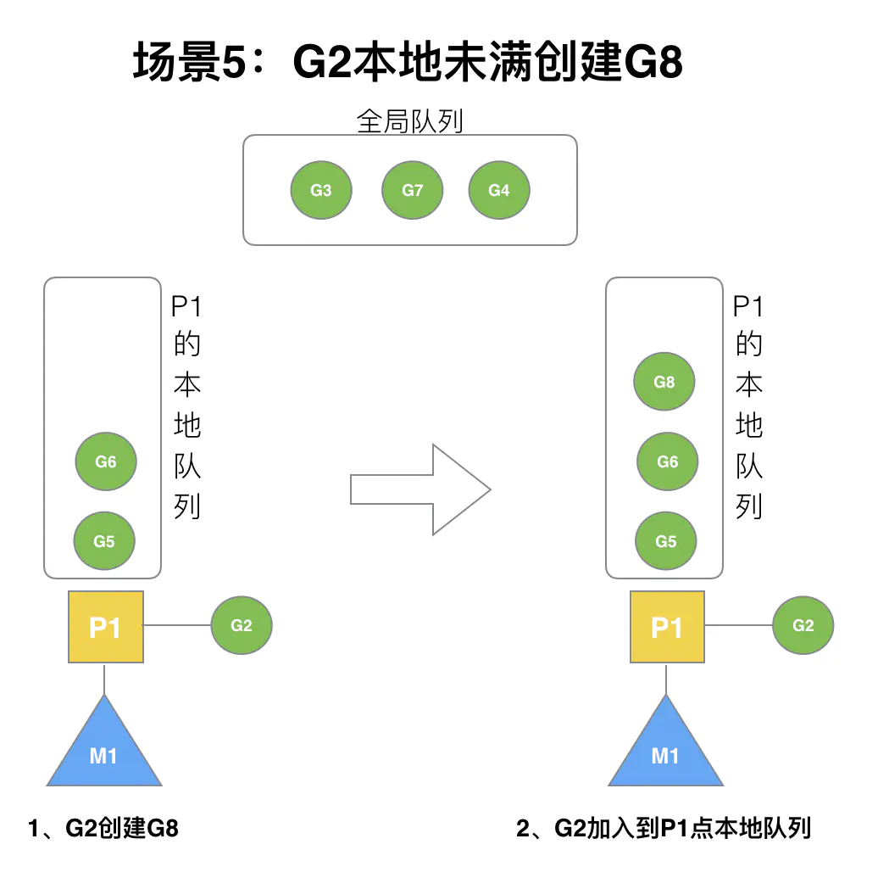
G8 加入到P1的本地队列的原因是因为P1此时在与M1绑定，而G2此时是M1在执行，所以G2创建的新的G会优先放置到自己的M绑定的P上。

### (6)场景6
规定：在创建G时，运行的G会尝试唤醒其他空闲的P和M组合去执行。
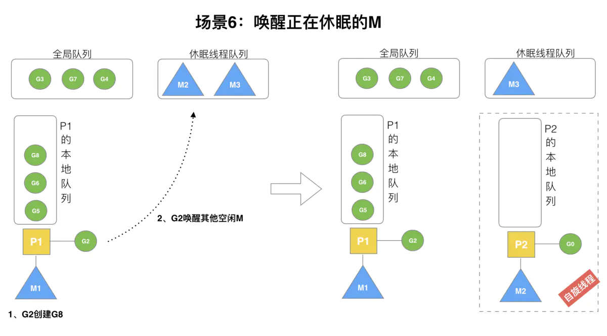
假定G2唤醒了M2，M2绑定了P2，并运行G0，但P2本地没有G，M2此时为自旋线程(没有G但是为运行状态下的线程，不断寻找G)

### (7)场景7
M2尝试从全局队列取一批G放到G的P2的本地队列。M2从全局队列去的G数量符合如下公式：
```
n = min(len(GQ)/GOMAXPROCS + 1, len(GQ/2))
```

至少从全局队列取一个G，但每次不要从全局队列移动太多的G到P的本地队列，给其他P留点。这是从全局队列到本地队列的负载均衡。
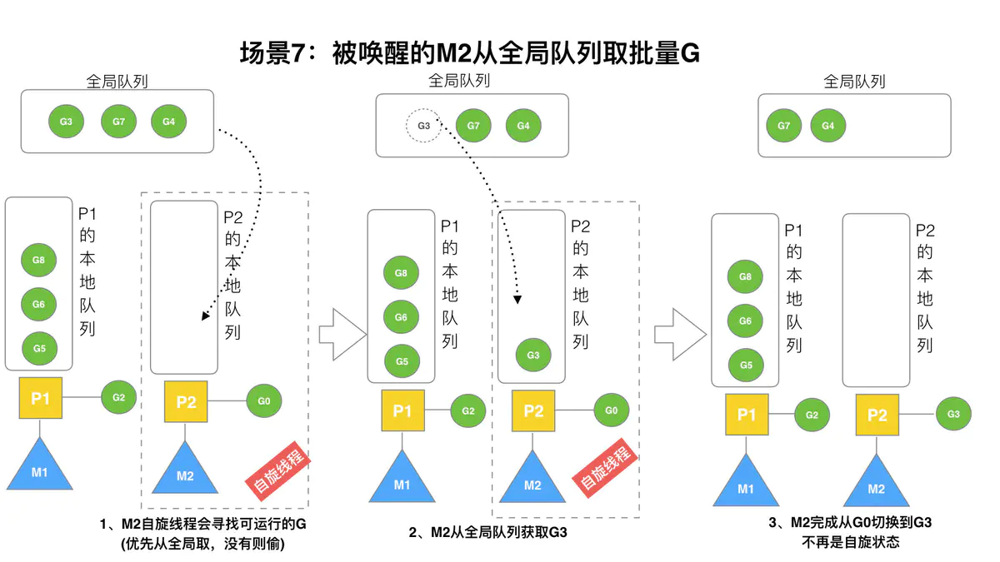

假定我们场景中一共有4个P(GoMaxProcs设置为4，那么我们运行最多就能用4个P来供M使用)。所以M2只能从全局队列取一共G移动到P2本地队列中，然后完成从G0到G3的切换，运行G3。

### (8) 场景8
假设G2一直在M1上运行，经过2轮后，M2已经把G7、G4从全局队列获取到了P2的本地队列并完成执行，全局队列和P2的本地队列都空了，如场景8图的左半部分。
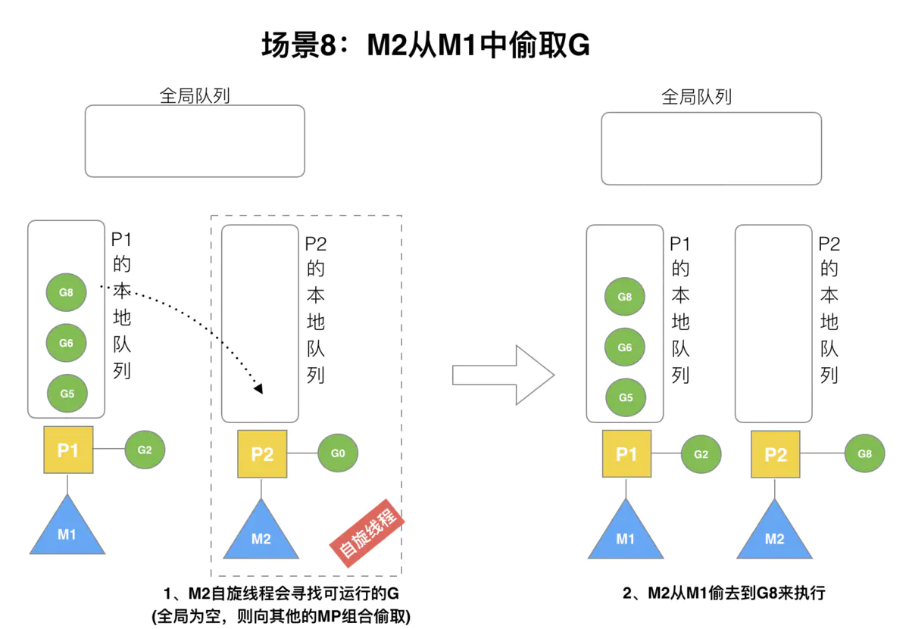
全局队列已经没有G，那m就要执行work stealing(偷取)：从其他有G的P哪里偷取一半G过来，放到自己的P本地队列。P2从P1的本地队列尾部取一半的G，本例中一半则只有1个G8，放到P2的本地队列并执行。

### (9)场景9
G1本地队列G5、G6已经被其他M偷走并运行完成，当前M1和M2分别在运行G2和G8，M3和M4没有goroutine可以运行，M3和M4处于自旋状态，它们不断寻找goroutine。
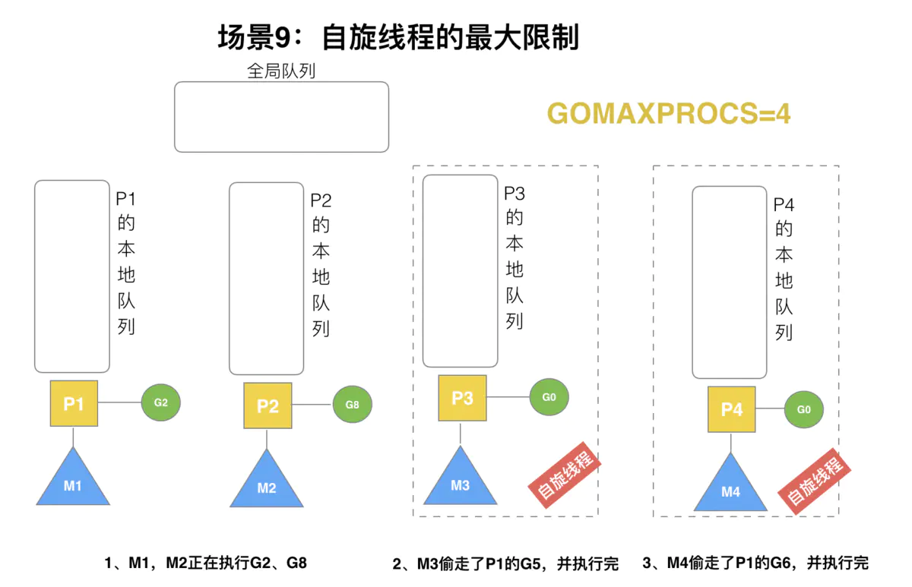
为什么要让m3和m4自旋，自旋本质是在运行，线程在运行却没有执行G，就变成了浪费CPU. 为什么不销毁现场，来节约CPU资源。因为创建和销毁CPU也会浪费时间，我们希望当有新goroutine创建时，立刻能有M运行它，如果销毁再新建就增加了时延，降低了效率。当然也考虑了过多的自旋线程是浪费CPU，所以系统中最多有GOMAXPROCS个自旋的线程(当前例子中的GOMAXPROCS=4，所以一共4个P)，多余的没事做线程会让他们休眠。

### (10)场景10
​ 假定当前除了M3和M4为自旋线程，还有M5和M6为空闲的线程(没有得到P的绑定，注意我们这里最多就只能够存在4个P，所以P的数量应该永远是M>=P, 大部分都是M在抢占需要运行的P)，G8创建了G9，G8进行了阻塞的系统调用，M2和P2立即解绑，P2会执行以下判断：如果P2本地队列有G、全局队列有G或有空闲的M，P2都会立马唤醒1个M和它绑定，否则P2则会加入到空闲P列表，等待M来获取可用的p。本场景中，P2本地队列有G9，可以和其他空闲的线程M5绑定。
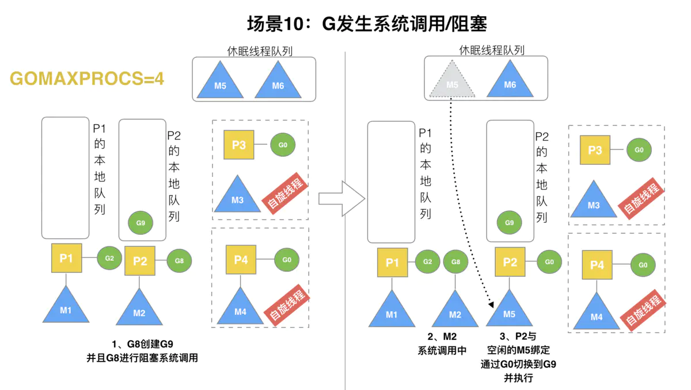


### (11)场景11
G8创建了G9，假如G8进行了非阻塞系统调用。

​ M2和P2会解绑，但M2会记住P2，然后G8和M2进入系统调用状态。当G8和M2退出系统调用时，会尝试获取P2，如果无法获取，则获取空闲的P，如果依然没有，G8会被记为可运行状态，并加入到全局队列,M2因为没有P的绑定而变成休眠状态(长时间休眠等待GC回收销毁)。

## 四、小结
总结，Go调度器很轻量也很简单，足以撑起goroutine的调度工作，并且让Go具有了原生（强大）并发的能力。Go调度本质是把大量的goroutine分配到少量线程上去执行，并利用多核并行，实现更强大的并发。