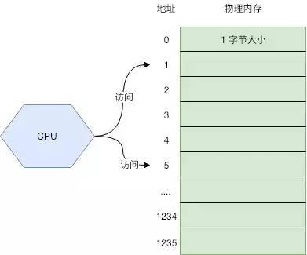
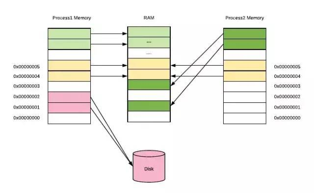
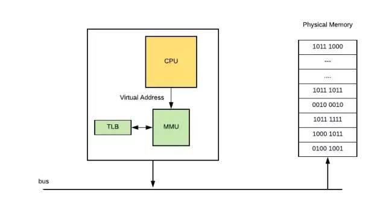
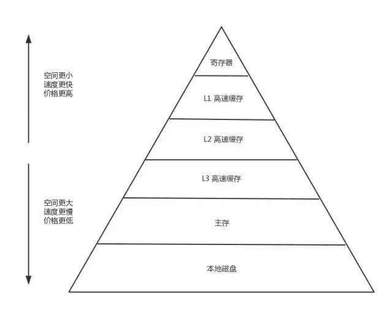
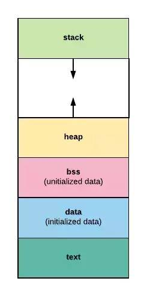

# Go语言内存管理(一)

## 介绍
要搞明白Go语言的内存管理，就必须先理解操作系统以及机器硬件是如何管理内存的。因为Go语言的内部机制是建立在这个基础之上的，它的设计，本质上是尽可能的发挥操作系统层面的优势，而避开导致低效情况。

## 操作系统内存管理
其实现在计算机内存管理的方式都是一步步演变而来的，最开始非常简单，后来为了满足各种需求而增加了各式各样的机制，越来越复杂。这里我们只介绍和开发息息相关的几个机制。

## 最原始的方式
我们可以把内存看成一个数组，每个数组元素的大小是1B，也就是8位(bit)，CPU通过内存地址来获取内存中的数据，内存地址可以看做成数组的游标(index)。


CPU在执行指令的时候，就是通过内存地址，将物理内存上的数据载入到寄存器，然后执行机器指令。但随着发展，出现了多任务需求，也就是希望多个任务能同时在系统上运行。这就出现了一些问题：
1. 内存访问冲突：程序很容易出现Bug，就是2或者更多的程序使用了同一块内存空间，导致数据读写错乱，程序崩溃。更有一些黑客利用这个缺陷制作病毒。
2. 内存不够用：因为每一个程序都需要自己单独使用一块内存，内存的大小就成了任务数量的瓶颈。
3. 程序开发成本高：你的程序使用多少内存，内存地址是多少，这些都不能搞错，对于人来说，开发正确的程序很费脑子。

举个例子：假设有一个程序，当代码运行到某处时，需要使用100M内存，其他时候1M内存就够；为了避免和其他程序冲突，程序初始化时，就必须要申请独立的100M内存以保证正常运行，这就是一种很大的浪费，因为这100M它大多时候用不上，其他程序不能用。

## 虚拟内存
虚拟内存的出现，很好的解决了上诉的一系列的问题。用户程序只能使用虚拟的内存地址来获取数据，系统将这个虚拟的内存地址翻译成实际的物理地址。

所有程序统一使用一套连续的虚拟地址，比如0x0000~0xffff。从程序的角度来看，它觉得自己独享一整块内存。不用考虑访问冲突的问题。系统会将虚拟地址翻译成物理地址，从内存上加载数据。

对于内存不够用的问题，虚拟内存本质上是将磁盘当做最终存储，而主存作为了一个cache。程序可从虚拟内存上申请很大的空间使用，比如1G；但操作系统不会真的在物理内存上开辟1G的空间，它只是开辟了一小块，比如1M给内存使用。

这样内存在访问内存时，操作系统看访问的内存地址是否能转换成物理内存地址，能则正常访问，不能则再开辟。这是的内存的到了更高效的使用。

如下图所示，每个进程所使用的虚拟内存地址是一样的，但是他们的虚拟内存地址会被映射到主存上的不同区域，甚至映射到磁盘上(内存不够时使用)。


### 虚拟地址
其实本质上很简答，就是操作系统将程序常用的数据放到内存里加速访问，不常用的数据放到磁盘上。这一切对用户来说是透明的，用户可以假装程序所有数据都在内存里，然后通过虚拟地址去访问数据。在这背后，操作系统会自动将数据在主存和磁盘间交换。

## 虚拟地址翻译
虚拟内存的实现方式，大多数都是通过页表来实现的。操作系统虚拟内存空间分成一页一页的来管理，每页的大小位4K(当然这个是可以配置的，不同操作系统不一样)。磁盘和主存之间的置换也是以页位单位来操作的。4K 算是通过时间中折中出来的通用值，太小了会出现频繁置换，太大了浪费内存。

虚拟地址->物理地址的映射关系有页表（page table）记录，它其实就是一个数组，数组中每个元素叫做页表条目(page table entry，PTE)，PTE由一个有效位和n个地址字段构成，有效位表示这个虚拟地址是否分配了物理内存。

页表内操作系统放在了物理内存的指定位置，CPU上有一个Memory Management Unit(MMU)单元，CPU把虚拟地址给MMU，MMU去物理内存中查询页表，得到实际的物理地址。当然MMU不会内存都查，它自己也有一份缓存Translation Lookaside Buffer(TBL)，是为了加上地址翻译。

### 虚拟地址翻译
你慢慢会发现整个计算机体系里面，缓存是无处不在的，整个计算机就是建立在一级级的缓存之上的，无论软硬件。

让我们来看一看CPU内存访问的过程：
CPU使用虚拟地址访问数据，比如执行了MOV指令加载数据到寄存器，把地址传递给MMU。
MMU生成PTE地址，并从主存(或自己的Cache)中得到它。
如果MMU根据PTE得到真实的物理地址，正常读取数据。流程到此接收。
如果PTE信息表示没有关联到物理地址，MMU则触发一个缺页异常。
操作系统捕获到这个异常，开始执行异常处理程序。在物理内存上创建一页内存，并更新页表。
缺页处理程序在物理内存中确定一个牺牲页，如果这个牺牲页上有数据，则把数据保存到磁盘上。
缺页处理程序更新PTE。
缺页处理程序结束，再回去执行上一条指令(导致缺页异常那个指令，也就是MOV指令)。这次肯定命中了。

### 内存命中率
你可能已经发现，上述访问步骤中，从第4步开始都是些很繁琐的操作，频繁的执行对性能影响很大。毕竟访问磁盘是非常慢的，它会引起程序的性能急剧下降。如果内存访问到第三步成功结束了，我们说页命中了；反之就是未命中，或者说是缺页，表示它开始执行第四步了。

假设在n次内存访问中，出现命中的次数是m，那么m/n*100%就表示命中率，这是衡量内存管理程序好坏的一个标准。

如果物理内存不足了，数据会在主存和磁盘之间频繁交换，命中率很低，性能出现急剧下降，我们称这种现象叫内存颠簸，这时你会发现系统的swap空间利用率还是增高，CPU利用率中iowait占比开始增高。

大多数情况下，只要物理内存足够，页命中率不会非常低，不会出现内存颠簸的情况。因为大多数程序都有一个特点，就是局部性。

局部性就是说被引用过一次的存储器位置，很可能在后续再被多次引用；而且在该位置附近的其他位置，也很可能在后续的一段时间被多次引用。

前面说过计算机到处使用一级一级的缓存来提升性能，归根结底就是利用了它的局部性特征，如果没有这个特征，一级级的缓存不会有那么大的作用。所以一个局部性很好的程序运行速度会更快。

## CPU Cache
随着技术的发展，CPU的运算速度越来越快，但内存访问的速度却一直没有什么突破。最终导致了CPU访问主存就成了整个机器性能的瓶颈。CPU cache的出现就是为了解决这个问题，在CPU和主存之间再加了cache，用来缓存这一块内存的数据，而且还不只一个，现代计算机一般有3级缓存，其中L1Cache的访问速度跟寄存器差不多。

现在访问数据的大致顺序是CPU -> L1 Cache -> L2 Cache -> L3 Cache -> 主存 -> 磁盘。从左到右，访问速度越来越慢，空间越来越大，单位空间(比如每字节)的加个越来越低。

现在存储器的整体层次结构大致如下图：


### 存储器层次架构
在这种架构下，缓存的命中率就更加重要了，因为系统会假定所有程序都有局部性特征的。如果某一级缓存出现了未命中，它就会将该级存储的数据更新成最近使用的数据。

主存与存储器之间以page(通常是4K)位单位进行交换，Cache与主存之间是以Cache line(通常是64byte)位单位交换的。

### 举个例子
我们通过一个例子来验证下命中率的问题，下面的函数是循环一个数字为每个元素赋值
``` go
func Loop(nums []int, step int){
    l := len(nums)
    for i := 0;i < step; i++{
        for j := i;j < l;j+=step{
            nums[j] = 4
        }
    }
}
```
参数 step 为 1 时，和普通一层循环一样。假设 step 为 2 ，则效果就是跳跃式遍历数组，如 1,3,5,7,9,2,4,6,8,10 这样，step 越大，访问跨度也就越大，程序的局部性也就越不好。
下面是 nums 长度为 10000 ， step = 1 和 step = 16 时的压测结果
```
1goos: darwin
2goarch: amd64
3BenchmarkLoopStep1-4              300000              5241 ns/op
4BenchmarkLoopStep16-4             100000             22670 ns/op
```

可以看出，2 种遍历方式会出现 3 倍的性能差距。这种问题最容易出现在多维数组的处理上，比如遍历一个二维数组很容易就写出局部性很差的代码。

## 程序的内存布局
最后看一下程序的内存布局。现在我们知道了每个程序都有一套自己独立的地址空间可以使用，比如0x0000~0xffff，但我们在高级语言，无论是C语言还是Go语言写程序的时候，很少使用这些地址，我们都是通过变量名来访问数据的，编译器会自动将我们的变量名转换成真正的虚拟地址。

那最终编译出来的二进制文件，是如何被操作系统加载到内存中并执行的呢？

其实，操作系统已经将一整块内存划分好了区域，每个区域用来做不同的事情。如图：


### 内存布局
- text 段：存储程序的二进制指令，以及其他的一些静态内容。
- data 段：用来存储已经被初始化的全局变量。比如常量(const)。
- bss 段: 用来存放未被初始化的全局变量。和.data段一样都属于静态分配，在这里面的变量数据在编译阶段就确定了大小，不释放。
- stack 段：栈段，主要用于函数调用时存储临时变量的，这部分的内存是自动分配自动释放的。
- heap 段：堆空间，用于动态分配，C语言中malloc和free操作的内存就存在这里，Go主要靠Gc自动管理这部分。

其实现在的操作系统，进程内部的内存区域没有那么简单，要比这复杂多了，比如内核区域，共享库区域。因为我们不是真的要开发一套操作系统，细节可以忽略。这里只需要记住堆空间和栈空间即可。

栈空间是通过压栈和出栈方式自动分配的，有系统管理，使用起来高效无感知。

堆空间是用以动态分配内存的，由程序自己管理分配和释放。Go虽然可以帮助我们自动管理分配和释放，但是代价也很高。

## 总结
局部性好的程序，可以提高缓存命中率，这对底层系统的内存管理是很友好的， 可以提高性能。CPU Cache层面低命中率导致程序运行缓慢，内存层面的低命中率会出现内存颠簸，出现这种现象时你的服务进本上已经瘫痪了。Go的内存管理是参考tcmalloc实现的，它其实就是利用好了OS管理内存的这些特点，来最大化内存分配性能的。
