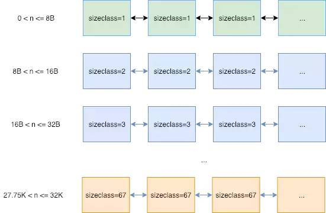
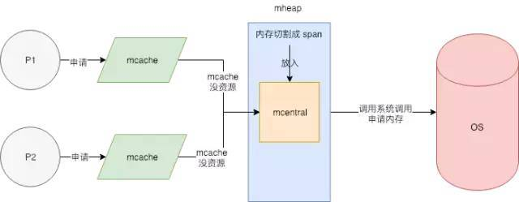
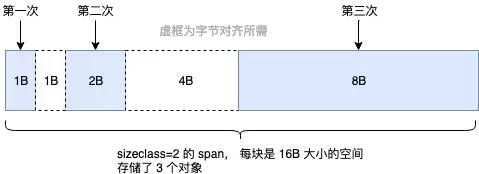
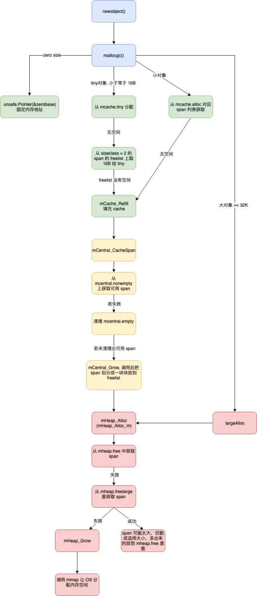

# Go语言内存管理(二)

## 介绍
了解操作系统对内存管理的机制后，现在可以去看一下Go语言是如何利用底层的这些特性来优化内存的。Go的内存管理基本上参考tomalloc来实现的，只是细节上根据自身的需要做了一些小的优化调整。

Go的内存是自动管理的，我们可以随意定义变量直接使用，不需要考虑变量背后的内存申请和释放的问题。本文意在搞清楚Go在这方面帮我们做了什么，使我们不再关心那些复杂内存问题，还依旧能写出高效的程序。

## 池
程序动态申请内存空间，是要使用系统调用的，比如Linux系统上是调用mmap方法实现的。但对于大型系统服务来说，直接调用mmap申请内存，会有一定的代价：
1. 系统调用会导致程序进入内核态，内核分配完内存后(也就是上篇所讲的，对虚拟地址和物理地址进行映射等操作)，再返回到用户态。
2. 频繁申请很小的内存空间，容易出现大量内存碎片，增大操作系统整理碎片的压力。
3. 为了保证内存访问具有良好的局部性，开发者需要投入大量的精力去做优化，这是一个很重的负担。

如何解决上面的问题呢？有经验的人很快就会想到解决方案，那就是我们常说的对象池(也可以说是缓存)。

假设系统需要频繁动态申请内存来存放一个数据结构，比如[10]int。那么我们完全可以在程序启动之初，一次性申请几百甚至上千个[10]int。这样完美解决了上面遇到的问题：
1. 不需要频繁申请内存了，而是从对象池里拿，程序不会频繁进入内核态。
2. 因为一次性申请一个连续的大空间，对象池会被重复利用，不会出现碎片。
3. 程序频繁访问的就是对象池背后的同一块内存空间，局部性很好。

这样做会造成一定的内存浪费，我们可以定时检测对象池的大小，保证对象的数量在一个合理的范围之内，少了就提前申请，多了就自动释放。

如果某种资源的申请和回收是昂贵的，我们都可以通过建立资源池的方式来解决，其他比如连接池、内存池等等，都是一个思路。

## Golang内存管理
Golang的内存管理本质上就是一个内存池，只不过内部做了很多优化。比如自动伸缩内存池大小，合理的切个内存块等等。

### 内存池mheap
Golang在程序启动之初，会一次性的从操作系统那里申请一大块内存作为内存池。这块内存空间会放在一个叫做mheap的struct中管理，mheap负责将这一块内存切割成不同的区域，并将其中的一部分的内存切割成合适的大小，分配给用户使用。

我们需要先知道几个重要的概念：
page：内存页，一块8K大小的内存空间。Go与操作系统之间的内存申请和释放，都是以page为单位的。
span：内存块，一个或者多个连续的page组成一个span。如果把page比作工人，span可以看成是小队，工人被分成若干个队伍，不同的队伍干不同的活。
sizeclass：空间规格，每个span都带着一个sizeclass，标记着该span中的page该如何使用。使用上面的比喻，就是sizeclass标志着span属于上面工种。
object：对象，用来存储一个变量数据的内存空间，一个span在初始化时，会被切割成一堆等大的object。加上object的大小是16B，span的大小是8K，那么就会把span中的page初始化8K/16B=512个object。所谓内存分配就是分配出一个object。


上图中，不同颜色代表不同的span，不同span的sizeclass不同，表示里面的page将会按照不同的规格切割成一个等大的object用作分配。

使用Go1.11.5版本测试了下初始堆内存分配应该是在64M左右，低版本的会少点。
测试代码：
```go
package main
import "runtime"
var stat runtime.MemStats
func main() {
    runtime.ReadMemStats(&stat)
    println(stat.HeapSys)
}
```
内部整体内存布局如下图所示：

- mheap.spans：用来存储page和span的信息，比如一个span的起始地址是多少，有几个page，已使用了多大等等。
- mheap.bitmap：存储着各个span中对象的标记信息，比如对象是否可回收等等。
- mheap.areana_start：将要分配给应用程序使用的空间。

在说明下，图中的空间大小，是Go向操作系统申请的虚拟内存地址空间，操作系统会将该地址空间预留出来不做它用。

### mcentral
用途相同的span会以链表的形式组织在一起。这里的用途sizeclass来表示，就是指该span用来存储那种大小的对象。比如当分配一块大小位n的内存时，系统计算n应该使用哪种sizeclass，然后根据sizeclass的值去找到一个可用的span来做分配，其中sizeclass有67种，如图所示：

找到合适的span后，会从中取出一个object返回给上层使用。这些span被放在一个叫做mcentral的结构中管理。

mheap将从OS那里申请过来的内存初始化成一个大的span(sizeclass=0)。然后根据需要从这个大span中切出小的span，放在mcentral中管理。大span有mheap.freelarge和mheap.busylarge等管理。如果mcentral中的span不够用了，会从mheap.freelarge上再切割一块，如果mheap.freelarge空间不够，会再次从OS那里申请内存重复上述步骤。下面是mheap和mcentral的数据结构。
```go
 type mheap struct {
     // other fields
     lock      mutex
     free      [_MaxMHeapList]mspan // free lists of given length， 1M 以下
     freelarge mspan                // free lists length >= _MaxMHeapList, >= 1M
     busy      [_MaxMHeapList]mspan // busy lists of large objects of given length
     busylarge mspan                // busy lists of large objects length >= _MaxMHeapList
 
     central [_NumSizeClasses]struct { // _NumSizeClasses = 67
        mcentral mcentral
        // other fields
    }
    // other fields
}

// Central list of free objects of a given size.
type mcentral struct {
    lock      mutex // 分配时需要加锁
    sizeclass int32 // 哪种 sizeclass
    nonempty  mspan // 还有可用的空间的 span 链表
    empty     mspan // 没有可用的空间的 span 列表
}
```

这种方式可以避免出现外部碎片，因为同一个span是按照固定大小分配的和回收的，不会出现不可利用的一小块内存把内存分割掉。这个设计方式与现代操作系统中的伙伴系统有点相似。

### mcahe
如果你阅读比较仔细，会发现mcentral结构中有一个lock字段，因为并发情况下，很有可能多个线程同时从mcentral那里申请内存的，必须要用锁来避免冲突。

但是锁是低效的，在高并发服务中，它会使内存申请成为整个系统的瓶颈，所以在mcentral的前面又增加了一层mcache。

每一个mcache和每一个处理器(p)是一一对应的，也就是说每个P都有一个mcache成员。Goroutine申请内存时，首先从其所在的P的mcache中分配，如果mcache没有可用的span，再从mcentral中获取，并填充到mcache中。

从mcache上分配的空间是不需要加锁的，因为在同一时间里，一个P只有一个线程在其上运行，不可能出现竞争。没有了锁的限制，大大加速了内存的分配。

所以整体的内存分配模型大致如下所示：


## 其他优化
### zero size
有一些对象所需要的内存大小是0，不如[0]int，struct{}，这些类型的数据根本就不需要内存，所以没必要走上面那么复杂的逻辑。

系统会直接返回一个固定的内存地址，源码如下：
```go
func mallocgc(size uintptr, typ *_type, flags uint32) unsafe.Pointer {
    // 申请的 0 大小空间的内存
    if size == 0 {
        return unsafe.Pointer(&zerobase)
    }
    //.....
}
```
测试代码：
```go
package main

import (
    "fmt"
)

func main() {
    var (
        a struct{}
        b [0]int
        c [100]struct{}
        d = make([]struct{}, 1024)
    )
    fmt.Printf("%p\n", &a)
    fmt.Printf("%p\n", &b)
    fmt.Printf("%p\n", &c)
    fmt.Printf("%p\n", &(d[0]))
    fmt.Printf("%p\n", &(d[1]))
    fmt.Printf("%p\n", &(d[1000]))
}
// 运行结果，6 个变量的内存地址是相同的:
0x557f50
0x557f50
0x557f50
0x557f50
0x557f50
0x557f50
```
### Tiny对象
上面提到的sizeclass=1的span，用来给<=8B的对象使用，所以像int32，byte，bool以及小字符串等常用的微小对象，都会使用sizeclass=1的span，但是分配给他们8B的空间，大部分是用不上的。并且这些类型的使用频率非常高，就会导致出现大量的内部碎片。

所以Go尽量不使用sizeclass的span，而是将<16B 的对象统一视为tiny对象(tinysize)。分配时，从sizeclass的span中获取一个16B的object用以分配。如果存储对象小于16B，这个空间暂时会被保存起来(mcache.tiny字段)，下次分配时会复用这个空间，知道这个object用完为止。

如图所示：

以上图为例，这样的方式空间利用率是(1+2+8)/16x100%=68.75%，而如果按照原来的管理方式，利用率是(1+2+8)/(8x3)=45.83%

源码中注释描述，说是对tiny对象的特殊处理，平均会节省20%左右的内存。

如果要存储的数据里有指针，即使<=8B也不会作为tiny对象，而是正常使用sizeclass=1的对象。

### 大对象
如上面所示，最大的sizeclass最大只能存放32K的对象，如果一次性申请超过32K的内存，系统会绕过mcache和mcentral，直接从mheap上获取，mheap中有一个freelarge字段管理着超大内存。

## 总结：
内存的释放过程，没什么特别之处。就是分配的返过程，当mcache中存在较多的空闲的span时，会归还给mcentral；而mcentral中存在较多的mspan时，会归还给mheap；mheap再归还给操作系统。这里就不详细介绍了。

总结一下，这种设计之所以快，主要有以下几个优势：
1. 内存分配大多时候是在用户态完成的，不需要频繁进入内核态。
2. 每个P都有独立的span mcache，多个CPU不会并发读写同一块内存，进而减少CPU L1cache的CacheLine出现dity情况，增大CPU Cache命中率。
3. 内存碎片的问题，Go是自己在用户态管理的，在OS层面看是没有碎片的，使得操作系统层面对碎片的压力也会降低。
4. mcache的存在使得内存分配不需要加锁。

当然这不是没有代价的，Go需要预申请大块内存，这必然会出现一定的浪费，不过好在内存比较廉价，不用太在意。

总体上，Go内存管理也是一个金字塔结构：


这种设计比较通用，比如常见的web服务设计，为提升性能，一般都会设计成客户端cache->服务器cache->服务端db这几层，也是金字塔结构。

将有限的计算资源布局成金字塔结构，再将数据从热到冷分为几个等级，放置在金字塔结构上。调度器不断作调整，将热数据放在金字塔的顶端，冷数据放在金字塔的底端。

这种设计利用了计算的局部性原理，认为冷热数据的交替是缓慢的。所以最怕的就是，数据访问出现冷热骤变。在操作系统上我们称为内存颠簸，系统架构上通常被说成是缓存穿透。其实都是一个意思，就是过度的使用了金字塔的底端资源。

这套内部机制，使得高性能服务容易很多，通俗来讲坑少了。一般情况下你随便谢谢性能都不会太差。我遇到过的导致内存出现压力的主要有2中情况：
1. 频繁申请大对象，常见于文本处理，比如写一个海量的日志分析服务，很多日志内容都很长，这种情况建议自己维护一个对象[]byte池，避免每次都要去mheap上申请。
2. 滥用指针，指针的存在不仅容易造成内存浪费，对GC也会造成额外的压力，所以尽量不要使用指针。

## 内存碎片
内存碎片是系统在内存管理过程中，会不可避免的出现一块快无法被使用的内存空间，这是内存管理的产物。

## 内部碎片
一般都是因为字节对齐，如上面介绍的tiny对象分配的部分，为了字节对齐，会导致一部分的内存空间直接被放弃掉，不做分配使用。
再比如分配28B大小的内存空间，系统会分配32B的空间给他，这也导致了其中4B空间是浪费掉的。这就是内部碎片。

## 外部碎片
一般是因为内存的不断分配释放，导致一些小的内存快分散在内存各处，无法被用以分配。如图：

上面8B和16B的小空间，很难再被利用起来。不过Go的内存管理机制不会引起大量外部碎片。

## 源代码调用过程


## runtime.MemStats 部分注释
```go
 type MemStats struct {
         // heap 分配出去的字节总数，和 HeapAlloc 值相同
         Alloc uint64
 
         // TotalAlloc 是 heap 累计分配出去字节数，每次分配
         // 都会累加这个值，但是释放时候不会减少
         TotalAlloc uint64
 
         // Sys 是指程序从 OS 那里一共申请了多少内存
        // 因为除了 heap，程序栈及其他内部结构都使用着从 OS 申请过来的内存
        Sys uint64

        // Mallocs heap 累积分配出去的对象数
        // 活动中的对象总数，即是 Mallocs - Frees
        Mallocs uint64

        // Frees 值 heap 累积释放掉的对象总数
        Frees uint64

        // HeapAlloc 是分配出去的堆对象总和大小，单位字节
        // object 的声明周期是 待分配 -> 分配使用 -> 待回收 -> 待分配
        // 只要不是待分配的状态，都会加到 HeapAlloc 中
        // 它和 HeapInuse 不同，HeapInuse 算的是使用中的 span，
        // 使用中的 span 里面可能还有很多 object 闲置
        HeapAlloc uint64

        // HeapSys 是 heap 从 OS 那里申请来的堆内存大小，单位字节
        // 指的是虚拟内存的大小，不是物理内存，物理内存大小 Go 语言层面是看不到的。
        // 等于 HeapIdle + HeapInuse
        HeapSys uint64

        // HeapIdle 表示所有 span 中还有多少内存是没使用的
        // 这些 span 上面没有 object，也就是完全闲置的，可以随时归还给 OS
        // 也可以用于堆栈分配
        HeapIdle uint64

        // HeapInuse 是处在使用中的所有 span 中的总字节数
        // 只要一个 span 中有至少一个对象，那么就表示它被使用了
        // HeapInuse - HeapAlloc 就表示已经被切割成固定 sizeclass 的 span 里
        HeapInuse uint64

        // HeapReleased 是返回给操作系统的物理内存总数
        HeapReleased uint64

        // HeapObjects 是分配出去的对象总数
        // 如同 HeapAlloc 一样，分配时增加，被清理或被释放时减少
        HeapObjects uint64

        // NextGC is the target heap size of the next GC cycle.
        // NextGC 表示当 HeapAlloc 增长到这个值时，会执行一次 GC
        // 垃圾回收的目标是保持 HeapAlloc ≤ NextGC，每次 GC 结束
        // 下次 GC 的目标，是根据当前可达数据和 GOGC 参数计算得来的
        NextGC uint64

        // LastGC 是最近一次垃圾回收结束的时间 (the UNIX epoch).
        LastGC uint64

        // PauseTotalNs 是自程序启动起， GC 造成 STW 暂停的累积纳秒值
        // STW 期间，所有的 goroutine 都会被暂停，只有 GC 的 goroutine 可以运行
        PauseTotalNs uint64

        // PauseNs 是循环队列，记录着 GC 引起的 STW 总时间
        //
        // 一次 GC 循环，可能会出现多次暂停，这里每项记录的是一次 GC 循环里多次暂停的综合。
        // 最近一次 GC 的数据所在的位置是 PauseNs[NumGC%256]
        PauseNs [256]uint64

        // PauseEnd 是一个循环队列，记录着最近 256 次 GC 结束的时间戳，单位是纳秒。
        //
        // 它和 PauseNs 的存储方式一样。一次 GC 可能会引发多次暂停，这里只记录一次 GC 最后一次暂停的时间
        PauseEnd [256]uint64

        // NumGC 指完成 GC 的次数
        NumGC uint32

        // NumForcedGC 是指应用调用了 runtime.GC() 进行强制 GC 的次数
        NumForcedGC uint32

        // BySize 统计各个 sizeclass 分配和释放的对象的个数
        //
        // BySize[N] 统计的是对象大小 S，满足 BySize[N-1].Size < S ≤ BySize[N].Size 的对象
        // 这里不记录大于 BySize[60].Size 的对象分配
        BySize [61]struct {
                // Size 表示该 sizeclass 的每个对象的空间大小
                // size class.
                Size uint32

                // Mallocs 是该 sizeclass 分配出去的对象的累积总数
                // Size * Mallocs 就是累积分配出去的字节总数
                // Mallocs - Frees 就是当前正在使用中的对象总数
                Mallocs uint64

                // Frees 是该 sizeclass 累积释放对象总数
                Frees uint64
        }
}
```