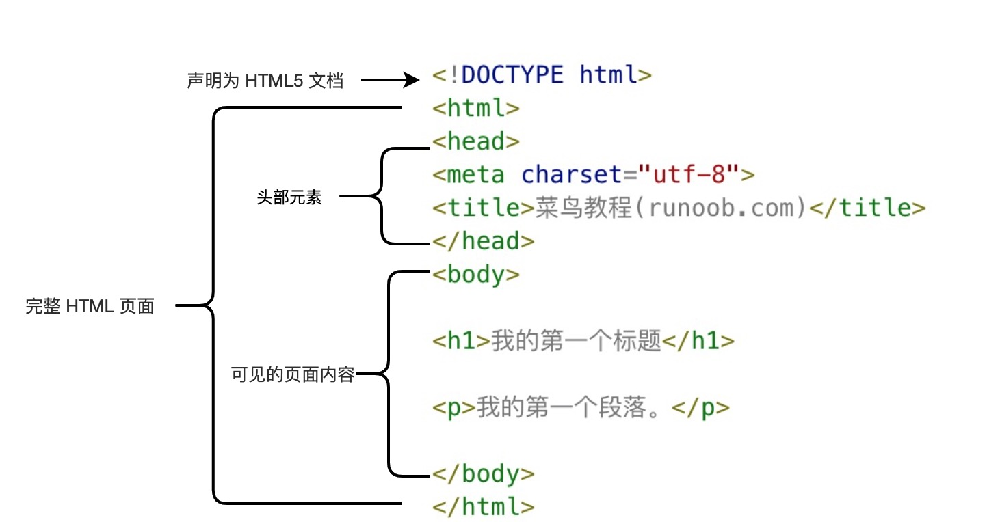

# HTML总结

##  HTML简介

```
<!DOCTYPE html>申明为html5文档
<html>元素是HTML页面的根元素
<head>元素包含文档的元meta数据,如<meta charset="utf-8">定制网页的编码格式为utf-8
<title>元素描述了文档的主题
<body>元素包含了可见页面的内容
<h1>元素定义一个大标题
<p>元素定义一个段落
```

## 什么是HTML
HTML是用来描述网页的一种语言
```
HTML 指的是超文本标记语言：HyperText Markup Language
HTML 不是一种变成语言，而是一种标记语言
标记语言是一种标记标签（markup tag）
HTML 使用标记标签来描述网页
HTML 文档包含了HTML标签及内容
HTML 也叫做web页面
```

##  中文编码
目前在大部分浏览器中，直接输出中文会出现中文乱码的情况，这时候我们就需要在头部将字符声明为 UTF-8 或 GBK。
```
<!DOCTYPE html>
<html>
<head>
<meta charset="UTF-8">
<title>
页面标题</title>
</head>
<body>
 
<h1>我的第一个标题</h1>
 
<p>我的第一个段落。</p>
 
</body>
</html>
```

##  HTML属性
```
HTML 元素可以设置属性
属性可以在元素中添加附加信息
属性一遍描述于开始标签
属性总是以名称/值对的形式出现
```

### 常用属性：
-   class：为html元素定义一个或者多个类名（classname）（类名从样式文件引入）
-   id：定义元素的唯一ID
-   style：规定元素的行内样式(inline style)
-   title：描述了元素的额外信息（作为工具条使用）


##  a标签
a签定义超链接，用于从一个页面链接到另一个页面。
a元素最重要的属性是 href 属性，它指定链接的目标。

### a标签常用属性
-   href: 规定链接的目标 URL。
-   rel：规定当前文档与目标URL之间的关系。
-   downlaod：指定下载链接
-   target：规定在何处打开目标URL。
    -   _blank:新窗口打开
    -   _parent:在父窗口打开链接
    -   _self:默认，在当页面跳转
    -   _top:在当前窗体打开链接，并替换当前整个窗体（框架页）。