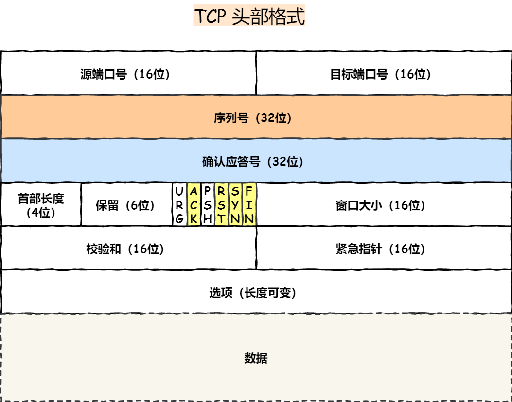

#   任TCP虐我千百遍，我仍待TCP如初恋

#   TCP基本认识
##  1.  TCP头部格式
### 1.1 TCP头部格式如下

源端口号(16bit) + 目标端口号(16bit) + 序列号(32bit) + ack序列号(32bit) + 首部长度(4bit) + 保留(6bit) + 标志位(6bit) + 窗口大小(16bit) + 校验和(16bit) + 紧急指针(16bit) + 选项(长度可变)

### 1.2 为什么需要TCP？ TCP工作在那一层?
先来说说OSI七层和tcp/IP 分层模型
OSI七层:物理层、链路层、网络层、传输层、回话层、表示层、应用层。
tcp/IP：网络接口层、网络层、传输层、应用层。

IP层是不可靠的，它不保证网络包的顺序、完整的交付。
如果需要保证网络数据包的可靠性，那么就需要有上层（传输层）的TCP协议来负责。因为TCP是一个工作在传输层的可靠的数据传输服务，它能确保接收端接收的网络包是无损坏的、无间隔的、非冗余和按序的。

### 1.3 什么是TCP？
tcp是<font color="blue">面向连接的、字节流、可靠的</font>网络传输通讯协议。
-   面向连接：一对一的连接，不能像UDP协议可以一个主机同时向多个主机发送消息，也就是一对多无法做到的。
-   可靠的：无论网络链路发生了什么样的变化，TCP都能够保证一个报文一定能够达到接收端。
-   字节流：用户消息通过TCP协议传输时，消息数据可能会被操作系统分组层多个TCP报文，如果接收方的程序不知道消息的边界，是无法读出一个有效数据的。并且tcp报文是有序的，当前一个tcp报文没有收到的时候，即使它收到了后面的tcp报文，那么也不会扔给应用层去处理，同时对重复的报文会自动丢弃。

### 1.4 UDP和TCP有什么区别？分别应用场景是啥？
UDP不提供复杂的控制机制，利用IP提供面向无连接的通讯服务。
UDP协议真的非常简单，头部只有8个字节，UDP头部格式如下：
源端口号(16bit)+目的端口号(16bit) + 包长度(16bit) + 校验和(16bit)

TCP和UDP区别：
1、 连接：
-   TCP是面向连接的传输层协议，传输前需要建立连接
-   UDP是不需要连接，即刻传输数据。

2、 服务对象：
-   TCP是一对一的两点服务，即一条连接只有两个端点。
-   UDP支持一对一、一对多、多对多的交互通信。

3、 可靠性：
-   TCP是可靠交付数据的，数据可以无差错、不丢失、无重复、按序到达。
-   UDP是尽最大努力交付，不保证可靠的数据交付。

4、 拥塞控制、流量控制：
-   TCP有拥塞控制和流量控制机制，保证数据传输的安全性。
-   UDP则没有，即使网络拥堵了，也不会影响UDP的发送速率。

5、 首部开销：
-   TCP首部长度较长，会有一定的开销，首部再没有使用选项字段时是20字节，如果使用了会边长。
-   UDP首部只有8个字节，并且是固定不变的，开销较小。

6、 传输方式：
-   TCP是流数据，没有边界，但保证有序性和可靠。
-   UDP是一个包一个包的发送，是有边界的，但可能会丢包或乱序。

7、 分片不同：
-   TCP的数据大小如果小于mss大小，则会在窗口传输层进行分片，目标主机收到后，也同样再传输层组装tcp包，如果中途丢失了一个分片，则传输层只需要重传这个丢失的分片即可。
-   UDP的数据包大小如果大于MTU大小，则会再IP层进行分片，目标主机收到数据后，在IP层组装数据，然后在发送给传输层。

### 1.5 UDP和TCP应用场景
由于TCP是面向连接的，能保证数据的可靠性交付，因此经常用于：
-   FTP文件传输。
-   HTTP/HTTPS。
由于UDP面向无连接的，它可以随时发送数据，再加上UDP本身的处理即简单又高效，因此经常用于：
-   包总量较小的通讯，如DNS、SNMP等；
-   视频音频等多媒体通讯；
-   广播通讯；

##  2.  TCP建立连接
### 2.1 TCP三次握手的过程是怎么样的？
-   一开始，客户端和服务端都处于close状态，先是服务端主动监听某个端口，处于listen状态；
-   客户端会随机初始化序列号，将此序列号置于TCP首部的序号字段中，同事把SYN标志位置为1，表示SYN报文。接着把SYN报文发送给服务端，表示客户端发起了一个连接，该报文不含应用层数据，之后客户端处于SYN-SENT状态；
-   服务端收到syn报文后，首先服务器端也随机初始化自己的序列号，将此序列号填入TCP首部的序号字段中，其次tcp首部的应答确认号字段中填上client_isn+1,接着把syn和ack标志位置为1。最后把报文发送给客户端，该报文不包含应用层数据，之后服务端处于SYN-RCVD状态。
-   客户端收到服务端的报文后，还要向服务端发送最后一个应答报文，首先首部应该将tcp的ack标志位置为1，其次确认号字段填上server-isn+1，最后把报文发送给服务端，这次报文可以携带上客户到服务端的数据，之后客户端处于ESTABLISH状态。

综上，前两次握手是不携带数据的，<font color="red">第三次是可以携带数据的</font>。

### 2.2 如何在linux系统中查看TCP状态？
    TCP的连接状态查看，再linux中可以用netstat -anpt命令查看。

### 2.3 为什么是三次握手？而不是两次、四次？
比较常见的回答是：三次握手保证了客户端和服务具有发送和接受能力。
这个回答是片面的，没有回答主要原因。
在前面我们知道了什么是TCP连接：
    用于保证可靠性和流量控制的某些状态信息，这些信息的组合，包括Socket、序列号和窗口大小。

所以，重要的是为什么三次握手才可以初始化Socket、序列号和窗口大小。
接下来，已三个方面分析三次握手的原因：
-   三次握手才可以阻止重复历史连接的初始化（主要原因）
-   三次握手才可以同步双方的初始化序列号
-   三次握手才可以避免资源的浪费

原因一：避免历史连接
三次握手的首要原因是为了防止旧的重复连接初始化造成混乱。
>我们考虑一个场景：客户端先发送了一个SYN=90的请求，然后客户端宕机了，而且这个SYN报文还被网络阻塞了，服务端并没有收到，接着客户端重启，又重新和服务器建立了连接，发送了SYN=100的请求。

客户端连续发送多次SYN建立连接的报文，再网络阻塞情况下：
-   一个旧的SYN报文比最新的SYN报文早到达了服务端；
-   那么此时服务端就会回复SYN+ACK的报文；
-   客户端收到报文后根据上下文可以判断出这是一个历史连接（序列号超时或者失效了），那么客户端就会发送RST报文给服务端，表示终止这次连接。

如果是两次捂手连接，就无法阻止历史连接，那为什么两次握手就无法阻止历史连接呢？

    主要是因为在两次握手的情况下，被动发起方没有中间状态给主动发起方来阻止历史连接，导致被动发起方可能建立一个历史连接，造成资源的浪费。因为被动发起方再收到SYN之后就进入了ESTABLISHED装填，意味着这时可以给被动发起方发送数据，但是主动发起方还没有进入ESTABLISHED状态，假设这是历史连接，主动发起方判断为历史连接，就主动给被动发起方发送RST报文来断开连接，而被动发起方在第一次握手的时候就进入ESTABLISHED状态，所以他是可以发送数据的，但是它并不知道这是个历史连接，它只有再收到RST报文后，才会断开连接。可以看到，再这种情况，被动发起方白白发送了数据，浪费了被动方的资源。
    要解决这种现象，最好就是再被动方发送数据之前，也就是建立连接之前，要阻止掉历史连接，这样就不会造成资源的浪费，要实现这个功能，就需要三次握手。

原因二：同步双方初始序列号

    TCP协议通讯的双方，都必须维护一个序列号，序列号是可靠性传输的一个关键因素，它的作用：
-   接收方可以去除重复的数据
-   接收方可以根据数据包的序列号按序接收；
-   可以标识发送出去的数据包中，那些是已经被对方收到的（通过ACK报文中的序列号知道的）；
>两次握手只保证了一方的初始序列号能被对方接收，没法保证双方的序列号都被确认接收。

原因三：浪费资源：

    如果只有两次握手，客户端的syn请求连接再网络中阻塞，客户端没有收到ack报文， 就会重发syn报文，由于没有三次握手，服务器没法知道客户端是否已经接收到了ack报文，所以每收到一个syn报文，就会建立一个连接，如果客户端的syn阻塞了，重复发送多次syn报文，那么服务器再接收到请求后就会去创建多个冗余的无效的连接，造成资源的不必要的浪费。

>小结：
>
>TCP建立连接时，通过三次握手能防止历史连接的建立，能减少双方不必要的资源开销，能帮助双方同步初始化序列号。序列号能保证数据包不重复、不丢弃和按序传输。
>
>不使用两次和四次握手的原因：
>
>   -   两次握手：无法防止历史连接的建立，会造成双方资源的浪费，也无法可靠的同步双方序列号。
>   -   四次握手：三次握手就已经理论上最少可靠连接建立，所以不需要使用更多的通信次数。   

### 2.4 为什么每次建立TCP连接时，初始化的序列号不一样？
>   主要原因有两个方面：
>   
>   -   为了防止历史报文被下一个相同的四元组的连接接收（主要方面）；
>   -   为了安全性，防止黑客伪造相同的序列号的TCP被对方接收；

过程如下：
-   客户端和服务端建立一个TCP连接，在客户端发送数据被网络阻塞了，然后超时重传了这个数据包，而此时服务器设备断电重启，之前与客户端建立的连接消失了，于是在收到客户端数据包的时候会发送RST报文。
-   客户端收到RST报文，重置连接，又建立了一个跟上一个四元组相同的连接。
-   在建立连接完成后，服务端就收到了之前被阻塞的数据包，正好在服务器的接收窗口内，所以该报文会被服务器正常接收，就会造成数据错乱。

### 2.5 既然IP层会分片，为什么TCP还需要MSS呢？
我们先来认识一下MTU和MSS：
-   MTU：一个网络包的最大长度，以太网中一般未1500字节。
-   MSS：除去IP和TCP头部之后，一个网络包所能容纳的TCP的最大长度。

如果再TCP中整个报文都交给IP层进行分片，会有什么异常？
当IP层有一个超过MTU大小的数据（TCP头部+TCP数据）要发送，那么IP层就要分片，把数据分成若干片，保证每一个部分都小于MTU。把一份IP数据报进行分片以后，有目标主机的IP层进行重新组装，再交给上一层TCP传输层。

这看起来井然有序，但是存在隐患，那么如果当一个IP分片丢失，整个IP报文的所有分片都得重传。

因为IP层本身没有重传机制，它有TCP层来负责超时和重传。当接收方发现TCP报文（头部+数据）的某一段丢失后，则不会响应ACK给对方，那么对端的TCP再超时后，就会重发整个TCP报文（头部+数据）。 因此可以得知有IP层进行分片传输，是非常没有效率的。

所以为了能达到最佳的传输效率，TCP再建立连接的时候通常要协商双方的MSS值，当TCP层发现数据层超过MSS时，则就会先进行分片，当然有它形成的IP报文就不会分片了。通过TCP分片后，即使发送了报文丢失，超时重传也是基于MSS为单位重传的，大大增加了效率。

### 2.6 第一次握手的丢失，会发生什么？
当客户端想和服务端建立TCP连接，首先会发送一个SYN报文，然后就进入到SYN-SENT状态，在这之后，如果客户端迟迟收不到ACK报文，会触发超时重传机制，重传SYN报文，而且重传的SYN报文的序列号都是一样的。
不同版本的操作系统的超时重传时间可能不一样，有的1s,有的3s,这个超时时间是写死再内核中的，如果想要修改这个参数就要重新编译内核，比较麻烦。
当客户端在1秒之后没有收到SYN-ACK报文，客户端就会重发SYN报文，那到底是重发几次呢？
在linux里，客户端的SYN报文最大重传次数由tcp_syn_retries内核参数控制，这个参数是可以自定义的，默认值是5。
```
# cat /proc/sys/net/ipv4/tcp_syn_retries
5
```
通常，第一次超时重传是在1秒之后，第二次是2秒，第三次是4秒，第四此是8秒，第五次是16秒，每次超时是上一次的两倍。第五次超时重传时候，会等待32秒，如果服务端仍然没有回应ack，客户端就不在发送syn报文，然后断开tcp连接。所以总耗时1+2+4+8+16+32=63秒，大约1分钟左右。

### 2.7 第二次握手丢失了，会发生什么？
当服务端收到客户端的syn后，就会回SYN-ACK报文，这个就是第二次握手，此时服务端会进入SYN-RCVD状态。
第二次握手的SYN-ACK报文其实有两个目的：
-   第二次握手里的ACK其实是对第一次握手的回应确认；
-   第二次握手的SYN，是服务端发起TCP建立连接的报文；

所以，第二次握手的报文丢了，就会发生比较有意思的事情：因为第二次握手包含对第一次握手的确认报文，如果客户端迟迟收不到服务端的SYN-ACK，就会触发超时重传SYN报文。然后因为第二次握手的报文包含服务端发起的SYN报文，，所以只有当客户端接收到报文后返回ACK报文（即第三次握手报文），服务端才会认为改SYN报文被服务端接收到了。那么如果第二次握手报文丢失了，服务端就收不到第三次握手，于是服务端这边就会触发TCP的超时重传机制重发SYN-ACK报文。

在linux下，SYN-ACK报文的最大重传次数是又内核参数tcp-synack-retries控制的，默认是5.

因此，客户端和服务端都会重传。

### 2.8 第三次握手丢失了，会发生什么？
客户端收到服务端的syn-ack报文，就会给服务端返回一个ack报文，也就是第三次握手，此时客户端也进入到established状态。
因为这个第三次握手的报文是对第二次握手syn报文的确认，所以当第三次握手报文丢失了，服务端迟迟收不到那么ack报文，就会重传syn-ack报文，知道收到ack或者达到最大次数。

### 2.9 什么是syn攻击，如何避免syn攻击？
我们都知道TCP连接建立是需要三次握手的，假设攻击者短时间内伪造不同的IP地址进行SYN报文，服务端每接收到一个SYN报文，都会进入SYN-RCVD状态，但服务端发出去的ACK+SYN报文，无法得到未知IP主机的ACK应答，久而久之就会沾满服务器的半连接队列，使得服务器不能为正常用户服务。

先了解一下什么是TCP半连接和全连接队列。
在TCP三次握手的时候，linux内核会维护两个连接队列：
-   半连接队列，也成SYN队列
-   全连接队列，也成accept队列

先来看看linux内核的半连接队列和全连接队列是如何工作的：

正常流程：
-   当服务端接收到客户端的SYN报文时，会创建一个半连接的对象，然后将其加入到内核的半连接队列；
-   接着发送SYN-ACK给客户端，等待客户端回应ack；
-   服务端接收到ack报文后，从SYN队列取出一个半连接的对象，然后创建一个新的半连接对象放入到accept队列中。
-   应用通过调用accept() 的socket接口，从accept队列中取出连接对象。

不管是半连接还是全连接队列，都有最大长度，超过限制，默认情况都会丢弃报文。

SYN攻击方式最直接的表现就是会把TCP半连接队列打满，这样当TCP半连接队列满了，后续再收到SYN报文就会丢弃，导致客户端无法和服务端建立连接。

避免SYN攻击方式，有以下四种方法：
-   调大 netdev-max-backlog；
-   调大tcp半连接队列；
-   开启syn-sybcookies；
-   减少syn-ack的重传次数；

>   方式一：调大 netdev-max-backlog

当网卡接收数据包的速度大于内核处理的速度时，会有一个队列保存这些数据包，控制改队列的最大值如下参数，默认值是1000，我们要适当调大该参数的值，比如设置为 10000：
```
net.core.netdev_max_backlog = 10000
```

>   方式二：调大tcp半连接队列

增大TCP半连接队列，要同事增大如下三个参数：
-   增大net.ipv4.tcp_max_syn_backlog
-   增大 listen() 函数中的 backlog
-   增大 net.core.somaxconn

>   方式三：开启net.ipv4.tcp_syncookies;

开启syncookies功能就可以在不使用syn半连接的情况下成功建立连接，相当于绕过了syn半连接队列

具体过程：
-   当syn队列满了之后，后续服务器收到syn包不会丢弃，而是根据算法，计算出一个cookie值；
-   将cookie值放到第二次握手的报文的序列号中，然后服务端回第二次握手给客户端；
-   服务端接收到客户端的应答报文时，服务器会检查这个ack报文的合法性。如果合法，将该连接对象放入到accept队列。
-   最后应用程序通过调用accept（）接口，从accept队列中取出连接。

可以看到，当开启了tcp_syncookies了，即使受到SYN攻击导致SYN队列满时，也能保证正常的连接成功建立。

net.ipv4.tcp_syncookies参数主要有一下三个值：
-   0值：表示关闭该功能
-   1值：表示仅当SYN半连接队列放不下时，再启用它；
-   2值：表示无条件开启功能；

那么在应对SYN攻击时，只需要设置为1即可。
```
$ echo 1 > /proc/sys/net/ipv4/tcp_syncookies
```

>   方式四：减少SYN+ACK重传次数

当服务端受到SYN攻击时，就会有大量处于SYN-RCVD状态的TCP连接，处于这个状态的TCP会重传SYN-ACK，当重传超过次数达到上限后，就会断开连接。那么针对SYN攻击场景，我们可以减少SYN-ACK重传次数，以加快处于SYN-RCVD状态的TCP断开连接。

##  3   TCP断开连接
### 3.1 TCP四次挥手的过程是怎么样的？
-   客户端打算关闭连接，此时会发送一个TCP首部FIN标志位置为1的报文，即FIN报文，之后客户端进入FIN-WAIT-1状态。
-   服务端收到FIN报文后，就向客户端发送ACK报文，接着服务端进入CLOSE_WAIT状态。
-   客户端收到服务端ACK报文后，之后进入FIN_WAIT_2状态。
-   等待服务端处理完数据后，也向客户端发送FIN报文，之后进入LAST_ACK状态。
-   客户端收到服务端的FIN报文，回一个ACK报文，之后进入TIME_WAIT状态。
-   服务端收到ACK应答报文，就进入close状态，至此服务端已经完成了连接的关闭。
-   客户端在经过2MSL一段时间后，自动进入close状态，至此客户端也完成了连接的关闭。

### 3.2 为什么会需要四次挥手？
再来回顾一下四次挥手双方发FIN包的过程，就能理解为什么需要四次挥手了。
-   关闭连接时，客户端向服务端发送FIN报文时，仅仅表示客户端不再发送数据，但是还能接收数据。
-   服务器收到客户端的FIN报文，先回一个ACK应答报文，而服务端可能还有数据需要处理和发送，等服务端不在处理和发送数据的时候，才发送FIN报文给客户端表示同意现在管理连接。

从上面可知，服务端通常需要等待完成数据的发送和处理，所以服务端的ACK和FIN一般会分开发送，所以是需要四次挥手。但是再特定情况下，四次挥手是可以变成三次挥手的。

### 3.2 第一次挥手丢失了，会发生什么？
当客户端主动关闭连接，发送FIN报文后，进入FIN-WAIT-1状态，正常情况下如果能收到ACK，立刻进入FIN-WAIT-2状态。如果第一次挥手丢失，那么客户端迟迟收不到ACK报文，也就会触发超时重传机制，重传ACK报文。重发次数有tcp-orphan-retries参数控制。当客户端重传FIN报文的次数超过tcp-orphan-retries后，就不再发送FIN报文，则会再一段时间后进入CLOSE状态。

### 3.3 第二次挥手丢失了，会发生什么？
当服务端收到FIN报文后，会先发一个ACK报文，进入CLOSE-WAIT状态，如果第二次挥手丢失了，客户端也会迟迟收不到ACK报文，触发FIN报文的超时重传，当客户端重传FIN报文的次数超过tcp-orphan-retries后，就不再发送FIN报文，则会再一段时间后进入CLOSE状态。

还有一点，当客户端收到第二次挥手报文ACK时，就进入FIN-WAIT-2状态，在这个状态就是等待服务端发送第三次挥手报文，也就是FIN报文。对于close函数关闭的连接，由于无法再发送和接收数据，所以FIN-WAIT2不可以持续太久，而tcp-fin-timeout控制了这个状态下的时长，默认值是60秒。这意味这个对于调用close关闭的连接，如果再60秒还没有接收到fin报文，客户端的连接就会主动关闭。

### 3.4 第四次挥手丢失后，会发生什么？


