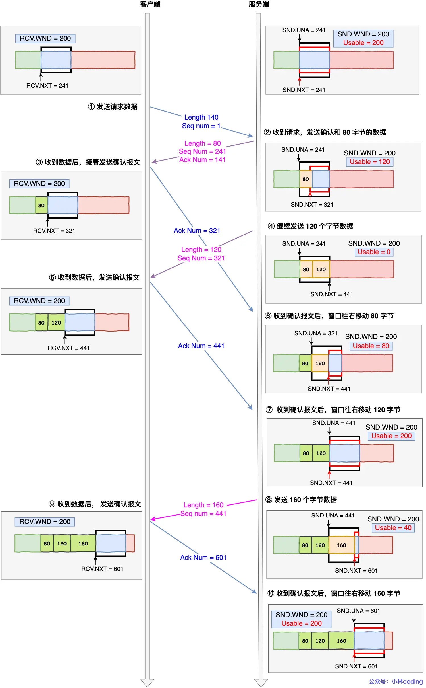
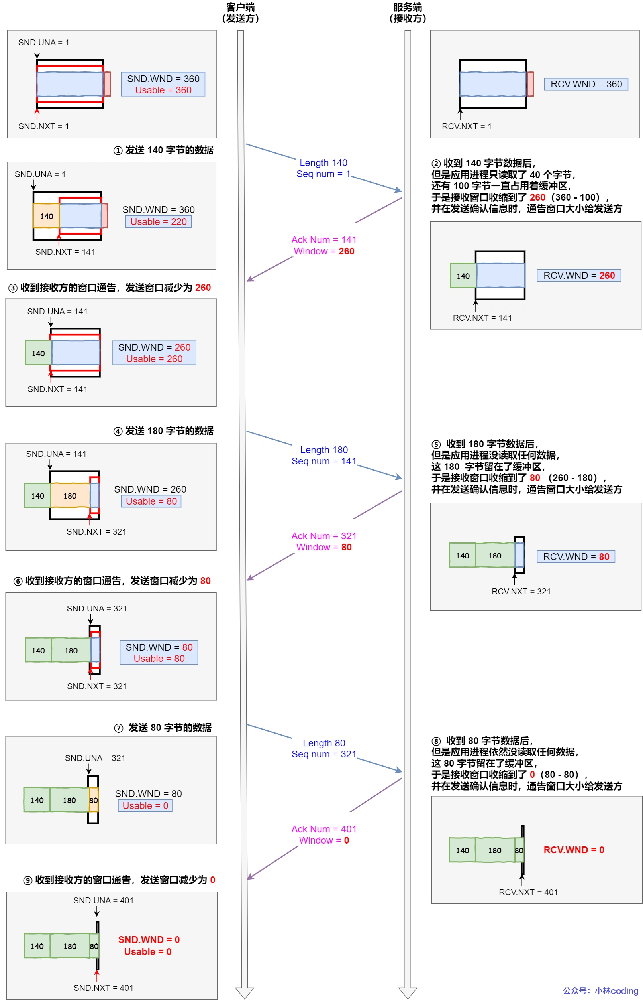

#   TCP 重传、滑动窗口、流量控制、拥塞控制
##  1   前言
>   TCP是一个可靠性传输协议，它是怎么保证可靠的呢？

为了实现可靠性传输，需要靠考虑很多事情，例如数据被破坏、丢包、重复以及分片顺序混乱等问题。如果不能解决这些问题，也就无从谈起可靠性传输。

那么，TCP是通过序列号、应答机制、重发控制、连接管理以及窗口控制等机制实现了可靠性。
本节重点讲解**TCP重传、滑动窗口、流量窗口、拥塞控制**。


##  2 重传机制
TCP实现可靠传输的方式之一，是序列号和应答号。

接下来说说TCP常见的应答机制：
-   超时重传
-   快速重传
-   SACK
-   D-SACK

### 2.1 超时重传
重传机制中的一个方式，就是再发送数据时，设定一个定时器，当超过指定的时间后，没有收到对方的ack报文，就会重发该数据，也就是超时重传。

TCP会在两种情况下重传：
-   ack包丢失
-   数据包丢失
>   超时时间是多少呢？

我们先来了解一个RTT（round-trip time）:

RTT指的是数据发送时刻到接收到数据时刻的差值，也就是包的往返时间。

超时重传时间是以RTO(Retransmission Timeout)表示。
假设重传的情况下，超时时间RTO较长或者较短时，会发生什么？

上图中有两种超时时间不同的情况：
-   当超时时间RTO较大时，重发就慢，丢了老半天才重发，没有效率，性能查。
-   当超时时间RTO较小时，会导致可能并没有丢就重发，于是重发的就快，会增加网络拥塞，导致更多的超时，更多的超时导致更多的重发。

精确测量RTO的值是非常重要的，这可以让我们超时重传机制更高效。
根据上面两种情况，超时重传的时间RTO应该略大于报文往返的时间。

至此，大家可能觉得超时重传时间RTO的计算，也不是很复杂。
好像就是再发送端发包是几下t0,然后接收端把这个ack回来是再记一个t1，于是rtt=t1 -t0，没那么简单，这只是一个采样的结果，不能代表普遍情况。

实际上RTT的值是经常变化的，因为我们的网络也是时常变化的。也就因为RTT是经常波动变化的，所以超时重传的RTO值应该是一个动态变化的值。

我们再来看看linux如何计算RTO的？
估计往返的时间，经常需要采样一下两个：
-   需要TCP通过采样RTT的时间，然后进行加权平均，算出一个平滑的RTT的值，而且这个值还是要不断变化的，因为网路状况不断变化。
-   除了采样RTT，还要采样RTT的波动范围，这样就避免了如果RTT有一个大的波动的话，很难被发现的情况。

如果超时重发的数据，再次超时的时候，又需要重传的时候，TCP的策略是超时间隔加倍。
也就是每当遇到一次超时重发的时候，都会将下一次超时重发的时间间隔设置为先前值的2倍，再次超时，说明网路环境差，不宜频繁反复发送。

超时重传存在问题，超时周期可能相对较长，那是不是可以有更快的方式呢？
于是就可以用快速重传机制解决超时重发等待时间的问题。

### 2.2 快速重传
TCP还有另外一种快速重传(fast retransmite)机制，它可以不以时间为驱动，而是以数据重传为驱动。

在上图，发送方发出了1，2，3，4，5分数据：
-   第一份seq1先发送到了，于是就ack会2；
-   结果seq2因为某些原因没有收到，seq3到达了，于是还是ack回2；
-   后面的4，5都到了，但是ack还是回2，因为seq2没有收到；
-   发送端收到三个ack=2的确认，知道了seq2还没有收到，就会再定时器过期前，重传丢失的seq2。
-   最后，收到了seq2，此时因为收到了seq3，4，5都收到了，所以回复ack6.

所以快速重传的工作方式是当收到三个重复的ack报文时，会在定时器过期之前，重传丢失的报文。

快速重传只解决了一个问题，就是超时时间的问题，但是它依然面临着另外一个问题，就是超时重传的时候，是重传一个，还是重传所有的问题。

举个例子，如果发送方发送了6个数据，编号是1-6，但是编号2-3都丢了，那么接收方再收到数据4-6后依然返回的是ack=2，但是发送方不清楚是应该的重传2的报文还是应该重传2-6的报文。

-   如果只选择重传2，那么重传的效率很低，因为对于丢失的报文3，还得后续收到三个重复的ack3后才会重传；
-   如果重传2之后的所有报文，虽然能同时重传已丢失的2和3，但是4-6已经被接受过了，对于重传的4-6相当于做了一次无用功，造成了资源的浪费。

可以看到，不管是重传一个报文还是重传已发送的报文，都存在问题。
为了解决不知道重传那个报文，于是就有了sack方法。

### 2.3 SACK方法
还有一种实现重传机制的方法叫：SACK，选择性确认。
这种方式需要再TCP头部选项字段中加一个SACK的东西，它可以将已收到的数据信息发送给发送方，这样发送方就知道那些数据收到了，那些数据没有收到，知道了这些信息，就可以只重传丢失的数据。

如下图，发送方收到了三次同样的ack确认报文，于是就会触发快速重传机制，通过sack信息发现只有200-299这段数据丢失，则重发时，只选择了这个TCP数据端进行重传。

如果要支持SACK，必须双方都要支持。在Linux下，可以通过net.ipv4.sack参数打开这个功能。

### 2.4 D-SACK
D-SACK：Duplicate SACK，其主要使用了SACK来告诉发送方有哪些数据被重复接收了。
举两个例子说明D-SACK作用：
一：ACK丢包
.webp)
-   接收方发给发送方两个ACK都丢失了，所以发送方超市以后，重传第一个数据包(3000-3499)
-   于是接收方发现接收方是重复收到的，于是回一个SACK=3000-3500，告诉发送方3000-3500早已被接收到了，因为ACK都已经到4000了，已经意味着4000之前的所有数据都已经收到了，所以这个ack就代表着D-SACK。
-   这样接收方就知道，数据没有丢，是接收方的ack丢了

二：网络延时

-   数据包（1000-1499）被网络延迟了，导致发送方没有收到ACK1500的确认报文。
-   而后面报文到达的三个相同ACK的确认报文，就触发了快速重传机制，但是在重传之后，被延迟的数据包1000-1499又到了接收方。
-   所以接收方回了一个SACK1000-1500的包，因为ACK已经到了3000，所以这是D-SACK，表示收到了重复包。
-   这样发送方就知道快速重传触发的原因不是发出去的包丢了，也不是因为回应的ACK丢了，而是因为网络延时了。

可见D-SACK有几个好处：
1. 可以让发送方知道，是发出去的包丢了，还是ACK丢了。
2. 可以知道是不是网络发送的包被延迟了。
3. 可以知道网络中是不是把发送方的包给复制了。

在Linux下可以通过net.ipv4.tcp-dsack参数开启/关闭这个功能。

##  3.  滑动窗口
>   引入滑动窗口的原因
>
>我们都知道TCP每发送一个数据，都会收到一个ack应答，当上一个数据包收到了应答，再发送下一个。
>这个模式有点像我们的聊天，你一句我一句。但是这种方式的缺点就是效率比较低。
>如果你说完一句话，我在处理其他事情，没有及时回复你，那你不是要干等我做完其他事情后，我回复你，你才能说下一句话，显然很不现实。
-   所以这样传输方式一个缺点：数据包往返的时间越长，效率越低下。
-   为了解决这个效率问题，TCP引入了窗口这个概念，即使在往返时间较长的情况下，它也不会降低网络通信的效率。
-   那么有了窗口，可以置顶窗口大小，窗口大小就是值无需等待确认应答，而可以继续发送数据的最大值。
-   窗口的实现实际上是操作系统开辟的一个缓存空间，发送方主机在等到确认应答返回之前，必须再缓冲区保留已发送的数据，如果按期接收到确认应答，此时就可以从数据缓冲区中清除。
-   假设窗口大小为3个TCP段，那么发送方就可以连续发送三个TCP段，并且中途有ACK丢失，可以通过下一个确认应答进行确认。

图中ack600报文丢失，也没有关系，因为可以通过下一个确认应答进行确认，只要发送方收到了ack700的确认应答，就意味着700之前的数据都已经收到了，这个模式就叫**累计确认**或者**累计应答**
>   窗口大小由哪一方确定？

TCP头里有一个字段叫window，也就是窗口大小。
这个字段是接收方告诉发送方自己还有多少缓冲区可以接收数据。于是发送端就可以根据这个接收端的处理能力来发送数据，而不会导致接收端处理不过来。
所以，接收方的窗口大小是由接收方的窗口大小来决定的。发送方的数据大小不能超过接收方的窗口大小，否则接收方就无法正常接收到数据。

>   发送方的滑动窗口

我们先来看看发送方的窗口，下图就是发送方缓存的数据，根据数据处理的情况分成四个部分，其中深蓝色方框是发送窗口，  紫色是可用窗口。

-   #1  是已发送并收到ack确认的数据，1-31字节。
-   #2  是已发送但是未收到ack确认的数据，32-45字节
-   #3  是未发送但是在接收方处理能力范围内(接收方还有空间)，46-51
-   #4  是未发送但总大小超过接收方处理范围(接收方没有空间)，52字节以后

在下图，当发送方把数据全部都一下发送出去后，可用的窗口大小就为0了，表明可用窗口已经耗尽，在没有收到ack确认之前数无法发送数据的。


在下图，当收到之前的数据32-36字节的ack确认应答后，如果发送窗口的大小没有变化，则滑动窗口后边移动5个字节，因为有5个字节被确认了，接下来52-56字节有变成可用窗口，那么后续可以发送52-56的数据了。


>   程序是如何表示发送方的四个部分呢？

TCP欢动窗口方案使用三个指针来跟踪在四个传输类别中的每一个类别的字节。其中两个指针是绝对指针（指特定的序列号），一个是相对指针(需要做偏移)。

-   SND.WND：表示发送窗口大小(大小由接收方指定)
-   SND.UNA：Send unack，是一个绝对指针，它指向的是已发送但未收到确认的第一个字节的序列号，也就是#2的第一个字节。
-   SND.NXT：也是一个绝对指针，它指向未发送但可以发送范围的第一个字节的序列号，也就是#3的第一个字节。
-   指向#4的第一个字节是个相对指针，它需要SND.UNA指针加上SND.WND大小的偏移量，就可以指向#4的第一个字节了。

那么窗口大小的计算可以是：
可用窗口大小=SND.WND - (SND.NTX - SND.UNA)

> 接收方的滑动窗口

接下来看看接收方的滑动窗口，接收窗口相对简单一些，根据处理的情况划分成三个部分：
-   #1 + #2是已经成功接收并确认的数据(等待应用程序读取)
-   #3 是未收到数据但可以接收的数据
-   #4 是未接收到数据并不可以接收数据

其中三个接收部分，使用两个指针进行划分：
-   RCV.WND：表示接收窗口的大小，它会通告给发送方。
-   RCV.NXT：是一个指针，它指向期望从发送方发送来的下一个数据字节的序列号，也就是#3的第一个字节
-   指向#的第一个字节是相对指针，它需要RCV.NXT加上RCV.WND大小的偏移量，就可以指向#4的第一个字节

>   接收窗口和发送窗口的大小是相等的吗？
> 
>并不是完全相等，接收窗口的大小是约等于发送窗口大小的。
因为滑动窗口并不是一层不变的，比如，当接收方的应用程序读取数据的速度非常快的话，这样的话接收窗口可以很快的就空缺出来，那么新的接收窗口大小，是通过TCP报文中的Windows字段来告诉发送方。那么这个传输过程是存在延时的，所以接收窗口也发送窗口是约等于的关系。

##  4   流量窗口
### 4.1 流量控制
发送方不能无脑的发送数据给接收方，要考虑接收方的处理能力
如果一直无脑的发送数据给对方，单对方处理不过来，那么就会导致触发重发机制，从而导致网络流量的无端的浪费。
为了解决这种问题，TCP提供了一种机制可以让发送方根据接收方的实际接收能力控制发送的数据量，这就是所谓的流量控制。

下面举个例子：
-   客户端是接收方，服务端是发送方
-   假设接收窗口和发送窗口相同，都为200
-   假设两个设备再整个传输过程中都保持相同的窗口大小，不受外界影响

根据上图的流量控制，说明一下每个过程：
1.  客户端向服务端发送请求报文。这里要说明一下，本次例子是把服务端作为发送方，所以没有画出服务端的接收窗口。
2.  服务端收到请求报文以后，发送ack和80字节的数据，于是可用的usable大小从200减少的120字节，同时NXT指针也向右偏移了80个字节，指向了321，这意味这下次发送数据的时候，序列号是321.
3.  客户端收到80个字节数据后，于是接收窗口也向右偏移80字节，NXT指针指向321.这就意味这下次期望接收的序列号是321.接着向服务端发送确认报文。
4.  服务端在次向客户端发送120字节的数据，于是可用窗口为0，服务端无法再继续发送数据。
5.  客户端收到120字节的数据，NXT向右偏移120字节，接着向服务单发送ack确认。
6.  服务端收到80字节数据的确认报文，服务端UNA指针偏移80字节，指向321，于是可用窗口大小变为80
7.  服务端收到120字节数据的确认报文。服务单UNA指针偏移80字节，指向441，于是可用窗口变为200。
8.  服务端可以继续发送数据了，于是发送了160字节的数据后，NXT指向了601，于是可用窗口变成40。
9.  客户端收到160字节数据后，接收窗口往右移动了160字节，NXT也向右偏移了160字节，指向了601，然后发送了确认报文。
10. 服务端收到160字节数据的确认报文后，UNA指针向右偏移了160字节，指向了601，可用窗口也就增大到了200。

### 4.1 操作系统缓冲区和滑动窗口的关系
前面的流量控制例子，我们假定了发送窗口和接收窗口是不变的，但是实际上，发送窗口和接收窗口中所存放的字节数，都是存放在操作系统的缓冲区中，而操作系统的缓冲区，会被操作系统调整。
当应用程序没办法及时读取缓冲区数据时，也会对我们的缓冲区造成影响。
>   那么操作系统的缓冲区，是如何影响发送窗口和接收窗口的呢？

我们先来看一个例子：
当应用程序没有及时读取缓冲区数据时，发送窗口和接收窗口的变化。

考虑一下场景：
-   客户端作为发送方，服务端作为接收方，发送窗口和接收窗口初始大小为360；
-   服务端非常的繁忙，当收到客户端的数据时。应用层不能及时读取数据；

根据上图的流量控制，说明下每个过程：
1.  客户端发送140个字节后，可用窗口为220。
2.  服务单收到140个字节后，但是服务单非常繁忙，应用程序只读了40个字节，还有100字节占用着缓冲区，于是接收窗口收到到260，发送确认消息，将窗口大小告诉给客户端。
3.  客户端收到确认和窗口的报文后，发送窗口减少为260.
4.  客户端发送180个字节，此时可用窗口减少为80字节。
5.  服务端收到180字节数据，但是应用程序没有读取任何数据，这180字节就直接停留再缓冲区，于是接收窗口收缩为80，并发送确认报文，将窗口大小告诉客户端。
6.  客户端收到确认和窗口报文后，发送窗口减少为80
7.  客户端发送80字节数据，可用窗口耗尽。
8.  服务单收到80字节数据，但是应用程序没有读取任何数据，这80字节停留在了缓冲区，于是接收窗口收缩为0，并在发送确认报文时，将窗口大小发送给客户端。
9.  客户端收到确认报文后，发送窗口减少为0。

可见最后窗口都收缩为0了，也就是发生了关闭，当发送方可用窗口为0时，发送方实际上回定时发送窗口探测报文，以便知道对方的窗口是否发生了改变。

我们再看第二个例子：
当服务端系统资源非常紧张的时候，操作系统可能会直接减少了接收缓冲区的大小，这是应用程序又无法及时读取缓冲区数据，那么这个时候严重的事情就发生了，会出现数据包丢失的现象。

说明下每个过程：
1.  客户端发送140字节的数据，于是可用窗口减少到220.
2.  服务端因为现在非常的繁忙，操作系统于是就把接收缓冲区较少了120字节，当收到140字节数据后，又因为应用程序没有读取任何数据，所以140字节留在了缓冲区，于是接收窗口大小从360收缩成了100，最后发送确认消息时，通告窗口大小给对方。
3.  此时客户端因为还没有收到服务端通告的窗口大小，所以不知道窗口收缩成了100，客户端会看自己的发送窗口还有220，所以客户端就发送了180字节，于是可用窗口减少为40.
4.  服务端收到了180字节数据，发现数据包超过了窗口大小，于是就把数据包丢掉了。
5.  客户端收到第二步ack时，服务端发送的确认报文和通告窗口报文，尝试减少发送窗口到100，把发送窗口的右端向左收缩了80，此时可用窗口大小就会出现诡异的负值。

为了防止这种情况发生，TCP规定是不允许同时减少缓存又收缩窗口的，而是先采用收缩窗口，过段时间再减少缓存，这样就可以避免丢包的情况。

### 4.2 窗口关闭
在前面我们都看到了，TCP通过让接收方指明希望从发送方接收数据大小（窗口大小）来进行流量控制。
如果窗口大小为0时，就会阻止发送方给接收方传递数据，知道窗口变为非0为止，这就是窗口关闭、
>   窗口关闭的危险

接收方向发送方通告窗口大小时，是通过ack报文来通告的。

那么当窗口关闭发生时，接收方处理完数据后，会向发送方通告一个非0的ack报文，如果这个通告窗口的ack报文在网络中丢失了，那麻烦就大了。

这会导致发送方一直等待接收方非0的窗口通知，接收方一直在等发送方发送数据，如果不采取措施，这种互相等待的过程就会造成死锁。

>   TCP 是如何解决窗口关闭是，潜在的死锁问题？

为了解决这个问题，TCP为每个连接设定一个持续定时器，只要TCP连接一方收到窗口为0的通知，就会启动定时器。
如果持续定时器超时就会发送窗口探测报文，而对方在确认这个探测报文时，给出自己现在的接收窗口的大小。

-   如果接收窗口仍然为0，那么收到这个报文的一方就会启动持续计时器。
-   如果接收窗口不是0，那么死锁的局面就会被打破。

窗口探测的次数一般是3次，每次大约30-60秒（不同实现可能不一致），如果3次探测后窗口大小持续为0，TCP就会发送RST来中断连接。

### 4.3 糊涂窗口综合征
如果接收方太忙了，来不及取走窗口里的数据，那么就会导致发送方窗口越来越小。
到最后，如果接收方腾出几个字节并告诉发送方现在窗口大小，而发送方会义无反顾的发送这几个字节，这就是糊涂窗口综合征。
要知道，我们的TCP+IP头有40字节，为了传输那几个字节的数据，要搭上这么大的开销，这太不经济了，

就好像一个可以承载50人的大巴车，每次来了一两人，就直接发车，除非家里有矿的大巴司机，才敢这样玩，不然迟早破产，要解决这个问题也不难，大巴司机等承载数量超过25人，才认定可以发车。

现在举个糊涂窗口综合征的例子，考虑一下场景：
接收方窗口大小是360字节，但接收方由于某些原因陷入困境，假设接收方应用读取能力如下：
-   接收方每接收3个字节，应用程序只能从缓冲区读取1个字节，
-   在下一个发送方的TCP数据到达之前，应用程序还从缓冲区读取了40个额外的字节；

每个过程的窗口大小的变化，在图中描述的很清楚了，可以发现窗口不断减少，并且发送的数据都是比较小的。

所以，糊涂窗口综合征的现象是可以发生在发送方和接收方：
-   接收方可以通告一个小的窗口
-   而发送方可以发送小的窗口数据

于是，于是解决糊涂窗口综合征就需要同时解决上面两个问题就可以了：
-   让接收方不通告小窗口
-   让发送方避免发送小窗口数据

>   怎么让接收方不通告小窗口给发送方呢？
> 
> 接收方通常的策略如下：
>   
>   当窗口大小小于min(MSS,缓存空间/2)也就是小于MSS与缓存空间/2中的最小值时，就会向发送方发送窗口为0，也就阻止了发送方再发送数据过来。等到接收方处理了一些数据以后，窗口大小>=MSS ,或者缓存空间有一半可以使用，就可以把窗口打开让发送方发送数据过来。

>   怎么让发送方避免发送小数据呢？
> 
> 发送方通常的策略如下：
> 
>   使用Nagle算法，改算法的思路是延时处理，只有满足下面两个条件中的任意一个，才可以发送数据：
> 
>   -   条件一：要等到窗口大小大于MSS并且数据大小大于MSS；
>   -   条件二：收到之前发送的ack回包；
>
>   只要上面两个条件都不满足，发送方会一直囤积数据，知道满足上述条件。

注意如果接收方不能满足不通告小窗口给发送方，那么即使开启了nagle算法，也无法避免糊涂窗口综合证。因为如果对方ack回复很快的话(达到nagle算法调节二)，Nagle算法就不会拼接太多的数据包，这种情况下依然会有小的数据包传输，网络总体的利用率很低。

所以，接收方得满足“不通报小窗口给发送方” + 发送方开启Nagle算法 才能避免糊涂窗口综合征。

另外，Nagle是默认打开的，如果对于一些需要小数据交互的场景的程序，比如telnet、ssh这样交互性比较强的程序，则需要关闭Nagle算法。

可以在Socket设置TCP_NoDela选项来关闭这个算法
```
setsockopt(sock_fd, IPPROTO_TCP, TCP_NODELAY, (char *)&value, sizeof(int));
```

### 4.4 拥塞控制
>   为什么要拥塞控制，不是有流量控制了吗？

前面的流量控制是避免发送方的数据填满接收方的缓存，但是并不知道网络中发生了什么。
一般来说，网络环境都处在一个共享的环境，因此也有可能会因为其他主机之间的通信使得网络拥堵。

在网络拥堵时，如果继续发送大量数据包，可能会导致数据包的延时，丢失等，这时TCP就会重发，但是一重传就会导致网络负担更重，于是会导致更大的延迟以及更多的丢包，这个情况下就会进入恶性循环。

所以TCP不能忽略网路上发生的事，它被设计成一个无私的协议，当网络发生拥堵是，它会自我牺牲，降低发送的数据量。

于是就有了拥塞控制，控制的目的就是避免发送方的数据填满整个网络。

为了在发送方调节所要发送的数据量，定义了一个叫**拥塞窗口**的概念。
>   什么是拥塞窗口？和发送窗口有什么关系？

拥塞窗口cwnd是发送方维护的一个状态变量，它会根据网络拥塞程度动态变化的。

我们再前面提到过发送窗口swnd和接收窗口rwnd是约等于的关系，那么由于加入了拥塞窗口的概念，此时发送窗口的大小swmd=min(cwnd,rwnd)，也就是拥塞窗口和接收窗口的最小值。

拥塞窗口cwnd的变化规则：
-   只要网络中没有拥塞，cwnd就会增大；
-   网络中出现了拥塞，cwnd就会减小；

>   那么怎么知道网络中出现了拥塞呢？
>  
> 其实只要发送方没有在规定的时间内接收到ack报文，也就是发送了重传报文，就认为网络出现了拥塞。

>   拥塞的控制有哪些？

拥塞控制主要是四个算法：
-   慢启动
-   拥塞避免
-   拥塞发生
-   快速恢复

####    4.4.1 慢启动
TCP刚建立连接完成后，首先是有一个慢启动的过程，这个慢启动的意思就是一点一点的提高发送数据包的数量，如果一上来就发大量数据，这不是给网络添堵吗？

慢启动的算法记住一个规则就行：当发送方每收到一个ack，拥塞窗口的cwnd的大小就会+1

这里假设拥塞窗口cwnd和方窗口swnd相等，下面举个例子：
-   建立连接完成后，一开始初始化的cwnd为1，表示可以传一个MSS大小的数据
-   当收到一个ack确认应答后，cwnd增加1，于是一次能够发送2个
-   当收到2个ack报文后，cwnd增加2，于是就可以比之前多发2个，所以这次一共能够发4个
-   当4个ack确认到来的时候，每个确认cwnd增加1，4个确认cwnd增加4，于是比之前多发4个，这次能够发8个
可以看出慢启动算法，发包的个数是指数增长的。
> 那慢启动涨到什么时候才是个头呢？

有一个慢启动门限ssthresh(slow start threshold)的状态变量。
-   当cwnd < ssthresh是，会使用慢启动算法。
-   当cwnd >= ssthresh时，就会使用拥塞避免算法。

####    4.4.2   拥塞避免算法
前面说道，当拥塞窗口cwnd超过慢启动门限时，就会使用拥塞避免算法。

一般来说ssthresh的大小是65535字节。

那么进入拥塞避免算法后，他的规则是每收到一个ack时，cwnd增加1/cwnd。

接上面的例子，现在假定ssthresh的大小为8：
-   当8个ack应答确认到来时，每个确认增加1/8，8个ack一共增加1，于是这一次能够发送9个MSS大小的数据。变成线性增长。

所以，我们可以发现，拥塞避免算法就是将原本慢启动算法的指数增长变成线性增长，还是增长阶段，但是就是增长的速度慢了一些。

就这么一直增长后，网络慢慢进入拥塞状态，于是就会出现丢包的现象，这是就需要对丢失的数据包进行重传。

当触发了重传，也就进入了拥塞发生算法。

####    4.4.3   拥塞发生算法
当网络出现拥塞，也就是会发生数据包的重传，重传机制有两种：
-   超时重传
-   快速重传

这两种使用的拥塞发生算法是不同的，接下来分别说说：
>   发生超时重传时的拥塞发生算法：

当发生了超时重传，就会使用拥塞发生算法。这个时候ssthresh和cwnd的值都会发生变化。
-   ssthresh设为 cwnd/2
-   cwnd重置为1(是恢复为cwnd初始化值，这里假定cwnd初始化为1)

>   怎么查看cwnd初始化值？
> 
>   linux 针对每个tcp连接的cwnd初始化值是10，也就是10个MSS，我们可以用ss -nli命令查看每一个tcp连接的cwnd初始化值。

>   发生快速重传的拥塞发生算法：

还有更好的方式，前面我们讲过快速重传算法，当接收方发现丢了一个中间包的时候，发送前三次一个包的ack,于是发送端就会快速的重传，不必等待超时。

TCP认为这种情况不严重，因为大部分没有丢，只丢了一小部分，则ssthresh 和cwnd变化如下：
-   cwnd=cwnd/2 也就是设置为原来的一般，
-   ssthresh=cwnd；
-   进入快速恢复算法；

####    4.4.4   快速恢复
快速重传和快速恢复算法一般一起使用，快速恢复算法认为，还能收到3个重复的ack说明网络也不那么糟糕，所以没有必要像RTO那么强烈。

正如前面所说，进入快速恢复算法，cwnd和ssthresh已被更行了；
-   cwnd=cwnd/2
-   ssthresh=cwnd

然后，进入快速恢复算法：
-   拥塞窗口cwnd=ssthresh+3
-   重传丢失的数据包；
-   如果再收到重复的ack，那么cwnd增加1
-   如果收到新的数据的ack后，把 cwnd设置为第一步中的sstresh的值，原因是改ack确认了新的数据，说明从duplicate ack时的数据都已经收到了，该恢复过程已经结束，可以恢复到之前的状态了。也即再次进入拥塞避免状态。
