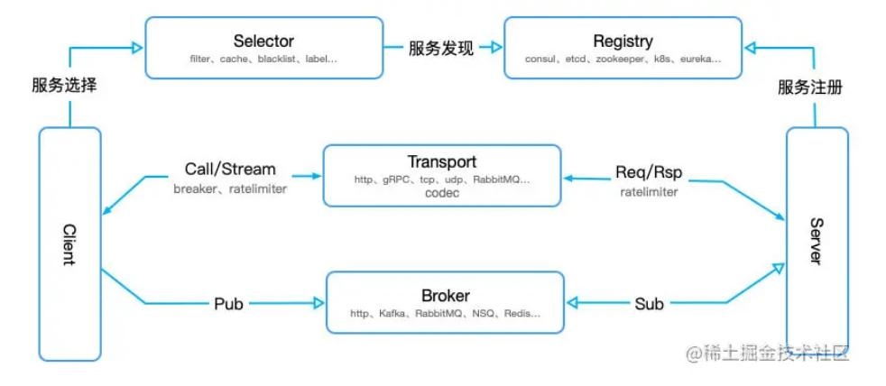

#   一、微服务
##  1.  什么是微服务
微服务是一种分布式系统解决方案，推动细粒度服务的使用，这些服务协同工作。
##  2.  微服务优点
-   更容易扩展开发：团队围绕不同的业务需求组织管理自己的服务。
-   共容易理解：微服务要小的多，通常为1000LOC或更少
-   更容易部署新版本的服务：可以部署缩放和独立管理服务。
-   改进的容错和隔离：关注分离可以最大限度的减少一个服务中的问题对另一个服务的影响。
-   提高执行速度：团队通过独立开发，部署和管理微服务来更快的实现业务需求。
-   可重复使用的服务和快速原型：微服务中的unix理念能够重用现有服务，并更快的构建现有功能。
##  3.  微服务特性
-   单一职责：微服务架构中每个服务，都是具有业务逻辑的，符合高内聚、低耦合原则以及单一职责原则的单元，不同的服务通过“管道”的方式灵活组合，从而构建出庞大的系统。
-   轻量级通讯：服务之间通过轻量级的通信机制实现互通互联，而所谓的轻量级，通常指语言无关、平台无关的交互方式。例如通讯格式xml、json都是与语言、平台无关的；而通讯协议http能让服务之间通信变得标准化、无状态化。REST是实现服务之间互相协作的轻量级通信机制之一。
-   独立性：每个服务在应用交付过程中，独立的开发、测试和部署。
-   进程隔离：微服务中业务实体运行在单独的进程中。

##  4.  微服务缺点
-   运维要求高
-   分布式复杂性
-   接口调整成本高
-   重复劳动

#   二、接口
##  1.go-micro使用
-   go1.15版本以上使用go-micro v3: github.com/asim/go-micro/v3
##  2.插件：
-   web插件：github.com/asim/go-micro/v3/web
-   服务发现插件：
    -   接口："github.com/asim/go-micro/v3/registry"
    -   etcd："github.com/asim/go-micro/plugins/registry/etcd/v3"
    -   consul："github.com/asim/go-micro/plugins/registry/consul/v3"

#   三、Micro V3架构：
Go Micro 框架的基础架构如下，由 8 个核心接口组成，每个接口都有默认实现：
-   Service：最顶层的service接口是构建服务的主要组件，它把底层需要实现的接口，做了一次封装，包含一系列用于初始化service和Client的方法，使我们可以很简单的创建一个RPC服务。
-   Client：请求服务接口，从Register中获取Server信息，然后封装了Transprot和Codec进行RPC调用，也封装了Broker进行消息发布，默认通过RPC协议进行通讯，也可以基于HTTP或GRPC。
-   Server：监听服务调用的接口，也将以接收Broker推送过来的消息，需要想Register注册自己的存在与否，以便客户端发起请求，和client一样，默认通过RPC协议进行通讯，也可以基于HTTP或GRPC。
-   Broker：消息发布订阅的接口，默认实现是基于http，在生产环境可以替换为kafka、rabbitmq等其他组件实现。
-   Codec：用于解决传输过程中的编码和解码，默认实现是protobuf，也可以替换成json/mercury等。
-   Registry：用于实现服务的注册和发现，当有新的service发布时，需要向Registry注册，然后Registry通知客户端进行更新，Go Micro默认基于Consul实现服务注册与发现，也可以替换成Etcd/zookeeper/kubernetes等。
-   Selector：客户端级别的负载均衡，当客户端向服务端发起请求时，Selector根据不同的算法从Registry的主机列表中得到可用的Service节点进行通讯，目前实现的有循环算法和随机算法，默认使用随机算法，另外，selector还有缓存机制，默认是本地缓存，还支持label、blacklist等方式。
-   Transport：服务之间通讯的接口，也就是服务发送和接收的最终实现方式，默认使用http通信，也可以支持tcp/udp/nats/grpc等。
 

通过上诉介绍，可以看到，Go Micro简单轻巧，易于上手、功能强大、扩展方便,是基于Go语言进行微服务架构服务时非常值得推荐的一个RPC框架，基于其核心功能插件，我们可以轻松解决微服务架构的问题：
-   服务接口定义：通过Transport/codec定义通讯协议以及数据编码。
-   服务发布与调用：通过Registry实现服务注册与订阅，还可以基于Selector提高系统可用性。
-   服务监控、服务治理、故障定位：通过Plugins Wrapper中间件来实现。
