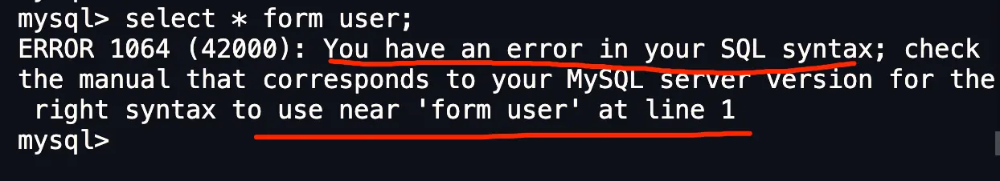
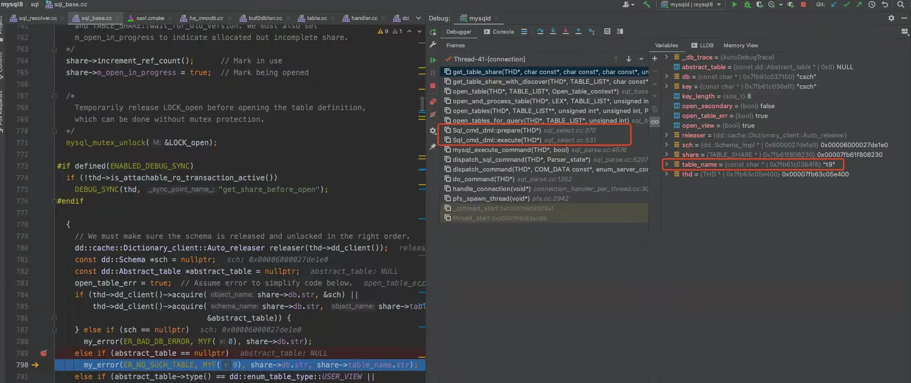
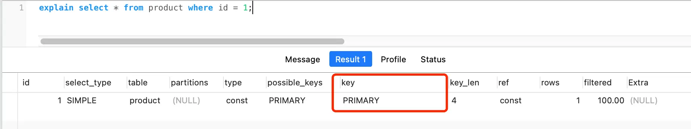
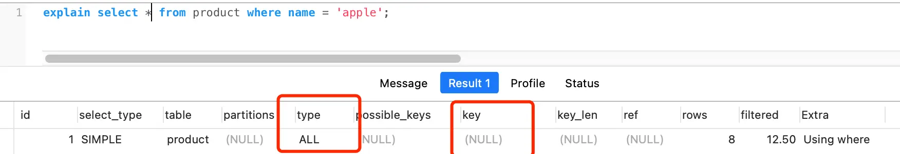
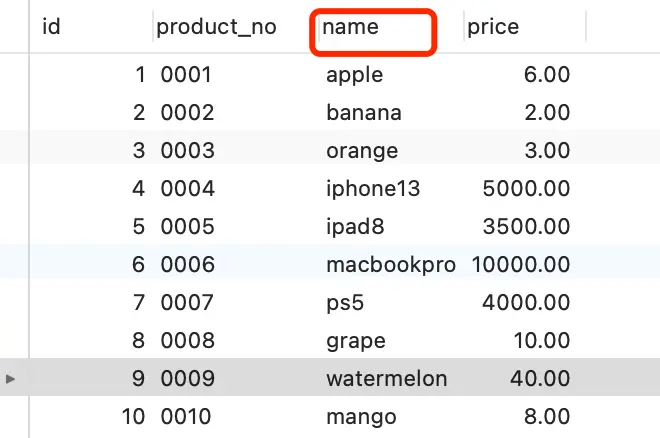
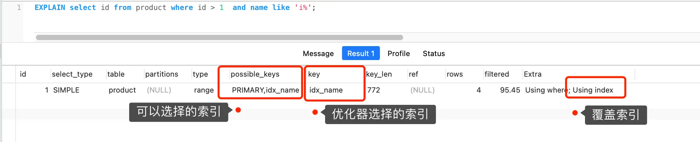
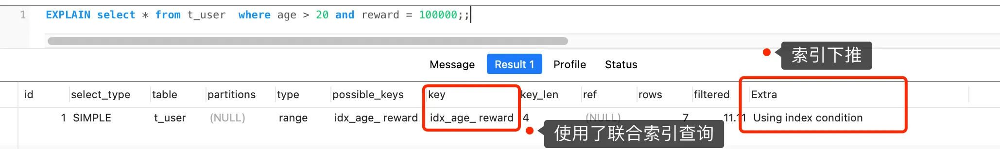

# 执行一条select语句，期间发生了什么？

学习SQL的时候，大家肯定第一个先学到的就是select查询语句，比如下面这句查询语句：
```
// 在 product 表中，查询 id = 1 的记录
select * from product where id = 1;
```

但是有没有想过，MySQL执行一条select查询语句，在MySQL期间发生了什么？

带着这个问题，我们可以很好的了解MySQL内部架构，这次我们就拆解一下MySQL内部的结构，看看内部里的每一个零件具体是负责做什么的。

## MySQL执行流程是怎么样的？
先来一个上帝视角，下面就是MySQL执行一条SQL查询语句的流程，也从图中可以看到MySQL内部架构里的各个功能模块。


可以看到，MySQL架构分为两层：Server层和存储引擎层。
- Server层负责建立连接、分析和执行MySQL。MySQL大多数的核心功能模块都在这实现， 主要包括连接器，查询缓存、解析器、预处理器、优化器、执行器等。另外，所有的内置函数(如日期、时间、数学和加密函数等)和所有跨存储引擎的功能(如存储过程、触发器、试图等)都是在server实现。
- 存储引擎层负责数据的存储和提取。支持Innodb、MyISam、Memory等多个存储引擎，不同的存储引擎公用一个Server层。我们常用的存储引擎是Innodb，从MySQL5.5版本开始，Innodb成了MySQL默认的存储引擎。我们常说的索引数据结构，就是由存储引擎实现的，不同的存储引擎支持的索引类型也不同，比如Innodb支持的索引类型是B+树，且是默认使用，也就是说在数据表中创建的主键索引和二级索引默认使用的是B+树索引。

好了，现在我们对Server层和存储引擎层有了一个简单的认识，接下来，就详细说一条SQL查询语句的执行流程，依次看看每个模块的功能。

## 第一步：连接器

如果你在Linux操作系统里需要使用MySQL，那你第一步一定是要先连接MySQL服务，然后才能执行SQL语句，普遍我们都是使用下面这条命令进行连接：
```
# -h 指定 MySQL 服务得 IP 地址，如果是连接本地的 MySQL服务，可以不用这个参数；
# -u 指定用户名，管理员角色名为 root；
# -p 指定密码，如果命令行中不填写密码（为了密码安全，建议不要在命令行写密码），就需要在交互对话里面输入密码
mysql -h$ip -u$user -p
```

连接的过程需要先经过TCP的三次握手，因为MySQL是基于TCP协议进行传输的，如果MySQL服务并没有启动，则会收到连接失败的报错。

如果MYSQL服务正常运行，完成TCP连接的建立后，连接器就要开始验证你的用户名和密码了，如果用户名秘密不对。就会收到一个Access denied for user的错误，然后客户端程序结束执行。

如果用户名密码都没有问题，连接器就会获取该用户的权限，然后保存起来，后续该用户在此连接里的任何操作，都会基于连接开始读到的权限进行权限逻辑的判断。

所以如果一个用户已经建立了连接，即使管理员中途修改了该用户的权限，也不会影响已经存在的连接的权限。修改完成后，只有再新建的连接才会使用新的权限设置。

> 如何查看MySQL服务被多少个客户端连接了？

如果你想知道当前MySQL服务被多少个客户端连接了，你可以执行show processlist命令进行查看。

比如上图的显示结果，共有两个用户名为root的用户连接了MySQL服务，其中id为6的用户的commend列的状态位Sleep，这意味着该用户连接完MySQL服务就再也没有执行过任何命令，也就是说是一个空闲的连接，并且空闲的时长是736秒(列)。

> 空闲连接会一直占用这吗？

当然不是了，MySQL定义了空闲连接的最大空闲时长，有wait_timeout参数控制的，默认值是8小时(28880秒)，如果空闲连接超过了这个时间，连接器就会将其断开。
```
mysql> show variables like 'wait_timeout';
+---------------+-------+
| Variable_name | Value |
+---------------+-------+
| wait_timeout  | 28800 |
+---------------+-------+
1 row in set (0.00 sec)
```

当然，我们自己也可以手动断开空闲的连接，使用kill connection+id的命令。
```
mysql> kill connection +6;
Query OK, 0 rows affected (0.00 sec)
```

一个处于空闲状态的连接被服务端主动断开后，这个客户端并不会马上知道，等到客户端在发起下一个请求的时候，才会收到断开连接的报错。

> MySQL连接数量有限制吗？

MySQL的最大连接数有max_connections参数控制，比如我的MySQL服务器默认是151个，超过这个值，服务端就会拒绝连接请求，并报错提示“Too many connections”。
```
mysql> show variables like 'max_connections';
+-----------------+-------+
| Variable_name   | Value |
+-----------------+-------+
| max_connections | 151   |
+-----------------+-------+
1 row in set (0.00 sec)
```

MySQL的连接也跟http一样，有长连接和短连接的概念，它们的区别如下：
```
// 短连接
连接 mysql 服务（TCP 三次握手）
执行sql
断开 mysql 服务（TCP 四次挥手）

// 长连接
连接 mysql 服务（TCP 三次握手）
执行sql
执行sql
执行sql
....
断开 mysql 服务（TCP 四次挥手）
```

可以看到，使用长连接的好处就是可以减少建立和连接的过程，所以一般是推荐长连接。

但是使用长连接后占用内存可能增多，因为MySQL在执行查询过程中临时使用内存管理连接对象，这些连接对象的资源只有在连接断开是才会释放。 如果长连接积累很多，将导致内存占用太大，有可能被系统强制杀掉，这样会发生MySQL服务异常重启的现象。

> 怎么解决长连接占用内存的问题？

有两种解决方式。

第一种，定期断开长连接。既然断开连接后就会释放连接占用的内存资源，那么我们就可以定期断块长连接。

第二种，客户端主动重置连接。MySQL5.7版本实现了mysql_reset_connection()函数的接口，注意这是函数接口而不是命令，那么当客户端执行了很大的操作后，在代码里调用mysql_reset_connection()函数来重置连接，达到释放内存的效果。这个过程不需要重连和重新做权限验证，但是会将连接恢复到刚刚创建完时的状态。

至此，连接器的工作做完了，简单总结一下：
- 与客户端进行TCP三次握手建立连接；
- 校验客户端的用户名和密码，如果用户名或者密码不对，则会报错；
- 如果用户名和密码都对，会读取该用户的权限，然后后面的权限逻辑判断都基于此刻读取到的权限；

## 第二步，查询缓存
连接器的工作完成后，客户端就可以向MySQL服务发送SQL请求了，MySQL服务收到SQL语句后，就会解析出SQL语句的第一个字段，看看是什么类型的语句。

如果SQL是查询语句(select语句)，MySQL就会先去查询缓存(Query Cache)里查找缓存数据，看看之前有没有执行过这一条命令，这个查询缓存以key-value形式保存在内存中，key为SQL查询语句，value为查询结果。

如果查询的语句命中查询缓存，那么就会直接返回value给客户端，如果查询的语句没有命中查询缓存，那么就要继续往下执行，等执行完后，查询的结果会放入缓存中。

这么看，查询缓存挺有用，但是其实查询缓存其实挺鸡肋的。

对更新频繁的表，查询缓存的命中率很低，因为只要有一个表有更新操作，那么这表的查询缓存就会被清空。如果刚缓存了一个查询很大的数据，还没被使用的时候，刚好这个表有更新，查询缓存就被清空了，相当于缓存了个寂寞。

所以，MySQL8.0版本直接将查询缓存删掉了，也就是说MySQL8.0开始，执行一条SQL查询语句，不会再走到查询缓存的阶段了。

对于MySQL8.0之前的版本，如果想关闭查询缓存，我们可以通过将参数query_cache_type设置成DEMAND。

> TIP
> 这里说的查询缓存是server层的，也就是MySQL8版本移除的是server层的查询缓存，并不是Innodb存储引擎中的buffer pool。

## 第三步：解析器
在正式执行SQL查询语句之前，MySQL会先对SQL语法做解析，这个工作由解析器完成。

### 解析器
解析器会做如下两件事情。

第一件事情，词法分析。MySQL会根据你输入的字符串识别出关键字出来，构建出SQL语法树，这样方便后面的模块获取SQL类型、表名、字段名、where条件等。

第二件事情，语法分析。根据语法分析的结果，语法解析器会根据语法规则，判断你输入的这个SQL语句是否满足MySQL语法。

如果我们输入的SQL语法不对，就会在解析器这个阶段报错。不如，我下面这条语句，把from写成form，这时MySQL解析器就会报错。

但是注意，表不存在或者字段不存在，并不是解析器里做的。那到底是谁来做检查表和字段是否存在的工作呢？别急，接下来就是了。

## 第四步：执行SQL
经过解析器后，接着就要进入执行SQL查询语句的流程了，每条select查询语句都可以分为下面这三个阶段：
- prepare阶段，也就是预处理阶段；
- optimize阶段，也就是优化阶段；
- execute阶段，也就是执行阶段；

### 预处理器
我们先来说说预处理阶段做了什么事情。

- 检查SQL查询语句中的表或者字段是否存在。
- 将select * 中的* 符号，扩展为所有列；

我下面这条查询语句，test这张表是不存在的，这是MySQL就会在执行SQL查询语句的prepare阶段中报错。
```
mysql> select * from test;
ERROR 1146 (42S02): Table 'mysql.test' doesn't exist
```

这里贴个 MySQL 8.0 源码来证明表或字段是否存在的判断，不是在解析器里做的，而是在 prepare 阶段。（PS：下图是公众号「一树一溪」老哥帮我分析的，这位老哥专门写 MySQL 源码文章，感兴趣的朋友，可以微信搜索关注）


上面的中间部分是MySQL报错表不存在时的函数调用栈，可以看到表不存在的错误是在get_table_share()函数里报错的，而这个函数是在prepare阶段调用的。

### 优化器
经过预处理阶段后，还需要为SQL查询语句先指定了一个执行计划，这个工作由优化器来完成。优化器主要负责将SQL查询语句的执行方案确定下来，比如在表里有多个索引的时候，优化器会基于查询成本考虑，来决定选择使用哪个索引。

当然，我们本次的查询语句(select * from product where id = 1)很简单，就是选择使用主键索引。

要向知道优化器选择了哪个索引，我们可以在查询这个语句之前加个explain命令，这样就会输出这条语句的执行计划，然后计划中的key就表示执行过程中使用了哪个索引，比如下图中的key为primary就是使用了主键索引。

如果查询语句的执行计划里的key位null说明没有使用索引，那么就会全表扫描（type=all），这种查询扫描的方式是效率最低档次的。如下图：

这张product表只有一个索引就是主键索引，现在我在表中将name设置为普通索引(二级索引)。

这时product表就会有主键索引(id)和普通索引(name)，假设执行了这条查询语句：
```
select id from product where id > 1  and name like 'i%';
```
这条查询语句的结果既可以使用主键索引，也可以使用普通索引，但是执行效率肯定会不同。这时就需要优化器来决定使用哪个索引了。

很显然这条语句是覆盖索引，直接在二级索引就能查到结果(因为二级索引的B+树的叶子节点的数据存储的是主键值)，就没必要在主键索引查找了，因为查询主键索引B+数的成本会比二级索引的B+的成本大，优化器基于成本考虑会选择代价小的普通索引。

在下面的执行计划中，我们可以看到，执行过程中使用了普通索引，extra为using index，这就是表明了使用了覆盖索引优化。


### 执行器
经历完优化器后，就确定了执行方案，接下来MySQL就真正的开始执行语句了，这个工作是由执行器完成的，在执行过程中，执行器就会和存储引擎交互了，交互是以记录为单位的。

接下来，用三种方式执行过程，跟大家说一下执行器和存储引擎的交互过程:
- 主键索引查询
- 全表扫描
- 索引下推

#### 主键索引查询
以本文开头的查询语句为例，看看执行器是怎么工作的：
```
select * from product where id = 1;
```

这条查询语句的查询条件用到了主键索引，而且是等值查询，同时主键id是唯一，不会有id相同的记录，所以优化器决定选用类型为const进行查询，也就是使用主键索引查询一条记录，那么执行器与存储引擎的执行流程是这样的：
- 执行器第一次查询，会调用read_first_record函数指针指向的函数，因为优化器选择的访问类型为const，这个函数指针被指向为Innodb引擎索引查询的接口，把条件id=1交给存储引擎，让存储引擎定位符合条件的第一条记录。
- 存储引擎通过主键索引的B+树结构定位到id=1的第一条记录，如果记录是不存在的，就会向执行器上报记录找不到的错误，然后查询结束。如果记录是存在的，就会将记录返回给执行器。
- 执行器从存储引擎读取到记录后，接着判断记录是否符合查询条件，如果符合则发送给客户端，如果不符合则跳过该记录。
- 执行器查询过程是一个while循环，所以还会再查一次，但是这次因为不是第一次查询了，所以会调用read_record函数指针指向的函数，因为优化器选择的访问类型是const，这个函数指针被指向一个永远返回-1的函数，所以当调用该函数的时候，执行器就会退出循环，也就是结束查询了。

至此，这个语句就执行完成了。

#### 全表扫描
举个全表扫描的例子：
```
select * from product where name = 'iphone';
```
这条查询语句没有用到索引，所以优化器决定选用的访问类型是ALL进行查询，也就是全表扫描的方式查询，那么这是执行器与存储引擎的执行流程是这样的：
- 执行器第一次查询，会调用read_first_record函数指针指向的函数，因为优化器选择的访问类型位all，这个函数指针被指向为Innodb引擎全表扫描的接口，让存储引擎读取表中的第一条记录；
- 执行器会判断读到的这条记录的name是不是iPhone，如果不是则跳过；如果是则将记录发给客户端(是的没错，server层每从存储引擎读到一条记录就会发送给客户端，之所以客户端显示的时候是直接显示所有记录的，是因为客户端是等查询语句查询完之后，才会显示所有记录)
- 执行器查询的过程是一个while循环，所以还会再查一次，会调用read_record函数指针指向的函数，因为优化器选择的访问类型是all，read_record函数指针指向的还是Innodb引擎全表扫描的接口，所以接着向存储引擎要求继续读刚才那条记录的下一条记录，存储引擎把下一条记录取出后就将其返回给执行器(server层)，执行器继续判断条件，不符合查询条件即跳过该记录，否则发送到客户端；
- 一直重复上述过程，知道存储引擎包表中的所有记录读完，然后向执行器(server层)返回了读取完的信息；
- 执行器收到存储引擎报告的查询完毕的信息，退出循环，停止查询。

至此，这个查询就执行完毕了。

#### 索引下推
在这部分非常适合讲索引下推(MySQL5.6推出了查询优化策略)，这样大家能清楚的知道，下推这个动作下推到哪里。

索引下推能够减少二级索引在查询时候的回表操作，提高查询效率，因为它将server层部分负责的事情交给存储引擎处理了。

举个例子，方便大家理解，这里用户一张表如下，我对age和reward字段建立了联合索引(age,reward):

现在有下面这两条语句：
```
select * from t_user  where age > 20 and reward = 100000;
```
联合索引当遇到范围查询(>、<)就会停止匹配，也就是age字段能用到联合索引，但是reward字段则无法利用索引。

那么，不适用索引下推时，执行器与存储器的执行流程是这样的：
- server层首先调用存储引擎接口定位到满足查询条件的第一条二级索引记录，也就是定位到age>20的第一条记录。
- 存储引擎根据二级索引的B+树快速定位到这条记录后，获取主键值，然后进行回表操作，将完整的记录返回给server层。
- server层在判断该记录的reward是否等于100000，如果成立则将其发送给客户端，否则跳过该记录；
- 接着，继续向存储引擎索要下一条记录， 存储引擎在二级索引定位到记录后，获取主键值，然后回表操作，将完整的记录返回给server层；
- 如此往复，知道存储引擎把表中所有记录读完。

可以看到，没有索引下推时，每查询到一条二级索引记录，都要进行回表操作，然后将记录返回给server层，接着server再判断该记录的reward是否等于100000。

而使用索引下推后，判断记录的reward是否等于100000的工作交给了存储引擎，过程如下：
- server层首先调用存储引擎的接口定位到满足查询条件的第一条二级索引记录，也就是定位到age> 20的第一条记录；
- 存储引擎定位到二级索引后，先不执行回表操作，而是先判断一下该索引中包含的列(reward列)的条件是否成立，如果条件不成立，则直接跳过该二级索引，如果成立，则执行回表操作，将完成记录返回给server层。
- server层在判断其他的查询条件是否成立， 如果成立这将其发送给客户端，否则跳过该记录，然后向存储引擎索要下一条记录。
- 如此往复，直到存储引擎把表中的所有记录读完。

可以看到，使用了索引下推后， 虽然reward列无法使用到联合索引，但是因为它包含在联合索引(age,reward)里，所以直接在存储引擎过滤出满足reward=100000的记录后，才去执行回表操作获取整个记录。相比没有使用索引下推，节省了很多回表操作。

当你发现执行计划里的extr部分显示了using index condition，说明使用了索引下推。

