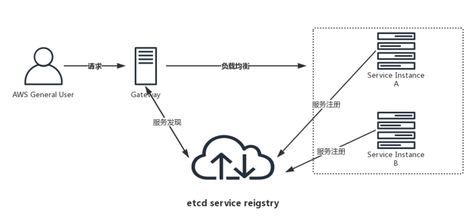

##  1.etcd 是什么，有什么用
-   etcd归根结底是一个存储组件，基于Go语言实现，可以实现配置共享、服务发现、消息订阅发布、分布式锁。etcd可以集中管理配置信息。
-   etcd的特性：简单、存储、watch机制、安全通讯、高性能、一致可靠。
-   etcd是实现了分布式一致性键值对存储的中间件，支持跨平台，拥有活跃用户的社区。
-   etcd有v2和v3 版本，接口不一样、存储数据不一样，两个版本产生的数据互相隔离。
-   有点：
    1.  简单，使用Go语言编写部署简单；使用HTTP作为接口使用简单；使用raft算法保证强一致性，让用户易于理解。
    2.  数据持久化。etcd数据一更新就进行持久化。
    3.  安全。etcd支持SSL客户端安全认证。

##  2.etcd架构
-   etcd-server：对外接收和处理客户端的请求
-   raft：raft算法，实现一致性的核心。
-   grpc-server：etcd和其他etcd节点之间的通信和信息同步
-   MVCC：多版本控制，etcd的存储模块，键值对的每一次操作都会被记录存储。这些数据底层存储在BoltDB中。
-   snapshot：快照，以防WAL日志过多，用于存储某一时刻etcd的所有数据。
-   wal：预写式日志，etcd中的数据提交前都会记录到日志。
```
+----------------------------------------------------------------------------------------+
|                                                                                        |
|         Follower                     Follower                     Follower             |
| +--------------------------+ +--------------------------+ +--------------------------+ |
| |                          | |                          | |                          | |
| | +----------------------+ | | +----------------------+ | | +----------------------+ | |
| | |        boltdb        | | | |        boltdb        | | | |        boltdb        | | |
| | +----------------------+ | | +----------------------+ | | +----------------------+ | |
| |                          | |                          | |                          | |
| | +-------+ +------------+ | | +-------+ +------------+ | | +-------+ +------------+ | |
| | |  wal  | |  snapshot  | | | |  wal  | |  snapshot  | | | |  wal  | |  snapshot  | | |
| | +-------+ +------------+ | | +-------+ +------------+ | | +-------+ +------------+ | |
| |                          | |                          | |                          | |
| |                 +--------+-+--------------------------+-+-------+                  | |
| |                 |             Raft consensus algorithm          |                  | |
| |                 +--------+-+--------------------------+-+-------+                  | |
| |                          | |                          | |                          | |
| | +----------------------+ | | +----------------------+ | | +----------------------+ | |
| | |   grpc server        | | | |   grpc server        | | | |   grpc server        | | |
| | +----------------------+ | | +----------------------+ | | +----------------------+ | |
| |                          | |                          | |                          | |
| +--------------------------+ +--------------------------+ +--------------------------+ |
|                                                                                        |
+----------------------------------------------------------------------------------------+

+----------------------------------------------------------------------------------------+
|                                      client                                            |
+----------------------------------------------------------------------------------------+
```

##  3.etcd的数据存储
-   boltdb是一个单机的支持事务的kv存储，etcd的事务是基于boltdb事务实现的，boltdb为<font color=red>每一个key都创建一个索引(B+树)；该B+树存储了key所对应的版本历史信息</font>。
-   wal(write ahead log)：预写式日志实现事务的标准方法；执行写操作前先写日志，跟mysql日志类似，wal实现的是顺序写，而若安装B+树写，则涉及多次io以及随机写。
-   snapshot：快照数据，用于其他节点同步主节点数据从而达到一致性的状态，类似redis主从复制通过日志数据恢复，流程：
    1.  leader生产snapshot；
    2.  leader像Follower发送snapshot
    3.  Follower接收并恢复数据。

##  4.常用命令(etcdctrl)
-   etcdctrl put key val：创建或者修改key，值为val
-   etcdctrl get key：获取key的value，-w set the output format (fields, json, protobuf, simple, table)
-   etcdctrl txn -i：开启事务
-   etcdctrl lease grant 秒：创建租约
-   etcdctrl put key val --lease leaseid：设置key的值并绑定租约，租约id=leaseid
    -   value(key) 获取key的值
    -   create(key) key的版本信息
    -   mod(key) key的修改版本

##  5.B+树中的版本信息
-   {"header":{"cluster_id":10316109323310759371,"member_id":12530464223947363063,"revision":2,"raft_term":2},"kvs":[{"key":"a2V5","create_revision":2,"mod_revision":2,"version":1,"value":"Zmx5"}],"count":1}
-   raft_term：任期，每次参加leader，任期都会+1
-   revision：全局的版本号，只要对etcd进行修改（例如Key的增删改操作），该版本号都会+1
-   create_revision：创建某一个key的版本，这个版本对应的是上面的全局的revision版本号。
-   mod_revision：修改key时的版本号，这个版本对应的是上面的全局的revision版本号。

##  6.etcd的数据存储
-   在内存中是B树存储，通过key映射revision。
-   在磁盘中是B+树存储，通过revision映射key。

##  7.lease租约


##  8.分布式锁
```
	// 分布式锁
	var glob = 0
	g := sync.WaitGroup{}
	for i := 0; i < 1000; i++ {
		g.Add(1)
		go func() {
			session, err := concurrency.NewSession(cli)
			if err != nil {
				log.Println("Get session err")
			}
			mtx := concurrency.NewMutex(session, "/root/lock")
			mtx.Lock(context.Background())
			glob++
			mtx.Unlock(context.Background())
			g.Done()
		}()
	}
	g.Wait()
	log.Println("get glob=", glob)
```

##	9.服务发现

本质上来讲，服务发现就是想要了解集群中是否有进程在监听udp或者tcp端口，并且通过名字就可以查找或者连接。
服务发现需要实现以下基本功能：
-	服务注册：统一server的所有节点注册到项目目录下，节点启动后将自己的信息注册到所属服务的目录中。
-	健康检查：服务节点定时进行健康检查。注册到服务目录中的信息设置一个较短的TTL，运行正常的服务每隔一段时间回去更新信息的ttl，从而达到健康检查的效果。
-	服务发现：通过服务节点能查询到服务提供外部访问的IP和端口号。比如网管代理服务时能及时的发现服务中的新增节点、丢弃不可用的服务节点。
1.	服务注册及健康检查：
根据etcdv3的api，当启动一个服务的时候，我们把服务的地址写进etcd，注册服务。同时绑定租约(lease)，并以续租约(keep lease alive)的方式测试服务是否正常运行，从而实现健康检查。
