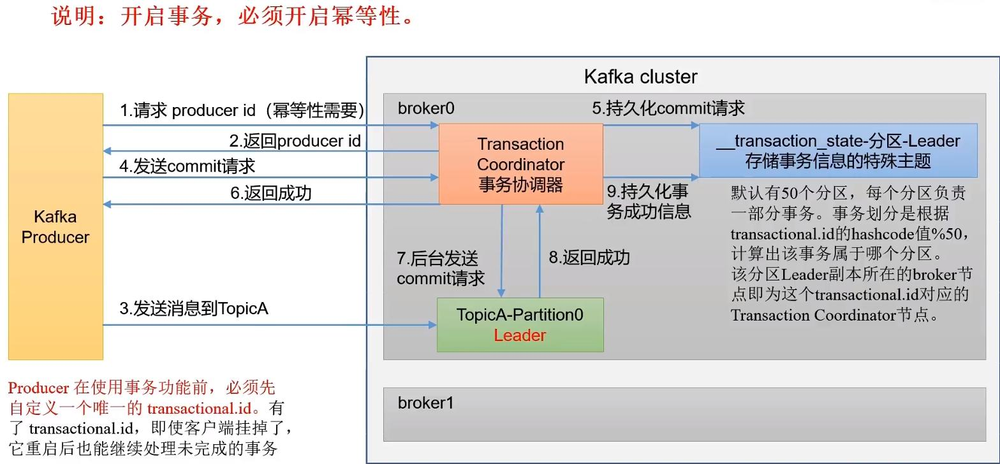

#   kafka
##  什么是kafka
*   ### 传统定义：kafka是一个<font color=red>分布式的基于发布/订阅模式的消息队列</font>，主要用于实时大数据处理领域。
*   ### 发布/订阅：消息的发布者不会立即将消息发送给订阅者，而是<font color=red>将消息分为不同的类别</font>，订阅者只接收感兴趣的消息。
*   ### 最新定义：kafka是一个开源的分布式的数据流平台，被数千家公司用于高性能数据管道、流分析、数据集成和关键任务处理。

## 消息队列
*   Kakfa、Activemq、Rabbitmq、Rocketmq。

## 应用场景
*   ### 异步、解耦、削峰

## 消息队列的两种模式
*   1.  点对点模式
    * 消费者主动拉取数据，消息收到后清除消息
*   2.  发布订阅模式
    *   可以有多个topic主题（浏览、点赞、订阅、收藏）
    *   消费者消费数据后，不删除数据
    *   每个消费者都互相独立，都可以消费到数据

## kafka的基本架构
1.  为了方便扩展，并提高吞吐量，一个topic分为多个partition。
2.  配合分区的设计，提出消费者组的概念，组内每个消费者并行消费。
3.  为了提高可用性，为每个partition添加若干副本。
4.  zookeeper 中记录谁是leader，kafka2.8.0以后可以配置不采用zk。

```
                +----------------------------+
                |          zookeeper         |
                |                            |
                | +------+ +------+ +------+ |
                | |  ZK  | |  ZK  | |  ZK  | |
                | +------+ +------+ +------+ |      +------------+
                |                            |      |    group   |
                +-------------^--------------+      | +--------+ |
                              |                     | |comsumer| |
                +-------------+--------------+  +---> +--------+ |
                |kafka cluster               |  |   | +--------+ |
                +------------- ------------- |  |   | |comsumer| |
                ||broker 0   | |           | |  |   | +--------+ |
+--------+      ||   topicA  | |   topicA  | |  |   +------------+
|        |      ||   Part 1  | |   Part4   | |  |
|        |      |------------+ +-----------+ |  |   +------------+
|        |      ||broker 1   | |           | +--+   |    group   |
|        |      ||   topicA  | |   topicA  | |      | +--------+ |
|        |      ||   Part 2  | |   Part 3  | +------> |comsumer| |
|producer+------>|-----------+ +-----------+ |      | +--------+ |
|        |      ||broker 2   | |           | +--+   | +--------+ |
|        |      ||   topicA  | |   topicA  | |  |   | |comsumer| |
|        |      ||   Part 3  | |   Part 2  | |  |   | +--------+ |
|        |      |------------+ +-----------+ |  |   +------------+
|        |      ||broker 3   | |           | |  |
+--------+      ||   topicA  | |   topicA  | |  |   +------------+
                ||   Part 4  | |   Part 1  | |  |   |    group   |
                |------------+ +-----------+ |  |   | +--------+ |
                +----------------------------+  |   | |comsumer| |
                                                +---> +--------+ |
                                                    | +--------+ |
                                                    | |comsumer| |
                                                    | +--------+ |
                                                    +------------+

```
-   Producer:消息生产者，就是向kafka broker发送消息的客户端。
-   Consumer：消息消费者，向kafka broker取消息的客户端。

## kafka生产者
1.  发送原理：
    在发送消息的过程中，涉及到两个线程--main线程和sender线程。在main线程中创建了一个双端队列RecordAccumulator。main线程将消息发送给RecordAccumulator，Sender线程不断的从RecordAccumulator中不断的拉取消息发送到kafka Broker。
    -   batch.size：只有数据累计到batch.size之后，sender才会发送数据。默认16k
    -   linger.ms：如果数据迟迟未达到batch.size，sender等待linger.ms设置的时间到了之后就会发送数据，单位是ms，默认是0ms，表示没有延迟。
    -   sender.NetworkClien.InFlightRequests：默认每个broker节点最多缓存5个请求。
    -   RecordAccumulator：<font color=red>是在内存中，默认大小是32M，它为每个分区创建一个队列Queue</font>。

2.  brokers应答acks：
    -   0：生产者发送过来的数据，不需要等数据落盘应答。
    -   1：生产者发送过来的数据，Leader收到数据后应答。
    -   -1（all）：生产者发送过来的数据，Leader和ISR队列里面的所有节点收齐数据后应答，-1和all等价。

3.  总结：
```
+------------------------------------------------------------------------+
|   main线程                          sender线程                         |
| +------------+   +------------+   +-------------+   +----------------+ |
| |            |   |            |   | +---------+ |   |    kafka集群   | |
| |   拦截器    |   |   Record   |   | |  sender | |   |                | |
| |            |   |Accumulator | +--->  数据    | |   | +------------+ | |
| +-----+------+   |            | | | +---------+ |   | |  broker0   | | |
|       |          | +--------+ | | | +-----|     |   | +------------+ | |
|       |        +---> queue  | | | | | +---v---+ |   | | Partition  | | |
| +-----v------+ | | +--------+ | | | | |Network| |   | +------------+ | |
| |            | | |            | | | | |Client | |   | | Partition  | | |
| |  序列 化器  | | | +--------+ | | | | +-------+ |   | +------------+ | |
| |            | +---> queue  | +-+ | | |request| | +->     ......     | |
| +-----+------+ | | +--------+ |   | | +-------+ | | | +------------+ | |
|       |        | |            |   | | |request| | | | |  brokerN   | | |
|       |        | | +--------+ |   | | +-------+ | | | +------------+ | |
| +-----v------+ +---> queue  | |   | | |request| | | | | Partition  | | |
| |            | | | +--------+ |   | | +-------+ | | | +------------+ | |
| |   分区器    +-+ |   ......   |   | |   ......  | | | | Partition  | | |
| |            |   |            |   | +--Selector+--+ | +------------+ | |
| +------------+   +------------+   +-------------+   +----------------+ |
|                                                                        |
+------------------------------------------------------------------------+
```
-   外部数据通过生产者发送到broker：首先producer先创建两个工作线程main和sender线程，main线程接收数据，经过内部的拦截器、序列化器、和分配器后将压缩的数据发送到RecordAccumulator(缓存区，默认32M)中；
-   缓冲区会为每个分区创建一个双端队列，发送的数据会存储到队列中，然后由sender拉取数据；注意缓冲区阻塞：当消息size太大，将缓冲区占满，sender还未来得及拉取数据，此时消息发送会被阻塞，直到缓冲区有足够的空间。生产中可以适当的调整缓冲区大小64M或者更大。
-   sender拉取需要满足两个条件：等待时间linger.ms时间到了或者队列中的消息总量累计到设定的batch.size；
-   sender的NetworkClient以broker节点为key，将拉取到的数据放到不同的request队列中发送给对应的broker，网络IO 发送消息成功之后(注意：再此之前，发送消息的函数都是在阻塞状态)，会根据配置等待broker的ack。
-   sender的InFlightRequest，默认为每个分区缓冲5个request；即在broker 未应答时，sender最多发送5个request 到broker等待应答，由此可能引发消息乱序。


## kafka分区好处
1.  便于合理使用存储资源，每个partition在一个Broker上存储，可以把海量数据按照分区切割成一块一块的数据存储在多个broker上，合理控制分区的任务，可以实现负载均衡的效果。
2.  提高并行度，生产者可以以分区为单位发送数据，消费者可以以分区为单位消费数据。

## 分区策略
1.  指明partition的情况下，直接将指明的值作为partition值。例如partition=0，所有数据写入0分区。go-sarama中设置方法：需要提前配置sarama.Config.Producer.Partitioner = sarama.NewManualPartitioner,然后设置消息smg.Partition即可。
2.  没有指明partition的情况,将Key的hash值与topic的partition数进行取余得到partition值。go-sarama中设置方法：需要提前配置sarama.Config.Producer.Partitioner = sarama.NewHashPartitioner,然后设置消息smg.Key = sarama.StringEncoder("<font color=red>Key</font>")即可。
3.  既没有指定分区也没有指定key的情况下，kafka采用Sticky Partition(黏性分区器)，会随机选择一个分区，并尽可能一直使用该分区，待该分区的batch已满或者已完成，kafka在随机选择一个分区进行使用（和上一次的分区不同）。例如：第一次随机0号分区，等0号分区当前批次满了，或者linger.ms 设置的时间到了，kafka再随机一个分区进行使用(如果还是0，继续随机)。

    ### <font color=red>注意：go-sarama中sarama.SyncProducer.SendMessage会被Sender分区策略阻塞！</font>

## 生产经验---生产者如何提高吞吐量
-   batch.size：批次大小，默认16K。go-sarama中设置"sarama.Config.Producer.Flush.Bytes"
-   linger.ms：等待时间，修改为5-100ms。go-sarama中设置"config.Producer.Flush.Frequency"
-   compression.type：压缩snappy。go-sarama中设置"config.Producer.Compression"
-   RecordAccumulator：缓冲区大小，修改为64M。<font color=red>当缓冲区大小不够时，可以适当放大缓冲区大小；当缓冲池的内存块用完后，消息追加调用将会被阻塞，直到有空闲的内存块。</font>

## 生产经验---数据可靠性
1.  ack应答级别及其风险：
    - 0：生产者发送过来的数据，不需要等待数据落盘应答
      - 风险1：当数据发送给broker集群的leader后，还未来的级落盘或者和follower同步数据，leader挂了，导致数据丢失。
    - 1：生产者发送过来的数据，Leader收到数据后应答
      - 风险1：当数据发送给broker集群的leader后，leader落盘之后，返回ack应答，但是当还未来得及和follower同步，leader挂了，导致数据丢失。
    - -1（all）：生产者发送过来的数据，Leader和ISR队列里面的所有节点收齐数据后应答。
      - 风险1：Leader收到数据后，所有follower都开始同步数据，但是有一个follower，因为某种故障，迟迟不能与leader进行同步，可能会造成阻塞。 
2.  可靠性总结：
    - acks=0：生产者发送过来数据就不管了，可靠性差，效率高；
    - acks=1：生产者发送数据到Leader应答，可靠性中等，效率中等；
    - acks=-1:生产者发送过来的数据需要等待Leader和Follower数据同步完成然后应答，可靠性高，效率低；
    - 在生产环境中很少使用acks=0；acks=1一般用于传输普通日志，允许丢个别数据；acks=-1，一般用于传输和钱相关的数据，对可靠性要求比较高的场景。
3.  acks配置：
    - Retry次数：sarama.Config.Producer.Retry.Max,默认3次
4.  风险分析：
    1.  acks=-1引发acks阻塞：
        - 风险分析：Leader维护一个动态的in-sync Replica set(ISR)，意为和Leader保持同步的Follow+Leader集合。如果Follower长时间未向Leader发送通信请求或者同步数据，则该Follower将被提出ISR，该阈值由replica.lag.time.max.ms参数设定，默认是30s。这样就不用等长期联系不上或者已经故障的节点。 
        - 数据可靠性分析：如果分区副本设置为1个，或者ISR里应答的最小副本数量(min.insync.replicas,默认为1)为1，和ack的效果是一样的，还是有风险。
        - 数据完全可靠条件：ack级别设置为-1，分区副本对于等于2，ISR里应答的最小副本数量大于等于2。 
    2.  acks=-1引发数据重复：
        - 风险分析：生产者发送过来数据，Leader和ISR队列里面的所有节点收齐了数据后应答。在leader准备回复ack时挂了，此时其他follower进行了选举，新的leader和follower中都已经落盘了该数据，producer由于长时间没有接收到应答，发起了重传，导致数据又落盘了一次。
5.  数据重复
    1.  幂等性原理：
        - 幂等性就是指Producer不论向Broker发送多少次重复数据，Broker都会持久化一条数据，保证不重复。
        - 精确一次（exactly once）= 幂等性 + 至少一次(ack=-1 + 分区副本数>=2 + ISR最小副本数>=2)
    2.  重复数据的判断标准：具有<PID,Partition,SeqNumber>相同的主键的消息提交时，Broker只会持久化一次，其中PID是kafka每次重启都会分配一个新的;Partition表示分区号；Sequence Number是单调递增的。所以幂等性只能保证单分区单回话内不重复。
    3.  开启幂等性：开启参数enable.idempotence, 默认是true，关闭是false。

6.  生产者事务
    1.  事务底层原理：
    
    2.  事务实现：go 客户端没有实现kafka事务

##  kafka---Broker
1.  kafka Broker的总体工作流程
    1.  broker启动后在zookeeper(以下简称zk)的/brokers/ids中注册。
    2.  broker中的controller模块对zk中的controller节点进行抢占注册，谁先注册谁说了算。
    3.  broker集群中由抢占选举出来的Controller为leader，负责监听broker集群(即zk中/borker/ids/下节点)的变化。
    4.  Controller-leader决定broker-Leader的选举。选举规则：在isr中存活为前提，安装AR中排在前面的优先，例如：ar[0,1,2],isr[0,1,2],那么leader就会按照0，1，2的顺序轮训。
    5.  Controller-leader将节点信息上传到zk。
    6.  其他Controller从zk同步相关信息。

2.  节点的服役
    1.  添加新的节点：在docker-compose中添加新的broker节点，并执行启动。
    2.  进入一个broker节点，创建一个要负载均衡的主题：vim topics-to-move.json 输入如下内容：
        ```
        {
            "topics":[
                {"topic":"third"}  //添加想要数据负载均衡的topics
            ],
            "version":1
        }
        ```
    3.  生成一个负载均衡的计划：kafka-reassign-partitions.sh --bootstrap-server broker1:9092 --topics-to-move-json-file /bitnami/kafka/config/topic-to-move.json --broker-list "1,2,3,4" --generate
    4.  创建副本存储计划：将3中生成的配置写入到increase-replication-factor.json中
    5.  执行副本存储计划：kafka-reassign-partitions.sh --bootstrap-server broker1:9092 --reassignment-json-file /bitnami/kafka/config/increase-replication-factor.json --execute
3.  节点的退役
    1.  流程同服役的2-5相同，只不过第三条中将服役的broker节点去掉(例如--broker-list "1,2,3,4" 改成"1,2,3")即可。

## kafka副本
1.  副本基本信息
    1.  副本作用：提高数据可靠性
    2.  kafka默认副本一个，生产环境一般设置为2个，保证数据可靠性，太多副本会增加磁盘存储空间，增加网络传输，效率降低。
    3.  kafka中副本分为Leader和Follower。Kafka会把数据往leader上发，然后Follower找leader同步数据。
    4.  kafka分区中所有副本统称为AR。

2.  Follower故障处理
    1.  相关专业术语：
        -   LEO(log end offset)：每个副本的最后一个Offset，LEO其实就是最新的offset+1。
        -   HW(high watermark)：所有副本中最小的LEO。
    2.  故障处理流程
        1.  Follower发生故障后会被临时提出ISR
        2.  这个期间Leader和Follower继续接收数据
        3.  待该Follower回复后，Follower会读取本地磁盘记录上次的HW，并将log高于HW的部分截取掉，从HW开始向Leader进行同步。
        4.  等该Follower的LEO大于等于该partition的HW，即Follower追上Leader之后，就可以重新加上ISR。
3.  Leader故障处理
    1.  Leader发送故障以后，会从ISR中选出一个新的Leader
    2.  为保证多个副本的一致性，其余的Follower会现将各自高于HW的部分截取掉，然后从新的Leader同步数据。
    3.  注意：这只能保证Leader和Follower数据一致性，并不能保证数据不丢失或者不重复。

4.  生产经验---手动调整分区副本
    1. 方法同节点服役配置，制定计划然后执行。

5.  生产经验---Broker-leader负载均衡
    1.  broker可以自动负载均衡配置，默认开启，但是生产过程中应该关闭，或者门槛调高，因为会平衡过程中会大大影响性能

6.  生产经验---增加副本因子
    1. 方法同节点服役配置，制定计划然后执行。

7.  kafka文件存储
    1.  查看日志： kafka-run-class.sh kafka.tools.DumpLogSegments --files 日志文件

8.  Broker 高效读写
    1.  kafka本身是分布式集群，可以采用分布式技术，并行度高。
    2.  读数据采用稀疏索引，可以快速定位到要消费的数据。
    3.  顺序写磁盘：Kafka 的Producer生产数据，要写入到log文件中，写过程是一直追加到文件末尾，为顺序写。比乱序写效率高。
    4.  采用页缓存零拷贝技术：
        -   零拷贝：kafka的数据加工处理交由Kafka生产者和Kafka消费者处理，Kafka的Broker应用层不关心存储的数据，所以就不用走应用层，传输效率高
        -   pageCache页缓存：Kafka重度依赖操作系统底层提供的PageCache功能。当上层有写操作时，操作系统只是将数据写入PageCache，当读操作发生时，先从PageCache中查，如果找不到，再去磁盘中读取。实际上PageCache是吧尽可能多的空闲内存都当做磁盘缓存来使用。

## kafka消费者
1.  消费方式
    1.  pull(拉)模式：consumer采用从broker中主动拉取数据。Kafka采用这种方式。
    2.  push(推)模式：Kafka没有采用这种方式，因为broker决定消息的发送速率，很难适应所有的消费者消费速率。缺点：如果kafka的broker没有数据，消费者可能陷入循环中，一直返回空数据。

2.  消费者总体工作流程
    1.  一个消费者可以消费多个分区数据
    2.  对于消费者组，每个分区的数据只能由消费者组中的一个消费者消费。可以将一个消费者组看做一个单独的消费者的整体。
    3.  每个消费者的offset由消费者提交到系统主题保存。由broker的__consumer_offset维护。

3.  消费者组工作原理
    1.  Consumer Group(CG)：消费者组，由多个Consumer组成，形成一个消费者组的条件，是所有消费者的groupid相同。
    2.  消费者组的每个成员消费不同的分区的数据，一个分区数据只能由组中的一个消费者消费。
    3.  消费者组之间互不影响。所有消费者都属于某个消费者组，即消费者组是逻辑上的一个订阅者。
    4.  如果消费者组中的消费者比分区多，多的部分消费者就会闲置下来收不到消息。
    5.  消费者组之间相互独立互不影响。

4.  消费者组初始化流程
    1.  coordinator：辅助实现消费者组的初始化和分区的分配，每个broker中都有一个coordinator
        -   coordinator节点选择=groupid的hash值%50（__consumer_offset的分区数量,__consumer_offset分布在不同的broker上）
        -   例如：groupid的hash值是1，1%50 = 1，那么__consumer_offset主题的1号分区，在哪个broker上，就选择这个节点的broker上的coordinator作为消费者组的老大。消费者组下的所有消费者提交offset的时候就往这个分区去提交offset。
    2.  每个consumer都发送joingroup请求给coordinator_leader
    3.  coordinator_leader 选出一个consumer作为leader，然后把要消费的topic情况发送给consumer_leader。
    4.  consumer_leader制定消费方案(规定consumer和partition的消费对应关系)。并把消费方案发送给coordinator_leader。
    5.  coordinator_leader把消费方案发送给各个consumer。
    6.  每个消费者都会和coordinator_leader保持心跳(默认3s)，一旦超时(session.timeout.ms=45s),该消费者会被移除，并触发再平衡；或者消费者处理消息的时间过长(max.poll.interval.ms5分钟)，也会触发再平衡。

5.  消费者组消费详细流程
    1.  consumer消费者组先创建一个消费者组网络连接客户端，与brokers进行网络通讯。
    2.  group调用Sendfetch方法，设置抓取数据配置初始化：
        -   Fetch.min.bytes：每批次最小抓取大小；默认一个字节。
        -   Fetch.max.wait.ms：每隔最多时间抓取一次数据。
        -   Fetch.max.bytes：每批次最大抓取大小，默认50m。
    3.  NetworkClient调用send方法，发送请求，通过回调方法onsuccess将消息拉取回来，并将消息放入队列中。
    4.  group中的消费者去队列中拉取消息(max.poll.records 一次拉取数据返回消息的最大条数，默认500条)，进行反序列化、经过拦截器后，消费者处理数据。

6.  生产经验---分区的分配以及再平衡
    1.  一个consumer group中有多个consumer组成，一个topic有多个partition组成，现在的问题是，到底由那个consumer消费哪个partition的数据。
    2.  Kafka有四种主流的分区分配策略:Range,RoundRobin,Sticy,CooperativeSticky。
    3.  可以通过配置参数partition.assignment.strategy，修改分区的分配策略，默认策略是Range+CooperativeSticky。Kafka可以使用多个分区分配策略。

7.  分区分配策略之Range
    -   Range是对每个topic而言的。首先对同一topic里面的分区按照序号进行排序，并对消费者按照字母顺序进行排序。例如分区[0,1,2,3，4],有3个consumer，则consumer消费partition情况为[0,1][2,3][4]
    -   注意：如果只是针对一个topic而言，排在前面的消费者的压力不是很大。但是有N多个topic，每多一个topic，排在前面的消费者都会多消费一个分区，那么这些消费者的压力远远大于其他消费者。
    -   缺点：简而言之就是容易产生数据倾斜。

8.  分区分配策略之RoundRobin
    -   RoundRobin是针对所有topic而言的。RoundRobin轮询分区策略，是吧所有的partition和所有的consumer都列出来，然后按照hashcode进行排序，最后通过轮询算法来分配partition到各个消费者。

9.  分区分配策略之Sticky
    -   Sticky 即粘性分区，可以理解分配结果带有“粘性的”。即在一次新的分配前，考虑上一次的分配结果，尽量少的调整分配的变动，可以节省大的开销。
    -   Sticky粘性分区是在kafka 0.11x版本开始引入这种分区分配策略，首先会尽量均衡的放置分区到消费者上面，在同一消费者组内出现问题的时候，会尽量保持原有的分区不变化。

10. Offset位置
    -   从0.9 版本开始，consumer默认将offset保存到Kafka一个内置的topic中，该topic为__consumer_offset。
    -   0.9 版本以前，consumer默认将offset保存到zookeeper的节点中。这种方案会增加consumer跟zookeeper的交互，带来大量的网络通讯，效率底下。
    -   __consumer_offset 主题里面采用key-value的方式存储数据。key是"group.id" + "topic" + "partition-id"，value是当前offset的值。每隔一段时间，每隔一段时间，kafka内部会对这个topic进行compack，也就是每个"group.id" + "topic" + "partition-id"的key保存最新的值。

11. 自动提交Offset
    -   为了使我们能够专注于业务逻辑，kafka提供了自动提交offset的功能。
    -   自动提交的相关参数：
        -   enable.auto.commit：是否开启自动提交功能，默认是ture
        -   auto.commit.interval.ms：自动提交offset的时间间隔，默认是5s。

12. 手动提交Offset
    -   虽然自动提交offset十分简单便利，但由于其是基于时间提交的，开发人员难以把握offset提交的时。因此kafka还提供了手动提交offset的方法。
    -   手动提交offset有两种方法：分别是commitSync(同步提交)和commitAsync(异步提交)。两者的相同点是，都会将本次提交的一批数据最高的偏移量提交。不同点是，同步提交阻塞当前线程，一直到提交成功，并且会自动失败重试(由不可控因素导致，也会出现提交失败)；而异步提交则没有失败重试的机制，故有可能提交失败。
    -   commitsync(同步提交)：必须等待offset提交完毕，再去消费下一批数据。
    -   commitAsync(异步提交)：发送完offset提交，就开始消费下一批数据。

## 生产调优
1.  kafka硬件配置选择
    1.  场景说明：
    -   100万日活，没人每天100条日志，每天总共的日志条数是100w*100条= 1亿条。
    -   1亿/24小时/60分/60秒 = 1150条/每秒
    -   每条日志大小0.5k-2k（取1k）
    -   1150条/每秒 * 1k  ≈ 1Mb/s
    -   高峰期每秒钟1150 * 20 = 23000条
    -   每秒多少数据量：20Mb/s
    2.  购买多少台服务器
    -   服务器台数 = 2 * （生产者峰值生产速率 * 副本数 / 100） + 1
    -   总数 = 2 * (20MB/s * 2 /100) + 1 = 3
    3.  硬盘选择：
    -   kafka 按照顺序读写，机械硬盘和固态硬盘顺序读写速度差不多，选择机械硬盘
    -   1 亿条* 1Kb * 2个副本 * 3天(日志保存) /0.7(次盘占用率70%) = 1t； 3太机器大于1t 就行了
    4.  内存选择
    -   kafka 内存 = 堆内存 (kafka 内部配置) + 页缓存（服务器内存）
    -   堆内存 = 10-15g；可修改配置
    -   页缓存 segment(1g) Leader(10) * 1g*25% /3台 ≈ 1g;
    -   一台服务器内存 = 10g + 1g 
    5.  CPU 选择：
    -   num.io.threads = 8；负责写磁盘的线程数，整个参数值要占总核数的50%。
    -   num.replica.fetchers = 1；副本拉取线程数，这个参数占总核数的50%的1/3。
    -   num.network.threads=3; 数据传输线程数，这个参数占总核数的50%的2/3。
    -   建议32个cpu core，其中24核给上述线程使用，其他核给kafka其他线程使用(定时器、心跳等)。
    6.  网络选择：
    -   选择千兆网卡即可。


