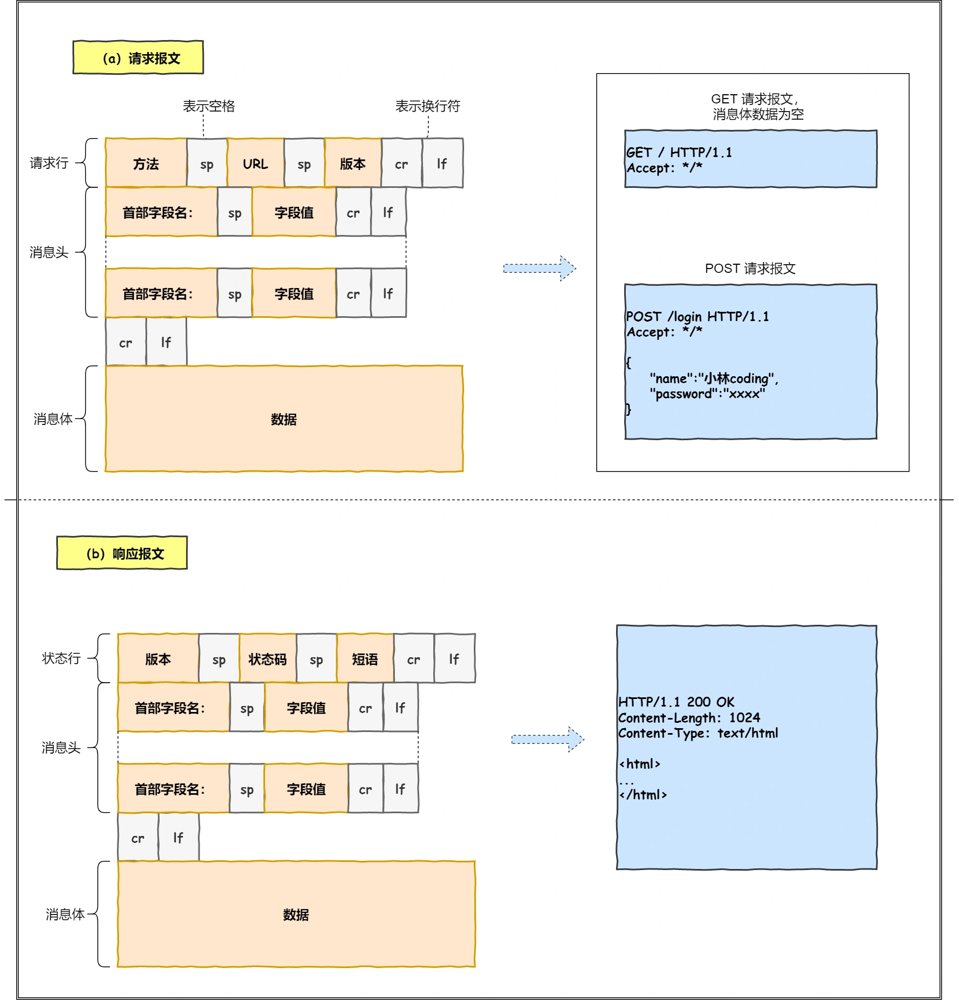
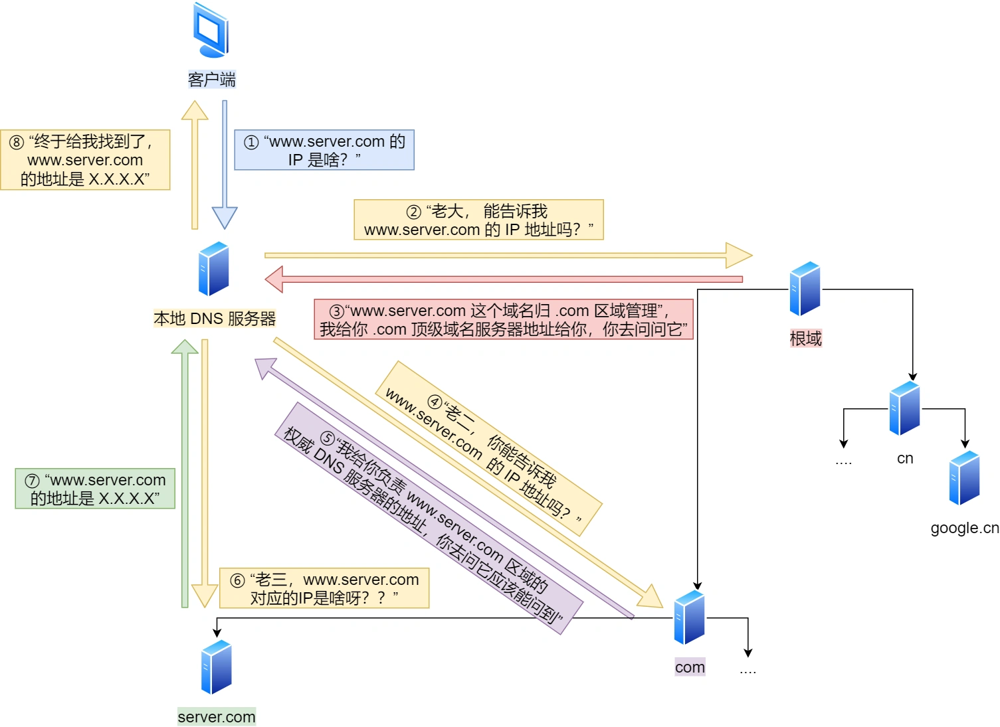
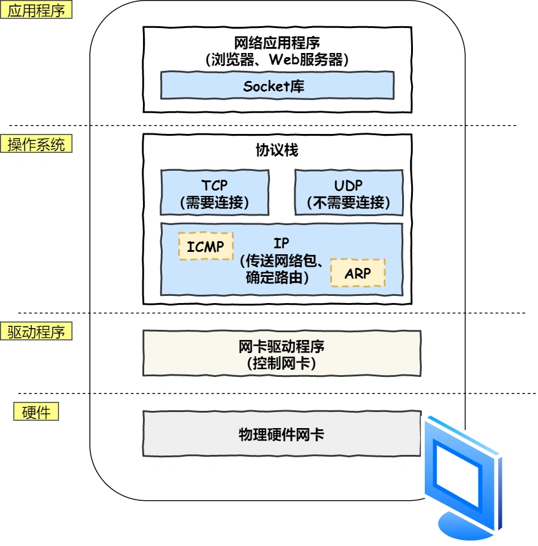
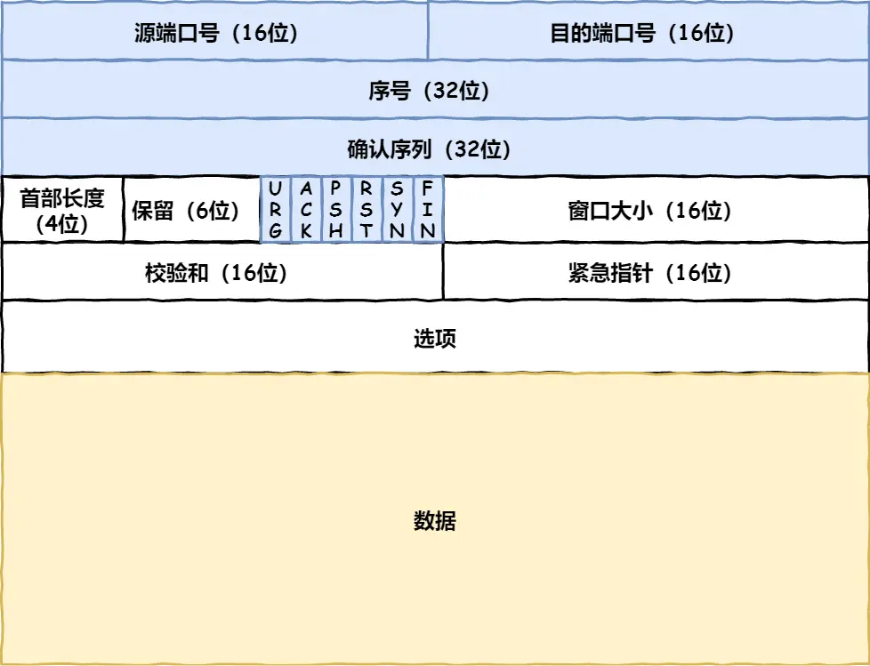
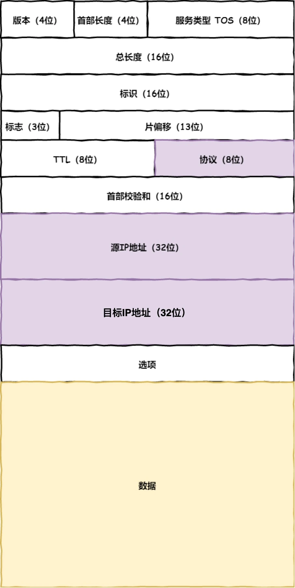
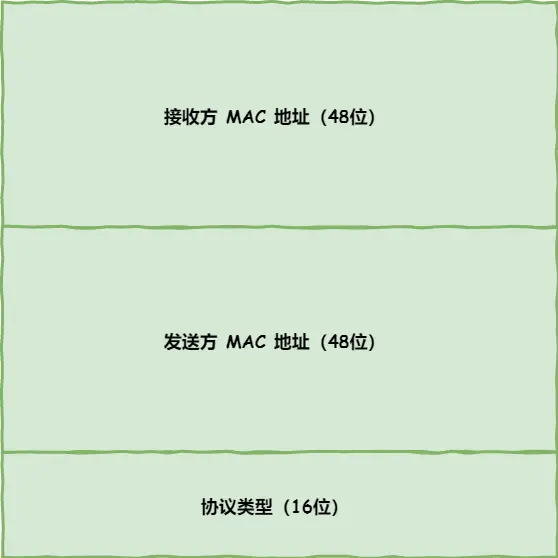
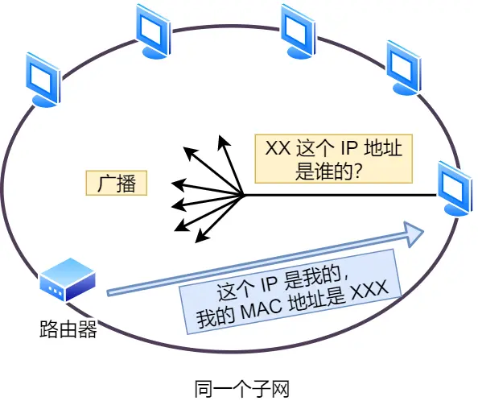
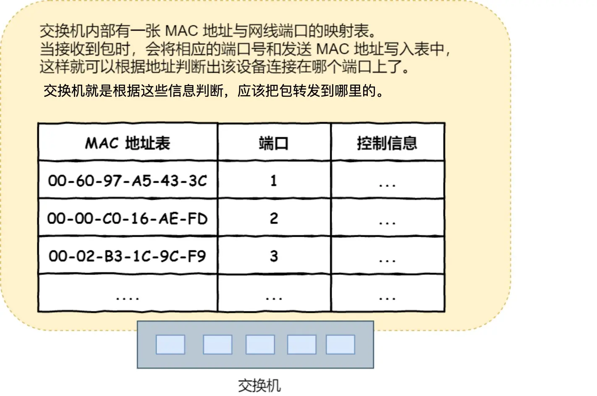
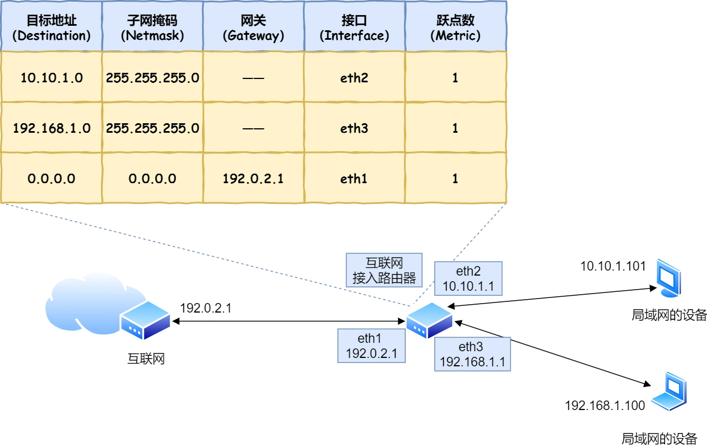
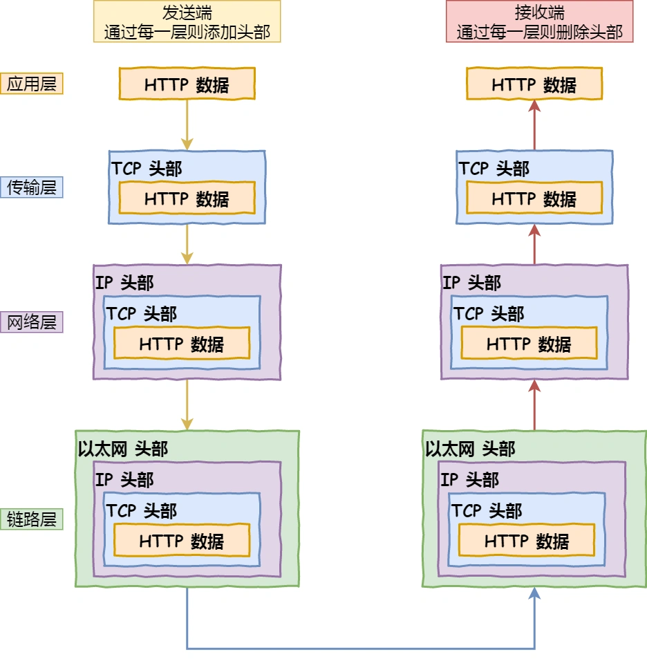

#   基础篇

##  1.  TCPIP网络模型有哪几层？
请问，为什么要有网络模型？

对于同一设备上的进程通讯，有很多中方式，比如有管道、消息队列、共享内存、信号等方式，而对于不同设备上的进程间通讯，就需要网络通讯，而设备是多样性的，所以需要兼容多种多样的设备，就协商出了一套通讯网络协议。

这个网络协议是分层的，每一层都有各自的职责，接下来就根据TCPIP网络模型分别对每一层进行介绍。

### 应用层
最上层的，也就是我们能最直接接触到的就是应用层（application），我们手机或者电脑使用的应用软件都是再应用层实现的。那么当两个不同设备的应用需要通讯的时候，应用就会把数据传给下一层，也就是传输层。

所以，应用只需要专注于为用户提供功能，比如HTTP、FTP、tenlet、DNS、SMTP等

应用层只是不用去关心数据是如何传输的，就类似与我们寄快递的时候，只需要把包裹交给快递员，由他负责运输快递，我们不需要关心快递是如何被运输的。

而且应用层是工作在操作系统中的用户态，传输层及一下工作在内核态。

### 传输层
应用层的数据包传输给传输层，传输层是为应用层提供网络支持的。

在传输层会有两个协议：TCP、UDP。

TCP叫传输控制协议，大部分应用使用的是TCP协议，比如HTTP应用层协议。TCP相比UDP多了很多特性，比如流量控制、超时重传、拥塞控制等，这些都是为了保证数据可靠性传输。

UDP相对来说简单点，简单到只负责发送数据包，不保证数据包是否能够抵达对方，但他的实时性相对更好，传输效率也高，当然UDP也可以实现可靠性传输，把TCP的特性在应用层实现就可以，不过要实现一个商用的可靠的UDP传输协议不是一个容易的事情。

应用需要传输的数据可能非常大，如果直接传输就控制不好，因此当传输层的数据包大小超过MSS(TCP 最大报文段长度)，就要将数据分块，这样即使一个数据块丢了，只用重传这个数据块就可以了，而不用重传整个数据包。在TCP协议中，我们把每个分块称为一个TCP端(TCP segment)。

当设备作为接收方时，传输层则要负责把数据包传给应用，但是一台设备上可能有很多应用在接收或者传输数据，因此需要用一个编号将应用分开，这个编号就是端口。

比如80端口就是web服务器用的，22端口则是远程服务器登录用的，而对于浏览器(客户端)中的每个标签栏，都是独立的进程，操作系统会为这些进程分配临时的接口。

### 网络层
传输层可能大家刚接触的时候，会认为它负责将数据从一个设备传输到另一个设备，事实上它并不负责。

实际场景中的网络环节是错综复杂的，中间有各种各样的线路或者分叉路口，如果一个设备的数据要传输给另一个设备，就需要在各种各样的路径和节点进行选择，而传输层的设计理念是简单、高效、专注。如果传输层还负责这一块功能就有点违背设计原则了。

也就是说我们不希望传输层协议处理太多的事情，只需要服务好应用即可，让其作为应用间数据传输的媒介，帮助应用更好的通讯，而实际的传输功能就交给下一层，网络层。

网络层最常使用的就是IP协议，IP协议将传出层的报文作为数据部分，再加上IP包头组装成IP报文，如果IP报文大小超过MTU就会再次分片，得到一个即将发送到网络的IP报文。

网络层将数据从一个设备发送到另一个设备，世界上这么多设备，是如何找到对方的呢？因此网络层需要有区分设备的编号。

我们一般用IP地址给设备进行编号，对于IPV4协议，IP地址共32位，分成了4个字段，每段8位，只有一个单纯的IP地址虽然做到了区分设备，但是寻址起来就特别的麻烦，全世界那么多台设备，难道一个个匹配？这显然不科学。

因此，需要将IP地址分成两种意义。
-   一个是网络号，负责表示改IP是负责哪个子网的。
-   一个是主机号，负责标识统一子网下的不同主机。

怎么分的呢？这需要配合子网掩码才能算出IP地址的网络号和主机号。
举个例子：比如10.100.122.0/24，后面的24就是255.255.255.0子网掩码，

知道了子网掩码，怎么算出网络地址和主机地址呢？

将10.100.122.2和255.255.255.0按位与运算，就可以得到网络号。
将255.255.255.0取反后与IP地址按位与运算，就可以得到主机号。

那么在寻址的过程中，先匹配到相同的网络号(表示要找到同一个子网)，才会去找对应的主机。
出了寻址能力，IP协议还有一个重要的能力，就是路由，实际场景中，两台设备并不是用一根网线连起来的，而是通过很多网关、路由器、交换机等众多网络设备连接起来的，那么就会形成多条网络的路径，因此当数据包到达一个网络节点，就需要通过路由算法决定下一步走那一条路。

路由器寻址工作中，就是要找到目标地址的子网，找到后进而把对应的数据包转发到对应的网络中。
所以，IP地址寻址的作用是告诉我们往下一个目的地该朝哪个方向走，路由则是根据下一个目的地选择路径，寻址更像是在导航，路由更像是在操作方向盘。

### 网路接口层
生成了IP报文，接下来就交给网络接口层在IP头部加一个MAC头部，并封装层数据帧发送到网络上。

IP头部中的接收方的IP地址表示网络包的目的地，通过这个地址我们就可以判断要将包发送到哪里，但在以太网的世界中，这个思路显然是不通的。

什么是以太网呢？电脑上的以太网接口、wifi接口、以太网交换机、路由器上的千兆万兆以太网口，还有网线，它们都是以太网的组成部分。以太网就是一种在局域网内，把附近的设备连接起来，使他们之间可以互相通讯的技术。

以太网在判断网络包目的地时和IP的方式不同，因此必须采用相同的相匹配的方式才能再以太网中将包发往目的地。而MAC头部就是干这个的，所以在以太网通讯需要用到MAC地址。

MAC头部是以太网使用的头部，它包含了接收方和发送方的MAC地址等信息，我们可以通过ARP协议获取对方的MAC地址。
所以说网络接口层主要为网络层提供链路级别的传输服务，负责在以太网、wifi这样的底层网络上发送原始数据包，工作再网卡这个层次，使用MAC地址来表示这个设备。

##  2、 键入网址到网页显示，期间发生了什么？
>   浏览器第一步做的是解析URL

首先浏览器做的第一步是对URL进行解析，从而生成发送给web服务端的请求信息，让我们看看长长的URL里各个元素的代表是什么，见下图：

所以长长的URL实际上是请求服务器里的文件资源。
>   要是上图中的蓝色部分的URL都省略了，那应该是是请求哪个文件呢？

当没有路径名时，就代表访问根目录下事先设置的默认文件，也就是index.html，或者default.html这些文件，这样就不会发生混乱了。

>   产生HTTP请求信息

对URL解析之后，浏览器确认了web服务器和文件名，接下来就是根据这些信息来生成http请求信息了。

>   一个孤单的http数据包表示：我这么一个小小的数据包，没亲没友，直接发送到浩瀚的网络，谁会知道我呢？谁能保护我，我的目的地在那？各种疑问的它，没有停滞不前，依然踏上了征途。

### 真实地址查询---DNS
通过浏览器解析URL并生成HTTP消息后，需要委托操作系统将消息发送给web服务器。
但在发送之前，还有一项工作需要完成，那就是查询服务器域名对应的IP地址，因为委托操作系统发送消息时，必须提供通讯对象的IP地址。

比如我们打电话的时候，必须要知道对方的电话号码，但是由于对方的电话号码太难记了，所以通常会将电话号码+姓名保存再通讯录里。

所以有一种服务器专门保存了web服务器域名和IP的对应关系。它就是DNS服务器。

>   域名的层级关系

DNS的域名都是用句点来分隔的，比如www.server.com，这里的句点代表了不同层次的界限。在域名中，越靠右层级越高。

实际上域名最后还有一个点，比如www.server.com.，这个最后的点代表根域名。
也就是，.根域在最顶层，它的下一层就是.com顶级域，再下面是server.com。所以域名的层级关系类似一个树状结构:
-   根DNS服务器
-   顶级域DNS服务器
-   权威DNS服务器

根域的DNS服务器信息保存在互联网中所有的DNS服务器中。
这样一来，任何DNS服务器就可以找到并访问根域DNS服务器了。

因此，客户端只要能够找到任意一台DNS服务器，就可以找到根域DNS服务器，进而顺藤摸瓜找到位于下层的某台目标DNS服务器。

> 域名解析的工作流程

1.  客户端首先会发送一个DNS请求，问www.server.com的IP是啥，并发送给DNS服务器（也就是客户端IP/TCP 设置中填写DNS服务器地址）。
2.  本地域名服务器接收到客户端的请求后，如果缓存中能够找到com.server.com，则它直接返回IP地址、如果没有，本地DNS会去问它的根域名服务器，根域名服务器是最高层次的，它不直接用于域名解析，单它能指明一条道路。
3.  根DNS收到来自本地DNS请求后，发现是.com，指出www.server.com这个域名归.com区域管理，我给你.com顶级域名服务器地址给你，你去问问它把。
4.  本地DNS服务器收到顶级域名服务器地址后，在此发起请求给顶级域名服务器
5.  顶级域名服务器收到后返回权威DNS服务器的地址。
6.  本地DNS服务器于是在此请求权威服务器。
7.  权威服务器查询后将对应的IP地址告诉本地DNS。
8.  本地DNS再将IP地址返回给客户端，客户端和目标建立连接。

至此完成了DNS的解析过程。

DNS域名解析的过程漫游意思的，整个过程和我们日常生活中找人问路的过程类似，只指路不带路。
>   那是不是每次域名解析都要经过这么多步骤呢？

当然不是了，还有缓存这个东西。
浏览器会先看自身有没有这个域名的缓存，如果有，那就直接返回，如果没有，就去问操作系统，操作系统也会去看看自己的缓存，如果有就直接返回，如果没有再去hosts文件看看，也没有，才去问本地的DNS服务器。

### 指南好帮手---协议栈
通过DNS获取IP地址后，就可以把HTTP的传输工作交给操作系统的协议栈。
协议栈内部分为几个部分，分别承担不同的工作内容，上下关系是有一定的规则的，上面的部分会向下面的部分委托工作，下面的部分收到委托的工作并 执行。

应用程序通过调用socket，来委托协议栈工作。协议栈上半部分有两块，分别是负责收发数据的TCP和UDP协议，这两个协议会接受应用层的委托执行收发数据的工作。
协议栈下面一部分是用IP协议控制网络报收发操作，在互联网上传数据时，数据会被切分成一块块的网络包，而将网络包发送给对方的操作就是由IP负责的。
此外IP中还包括ICMP和ARP协议。
-   ICMP用于告知网络包传输过程中产生的错误以及各种控制信息。
-   ARP用于根据IP地址查询相应以太网的MAC地址。

IP下面的网卡驱动程序负责控制网卡硬件，在最下面的网卡则负责完成实际的手法操作，也就是对网络栈中的信号执行发送和接收操作。

### 可靠传输---TCP
HTTP是基于TCP传输的，所以我们先了解一下TCP协议。
>   TCP 报头格式

我们先看tcp头部格式：

首先，源端口号和目标端口号是不可少的，如果没有这两个端口号，数据就不知道应该发给那个应用，接下来包有序号，这个是为了解决包乱序的问题。
还有确认号，目的是确认发出去的包对方能够收到。如果没有收到就应该重发，直到到达，这是为了保证不丢包。
接下来还有一些状态位，例如SYN是发起一个连接，ack是回复，RST是重置连接，FIN是结束连接。TCP是面向连接的，因而双方要维护连接状态，这些带状态位的包的发送，会引起双方的状态变更。
还有一个重要的就是窗口大小，TCP要做流量控制，通信双方个声明一个窗口(缓存大小)，标识自己当前能够处理的能力,别发的太快，撑死我，也别发的太慢，饿死我。
除了做流量控制外，TCP还会做拥塞控制，对于真正的通路堵车不堵车，它无能为例，他能做的就是控制自己，控制发送速度，尽量不增加拥堵。

>   TCP三次握手连接

在HTTP数据传输之前，首先需要TCP建立连接，TCP连接建立，通常为三次握手。
这个所谓的连接，只是双方计算机里维护的一个状态机，在连接建立的过程中，双方的状态变化如下：

-   一开始，客户端和服务端都处于close状态，先是服务端主动监听某个接口，处于listen状态。
-   然后客户端主动发送SYN，进入SYN_SEND状态。
-   服务端收到SYN报文，发送SYN_ACK给客户端，然后进入SYN_RCVD状态。
-   客户端收到SYN_ACK报文，发送ACK给服务端，然就进入established状态。
-   服务单收到ack报文，进入established状态。之后双方就可以收发报文了。

所以三次握手的目的是保证双方都有发送和接收的能力。

>   如何查看TCP的连接状态？

linux上可以用netstatus -anpt查看。

>   TCP 分割数据

如果HTTP请求消息比较长，超过了MSS的长度，这是TCP就会把HTTP的数据分割成一快快的数据发送，而不是一次性发送所有数据。
-   MTU：一个网络包的最大长度，一般是1500
-   MSS：除去IP和TCP头部之后，一个网络报所能容纳的TCP数据的最大长度。

数据会被已MSS的长度进行拆分，拆分出来的每一块数据都会单独的网络包中，也就是每个数据块加上TCP头，然后交给IP模块发送。

>   TCP报文生成

TCP里面有两个端口，一个是浏览器监听的端口，一个是服务器器监听的端口
在双方建立连接以后，TCP报文中的数据部分就是存放HTTP头部+数据，组装好TCP报文后，就需要交给下面的网络层处理。

### 远程定位---IP
TCP模块在执行连接、发送、断开等各阶段操作时，都需要委托IP模块将数据封装成网络包发送给通信对象。
>   IP 包头格式

我们先看看IP报文头的格式：

在IP协议里需要源目的IP地址：
-   源IP地址：即是客户端输出的IP地址；
-   目的IP地址：即通过DNS解析获得的服务器的IP地址。

因为HTTP是经过TCP的，所以再IP头中有协议号，要填写06，表示协议号为tcp。
>   假设客户端有多个网卡，就会有多个IP地址，那IP头部的原地址应该选那个？

当存在多个网卡时，在填写源地址IP时，就需要判断到底应该填写哪个地址，这个判断相当于再多个网卡中判断应该选用哪一个网卡来发送数据。
这个时候就需要根据路由表，来判断哪一个网卡作为源地址IP。
在linux操作系统中，我们可以使用route -n命令查看当前系统的路由表。

>   IP报文生成

至此，网络包的报文如下：

### 两点传输---MAC
生成了IP头部后，接下来网络包还需要再IP头部的前面加上MAC头部。
>   MAC 包头格式

MAC头部是以太网使用的头部，它包含了接收方和发送方的MAC地址信息。

在MAC包头里需要发送方MAC地址和接收方MAC地址，用于两点之间的传输。
一般再TCP/IP 通讯里，MAC包头的协议类型只使用：
-   0000：IP协议
-   0806：ARP协议

>   MAC 接收方和发送方如何确认？

发送方的MAC地址获取比较简单，MAC是在网卡生产的时候写入到ROM里，只要将这个值读取出来写入到MAC头部就可以了。

接收方的MAC地址就有点复杂了，只要告诉以太网对方的MAC地址，以太网就会帮我们发送过去，那么很显然这里应该填写对端的MAC地址。
所以得先搞清楚应该把包发给谁，这个只要查一下路由表就知道了。在路由表中找到匹配的条目，然后把包发给Gateway列中的IP地址就可以了。

>   既然知道要发给谁，那如何获取对方的MAC地址呢？

不知道对方的MAC地址，不知道就喊呗。
此时就需要ARP协议帮我们找到路由器的MAC地址。

ARP会在以太网中以广播的形式，对以太网所有设备喊出：“这个IP地址是谁的？请把你的MAC地址告诉我”
然后就会有人回答：“这个IP地址是我的，我的MAC地址是XXXXXX”
如果对方处于一个子网中，那么可以通过上面操作获得对方的MAC地址，然后，我们就将MAC地址协议MAC头部，MAC头部就完成了。

>   每次都要广播，这不是很麻烦吗？

放心，在后续的操作系统会把这此的查询结果放到一块叫做ARP缓存的内存空间留着以后使用，不过缓存的时间就几分钟。
也就是说，在发包时：
-   先查询ARP缓存，如果其中已经保存了对方的MAC地址，就不需要发送ARP查询，直接使用ARP缓存中的地址。
-   而当ARP缓存中不存在对方的MAC地址时，则发送ARP广播查询。

>   查看ARP缓存的内容

在linux系统中，我们可以使用arp -a命令来查看ARP缓存的内容。

>   MAC报文的生成

至此，网络报文如下：

### 出口---网卡
网络报只是内存中的一串二进制数组信息，没有办法直接发送给对方，我们需要将数字信息转换为电信号，才能在网线上传输，也就是说，这才是真正的发送数据过程。
负责执行这一操作的是网卡，要控制网卡还需要网卡驱动程序。
网卡驱动获取网络包之后，会将其复制到网卡内的缓冲区中，接着会在其开头加上报文和起始帧分界符，在末尾加上用于检测错误的帧校验序列。

-   起始帧分界符：是用来表示包起始位置的标记
-   末尾的FCS（帧校验序列）用来检查包传输过程是否有损坏

最后网卡会将包转化成电信号，通过网线发送出去。

### 送别者---交换机
下面来看一下包是如何通过交换机的。交换机的设计是将数据包原样转发到目的地，交换机工作再MAC层，也称为二层网络设备。

>   交换机的包接收操作

首先，电信号到达网络接口，交换机里的模块进行接收，接下来交换机里的模块将电信号转化为数字信号。
然后通过末尾的FCS校验错误，如果没问题则放到缓冲区。这部分操作基本和网卡相同，但交换机的工作方式和网卡不同。
计算机网卡本身具有MAC地址，并通过核对都到的包的接收方的MAC地址判断是不是发送给自己的，如果不是发给自己则丢弃；相对的，交换机的端口不核对接收方的MAC地址，而是直接接收所有的包并放到缓冲区中。因此和网卡不同，交换机端口不具有MAC地址。

将包放入缓冲区后，接下来需要查询一下这个包的MAC地址是否已经再MAC地址表中有记录。
交换机的MAC地址表主要包含两个信息：
-   一个是设备的MAC地址；
-   另一个是该设备连接在交换机的哪个端口上。

举个例子，如果收到的包的接收方 MAC 地址为 00-02-B3-1C-9C-F9，则与图中表中的第 3 行匹配，根据端口列的信息，可知这个地址位于 3 号端口上，然后就可以通过交换电路将包发送到相应的端口了。
所以，交换机根据MAC地址表查找MAC地址，然后将信号发送到相应的端口。

>   当MAC地址表找不到对应的MAC地址怎么办？

地址表中找不到对应的MAC地址，这可能因为具有该地址的设备还没有向交换机发送过包，或者这个设备一段时间没有工作导致地址被从地址表中删除了。
这种情况下，交换机无法判断应该把包转发到哪个端口，只能将包转发到除源端口外的所有端口上，无论该设备连接到哪个端口都能收到该包。

这样做不会产生什么问题，因为以太网的设计本来就是将包发送到整个网络，然后只有相应的接收方才能接收到数据，而其他设备则会忽略这个包。
有人会说，这样做会不会造成网络拥塞？
其实完全不用过于担心，因为发送了包之后目标设备会做出响应，只要返回了响应包，交换机就可以将它的地址写入MAC地址表，下次就不需要把包发送到所有端口了。

局域网中每秒可以传输上千个包，多出一两个并无大碍。
此外，如果接收方MAC地址是一个广播地址，那么交换机会将包发送到除源端口外的所有端口。
一下两个属于广播地址：
-   MAC地址：FF：FF：FF：FF：FF：FF
-   IP地址：255.255.255.255

### 出境大门---路由器
>   路由器与交换机的区别

网络报经过交换机到达路由器后，并在此被转发到下一个路由器或目标设备。
这一步工作原理和交换机类似，也是通过查表判断包转发的目标。
不过再具体的操作过程上，路由器和交换机是有区别的。
-   因为路由器是基于IP设计的，俗称三层网络设备，路由器的各个端口都具有MAC地址和IP地址；
-   而交换机是基于以太网设计的，俗称二层网络设备，交换机的端口不具有MAC地址。

>   路由器的基本原理

路由器的端口具有MAC地址，因此它就能成为以太网的接收方和发送方，同时还具有IP地址，从这个一样上说，它和计算网卡是一样的。

当转发包时，首先路由器端口会接收发给自己的以太网包，然后路由器查询转发目标，再有相应的端口作为发送方将以太网包发送出去。

>  路由器包的接收操作

首先，电信号达到网线接口部分，路由器中的模块电信号转成数字信号，然后通过包末尾的FCS进行错误校验。
如果没问则检查MAC头部中的接收方MAC地址，看看是不是发送给自己的包，如果是就放到接收缓冲区中，否则就对齐这个包。
总的来说，路由器的端口都具有MAC地址，只接收自身地址匹配的包，遇到不匹配的包直接丢弃。

>   查询路由表确定接收操作

完成接收操作后，路由器就会去掉包开头的MAC头部。
MAC头部的作用就是将包送达路由器。其中接收方MAC地址就是路由器的MAC地址。因此，当包到达路由器后，MAC头部的任务就完成了，于是MAC头部就会被丢弃。
接下来，路由器会根据MAC头部后方的IP头部的内容进行包的转发操作。
转发操作分为几个阶段，首选是查询路由表判断转发目标。

具体的工作流程根据上图，举个例子：
假设地址为10.10.1.101的计算机要向地址为192.168.1.100的服务器发送一个包，这个包首选到达路由器。
判断转发目标的第一步，就是根据包的接收方IP地址查询路由表中的目标地址栏，以找到相匹配的记录。
路由匹配和前面讲的一样，每个条目的子网掩码和192。168.100 IP做&运算后，得到结果与对应条目的目标地址进行匹配，如果匹配就会作为候选转发目标，如果不匹配就继续与下个条目进行路由匹配。
如第二条的子网掩码255。255.255.0与192.168.1.100做&运算后，得到的结果与对应条目的目标地址进行匹配，如果匹配就会作为候选转发目标，如果不匹配就继续与下个条目进行路由匹配。
实在找不到匹配路由时，就会选择默认路由，路由表中子网掩码为0.0.0.0的记录表示默认路由。

>   路由的发送操作

接下来就会进入发送操作
首选，我们需要根据路由表的网关列判断对方地址。
-   如果网关是一个IP地址，则这个IP地址就是我们要转发的目标地址，还未抵达终点，还需继续路由转发。
-   如果网关为空，则IP头部中的接收方IP地址就是要转发的目标地址，也就是终于找到IP包头里的目标地址了，说明已抵达终点。

知道对方的IP地址后，接线来要通过ARP协议根据IP地址查询MAC地址，并将查询结果作为接收方的MAC地址。
路由器也有ARP缓存，因此会首先再AARP缓存中查询，如果找不到，则发送ARP请求。
接下来是发送方的MAC地址，这里填写输出端口的MAC地址，还有一个以太类型，填写0806表示IP协议。
网络包完成之后，加下来将其转化为电信号通过端口发送除去，这一步的工作过程和计算机的也相同。
发送除去的网络包会通过交换机到达下一个路由器。由于接收方的MAC地址就是下一个路由器MAC地址，所以交换机会根据这一地址将包传输到下一个路由器。
接下来下一个路由器会转发到再下一个路由器，经过层层转发，网络包就到达了最终的目的地。
不知道你发现没有，再网络包的传输过程中，源目的IP地址是一直不变的，一直变化的是MAC地址，因为需要MAC地址在以太网内进行两个设备之间的包传输。

### 互相扒皮---客户端服务单

数据包抵达服务器后，服务器会首先扒开数据包的MAC头部，查看MAC地址是否和自己的MAC地址符合，符合就将包收起来。
接着继续扒开数据包的IP头，发现IP地址符合，根据IP头中的协议号，知道自己上层是TCP协议。
于是扒开TCP的头，里面有序列号，需要看一看这个序列号是不是自己想要的，如果是就放入缓存区中然后返回一个ack，如果不是则丢弃。tcp头里面还有端口号，HTTP的服务器端正在监听这个端口号。
于是服务器自然知道是HTTP想要这个包，于是就将包发给使用HTTP协议监听端口的进程。
HTTP协议分析原来是想要访问一个页面，于是就把这个网页封装在HTTP响应报文里。
HTTP响应报文也需要穿上TCP、IP、MAC头部，不过这次源地址是服务器的IP地址，目的地址是客户端的IP地址。
穿好头部衣服后，从网卡出去，交由交换机转发到路由器，经过层层转发最终到达客户端。
客户端收到响应数据后，也开始同样的操作，层层扒皮，把收到的数据交给HTTP处理后，最终交给浏览器去渲染页面。
最后客户端要离开，向服务器发送了四次挥手，至此双方的连接就断开了。

##  Linux系统是如何收发网络包的？
### 网络模型
为了使多种设备能够通过网络互相通信，和为了解决各种不同设备在网络互联中的兼容性问题，国际标准化组织制定了开放式系统互联通信参考模型，也就是OSI网络模型，该模型主要有7层，分辨是应用层、表示层、会话层传输层、网络层数据链路层以及物理层。

每一层负责的职能都不同：
-   应用层：负责给应用程序提供统一的接口；
-   表示层：负责把数据转换层另一个系统能够识别的格式；
-   会话层：负责建立管理和终止表示层实体之间的通信会话。
-   传输层：负责端到端的数据传输；
-   网络层：负责数据的路由、转发、分片；
-   数据链路层：负责数据的封帧或差错校验，以及MAC寻址；
-   物理层：负责在物理网络中传输；

由于OSI模型是在是复杂，也比较使用的是网络四层模型。即TCP/IP四层模型，Linux系统正是按照这套网络模型来实现网络协议栈的。

TCP/IP网络模型共有4层，分别是应用层、传输层、网络层、网络接口层：
-   应用层：负责向应用提供一组应用程序，比如HTTP、DNS、FTP等；
-   传输层：负责端到端的通信；
-   网络层：负责网络包的封装、分片、路由、转发，比如ICMP、IP等；
-   网络接口层：负责网络包再物理网络中传输，比如网络包的封帧、MAC寻址、差错检查以及网卡传输等、

### Linux接收网络包的流程
网卡是计算机里的一个硬件，专门负责接收和发送网络包，当网卡接收到一个网络包后，会通过DMA技术，将网络包写入到指定的内存地址，也就是写入到ring buffer中，这是一个环形缓冲区，接着就会告诉操作系统这个网络包已经到达。
>   那么应该怎么告诉系统这个网络包已经到达了呢？

最简单的一种方式是触发中断，也就是每当网卡收到一个网络包，就触发一个中断告诉操作系统。
但是这存在一个问题，在高性能网络场景下，网络包的数量经常会非常多，那么就会触发非常多的中断，要知道当CPU收到中断，就会停下手里的事情，而去处理这些网络包了，处理完毕以后，才会回去继续其他事情，那么频繁的触发中断，则会导致CPU一直没完没了的处理中断，而导致其他任务可能没办法继续前进，从而影响系统的整体效率。

所以为了解决频繁中断带来的开销，Linux系统再2.6版本那种引入了NAPI机制，他是混合中断和轮训的方式来接收网络包，它的核心概念就是不采用中断的房事读取数据，而是采用中断唤醒数据接收的服务程序，然后poll的方法来轮询数据。

因此，当有网络包到达时，会通过DMA技术，将网络包写入指定的内存地址，接着网卡向CPU发起硬件中断，当CPU收到硬件中断请求后，根据中断表，调已经注册的中断处理函数。

硬件中断处理函数会做如下事情：
-   需要先暂时屏蔽中断，表示知道内存中已经有数据了，告诉网卡下次有数据包直接写入内存就可以了，不要再通知CPU了，这样可以提高效率，避免CPU不停地中断。
-   接着发起软中断，然后恢复刚才屏蔽的中断。

至此，硬件中断处理函数的工作已经完成。
已经中断处理函数做的事情很少，主要耗时的工作都交给软中断处理函数了。
>   软中断的处理

内核中ksoftirqd线程专门负责软终端的处理，当ksoftirqd内核线程收到软中断后，就会来轮询处理数据。
ksoftirqd线程会从ring buffer中获取一个数据帧，用sk_buff表示，从而可以作为一个网络包交给网络协议栈逐层处理。

>   网络协议湛
首先会进入到网路接口层中，再这一层会检查报文的合法性，如果不合法则丢弃，合法则会找出该网络包的上层协议的类型，比如是IPV4还是IPV6，接着再去掉帧头和帧尾，交给网络层。
到了网络层，则取出IP包，判断网络包的下一步走向，比如是交给上层处理，还是转发出去。当确认这个网络包要发送给本机后，就会从IP头里看看上一层协议的类型是TCP还是UDP，接着去掉IP头，然后交给传输层。
传输层取出TCP头或者UDP头，根据四元组源目的IP、源目的端口号作为标识，找出对应的socket，并发数据放到socket的接收缓冲区中。
最后应用程序会调用socket接口，将内核socket接收缓冲区的数据拷贝到应用层的缓冲区，然后唤醒进程。
至此，一个网络包的接收过程就已经结束了。

### Linux发送网络包的流程
首先应用程序会调用socket发送数据包的接口，由于这个是系统调用，所以会从用户态陷入到内核态中的socket层，内核态会申请一个内核态的sk_buff内存，将用户待发送的数据拷贝到sk_buff 内存，并将其加入到发送换缓冲区。

接下来，网络协议栈从socket发送缓冲区中取出sk_buff,并按照TCP/IP协议栈从上到下逐层处理。
如果使用的是TCP传输协议发送数据，那么先拷贝一个新的sk_buff 副本，这是因为sk_buff后续在调用网络层，最后到达网卡发送完成的时候，这个sk_buff会被释放掉。而TCP协议是支持丢失重传的，在收到对方的ACK之前，这个sk_buff是不能被删除的。所以内核再每次调用网卡发送的时候实际上传递出去的是sk_buff的一个拷贝，等收到ACK再真正的删除。
接着，对sk_buff填充TCP头，这里提一下，sk_buff可以表示各个层的数据包，在应用层数据包叫data，再TCP我们叫segment，在IP层我们叫packet，在数据链路层，我们叫frame。
你可能会好奇，为什么全部数据包只用一个结构体来描述呢？协议栈采用的是分层结构，  上下层传递数据时需要增加包头，如果每一层都用一个结构体，那在层之间传递的时候，就需要多次拷贝，这将大大降低CPU效率；

于是，为了再层之前传递数据时，不发生拷贝，只用sk_buff一个结构体来描述所有的数据包，那他是如何做到的呢？是通过调整sk_buff中的data指针，比如：
-   当接收到报文时，从网卡驱动开始，通过协议栈层层往上传输数据包，通过增加skb->data的值，来逐步剥离协议首部，
-   当要发送报文时，创建sk_buff结构体，数据缓冲区的头部预留足够的空间，用来填充各层首部，在经过下层协议是，通过减少skb->data的值来增加协议首部。

至此，传输工作也就都完成了。
然后交给网络层，在网络层里会做这些工作：选取路由（确认下一跳的IP）、填充IP头、netfilter过滤、对超过MTU大小的数据包进行分片。处理完这些工作后，会交给网络接口层处理。
网络接口层会通过ARP协议获得下一跳MAC地址，然后对sk_buff填充帧头和帧尾，接着将sk_buff放到网卡的发送队列中。
这一些工作准备好后，会触发软中断告诉网卡驱动程序，这里有新的网络包需要发送，驱动程序会从发送队列中读取sk_buff，将这个sk_buff挂到ringbuff中，接着sk_buff数据映射到网卡可访问的内存DMA区域，最后触发真实的发送。
当数据发送完成以后，其实工作并没有结束，因为内存还没有清理，当发送完成的时候，网卡设备会触发一个硬中断来释放内存，主要是释放sk_buff内存和清理ringbuff内存。
最后当接收到这个TCP报文的ACK应答时，传输层就会释放原始的sk_buff。

>   发送网络数据，涉及几次内存拷贝的操作？

第一次，调用发送数据的系统调用的时候，内核会申请一个内核态的sk_buff内存，将用户待发送的数据拷贝到sk_buff中，并将其加入到缓冲区。
第二次，在使用TCP传输协议的情况下，从传输层进入网络层的时候，每一个sk_buff都会被克隆一个新的副本出来，副本sk_buff会被发送往网络层，等他发送完的时候就会释放调。然后原始的sk_buff还保留再传输层，目的是为了实现TCP的可靠性传输，等收到这个数据包的ack时，才会释放原始的sk_buff。
第三次，当IP层发现sk_buff大于MTU时才需要进行。会再申请额外的sk_buff,并将原来的sk_buff拷贝为多个小的sk_buff。

### 总结
电脑与电脑之前通常是通过网卡、交换机、路由器等网络设备连接到一起，那由于网络设备的异构性，国际标准化组织定义了一个七层的网络模型，但是这个网络模型比较复杂，实际应用中并没有采用，而是采用了更为简化的tcpip模型，linux网络协议栈就是按照了该模型来实现的。

TCP/IP 模型主要分为应用层、传输层、网络层、网络接口层四层，每一层所负责的职责都不同，这也是linux网络协议栈的主要构成部分。

当应用通过socket 接口发送数据包时，数据包会被网络协议栈从上到下进行逐层处理后，才会被发送到网卡队列中，随后由网卡将网络包发送除去。

而在接收网络包时，同样也需要网络协议栈上下逐层处理，最后才会被送到应用层。