#   HTTPS-ECDHE握手解析
HTTPS常用的密钥交换算法有两种，分别是RSA和ECDHE算法。

其中，RSA是比较传统的密钥交换算法，它不具备前向安全的性质，因此现在很少服务器使用的，而ECDHE算法具有前向安全，所以被广泛应用。
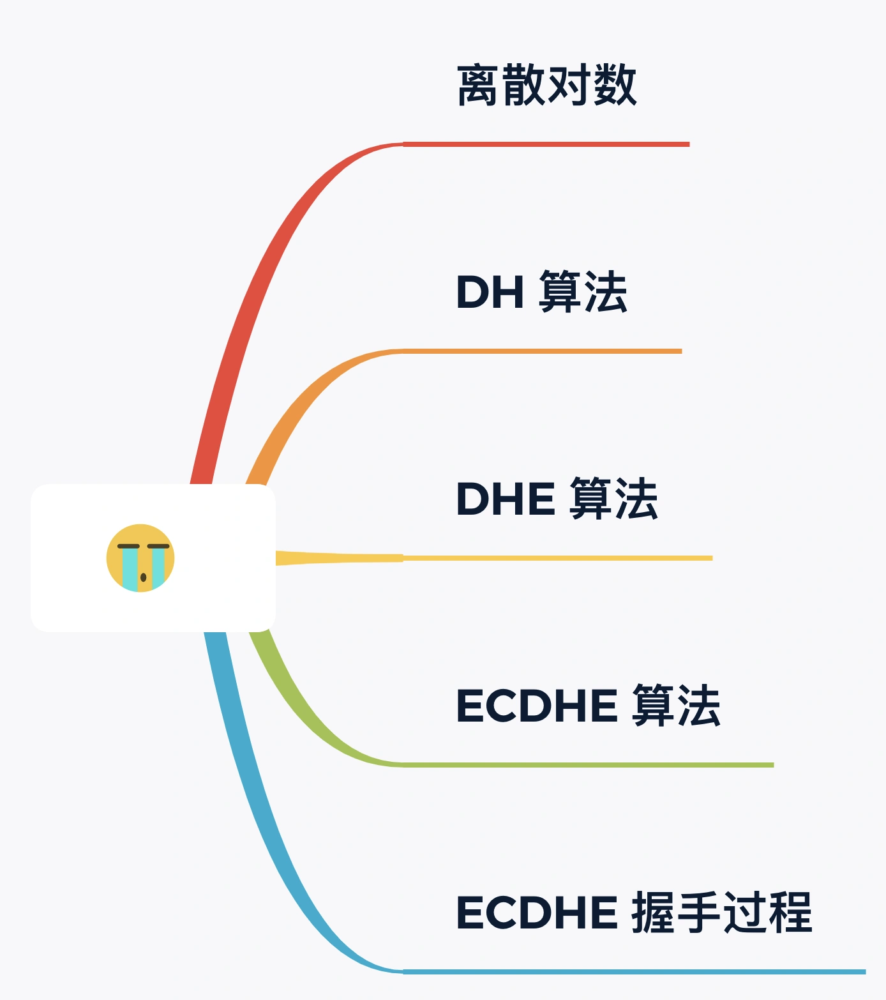

##  离散对数
ECDHE密钥协商算法是DH算法演进过来的，所以我们先从DH算法说起。

DH算法是非对称加密算法，因此它可以用于密钥交换，该算法核心数学思想是离散对数。

离散对数是"离散+对数"的两个数学概念的组合，所以我们先来复习一遍对数。要说起对数，必然要说指数，因为他们是互为反函数，指数就是幂运算，对数是指数的逆运算。举个例子，如果已2作为底数，那么指数和对数的运算公式如下：
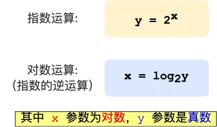
那么对于底数为2的时候，32的对数是5，64的对数是6，计算过程如下：
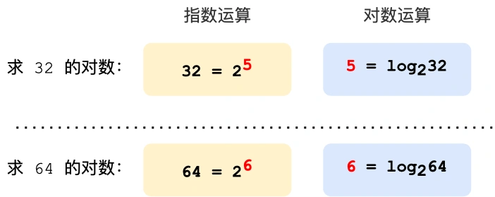
对数运算的取值是可以连续的，而离散对数的取值是可以连续的，因此也以离散而得名。

离散对数是在对数运算的基础上加了模运算，也就是取余数，对应编程语言的操作符是%，也可以用mod表示，离散对数的概念如下：
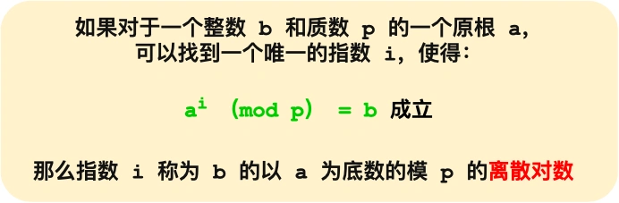
上图的，底数a和模数p是离散对数的公共参数，也就是说是公开的，b是真数，i是对数。知道了对数就可以用上面的公式求出真数，反过来，知道真数却很难求出对数。

特别是当模数p是一个很大的质数，即使知道底数a和真数b，在现有的计算机的计算水平是几乎无法求出离散对数的，这就是DH算法的数学基础。

##  DH算法
认识了离散对数，我们来看看DH算法是如何交换密钥。
现假设小红和小明约定使用DH算法来交换密钥，那么基于离散对数，小红和小明需要先确定模数和底数作为算法参数，这两个参数是公开的，用P和G表示。

然后小红和小明各自生成一个随机整数作为密钥，双方的密钥要各自严格保密，不能泄露，小红的私钥用a代称，小明的私钥用b代称。

现在小明和小红双方都有了P和G以及各自的私钥，于是就可以算出各自的公钥：
-   小红的公钥记作A：A=G^a(mod P)；
-   小明的公钥记作B：B=G^b(mod P)；

A和B也是公开的，因为根据离散对数的原理，从真数(A和B)反向计算出a和b是非常困难的，至少现有的计算机的计算能力是无法破解的，如果量子计算机出来了，那就有可能破解了，当然如果量子计算机真的出来了，那么密钥协商算法就要做大的升级了。

双方交换公钥(A和B)后，小红手上共有5个数：A、B、a、P、G；小明手上也有5个数：A、B、b、P、G；

然后小红执行运算：B^a(mod P)，其结果为K，因为离散对数的幂运算有交换律，所以小明执行运算：A^b(mod P)，得到结果也为K。
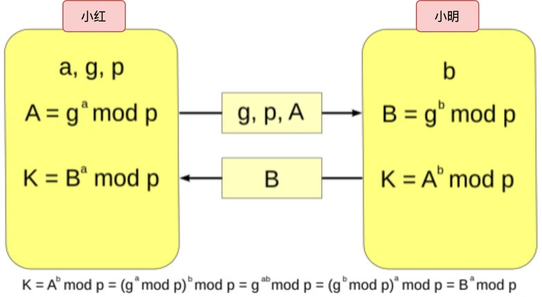
这个K就是小红和小明之间用于对称加密的密钥，可以作为回话密钥使用。

可以看到整个协商过程中，小红和小明公开了4个信息：A、B、G、P，其中，P、G是算法的参数，A和B是公钥，而a、b双方各自保管私钥，黑客无法获取这两个私钥，因此黑客只能从公开的A、B、P、G入手，计算出私钥(a、b)。

前面也多次强调，根据离散对数的原理，如果P是一个大数，在现有的计算机的计算能力是很难破解的。因此DH密钥交换是安全的。

##  DHE算法
根据私钥的生成方式，DH算法分为两种实现：
-   static DH，这个是已经被废弃了；
-   DHE算法，现在常用；

static DH算法里有一方的私钥是静态的，也就是说每次密钥进行协商的时候有一方的私钥都是一样的，一般是服务器固定，即a不变，客户端的私钥是随机生成的。

于是，DH交换密钥时就只有客户端的公钥是变化，而服务端的公钥不变，那么随着时间的延长，黑客就会截获海量密钥协商过程的数据，因为密钥协商的有些数据是公开的，黑客就会依据这些数据暴力破解出服务器私钥，然后就可以计算出会话密钥，于是之前截获的数据就会被破解，所以static DH算法不具备前向安全性。

既然固定一方的私钥有被破解的风险，那么干脆就让双方的私钥再每次密钥交换通信时，都是随机生成的、临时的，这个方式也就是DHE算法，E的全程是ephemeral(临时的)。

所以，即使有个牛逼的黑客破解了某一次通信过程的私钥，其他通信过程的私钥仍然是安全的，因为每个通信过程的私钥都是没有任何关系的，都是独立的，这样就保证了前向安全。

##  ECDHE算法
DHE算法由于计算性能不佳，因为需要做大量的乘法，为了提成DHE算法的性能，所以就出现了现在广泛用于密钥交换的算法--ECDHE算法

ECDHE算法是再DHE算法的基础上利用了ECC椭圆曲线特性，可以用更少的计算量计算出公钥，以及最终的会话密钥。

小红和小明使用ECDHE密钥交换算法的过程：
-   双方事先确定好使用那种椭圆曲线，和曲线上的基点G，这两个参数是公开的；
-   双方各自随机生成一个随机数作为私钥d，并与基点G相乘得到公钥Q(Q=dG),此时小红的公私玥为Q1和d1，小明的公私玥为Q2和d2；
-   双方交换各自的公钥，最后小红计算点(x1,y1)=d1Q2，小明计算点(x2,y2)=d2Q1，由于椭圆曲线上是可以满足乘法交换律和结合率的，所以有d1Q2=d1d2G=d2d1G=d2Q1,因此双方的X坐标是一样的，所以它是共享密钥，也就是回话密钥。

整个过程，双方的密钥都是随机的、临时生成的，都是不公开的，即使根据公开信息(椭圆曲线、公钥、基点G)也是很难计算出椭圆曲线上的离散对数(私钥)。

##  ECDHE握手过程
知道了ECDHE算法的基本原理后，我们就结合实际的情况来看看。

我们用wireshark工具抓到了ECDHE密钥协商算法的TSL握手过程，可以看到:
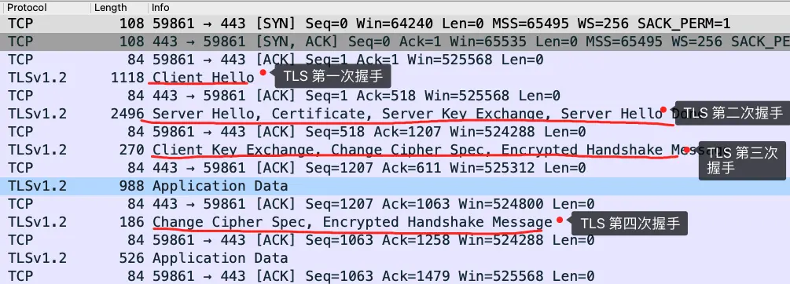
细心的小伙伴应该发现了，使用了ECDHE，在TLS第四次握手前，客户端就已经发送了加密的HTTP数据了，而对RSA过程，必须要完成TLS四次握手，才能传输应用数据。

所以，ECDHE相比RSA握手过程省去了一个消息往返的时间，这个有点抢跑的意思，它被称为是TLS false start，跟TCP fast open有点像，都是在连接没有完全建立前，就发送了应用数据，这样便提高了传输的效率。

接下来分析每一个ECDHE握手过程。

### TLS第一次握手
客户端首先会发送一个client hello消息，消息里面有客户端使用tls版本号，支持的密码套件列表，以及生成的随机数client random。
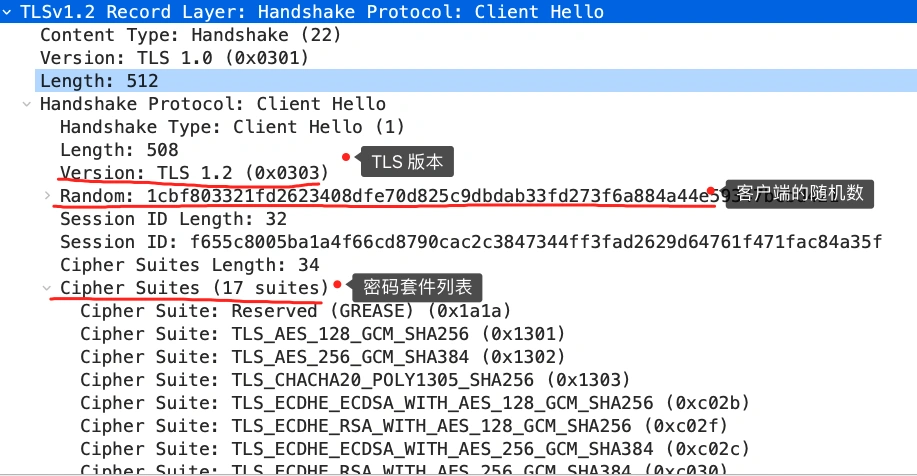

### TLS第二次握手
服务端收到客户端的clint hello消息后，也会返回server hello消息，消息里面有服务器确认的TLS版本号，也给出了一个随机数server random，然后客户端的密码套件列表选择了一个合适的密码套件。
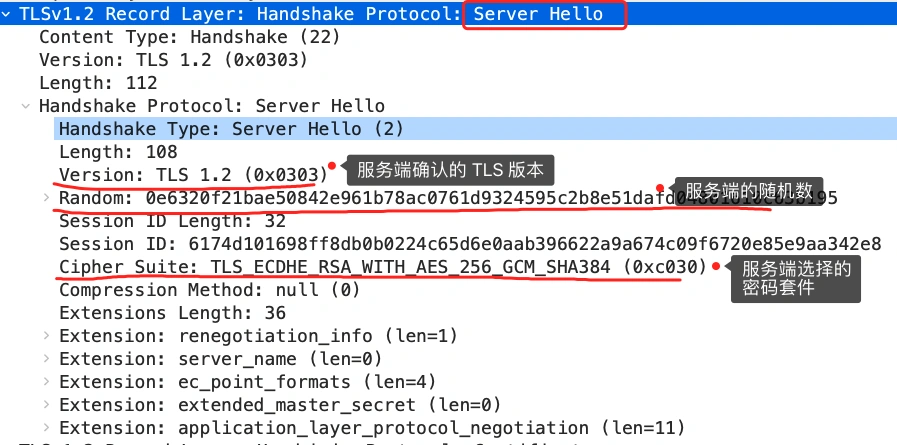
不过这次选择的密码套件和RSA不一样了，我们来分析一下这次的密码套件的意思：
「 TLS_ECDHE_RSA_WITH_AES_256_GCM_SHA384」
-   密钥协商算法使用ECDHE；
-   签名算法使用RSA；
-   握手后通信使用的AES对称算法，密钥长度为256，分组模式是GCM；
-   再要算法是SHA384；

接着，服务端为了证明自己的身份，发送了criticate消息，会把证书发送给客户端。
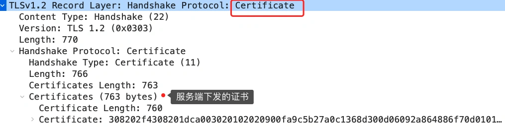
这一步就和RSA有很大的区别了，因为服务端选择了ECDHE算法，所以会再发送完证书后，发送server exchange消息。
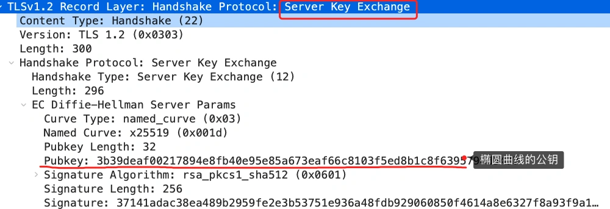
这个过程服务器做了三件事：
-   选择了名为x25519的椭圆曲线，选好了椭圆曲线相当于基点G也定好了，这些都会公开给客户端；
-   生成随机数作为服务器私钥，保留到本地；
-   根据基点G和私钥计算出服务器的椭圆曲线公钥，这个会公开给客户端；

为了保证这个椭圆曲线的公钥不被第三方篡改，服务端会用RSA签名算法给服务端的椭圆曲线的公钥做个签名；

随后，就是server hello done消息，服务端跟客户端表明，这些就是我提供的消息，打招呼完成。

至此，TLS两次握手就已经完成了，目前客户端和服务端通过明文共享了这几个信息：client random、server random、使用椭圆曲线、椭圆曲线基点G、服务端椭圆曲线公钥，这几个信息都很重要，是后续生成会话密钥的材料。

### TLS第三次握手
客户端收到了服务端证书后，自然是要校验证书的合法性，如果证书合法，那么服务端的身份就没有问题。随后，客户端会生成一个随机数作为椭圆曲线的私钥，然后在根据服务端前面给到的信息，生成客户端椭圆曲线公钥，然后再用client key exchange 消息发送给服务端。
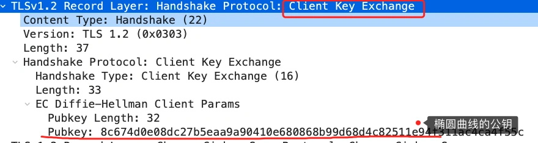
至此，双方都有对方的椭圆曲线公钥和自己的椭圆曲线公钥、椭圆曲线基点G。于是，双方就计算出点(x,y)，其中x坐标值双方都是一样的，前面说ECDHE算法的时候，说x是回话密钥，但实际应用中，x还不是最终的会话密钥。

还记得TLS握手阶段，客户端和服务端都会生成了一个随机数传递给对方吗？

最终的会话密钥，就是用"客户端随机数+服务器随机数+x(ECDHE算法算出的共享密钥)"三个材料生成的。

之所以要这么麻烦，是因为TLS设计者不信任客户端或服务端"伪随机数"的可靠性，为了保证真正的完全随机，把三个不可靠的随机数混合起来，那么随机的程度就会非常高，足够让黑客计算不出最终的会话密钥，安全性更高。

算好会话密钥后，客户端会发送一个change cipher spec 消息，告诉服务端后续改用对称算法加密通信。

接着，客户端就会发送Encypted Handshake Message消息，把之前的消息做个摘要，再用对称密钥加密一下，让服务端做个验证，验证一下本次生成的对称密钥是否可用。

### TLS第四次握手
最后服务端也会做同样的操作，发送change cipher spec 和encypted handshake message消息，如果双方都验证了加密和解密没有问题，那么握手正式完成，就可以正常收发加密的HTTP请求和响应了。

##  总结
RSA和ECDHE算法的区别：
-   RSA密钥协商算法不支持前向保密，ECDHE密钥算法支持前向保密；
-   使用了RSA密钥协商算法，TLS四次握手完成后才能进行应用数据传输，而对于ECDHE算法，客户端可以不用等服务端最后一次握手完成，就可以发送加密数据，节省了一个消息的往返时间；
-   使用ECDHE，在TLS第2次握手中，会出现服务器端发送的server key exchange消息，而RSA握手没有该消息。