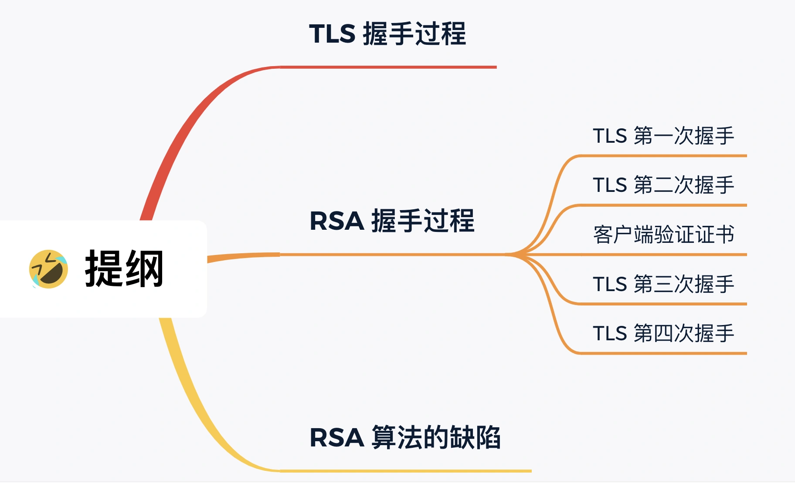
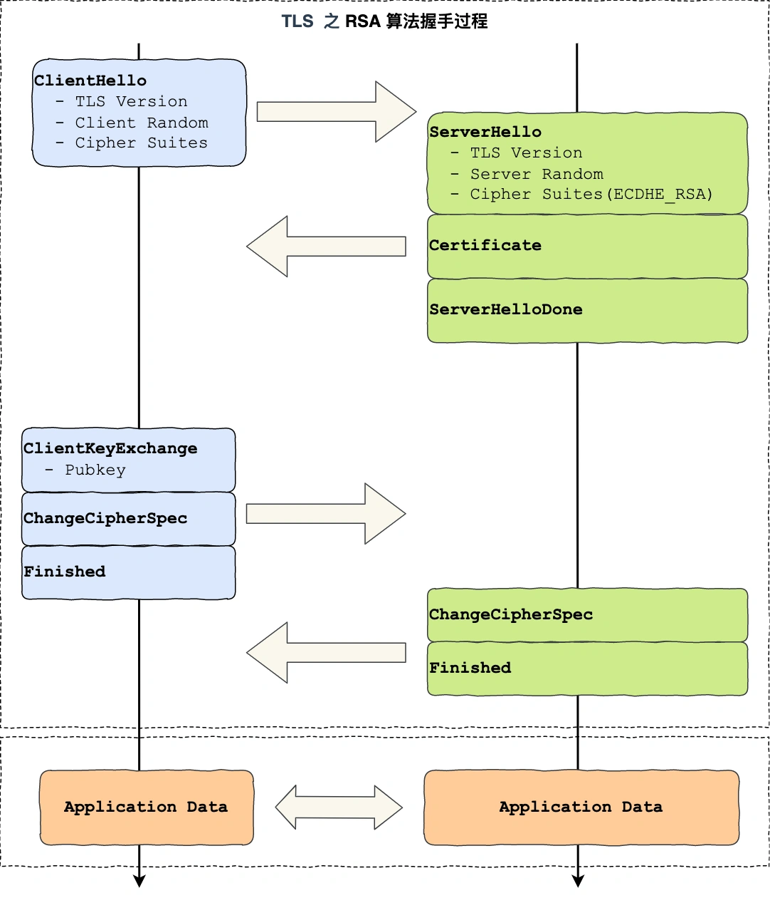
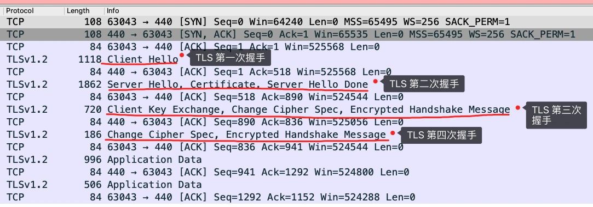
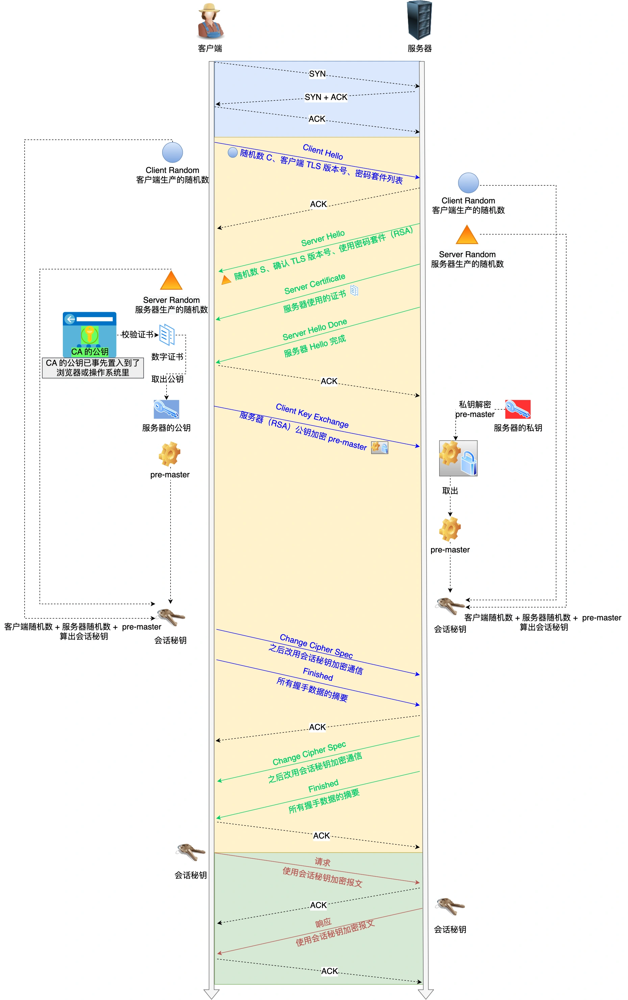
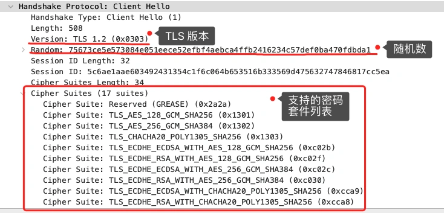
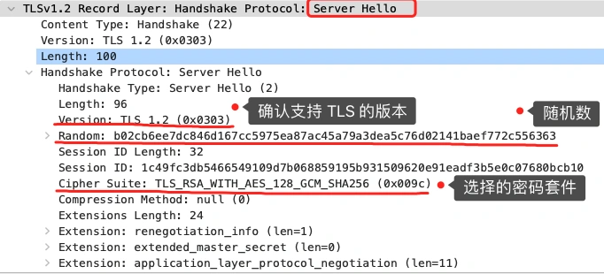
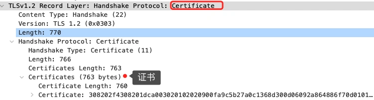
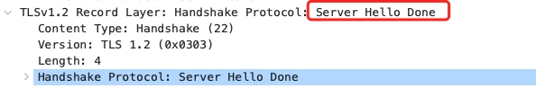

#   HTTPS握手解析

我们再来深入一下HTTPS，用实战抓包的方式，带大家窥探一次HTTPS

##  TLS握手过程
HTTP由于是明文传输，所谓的明文，就是说客户端服务器之间通信的信息都是肉眼可见的，随意使用一个抓包工具都可以截获的通讯内容。

所以安全上存在一下三个风险：
-   窃听风险：比如通信链路上可以获取通信内容。
-   篡改风险：比如强制植入广告，视觉污染。
-   冒充风险：比如冒充淘宝。

HTTPS在TCP和HTTP之间加入了TLS协议，来解决上述风险。

TLS是如何解决HTTP的风险的呢？
-   信息加密：HTTP交互信息是被加密的，第三方就无法被窃取。
-   校验机制：校验信息传输过程中是否有被第三方篡改过，如果被篡改过，则会有警告提示。
-   身份验证：证明淘宝是真淘宝。

可见有了TLS协议，能保证HTTP是安全的，那么再进行HTTP协议之前，需要先进行TLS握手，TLS握手的过程如下图：

上图简要概述了TLS的握手过程，其中每一个框都是一个记录，记录是TLS的收发数据的基本单位，类似与TCP的segment，多个记录可以组合成一个TCP包发送，所以通常经过四个消息就可以完成TLS握手，也就是两个RTT的时延，然后就可以在安全的通信环境里发送HTTP报文，实现HTTPS协议。

所以可以发现，HTTPS是应用层协议，需要先完成TCP三次握手，然后走TLS握手后，才能建立通信安全的连接。

事实上，不同的密钥交换算法，TLS握手的过程可能会有一些区别。

这里先简单介绍下密钥交换算法，因为考虑到性能的问题，所以双方在加密应用信息时使用的是对称加密密钥，而对称加密密钥是不能被泄露的，为了保证对称加密密钥的安全性，所以使用非对称加密的方式来保护对称加密密钥的协商，这个工作就是密钥交换算法负责的。

接下来我们就看看简单的RSA密钥叫换算法，来看看它的TLS的过程。

##  RSA握手过程
传统的TLS握手基本都是使用RSA算法来实现密钥交换的，在将TLS证书部署服务端时，证书其实就是服务端的公钥，会在TLS握手阶段传给客户端，。而服务端的私钥一直都在服务端，一定要确保私钥不能被窃取。

再RSA密钥协商算法中，客户端会产生随机密钥，并使用服务端的公钥加密后再传输给服务端，根据非对称加密算法，公钥加密的消息仅能通过私钥解密，这样服务端解密后，双方就得到了相同的密钥，再用它加密应用消息。

我们用wireshark工具抓了用RSA密钥交换的TLS握手过程，你从下面可以看到一共经历了四次握手：

对应wireshark抓包，下图和清晰的看到该过程：

那么接下来针对每一步进行介绍。

### TLS第一次握手
客户端首先会发送Client Hello消息，字面上我们能看到是跟服务器打招呼。

消息里面有客户端使用的TLS版本号，支持的密码套件列表，以及生成的随机数(client random)，这个随机数会被服务端保留，它是生成加密密钥的材料之一。

### TLS第二次握手
当服务端收到客户端发送的clienthello后，会确认TLS版本号是否支持，和从密码套件列表中选择一个密码套件，以及生成随机数(Server Random)

接着，返回Server Hello消息给客户端，消息里面有TLS版本号，也给出了一个随机数(Server Random)，然后客户端的密码套件列表选择了一个合适的密码套件。

可以看到，服务端选择的密码套件是“Cipher Suite: TLS_RSA_WITH_AES_128_GCM_SHA256”。

这个密码套件看起来真让人头晕，好大一串，但是其实它是有固定的格式和规范的，基本形式是：密钥交换算法+签名算法+对称加密算法+摘要算法，一般WITH前面有两个单词，第一个单词约定密钥交换算法，第二个单词是约定的证书验证算法。比如刚才密码套件的意思是：
-   由于WITH单词只有一个RSA，则说明握手时密钥交换算法和签名算法都是RSA；
-   握手之后通信使用的是AES对称加密算法，密钥长度是128位，分组模块是GCM；
-   摘要算法SHA256用于消息认证和产生随机数。

就前面这两个客户端和服务器互相打招呼的过程，客户端和服务器就已经确定了TLS的版本和使用的密码套件，而且你可能会发现客户端和服务端都各自会生成一个随机数，并且还会把随机数传给对方。

那这个随机数有啥用呢？其实这两个随机数都是后续作为生成回话密钥的条件，所谓的回话密钥数据传输时，所使用的对称加密密钥。

然后服务端为了证明自己的身份，会发送server certificate给客户端，这个消息里含有数字证书。

随后服务端发送了server hello done消息，目的是告诉客户端，我已经把该给你的东西都给你了，本次打招呼完毕。

### 客户端验证证书
客户端拿到了服务端的数字证书后，要怎么校验该数字证书是真实有效的呢？

### 数字证书和CA机构
在说数字证书是否可信的过程钱，我们先来看看数字证书包含了什么：
-   公钥；
-   持有者信息；
-   证书认证机构CA的信息
-   CA对着份文件的数字签名和使用的算法；
-   证书有效期；
-   还有一些额外信息；

那数字证书的作用使用来认证公钥持有者的身份，以防止第三方的冒充。说简单些，就是告诉客户，该服务端是合法的，因为只有证书合法，才代表服务端是可信的。