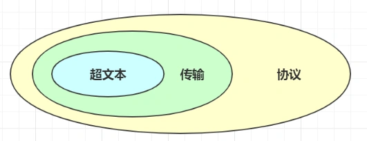
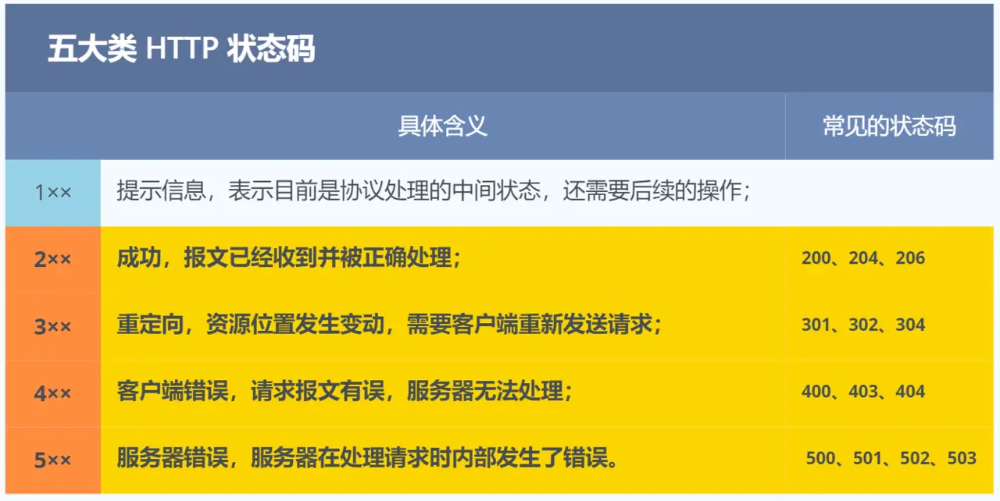
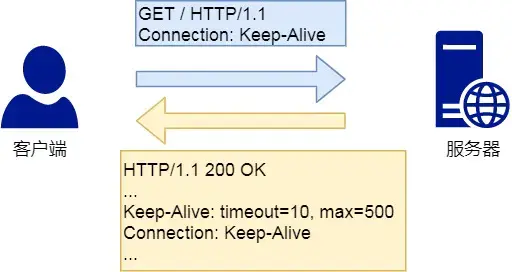
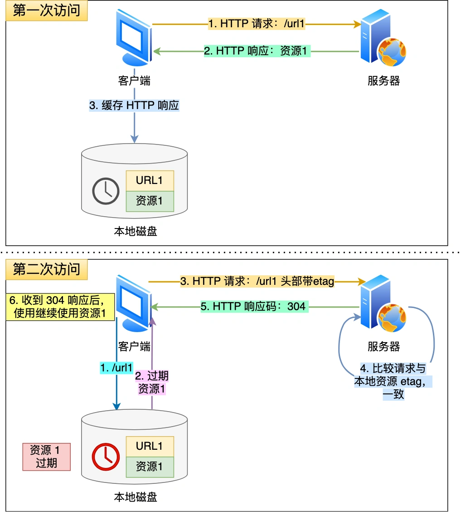
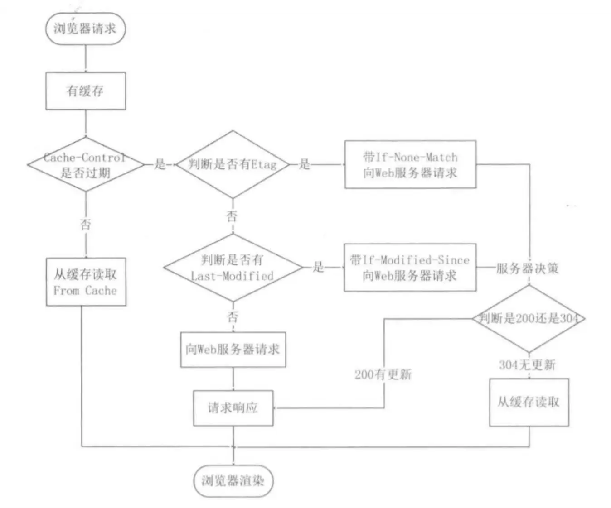
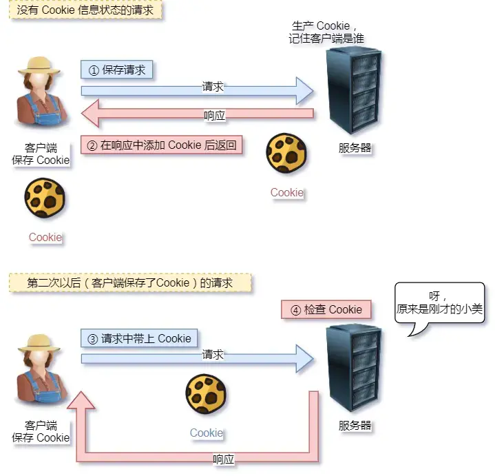
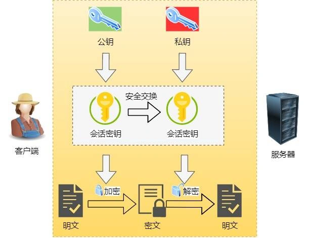
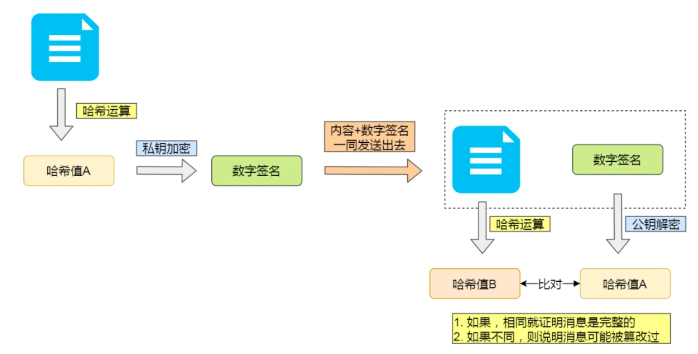

#   HTTP 常见面试题
在面试过程中，HTTP被提问的概率还是比较高的。
将常见面试题分为6大类：
1.  HTTP基础概念
2.  Get和Post
3.  HTTP特性
4.  HTTP缓存技术
5.  HTTPS与HTTP
6.  HTTP1.1、HTTP2、HTTP3演变


##  1.  HTTP 基本概念
HTTP是什么？
HTTP是超文本传输协议，也就是HeyperText transfer protocol
>   能否详细解释超文本传输协议

HTTP的名字超文本传输协议，它可以拆成三个部分：
-   超文本
-   传输
-   协议


1.  协议

HTTP是一个计算机里的协议，它使用计算机能够理解的语言确立了一种计算机之间交流通信的规范，以及相关的各种控制和错误处理方式。

2.  传输
HTTP是一个双向传输协议。HTTP 是一个在计算机世界里专门用来在两点之间传输数据的约定和规范。

3.  超文本
HTTP传输的内容是超文本。HTTP是一个在计算机世界里专门再两点之间传输文字、图片、视频、音频等超文本数据的约定和规范。
>   那HTTP是用于从互联网服务器传输超文本到本地浏览器的协议，这种说法正确吗？
> 这种说法是不正确的，因为也可以是服务器<-->服务器，所以采用两点之间更为准确。

### HTTP有那些状态码？

-   1xx类状态码属于提示信息，是协议处理中的一种中间状态，实际用到的比较少。
-   2xx类状态码表示服务器成功处理了客户端的请求，也是我们最愿意看到的状态。
    -   200 OK是最常见的成功状态码，表示一切正常，如果是非HEAD请求，服务器返回的响应头都会有body数据。
    -   204 NO Content 也是常见的成功状态码，与200 OK基本相同，但响应头没有body
    -   206 Partial Content 是应用与HTTP分块下载或断点传续传，表示响应的body不是资源的全部，而是其中的一部分，也是服务器处理成功的状态。

-   3xx类状态码表示客户端请求的资源发生了变动，需要客户端用新的URL重新发送了请求获取资源，也就是重定向。
    -   301 Moved Permanently 表示永久重定向，说明请求的资源已经不在了，需改用新的URL在此访问。
    -   302 Found 表示临时重定向，说明资源还在，但暂时需要另一个URL来访问。

    301和302都会再响应头里使用字段location，指明后续要跳转的URL，浏览器会自动重定向新的URL。

    -   304 Not Modified 不具有跳转的含义，表示资源未修改，重定向已存在的缓冲文件，也成缓存重定向，也就是告诉客户端可以继续使用缓存资源，用于缓存控制

-   4xx 类状态码表示客户端发送的报文有误，服务器无法处理，也就是错误码的含义
    -   400 bad request 表示客户端请求的报文有错误，也就是个笼统的错误。
    -   403 forbidden 表示服务器禁止访问资源，并不是客户端的请求出错。
    -   404 not found 表示请求的资源在服务器上不存在或者未找到，所以无法提供给客户端。

-   5xx 类状态码表示客户端请求报文正确，但是服务器处理时内部发生错误，属于服务器端的错误
    -   500 internal server error 与400类似，是个笼统错误，服务器发生了什么错误，我们并不知道。
    -   501 not implement 表示客户端请求的功能还不支持，类似即将开业，敬请期待的意思。
    -   502 bad gateway 通常是服务器作为网关或代理时的错误码，表示服务器自身工作正常，访问后端服务器发生了错误。
    -   503 server unavailable 表示服务器当前很忙，暂时无法想用客户端，类似服务器正忙，请稍后重试的意思。

### HTTP字段有哪些？
-   host字段：客户端发来请求时，用来指定服务器的域名
```
Host: www.A.com
```
有了Host字段，就可以将请求发往同一台服务器上的不同网站。

-   Content-Length字段
服务器在返回数据时，会有Content-Length字段，表明本次回应的数据长度。

-   Connections字段
Connections字段常用于客户端要求服务器使用TCP持久连接，以便其他请求复用。

HTTP/1.1 版本的默认连接都是持久连接，但为了兼容老版的HTTP，需要指定Connections首部字段的值为Keep-alive。
```
Connection: keep-alive
```
一个可以复用的TCP连接就建立了，直到客户端或服务器主动关闭连接，但是不是标准字段。

-   Content-Type字段：用于服务器回应时，告诉客户端，本次数据内容是什么格式。
```
Content-Type: text/html; charset=utf-8
```
上面的类型表示发送的是网页，而且编码是UTF-8。
客户端发送请求的时候，可以使用Accept字段表明自己可以接受哪些数据格式。
```
Accept:*/*
```
上面的代码表示可以接受任何格式的数据。

-   Content-Encoding字段：说明数据的压缩方法，表示服务器返回的数据使用了什么压缩格式。
```
Content-Encoding: gzip
```
上面表示服务器返回的数据采用gzip方式压缩，告知客户端需要采用此方式解压。
客户端在请求数据时，用Accept-Encoding字段说明自己可以接受那些压缩方式。
```
Accept-Encoding: gzip, deflate
```

### Get和Post的区别
根据RFC规范，GET的语义是从服务器获取指定的资源，这个资源可以是网页、图片、音频、视频等，GET请求的参数一般写在URL中，URL规定只能支持ASCII，所以GET请求参数只允许ASCII字符，而且浏览器会对URL的长度有限制(HTTP协议本身对URL长度做任何规定)。

根据RFC规范，POST的语义是根据请求负荷(报文body)对指定的资源做出处理，具体的处理方式视资源类型而不同。POST请求携带数据的位置一般是写在报文的Body中，body中的数据可以是任何格式的数据。只要客户端和服务端协商好即可，而且浏览器不会对body大小做出限制。

### GET和POST方法都是安全和幂等的吗？
先说明下安全和幂等的概念：
-   在HTTP协议里，所谓的安全是指请求方法不会破坏服务器上的资源
-   所谓幂等，意思是多次执行相同的操作，结果都是相同的。

如果从RFC规范定义的语义来看
-   GET方法就是安全且幂等的，因为它只是读操作，无论操作多少次，服务器上的数据都是安全的，且每次的结果都是相同的。所以可以对GET请求的数据做缓存，这个缓存可以做到浏览器本身上(彻底避免浏览器发请求)，也可以做到代理上，而且在浏览器中GET请求可以保存为书签。
-   POST因为是新增或提交数的操作，会修改服务器上的资源，所以不是安全的，且多次提交可能会创建多个资源，所以不是幂等的。所以浏览器一般不会缓存POST请求，也不能把POST请求作为书签。

做个简要小结：
GET的语义是获取指定资源的，GET的方法是安全、幂等、可被缓存的。
POST的语义是根据请求负荷（报文主体）对指定资源做出的处理，具体的方式视资源类型而不同。POST不安全，不幂等，不可缓存。

注意，上面是从RFC规范定义的语义来分析的。

但实际过程中，开发者不一定会按照RFC规范定义的语义来实现GET和POST方法。比如：
-   可以用GET方法实现新增或删除数据的请求，这样实现的GET就不安全和幂等。
-   可以用POST方法来实现查询数据的请求，这样POST就是安全和幂等的。

曾经有个笑话，有人写了个博客，删除博客用的是GET请求，他觉得没人访问就连鉴权都没做，然后google服务器爬虫爬了一遍，他所有的文章都没有了。。。

如果安全放入概念是指信息被泄露的话，虽然POST用body传输数据，而GET用URL传输，这样数据会在浏览器地址栏容易看到，但是并不能说明GET不如POST安全。

因为HTTP传输数据都是明文的，虽然在浏览器地址栏看不到POST提交的body数据，但是只要抓个包就能看到了。

所以，要避免传输过程中数据被窃取，就要使用HTTPS协议，这样所有的数据都会被加密传输。

>   GET请求可以带body吗？
RFC 规范并没有规定GET是不能带body的，理论上，任何请求都可以带上body，只是因为RFC规范定义的GET请求是获取资源，所以根据这个语义是不需要用到body。

另外，URL中查询参数也不是GET所独有的，POST也可以带上URL参数。

## HTTP缓存技术
### HTTP缓存有哪些实现方式？
对于一些具有重复性的HTTP请求，比如每次请求得到的数据都一样，我们可以把这对请求-响应的数据缓存到本地，那么下次就直接读取本地的数据，不必再通过网络获取服务器的响应了，这样的话HTTP1.1的性能肯定肉眼可见的提升。

所以避免发送HTTP请求的方法就是通过缓存技术，HTTP设计者早在之前就考虑到了这点，因此HTTP协议头部有不少字段是针对缓存处理的。
HTTP缓存实现有两种：**强制缓存**和**协商缓存**

### 什么是强制缓存
强缓存指的是只要浏览器判断缓存没有过期，则直接使用浏览器本地缓存，决定是否使用缓存的主动性浏览器这边。

在下图中，返回的状态码是200，但是在size项中标识的是from disk cache，就是使用了强制缓存。

强制缓存是利用下面这两个HTTP响应头部(response header)字段实现的，它们都用来表示资源在客户端上的有效期：
-   Cache-Control：是一个相对时间；
-   Expire：是一个绝对时间。

如果HTTP响应头部同时有Cache-Control和Expire字段时，Cache-Control的优先级高于Expire。

Cache-Control选项更多一些，设置更加精细，所以建议使用Cache-Control来实现强缓存，具体的实现流程如下：
-   当浏览器第一次请求访问服务器资源时，服务器在返回这个资源的同时，在Response头部加上Cache-Contrl，Cache-Control中设置了过期时间的大小；
-   浏览器再次访问服务器请求该资源时，会先通过请求资源的时间与Cache-Control中设置的过期时间大小，来计算出资源是否过期，如果没有则使用该缓存，否则重新请求服务器；
-   服务器再次收到请求后，会再次更新Response头部的Cache-Control。

### 什么是协商缓存？
当我们在浏览器使用开发者工具的时候，你可能会看到某些请求的响应码是304，这个是告诉浏览器可以使用本地缓存的资源，通常这种通过服务端告知客户端是否可以使用缓存的方式被称为协商缓存。

上图就是一个协商缓存的过程，所以协商缓存就是与服务器协商后，通过协商结果来判断是否使用本地缓存。

协商缓存可以基于两种头部来实现。

第一种：请求头部的If-Modified-sinse字段与响应头部中的Last-Modified字段实现，这两个字段的意思是：
-   响应头部中的Last-Modified：表示这个响应资源的最后修改时间；
-   请求头部中的If-Modified-Sinse：当资源过期了，发现响应头中具有Last-Modified申明，则再次发起请求的时候带上Last-Modified的时间，服务器收到请求后，发现有If-Modified-Sinse则与被请求的资源的最后修改时间进行对比（Last-Modified），如果最后的修改时间比较新(大)，说明资源又被修改过，则返回新的资源，HTTP200PK；如果最后的修改时间比较旧，说明资源无修改，应用HTTP304走缓存。

第二种：请求头部中的If-None-Match字段与响应头部中的Etag字段，这两个字段的意思是：
-   响应头部中Etag：唯一表示响应资源；
-   请求头部中的If-None-Match：当资源过期时，浏览器发现响应头里有Etag，则在此向服务器发起请时，会将If-None-Match字段设置为Etag的值，服务器收到请求后进行对比，如果资源没有变化返回304，如果资源变化了返回200。

第一种是基于时间实现的，第二种实现方式是基于一个唯一的标识，相对来说后者更加准确的判断内容文件是否被修改，避免由于时间篡改导致的不可靠问题。

如果在第一次请求资源的时候，服务器返回的HTTP响应头部同时有Etag和Last-Modified字段，那么客户端再下一次请求的时候，如果带上了Etag和Last-Modified字段信息 给服务端，这是Etag的优先级会更高，也就是服务端会先判断Etag是否变化了，如果Etag变化了，就不在判断Last-Modified了，如果没有变化然后再看看Last-Modified。

### 为什么Etag的优先级更高？
这是因为Etag主要解决了Last-Modified几个比较难以解决的问题：
1.  在没有修改文件内容的情况下文件的最后修改时间也可能会改变，这回导致客户端任务这个文件被改动了，从而重新请求。
2.  可能有些文件是在秒级内修改的，If-Modified-Sinse能检查到的粒度是秒级的，使用Etag就能保证这种需求下客户端在1秒内刷新多次。
3.  有些服务器不能精确获取文件最后的修改时间。

注意，协商缓存这两个字段必须要配合强制缓存中的Cache-Control字段来使用，只有在未能命中强制缓存的时候，才能发起协商缓存字段的请求。

下图是强制缓存和协商缓存的工作流程：

当使用Etag字段实现协商缓存的过程：
-   当浏览器第一次访问服务端资源时，服务器会在返回这个资源的同时，再Response头部加上Etag唯一标识，这个唯一标识的值是根据当前请求的资源生成的。
-   当浏览器在此访问服务器请求该资源时，首先会检查该缓存是否过期；
    -   如果没有过期，则直接使用本地的缓存；
    -   如果过期了，会在request头部添加If-None-Match字段，该字段的值就是Etag唯一标识；
-   服务器再次收到请求后，会根据请求中的If-None-Match字段的值与当前请求的资源生成的唯一标识进行对比：
    -   如果值相等，则返回304 Not Modified，不会返回资源；
    -   如果值不相等，则返回200 OK状态码和资源，并在Response头部加上新的Etag唯一标识；
-   如果浏览器收到304响应码，则会从本地加载缓存资源，否则更新资源。

### HTTP特性
HTTP1.1 有点有哪些？
HTTP最突出的有点就是简单、灵活和易于扩展、应用广泛和跨平台；

1.  简单
HTTP的基本报文格式就是Header+body，头部也是key-value简单文本的形式，易于理解和降低了学习使用门槛。

2.  灵活和易于扩展
HTTP协议里的各类请求方法、URI和RUL、状态码、头字段等每个组成要求都没有被固定死，都允许开发人员自定义和扩充。

3.  应用广泛和跨平台
互联网发展至今，HTTP的应用范围非常广泛，从台式机的浏览器到收集上的APP，从看新闻、刷贴吧到购物、理财、吃鸡，HTTP的应用遍地开花，同时天然具有跨平台的优越性。

HTTP1.1有哪些缺点？
HTTP里有些优缺点一体的双刃剑，分别是无状态、明文传输，同时还有一大缺点不安全。
1.  无状态
无状态的好处，因为服务器不会去记忆HTTP状态，所以不需要额外的资源来记录信息，这能减轻服务器的负担，能够把更多的CPU和内存用来对外提供服务。

无状态的坏处，既然服务器没有记忆能力，它在完成有关联的操作是非常麻烦。

例如：登录->添加购物车->下单->结算->支付，这系列操作都需要用户身份才行，但服务器不知道这些请求是有关联的，每次都要问一遍身份信息。

这样每操作一次，都要验证身份信息，这样的购物还能愉快吗？

对于无状态的问题，解决方案有很多种，其中比较简单的方式用cookie技术。
Cookie通过再请求和响应报文中写入Cookie信息来控制客户端的状态。

相当于，在客户端第一次请求以后，服务端会下发一个装有客户信息的小贴纸，后续客户端请求服务器的时候，带上小贴纸，服务器就能认得了。


2.  明文传输
明文意味着在传输过程中的信息，是可以方便阅读的。比如wireshark抓包都可以肉眼直接查看，为我们调试工作带来了极大的便利性。

但是正是这样，HTTP的所有信息都暴露在光天化日之下，相当于信息裸奔。在传输的漫长过程中，信息的内容都毫无隐私可言，很容易就能被窃取，如果你们有你的账号密码信息，那你的账号就没了。

3.  不安全
HTTP比较严重的缺点就是不安全：
-   通信使用明文，内容可能会被窃取，比如账号信息泄露了，那你号没了。
-   不验证通信方的身份，因此有可能会遭遇伪装。比如访问假的淘宝、平多多，你钱没了。
-   无法验证明文的完整性，所以有可能被篡改，比如网页植入垃圾广告、视觉污染，眼没了。

HTTP的安全问题，可以用HTTPS的方式解决，也就是引入SSL/TLS层，使得在安全上达到极致。

### HTTP1.1的性能如何？
HTTP是基于TCP/IP，并且使用请求-应答模式，所以性能的关键就在这里。
1.  长连接
早期HTTP1.0性能上有很大的问题，那就是每发起一个请求，都要建立一个TCP连接，而且是串行请求，做了无畏的TCP的连接和断开，增加了通信开销。

为了解决上述TCP连接问题，HTTP1.1提出了长连接的通信方式，也叫持久连接。这种方式的好处在于减少了TCP连接的重复建立和断开所造成的的额外开销，减轻了服务端的负载。

持久连接的特点是，只要任意一一端没有提出断开连接，则保持tcp连接状态。

当然，如果某个HTTP长连接超过一定时间没有任何数据交互，服务端就会主动断开这个连接。

2.  管道网络传输
HTTP1.1采用了长连接的方式，这使得管道网络传输成了可能。

即在同一个TCP连接里，客户端可以发起多个请求，只要第一个请求发送除去了，不必等其他回来，就可以再发第二个请求出去，可以减少整体的响应时间。

举例来说：客户端需要请求两个资源，以前的做法是，在同一个TCP连接里面，先发送A请求，然后等待服务器做出响应之后，才能发第二个请求，。那么管道机制则是允许浏览器同时发出请求A和请求B，但是服务器必须按照接收请求的顺序来发送对这些管道的响应。如果服务器端再请求A时耗时比较长，那么后续的请求就会被阻塞住，这称为队头阻塞。

所以，HTTP1.1解决了请求的队头阻塞，没有解决响应的队头阻塞。

>   TIP:注意！
>  
>   实际上HTTP1.1管道化技术是默认不开启的，而且浏览器基本都没有支持，所以后面的章节讨论HTTP1.1都是建立再没有管道的基础的前提上的。大家知道有这个功能，**但是没有使用就行了。**

3.  队头阻塞
请求-应答加剧了HTTP的性能问题。

因为顺序发送的请求序列中的一个请求因为某些原因被阻塞，在后面排队的请求都没阻塞，会导致客户端一直请求不到数据，这也就是队头阻塞，好比上班路上的塞车。

总之HTTP1.1性能一般般，后续的HTTP2和HTTP3就是在优化HTTP性能。

## HTTP和HTTPS
### HTTP和HTTPS有哪些区别？
1.  HTTP是超文本传输协议，信息是明文传输，存在安全风险的问题，HTTPS解决了HTTP不安全的问题，在TCP和HTTP网络协议之间加入了TLS/SSL 安全协议，使得报文 能够加密传输。
2.  HTTP建立相对简单，TCP三次握手之后，便可以进行HTTP的数据传输，而HTTPS在TCP三次握手之后，还需要进行SSL/TLS的握手过程，才可以加密报文传输。
3.  HTTP的端口是80，HTTPS的端口是443。
4.  HTTPS协议需要向CA(证书权威机构)申请数字证书，来保证服务器的身份是可信的。

### HTTPS解决了HTTP的那些问题？
HTTP由于是明文传输，所以安全上存在以下三个风险：
-   窃听风险：比如通信链路上可以获取通信内容，用户号容易没。
-   篡改风险：比如强制植入广告，视觉污染，用户眼容易瞎，
-   冒充风险：比如冒充淘宝网站，用户钱容易没。

HTTPS在HTTP和TCP之间加入了SSL/TLS协议，可以很好的解决上述风险：
-   信息加密：交互信息无法被窃取，但你的号会因为自身忘记账号而没。
-   校验机制：无法篡改内容，篡改了就不能正常显示，但百度竞价排名依然可以搜索到垃圾广告。
-   身份证书：证明淘宝网站是真的淘宝，但你的钱还是会因为你的剁手而没。

HTTPS是如何解决上述三个风险的？
-   混合加密的方式来实现机密性，解决了窃听的风险。
-   摘要算法的方式来实现完整性，它能够为数据生成独一无二的指纹，指纹用于校验数据的完整性。解决了篡改的风险。
-   将服务器公钥放入到数字证书中，解决了冒充的风险。

1.  混合加密
通过混合加密方式可以保证信息的机密性，解决了窃听的风险。

HTTPS通过对称加密和非对称加密结合的混合加密方式：
-   在通信建立前采用非对称加密的方式交换回话密钥，后续就不再使用非对称加密。
-   在通信过程中采用对称加密的会话密钥的方式加密密文数据。

采用混合加密的方式的原因：
-   对称加密只使用一个密钥，运算速度较快，密钥必须保密，无法做到安全的密钥交换。
-   非对称加密使用两个密钥，公钥和私钥，公钥可以任意分发，而私钥保密，解决了私钥交换问题但是速度慢。

2.  摘要算法+数字签名
为了保证传输的内容不被篡改，我们需要对内容计算出一个指纹，然后同内容一起传输给对方。对方收到后，先是对内容也计算出一个指纹，然后跟发送方的指纹进行对比，如果指纹相同，说明没有被篡改，否则就可以判断出被篡改了。

那么，在计算机里会用摘要算法(hash算法)来计算出内容的hash值，也就是内容的指纹，这个hash值是唯一的，且无法通过hash值推到出内容。

通过hash算法可以确保内容不被篡改，但是并不能保证内容+hash值不被中间人替换，因为这里缺少对客户端收到的消息是否来源于服务端的证明。

举个例子，你想向老师请假，一般来说是要求家长写一份请假理由和签名，老师才能允许请假。
但是你有模仿你爸爸字迹的能力，你用你爸爸的字迹写了一份请假理由和签上你爸爸的名字，老师一看到这个请假条，查看字迹和签名，就误以为是你爸爸写的，就会允许你请假。

那作为老师，要如何避免这种情况发生呢？现实生活中，可以通过电话或者视频来确认情况是否属实。但是在计算机的世界中可没有这种操作。

为了避免这种情况，计算机会使用非对称加密算法来解决，共有两个密钥：
-   一个是公钥，这个是可以公开给所有人的。
-   一个是私钥，这个必须由本人管理，不可泄露。

这两个密钥是可以双向解密的，比如可以用公钥加密内容，然后用私钥解密，也可以用私钥加密内容，公钥解密内容。

流程不同，意味着目的也不同：
-   公钥加密，私钥解密：这个目的是为了保证内容传输的安全，因为公钥加密的内容，其他人是无法解密的，只有持有私钥的人，才能解密。
-   私钥加密，公钥解密：这个目的是为了保证消息不会被冒充，因为私钥是不可泄露的，如果公钥能正常解密出私钥加密的内容，就能证明这个消息是来源于持有私钥的人发送的。

一般我们不会对非对称加密来加密实际的内容，因为非对称加密的计算是比较耗费性能的。

所以非对称加密的主要用途在于通过私钥加密，公钥解密的方式，来确认消息的身份，我们常说的数字签名的算法，就是用这种方式，不过私钥加密的内容不是内容本身，而是对内容的hash加密。

私钥是有服务端保管，然后服务端会向客户端办法对应公钥，如果客户端收到的消息，能被公钥解密，就说明该消息是由服务端发送的。

引入了数字签名算法后，你就无法模仿你爸爸的字迹来请假了，你爸爸手上持有密钥，你老师持有公钥。

这样只有你爸爸手上的私钥才能对请假条进行签名，老师通过公钥看能不能解出这个签名，如果能解出这个签名，并且确认内容完整性，就能证明这是由你爸爸发起的请假条，这样老师才允许你请假，否则老师不认。

3.  数字证书
前面我们知道：
-   通过hash算法来保证消息的完整性。
-   通过数字签名来保证消息来源的可靠性(能确认消息是由私钥的一方发送的)。

但是这还远远不够，还缺少身份验证的环节，万一公钥是被伪造的呢？
还是拿请假的例子，虽然你爸爸有私钥，老师来通过能否用公钥解密来确认这个请假条的来源是否是你爸爸。

但是，我们还可以伪造出一对公钥。
你找了个夜晚，偷偷把老师桌面上和你爸爸配对的公钥换成了你的公钥，那么下次在你请假的时候，你继续模仿你爸爸的字迹写了个请假条，然后用你的私钥做了个数字签名。

但是老师并不知道公钥被你替换过了，所以他还是跟往常一样用公钥解密，由于这个公钥和你的私钥是配对的，老师当然能用这个被替换过的公钥解密出来，并且确认了内容的完整性

