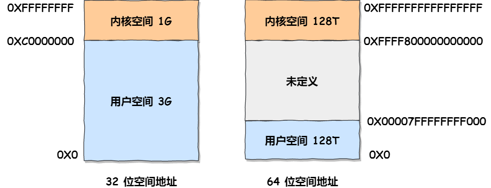

#   malloc是如何分配内存的
这次我们以malloc动态内存分配位切入点，来具体分析：
-   malloc是如何分配内存的？
-   malloc分配的是物理内存吗?
-   malloc(1)会分配多大内存？
-   free释放内存，会归还给操作系统吗？
-   free()函数只传入一个内存地址，为什么能知道要释放多大内存？

##  Linux内存分布长啥样？
在linux系统中，虚拟地址空间的内部有分为内核空间和用户空间两部分，不同位数的系统，地址空间的范围也不相同，比如最常见的32位和64位系统，如下所示：

通过这里可以看出：
-   32位系统的内核空间占用1G，位于最高处，剩下的3G是用户空间。
-   64位系统的内核空间和用户空间都是128T，分别占据整个内存空间的最高位和最低位，剩下的中间部分是未定义的。

再来说说，用户空间和内核空间的分别：
-   进程在用户态时，用户只能访问用户空间内存。
-   进程进入内核态时，才能访问内核空间的内存。

虽然每个进程都各自有独立的虚拟内存，但是每个虚拟内存中的内核地址，其实关联的都是相同的物理内存，这样进程切换到内核态后，就可以很方便的访问内核空间内存。

接下来进一步了解虚拟空间的划分情况，用户空间和内核空间的划分是不同的，内核空间的分布情况就不多说了。

我们来看看用户空间的划分情况，已32位系统为例，我画了一张图来表示他们的关系。
通过这张图可以看到，用户空间内存从低到高分别是6种不同的内存段：

-   程序文件段，包括二进制可执行代码；
-   已初始化数据段，包括静态常量；
-   未初始化数据段，包括未初始化的静态常量；
-   堆段，包括动态分配的内存，从低地址开始向上增长；
-   文件映射段，包括动态库、共享内存等，从低地址开始向上增长(跟硬件和内核有关)；
-   栈段，包括局部变量和函数调用的上下文等，栈的大小是固定的，一般是8M，当然系统也提供了参数，以便我们自定义大小；

在这 6 个内存段中，堆和文件映射段的内存是动态分配的。比如说，使用 C 标准库的 malloc() 或者 mmap() ，就可以分别在堆和文件映射段动态分配内存。

##  malloc是如何分配内存的？
实际上malloc并不是系统调用，而是C库里的函数，用于动态分配内存；

malloc申请内存的时候，会有两种方式向操作系统申请堆内存。

-   方式一：通过brk()系统调用从堆分配内存；
-   方式二：通过mmap()系统调用在文件映射区分配内存；

方式一实现的方式很简单，就是通过brk()函数将堆顶指针向高地址移动，获得新的内存空间，如下图：

方式二通过mmap系统调用中私有匿名映射的方式，在文件映射区分配一块内存，也就是从文件映射区偷了一块内存。如下图：


>   什么场景下malloc()会通过brk分配内存？又是什么场景下通过mmap()分配内存？

malloc源码里默认定义了一个阈值：
-   如果用户分配的内存小于128KB，则通过brk()申请内存；
-   如果用户分配的内存大于128kb，则通过mmap()申请内存；

注意，不同的glib版本定义的阈值也是不同的。

##  malloc()分配的是物理内存吗？
不是的，malloc分配的是虚拟内存。

如果分配后的虚拟内存没有被访问的话，虚拟内存是不会映射到物理内存的，这样就不会占用物理内存了。

只有在访问已分配的虚拟地址空间的时候，操作系统通过查找页表，发现虚拟内存对应的页没有在物理内存中，就会触发缺页中断，然后操作系统会建立虚拟内存和物理内存之间的映射关系。

##  malloc(1)会分配多大的虚拟内存？
malloc在分配内存的时候，并不是老老实实按用户预期申请的字节数来分配内存空间大小，而是会预分配更大的空间作为内存池。

具体会预分配多大的空间，跟malloc使用的内存管理器有关系，我们就以malloc默认的内存管理器(Ptmalloc2)来分析。

接下来，做个实验，用下面的代码，通过malloc申请1字节的内存时，看看操作系统实际分配了多大的空间。
```c
#include <stdio.h>
#include <malloc.h>

int main() {
  printf("使用cat /proc/%d/maps查看内存分配\n",getpid());
  
  //申请1字节的内存
  void *addr = malloc(1);
  printf("此1字节的内存起始地址：%x\n", addr);
  printf("使用cat /proc/%d/maps查看内存分配\n",getpid());
 
  //将程序阻塞，当输入任意字符时才往下执行
  getchar();

  //释放内存
  free(addr);
  printf("释放了1字节的内存，但heap堆并不会释放\n");
  
  getchar();
  return 0;
}
```
执行代码（先提前说明，我使用的 glibc 库的版本是 2.17）：
例子.png)
我们通过cat /proc/maps 文件查看进程内存的分布情况：
```shell
[root@xiaolin ~]# cat /proc/3191/maps | grep d730
00d73000-00d94000 rw-p 00000000 00:00 0                                  [heap]
```
这个例子分配的内存小于128k,所以是通过brk()系统调用向堆空间申请的内存,因此可以看到最右边有heap标识。

可以看到，堆空间的内存地址范围是 00d73000-00d94000，这个范围大小是 132KB，也就说明了 malloc(1) 实际上预分配 132K 字节的内存。

##  free释放内存后会归还给操作系统吗？
我们在上面的进程往下执行，看看通过free()函数释放内存后，堆内存还存在吗？
-free.png)
从下图可以看到，通过 free 释放内存后，堆内存还是存在的，并没有归还给操作系统。
-free2.png)
这是因为与其把这1字节释放给操作系统，不如先缓存着进malloc的内存池里，当进在此申请1字节的内存时就可以直接复用，这样速度快了很多。

当然，当进程退出后，操作系统会回收进程的所有资源。

上面说的free内存后堆内还存在，是针对brk()方式申请的内存的情况。

如果malloc通过mmap方式申请内存，free释放内存后会归还给操作系统。

我们做个实验验证下，通过malloc申请128k字节的内存，来使得malloc通过mmap方式来分配内存。
```c
#include <stdio.h>
#include <malloc.h>

int main() {
  //申请1字节的内存
  void *addr = malloc(128*1024);
  printf("此128KB字节的内存起始地址：%x\n", addr);
  printf("使用cat /proc/%d/maps查看内存分配\n",getpid());

  //将程序阻塞，当输入任意字符时才往下执行
  getchar();

  //释放内存
  free(addr);
  printf("释放了128KB字节的内存，内存也归还给了操作系统\n");

  getchar();
  return 0;
}
```
执行程序：
.png)
查看进程的内存分布情况，可以发现最右边没有[heap]标志，说明是通过mmap以匿名映射的方式从文件映射区分配的匿名内存。
执行结果.png)
然后我们释放这个内存看看：
释放内存.png)
再次查看该 128 KB 内存的起始地址，可以发现已经不存在了，说明归还给了操作系统。


对于malloc申请的内存，free释放内存会归还给操作系统吗？这个问题，我们可以做个结论了。
-   malloc通过brk()方式申请内存，free释放内存的时候，并不会把内存归还给操作系统，而是缓存在malloc的内存池中，待下次使用。
-   malloc通过mmap()方式申请的内存，free释放内存的时候，会把内存释放给操作系统，内存得到真真的释放。

##  为什么不全用mmap来分配内存？
因为向操作系统申请内存，是要通过系统调用的，执行系统调用是要进入内核态的，然后再会到用户态，运行态的切换会耗费不少的时间。

所以申请内存的操作应该避免频繁的系统调用，如果都用mmap来分配内存，等于每次都要执行系统调用。

另外，因为mmap分配的内存释放的时候，都会归还给操作系统，于是每次mmap分配的虚拟地址都是缺页状态的，然后在最后一次访问该虚拟地址的时候，就会触发缺页中断。

也就是说，频繁的通过mmap分配的内存话，不仅每次都会发生运行态的切换，还会发生缺页中断(在第一次访问虚拟地址后)，这样会导致CPU消耗较大。

为了改进这两个问题，malloc通过brk()系统调用在堆内存空间申请的时候，由于堆空间是连续的，所以直接预分配了更大的内存来作为内存池，当内存释放的时候，就缓存在内存池中。等下次再申请内存的时候，就直接从内存池中取出内存块就行了，而且可能这个内存块的虚拟地址与物理地址的映射关系还存在，这样不仅减少了系统调用次数，也减少了缺页中断的次数， 这将大大降低CPU的消耗。

##  既然brk这么牛逼，为什么不全部使用brk来分配？
前面我们提到过通过brk从堆空间分配内存，并不会归还给操作系统，那么我们考虑这样一个场景。

如果我们连续申请了10K,20K，30K这三片内存，如果10K和20K这两片释放了，变为了空闲内存空间，如果下次申请的内存小于30K的时候，那么就可以重用这块空闲的内存。

但是如果下次申请的内存大于30K，没有可用空闲内存空间，必须向OS申请，实际使用的内存继续增大。

因此，随着系统频繁的malloc和free，尤其对于小块内存，堆内将产生越来越多的不可用的碎片，导致内存泄露，这种泄露现象使用valgind是无法检查出来的。

所以mmap实现中，充分考虑了brk和mmap行为上的差异以及优缺点，默认分配大块内存(128K)才使用mmap分配内存空间。

##  free()只传入一个地址，为什么知道要释放多大的内存？
还记得前面提到过，malloc返回给用户态的内存起始地址比进程对空间起始地址多了16字节吗？

这个多出来的16字节就是保存了该内存块的描述信息，比如有内存块的大小。

这样当执行free()函数时，free会对传入进来的内存地址向左偏移16字节，然后从这16字节的分析出当前内存块的大小，自然就知道要释放多大的内存了。
