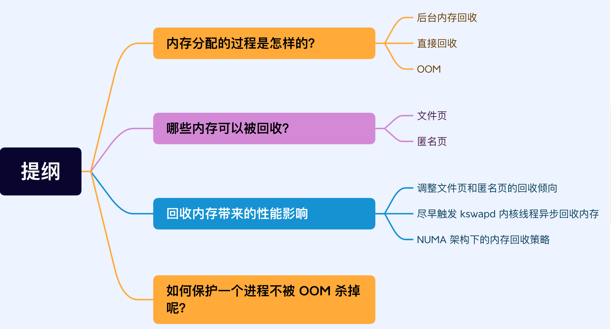

#   内存满了，会发生什么？
我们可以思考如下几个问题：
-   为什么操作系统需要内存管理和虚拟内存，出了给进程分配内存和防止进程间相互影响，还有什么作用？
-   除了OOM，在内存满了之后还会有什么处理？

先来说说第一个问题：虚拟内存有什么作用？
-   第一，虚拟内存可以使得进程对运行内存超过物理内存大小，因为程序运行符合局部性原理，CPU访问内存会有很明显的重复访问的倾向性，对于那些没有被经常访问到的内存，我们可以把它换出到物理内存之外，比如硬盘 上的swpa区域。
-   第二，由于每个进程都有自己的页表，所以每个进程的虚拟内存空间就是相互独立的，进程也没有办法访问其他进程的页表，所以这些页表是私有的，这就解决了多进程之间的地址冲突问题。
-   第三，页表里的页表项除了物理地址之外，还有一些标记属性的比特，比如控制一个页的读写权限，标记该页是否存在等。在内存访问方面，操作系统提供了更好的安全性。

然后今天聊聊第二个问题，系统内存紧张时，会发生什么？

##  内存的分配过程是怎么样的？