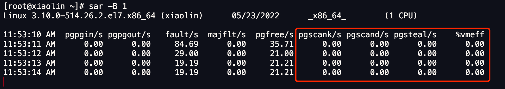

#   内存满了，会发生什么？
我们可以思考如下几个问题：
-   为什么操作系统需要内存管理和虚拟内存，出了给进程分配内存和防止进程间相互影响，还有什么作用？
-   除了OOM，在内存满了之后还会有什么处理？

先来说说第一个问题：虚拟内存有什么作用？
-   第一，虚拟内存可以使得进程对运行内存超过物理内存大小，因为程序运行符合局部性原理，CPU访问内存会有很明显的重复访问的倾向性，对于那些没有被经常访问到的内存，我们可以把它换出到物理内存之外，比如硬盘 上的swpa区域。
-   第二，由于每个进程都有自己的页表，所以每个进程的虚拟内存空间就是相互独立的，进程也没有办法访问其他进程的页表，所以这些页表是私有的，这就解决了多进程之间的地址冲突问题。
-   第三，页表里的页表项除了物理地址之外，还有一些标记属性的比特，比如控制一个页的读写权限，标记该页是否存在等。在内存访问方面，操作系统提供了更好的安全性。

然后今天聊聊第二个问题，系统内存紧张时，会发生什么？


##  内存的分配过程是怎么样的？
应用程序通过malloc函数申请内存的时候，实际上申请的是虚拟内存，此时并不会分配物理内存。

当应用程序读写这些虚拟内存的时候，CPU就会去访问这个虚拟内存，这时会发现这个虚拟内存没有映射到物理内存，CPU就会产生缺页中断，进程会从用户态切换到内核态，并将缺页中断交给内核的page Fault Handler(缺页中断函数)处理。

缺页中断处理函数会看是否有空闲的物理内存，如果有，就直接分配物理内存，并建立虚拟内存与物理内存之间的映射关系。

如果没有空闲的物理内存，那么内核就会开始进行回收工作，回收的方式主要有两种：直接内存回收和后台内存回收。
-   后台内存回收(kswapd)：在物理内存紧张时，会唤醒kswapd内核线程来回收内存,这个回收是异步的，不会阻塞进程执行。
-   直接内存回收(direct reclaim)：如果后台异步回收跟不上进程内存申请的速度，就会开始直接回收，这个回收过程是同步的，会阻塞进程的执行。

如果直接内存回收后，空闲的物理内存依然无法满足此次物理内存的申请，那么内核就会放最后的大招了--触发OOM(Out of Memory)机制。

OOM killer机制会根据算法选择一个占用物理内存较高的进程， 然后将其杀死，以便释放内存资源，如果物理内存依然不足，OOM killer会继续杀死占用物理内存较高的进程，直到释放足够的内存位置。

申请物理内存的过程如下：


##  哪些内存可以被回收？
系统内存紧张的时候，就会进行回收工作，那具体哪些内存是可以被回收的呢？

主要有两类内存可以被回收，而且他们的回收方式也不同：
-   文件页(file-backed page)：内核缓存的磁盘数据(buffer)和内核缓存的文件数据(Cache)都叫做文件页，大部分文件页，都可以直接释放内存，以后有需要时，再从磁盘再次读取就可以了。而那些被应用程序修改过，并且暂时还没有写入磁盘的数据(也就是脏页)，就得先写入磁盘，然后才能进行内存释放。所以，回收干净页的方式是直接释放内存，回收脏页的方式是先写入磁盘再回收。
-   匿名页(Anonymous Page)：这部分内存没有实际的载体，不像文件缓存有硬盘文件这样一个载体，比如堆栈数据等等。这部分内存很可能还要再次被访问，所以不能直接释放内存，他们的回收方式是通过swap机制，Swap会把不常用的内存先写入到磁盘中，然后再释放这些内存，给其他需要的进程使用。再次访问这些内存时，重新从磁盘读入内存就可以了。

文件页和匿名页的回收都是基于LRU算法，也就是优先回收不常访问的内存，LRU算法实际上维护者active和inactive两个双向链表，其中：
-   active_list活跃内存页链表，这里存放的是最近被访问过(活跃)的内存页；
-   inactive_list不活跃内存页，这里存放的是 很少被访问(非活跃)的内存页；

越接近链表尾部，就表示内存页越不常访问。这样内存回收时，系统就可以根据活跃度，优先回收不活跃的内存。

活跃和非活跃的内存页，按照类型的不同，又分别分为文件页和匿名页，可以从/proc/meminfo中查询他们的大小，比如：
```sh
# grep表示只保留包含active的指标（忽略大小写）
# sort表示按照字母顺序排序
[root@xiaolin ~]# cat /proc/meminfo | grep -i active | sort
Active:           901456 kB
Active(anon):     227252 kB
Active(file):     674204 kB
Inactive:         226232 kB
Inactive(anon):    41948 kB
Inactive(file):   184284 kB
```

##  回收内存带来的性能影响
在前面我们知道了回收内存有两种方式。
-   一种是后台回收内存，也就是唤醒kswapd内核线程进行异步回收，不会阻塞进程。
-   一种是直接回收内存，这种方式是同步回收，会阻塞进程，这样就会造成很长时间的延迟，以及系统的CPU利用率会升高，最终会引起系统的负荷彪高。

可被回收的内存类型有文件页和匿名页：
-   文件页的回收，对干净页是直接释放内存，这个操作不会影响系统性能，对于脏页的释放会先写入到磁盘，再释放内存，这个操作发生了磁盘的I/O，这个操作是会影响系统性能的。
-   匿名页的回收：如果开启了Swap，那么Swap机制会将不常访问的匿名页换出到磁盘中，下次访问时，再从磁盘中读入到内存，这个操作是会影响系统性能。

可以看到，回收内存的操作基本都会发生磁盘IO的，如果回收内存的操作很频繁，意味着磁盘IO次数会很多，这个过程势必会影响性能的，整个系统给人的感觉就是很卡。

下面针对回收导致的性能影响，说说常见的解决方式。

### 调整文件页和匿名页的回收倾向
从文件页和匿名页的回收操作来看，文件页的回收操作对系统的影响相比匿名页的回收操作少一点，因为文件页对与干净页是不会发生IO操作的，而匿名页的Swap换入换出这两个操作都会发生磁盘IO。

Linux提供了一个/proc/sys/vm/swapiness选项，用来调整文件页和匿名页的回收倾向。

swapiness的范围是0~100，数值越大，越积极使用swap，也就是越倾向于回收匿名页，数值越小，越消极使用swpa，也就是更倾向与回收文件页。
```sh
[root@xiaolin ~]# cat /proc/sys/vm/swappiness
0
```

### 尽早触发kswapd内核线程异步回收内存
>   如何查看系统直接内存回收和后台内存回收的指标？

我们可以使用sar -B 1命令来观察：

图中红色框住的就是后台内存回收和直接回收的指标，他们分别表示：
-   pgscank/s：kswapd(后台回收线程)每秒扫描page个数。
-   pgscand/s：应用程序在申请内存时过程中每秒直接扫描的page个数.
-   pgsteal/s：扫描的page中每秒被回收的个数(pgscank + pgscand)。

如果系统时不时发生抖动，并且在抖动的时间段里如果通过sar -B 观察到pgscand数值很大，那大概率是因为直接内存回收导致的。

针对这个问题，解决的办法就是，可以通过尽早的触发"后台内存回收"来避免应用程序进行直接内存回收。

>   什么条件下才能触发kswapd内核线程回收？

内核定义了三个阈值，用来衡量当前剩余内存(pages_free)是否充裕或者紧张，分别是：
-   页最小阈值；
-   页低阈值；
-   页高阈值；

这三个内存阈值会划分四中内存使用情况，如下图：

kswapd会定期扫描内存的使用情况，根据内存剩余的情况来进行内存回收工作。

-   图中绿色部分，如果剩余内存(pages_free)大于页高阈值，说明剩余内存是充足的；
-   图中蓝色部分，如果剩余内存在页高阈值和页低阈值之间，说明内存有一定的压力，但还可以满足应用程序申请内存的请求；
-   图中橙色部分，如果剩余内存在页低阈值和页最小阈值之间，说明内存压力较大，剩余内存不多了，这是kswapd会执行回收，知道剩余内存大于页高阈值为止，虽然会触发内存回收，但是不会阻塞应用程序，因为两者关系是异步的。
-   图中红色部分，如果剩余内存小于页最小阈值，说明用户可用内存已经耗尽了，此时就会触发直接内存回收，这时应用程序就会被阻塞，因为两者关系是同步的。

可以看到，当剩余内存页小于页低阈值，就是触发kswapd进行后台回收，然后kswapd一直回收直到可用内存大于页高阈值。

也就是说kswapd的活动空间只有页低阈值和页最小阈值之间这段区域，如果剩余低于页最小阈值会触发直接内存回收，高于页高阈值又不会唤醒kswapd

页低阈值可以通过内核参数/proc/sys/vm/min_free_kbytes（这参数代表系统所包留空闲内存的最低值）来间接设置。

min_free_kbytes虽然设置的是页最小阈值，但是页高阈值和页低阈值都是根据页最小阈值计算生成的，他们之间的计算关系如下：
```sh
page_min = min_free_kbytes
page_low = page_min*5/4
page_high = page_low*3/2
```

如果系统时不时发生抖动，并且通过 sar -B 观察到 pgscand 数值很大，那大概率是因为直接内存回收导致的，这时可以增大 min_free_kbytes 这个配置选项来及早地触发后台回收，然后继续观察 pgscand 是否会降为 0。

增大了 min_free_kbytes 配置后，这会使得系统预留过多的空闲内存，从而在一定程度上降低了应用程序可使用的内存量，这在一定程度上浪费了内存。极端情况下设置 min_free_kbytes 接近实际物理内存大小时，留给应用程序的内存就会太少而可能会频繁地导致 OOM 的发生。

所以在调整 min_free_kbytes 之前，需要先思考一下，应用程序更加关注什么，如果关注延迟那就适当地增大 min_free_kbytes，如果关注内存的使用量那就适当地调小 min_free_kbytes。

#