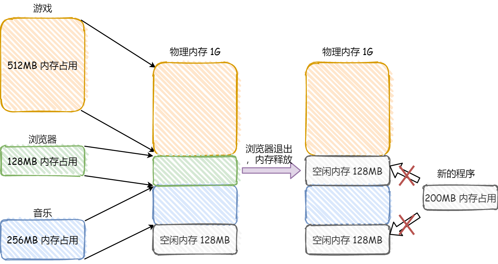
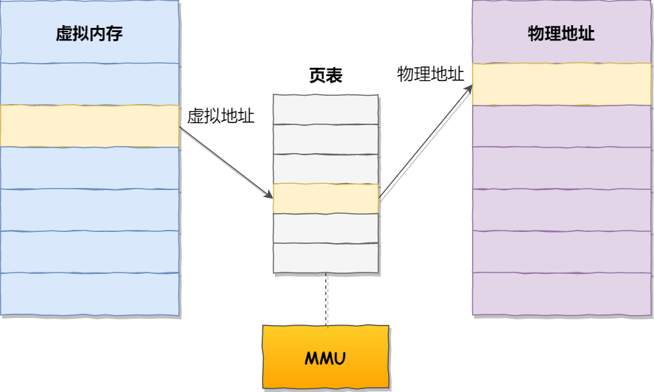
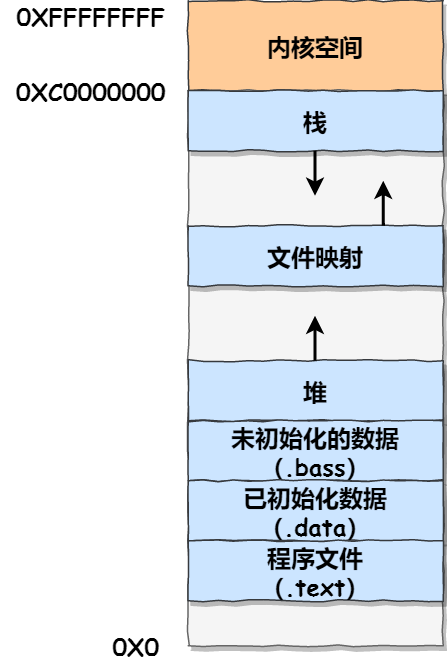

#   为什么要有虚拟内存？
本篇跟大家说说内存管理，内存管理还是比较重要的一个环节，理解了它，至少对整个操作系统的工作会有一个初步的轮廓。

##  虚拟内存
如果你是电子相关专业的，肯定在大学捣鼓过单片机。

单片机是没有操作系统的，所以每次写完代码，都需要借助工具把程序烧录进去，这样程序才能运行。另外单片机的CPU是直接操作内存物理地址的。

在这种情况下，要想在内存中同时运行两个程序是不可能的。如果第一个程序在2000的位置写入一个新的值，将会擦掉第二个程序相同位置的内容，所以同时运行两个程序是行不通的，这两个程序会立刻崩溃。

>   操作系统是如何解决这个问题的呢？

这里关键问题是两个程序都应用了绝对物理地址，而这正是我们最需要避免的。

我们可以把进程所使用地址隔离开来，即让操作系统为每个进程都分配一套独立的虚拟内存地址，人人都有，大家完自己的内存地址就行，互不干涉。但是有个前提每个进程都不能访问物理地址，至于虚拟地址怎么落到物理地址上，对进程来说是透明的，操作系统已经把这些安排的明明白白。

操作系统会提供一种机制，将不同的进程的虚拟地址和不同的物理的地址映射起来。

如果程序要访问虚拟地址的时候，由操作系统转换成不同的物理地址，这样不同的进程运行的时候，写入的是不同的物理地址，这样就不会冲突了。

于是，就引出了两个概念：
-   我们程序所使用的的内存地址叫做虚拟内存地址。
-   实际存在硬件里面的空间叫物理内存地址。

操作系统引入了虚拟内存地址，进程持有的虚拟地址会通过CPU芯片中的内存管理单元(MMU)的映射关系，来转换变成物理地址，然后再通过物理地址访问内存，如图：

>   操作系统是如何管理虚拟地址和物理地址之间的关系？

主要的方式有两种，分别是内存分段和内存分页，分段是比较早提出的，我们先来看看内存分段。

##  内存分段
程序是由若干个逻辑分段组成的，如可由代码分段、数据分段、栈分段、堆分段组成，不同的段是由不同熟悉的，所以就用分段的形式把这些段分离出来。

>   分段机制下，虚拟地址和物理地址是如何映射的？

分段机制下的虚拟地址由两部分组成，段选择因子和段内偏移量。

段选择因子和段内偏移量：
-   段选择因子就保存在段寄存器里面。段选择因子里面最重要的是段号，用作段表的索引。段表里面保存的这个段的基地址、段的界限和特权等级等。
-   虚拟地址中的段内偏移量应该位于0和段界限之间，如果段内偏移量是合法的就将段基地址加上段偏移量得到物理内存地址。

在上面，知道了虚拟地址是通过段表与物理地址进行映射的，分段机制会把程序的虚拟地址分成4个段，每个段在段表中有一个项，在这一项找到段的基地址，再加上偏移量，于是就能找到物理内存中的地址，如下图：

如果要访问段3中偏移量500的虚拟地址，我们可以计算出物理地址为，段3基地址7000+偏移量500=7500

分段的办法很好，解决了程序本身不需要关系物理内存地址的问题，但它也有些不足之处：
-   第一个问题是内存碎片问题。
-   第二个就是内存交换率低的问题。

>   接下来说说问什么会有这两个问题

我们来看一个例子，假设有1G的物理内存，用户执行了多个程序，其中：
-   游戏占用了512M内存
-   浏览器占用了128M内存
-   音乐占用了256M内存

这个时候，如果我们关闭了浏览器，则空闲内存还有1024-512-256=256M

如果这个256M不是连续的，被分成了2段128M内存，这就会导致没有空间再打开一个200M的程序。

>   内存分段会出现内存碎片吗？

内存分片主要分为内部内存碎片和外部内存碎片。

内存分段管理可以做到段根据实际需求分配内存，所以有多少需求就分配多大的段，所以不会出现内部内存碎片。

但是由于每个段的长度不是固定的，所以多个段未必能恰好使用所有的内存空间，会产生多个不连续的小物理内存，导致新的程序无法被装载，所以会出现外部内存碎片。

解决外部内存碎片的问题就是内存交换。

可以把音乐程序占用的那256M内存写到硬盘上，然后再从硬盘上读回到内存里，不过再读回的时候不能装载到原来的位置，而是紧跟着那已经被占用的512M内存后面，这样空缺出来连续的256M空间，于是新的200M程序就可以装载进来。

这个内存交换空间，在linux中，也就是我们常看到的swap空间，这块空间是从硬盘划分出来的，用于内存与硬盘的空间交换。

>   再来看看分段为什么会导致内存交换率低的问题？

对于多进程的系统来说，用分段的方式，外部内存分片是很容易产生的，产生了外部内存碎片，那不得不重新swap内存区域，这个过程会产生性能瓶颈。

因为因为硬盘的访问速度比内存慢太多了，每一次内存交换，我们都需要把一大段连续的内存数据写到硬盘上。

所以，如果内存交换的时候，交换的是一个占内存很大的程序，这样整个机器都会显得很卡顿。

为了解决内存分段的外部内存碎片和内存交换率低的问题，就出现了内存分页。

##  内存分页
分段的好处就是能够产生连续的内存空间，但是会出现外部内存碎片和内存交换问题。

要解决这些问题，那么就要想出能少出现一些内存碎片的办法。另外当然需要进行内存交换的时候，让需要内存交换写入或者从磁盘装载的数据更少一点，这样就可以解决问题了，这个办法也就是内存分页、

分页是把整个虚拟和物理内存空间切成一段段固定尺寸的大小，这样一个连续并且固定的内存空间，我们叫做页。在linux下，每一页的大小位4k。

虚拟地址与物理地址之间通过页表映射：

页表是存储在内存里的，内存管理单元(MMU)就做 将虚拟地址转换成物理地址的工作。

而当进程访问的的虚拟地址在页表中查不到的时候，会产生一个缺页异常，进入系统内核空间分配物理内存、更新进程页表，最后再返回用户空间，恢复进程的运行。

>   分页是怎么解决分段的外部内存碎片和内存交换率低的问题的？

内存分页由于内存空间都是预先划分好的，也就不会像内存分段一样，在段与段之间会产生间隙非常小的内存，这正是分段会产生外部内存碎片的原因。而采用了分页，页与页之间紧密排列的，所以不会有外部碎片。

但是，因为内存分页机制分配内存的最小单位是一页，即使程序不足一页大小，我们最少也只能分配一页，所以页内会出现内存浪费，随意内存分页机制会有内部内存碎片的问题。

如果内存空间不够，操作系统会其他正在运行的进程中最近没有被使用的内存页面给释放掉，也就是暂时写在磁盘上，称为换出。一旦需要的时候，再加载进来，称为换入，所以一次性写入磁盘的也只有少数的一个页或者几个页，不会话太多时间，内存交换的效率就相对较高。

更进一步的，分页的方式使得我们在加载程序的时候，不再需要一次性都把程序加载到物理内存中，我们完全可以在进行在进行虚拟内存和物理内存的页之间映射之后，并不真的把页加载到物理内存中，而是只有在程序运行中，需要用到对用的虚拟内存页里面的指令和数据的时候，再加载到物理内存中。

>   分页机制下,虚拟地址和物理地址是如何映射的？

在分页机制下，虚拟地址分为两部分，页号和页内偏移，页号作为页表的索引，页表包含物理内存页每页所在的物理基地址，这个基地址与页内偏移的组合就成了物理内存地址，见下图：

总结一下，对于一个内存地址转换，其实就是这三个步骤：
-   把虚拟内存地址，切分成页号和偏移量
-   根据页号，从页表里面，查询对应的物理页号；
-   直接拿物理页号，加上前面的偏移量，就得到了物理地址；

下面举个例子，虚拟内存中的页通过页表映射为了物理内存中的页：

这看起来没什么毛病，但是放到实际的操作系统中，这种简单的分页肯定是会有问题的。

>   简单的分页有什么问题呢？

有空间上的缺陷。

因为操作系统是可以运行非常多的进程的，那这不就意味着页表非常庞大。

在32位的环境下，虚拟地址空间总有4G，假设一个页的大小是4k(2^12)，那就需要100万(2^20)个页，每个页表项大约需要4个字节来存储，那么整个4GB空间的映射需要有4M内存来存储页表。

这4MB大小的页表，看起来不是很大，但是要知道每个进程都有自己的虚拟地址空间，也就是都有自己的页表。

那么100个进程就需要400M内存来存储页表，这是非常大的内存了，更别说64位的环境了。

### 多级页表
要解决上面的问题，就需要采取一种叫做多级页表的解决方案。

在前面我们知道了，对于单页表的实现方式，在32位和页大小位4k的环境下，一个进程需要100万个页表，并且每页表象是占用4个字节的，于是相当于每个页表需占用4MB的大小的空间。

我们把这个100万个页表项的单级页表再分页，将页表(一级页表)分为1024个页表(二级页表)，每个表(二级页表)中包含1024个页表项，形成二级分页。如下图所示：

>   你可能会问，分了二级表，映射4GB地址空间就需要4KB(一级表)+4M(二级表)的内存，这样占用岂不是更大了吗？

当然如果4GB的虚拟内存地址全部都加载到内存上的话，二级分页占用空间确实更大了，但是我们往往不会位一个进程分配那么多内存。

其实我们应该换个角度看问题，还记得计算机组成原理里面无处不在的局部性原理吗？

每个进程都有4GB的虚拟地址空间，而显然对于大多数程序来说，其使用到的空间远未达到4GB，因为会存在部分对应的页表项都是空的，根本没有分配，对于已分配的页表向，如果存在最近一段时间未访问的页表，在物理内存紧张的情况下，操作系统会将页面换出到硬盘，也就是说不会占用物理内存。

如果使用了二级分页，一级页表就可以覆盖整个4GB的虚拟地址空间，单如果某个一级页表项没被用到，也就不需要创建这个页表项对应的二级页表了，即在需要时才创建二级页表。做个简单的计算，假设只有20%的一级页表项被使用到了，那么页表占用空间就只有4K(一级页表)+4K * 1024 * 20% = 0.804M，这对比单级页表是不是一个巨大的节约？

那么为什么不分级的页表就做不到这样的节约呢？

我们从页的性质来看，保存在内存中的页表承担的职责是将虚拟地址翻译成物理地址。假如虚拟地址在页表中找不到对应的页表项，计算机就不能工作了。所以页表一定要覆盖全部的虚拟地址空间，不分级的页表就需要有100万个页表项来映射，而二级页表则只需要1024个页表项(此时一级页表项覆盖到了全部的二级虚拟地址空间，二级页表在需要时创建。)

我们再把二级页表推广到多级页表，就会发现页表占用的存储空间更少了，这一切都要归功于局部性原理的充分应用。

对于64位系统，两级页表肯定不够，就变成了4级页表。分别是:
-   全局页目录项PGD(page gobal directory);
-   上层页目录项PUD(Page Upper Directory)；
-   中级页目录项PMD(Page Middle Directory)；
-   页表项PTE(Page Table Entry)；

### TLB
多级页表虽然解决了空间上的问题，但是虚拟地址到物理地址的转换就多了几道工序，这显然就降低了这来地址的转换速度，也就是带来了时间上的开销。

程序是有局部性的，即在一段时间内，整个程序的执行仅限于程序中的某一部分。响应的，执行所访问的存储空间也局限于某个内存区域。

我们就可以利用这一特性，把最常用的几个页表项存储到访问速度更快的硬件，于是计算机科学家们，就在CPU芯片中，加入了一个专门存放程序最常用的页表项的Cache，这个Cache就是TLB(Translation Lookaside Buffer)，通常称为页表缓存、转址旁路缓存、快表等。

在CPU芯片里，封装了内存管理单元MMU芯片，它用来完成地址转换和TLB的访问和交互。

有了TLB后，那么CPU在寻址的时候，会先查TLB，如果没有找到，才会继续查常规的页表。

TBL的命中率其实很高的，因为程序最常访问的页就那几个。

##  段页式内存管理
内存分段和内存分页并不是对立的，他们是可以组合起来在同一个系统中使用的，那么组合起来后，通常称为段页式内存管理。

段页式内存管理的实现方式：
-   现将内存划分位多个有逻辑意义的段，也就是前面提到的分段机制；
-   接着再把每个段划分位多个项，也就是分段划分出来的连续空间，再划分固定大小的页。

这样地址结构就由段号、段内页号和页内偏移三部分组成。

用于段页式地址变换的数据结构是每一个程序一张段表，每个段有建立了一张页表，段表中的地址是页表的起始地址，而页表中的地址为某页的物理页号，如图所示：

段页式地址变化要得到物理地址必须要经过三次内存访问：
-   第一次访问段表，得到页表的起始地址；
-   第二次访问页表，得到物理页号；
-   第三次将物理页号和页内位移组合，得到物理地址。

可用软硬件结合的方法实现段页式地址转换，这样虽然增加了硬件成本和系统开销，但提高了内存的利用率。

##  Linux内存布局
那么，Linux操作系统采用了那种方式来管理内存呢？
>   在回答这个问题前，我们得先看看Intel处理器的发展史。

早期Intel的处理器从80286开始使用的是段式内存管理。但是很快发现，光有段式内存管理没有页式是不够的，这会使它的X86系列失去市场的竞争力。因此，在不久之后80386中就实现了页式内存管理。也就是说，80386出了完成并完善从80286开始的段式内存管理的同时还实现了页式内存管理。

但是这个80386的页式内存管理在设计时，没有绕开段式内存管理，而是建立在段式内存管理的基础上，这就意味着，页式内存管理的作用是在有段式内存管理所映射而成的地址上再加了一层地址映射。

由于此时由段式内存管理映射而成的地址不再是物理地址了，Intel就称之为线性地址(虚拟地址)。于是，段式内存管理先将逻辑地址映射成线性地址，然后由页式内存管理将线性地址映射成物理地址。

这里说明一下逻辑地址和线性地址：
-   程序所使用的地址，通常是没有被段式内存管理映射的地址，称为逻辑地址；
-   通过段式内存管理映射的地址，称为线性地址，也叫虚拟地址；

逻辑地址是段式内存管理映射前的地址，线性地址是页式内存管理转换前的地址；

>   了解完Intel处理器的发展史后，我们再来说说Linux采用了什么方式来管理内存？

Linux内存主要采用的是页式内存管理，但同时也不可避免的涉及到了段机制。

这主要是上面的Intel处理器发展史导致的，因为Intel X86 CPU一律对程序中使用的地址先进行段是映射，然后才能进行页式映射。既然CPU的结构是这样，Linux内核只好服从Intel的选择。

但是事实上，Linux内核所采取的办法是使段式映射的过程中实际上不起什么作用。也就是说，上有政策下有对策，若惹不起，就躲着走。

Linux系统中的每个段都是从0地址开始的整个4GB虚拟空间(32位环境下)，也就是所有段的起始地址都是一样的，这意味着，Linux系统中的代码，包括操作系统本身的代码和应用程序的代码，所面对的地址空间都是线性地址空间(虚拟地址)。这种做法相当于屏蔽了处理器中的逻辑地址的概念，段只被用于访问控制和内存保护。

>   我们再来瞧一瞧，Linux虚拟地址空间是如何分布的？

在Linux操作系统中，虚拟地址空间的内部又被分为内核空间和用户空间两部分，不同位数的系统，地址空间的范围也不同，比如常见的32位和64位系统：

通过这里可以看出：
-   32位系统的内核空间占用1G，位于最高处，剩下的3G是用户空间；
-   64位系统的内核空间和用户空间都是128T，分别占据整个内存空间的最高和最低处，剩下中间的部分未定义。

再来说说内核空间和用户空间的区别：
-   进程在用户态时，只能访问用户空间内存；
-   只有在进入内核态后，才可以访问内核空间的内存；

虽然每个进程都有各自地理的虚拟内存，但是每个虚拟内存的内核地址，其实相关联的都是相同的物理地址。这样，进程切到内核后，就可以很方便的访问内核空间内存。

接下来，进一步了解虚拟空间的划分情况，用户空间和内核空间划分的方式是不同的，内核空间的分布情况就不多说了。

我们看看用户空间的分布情况，以32位系统为例：

通过这张图可以看到，用户空间内存，从低到高，分别是6中不同的内存段：
-   程序文件段(.text)，包括二进制可执行代码。
-   已初始化的数据段(.data)，包括静态常量。
-   未初始化的数据段(.bss)，包括未初始化的静态变量。
-   堆段，包括动态分配的内存，从低地址开始向上增长。
-   文件映射段，包括动态库、共享内存等，从低地址开始向上增长；
-   栈段，包括局部变量和函数调用局部上下文等。栈的大小是固定的，一般是8m，当然系统也提供了参数，以便我们自定义大小。

上图中的内存布局中可以看到，程序文件段(.text)下面还有一段内存空间是灰色的，这一块区域是保留区，之所以要有保留区这是因为在大多数系统里，我们认为比较小数值的地址不是一个合法的地址，例如，我们通常在C代码中将无效的指针赋值位NULL，因此，这里会出现一段不可访问的内存保留区，防止程序出现bug，导致读或写了一些小内存地址的数据，而使得程序跑飞。

在这7个内存段中，堆和文件映射段的内存都是动态分配的，比如说，使用C标准库malloc或者mmap，就可以分别在堆和文件映射段动态分配内存。