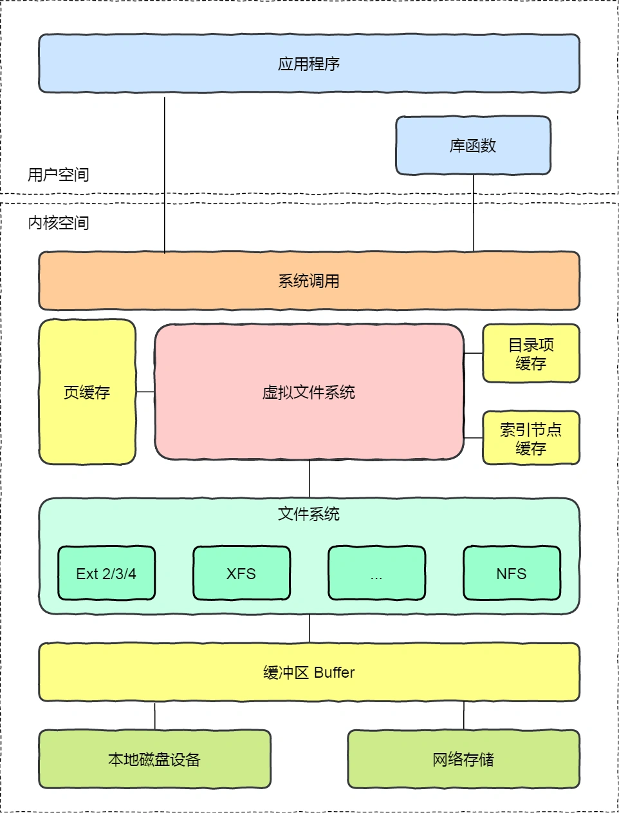
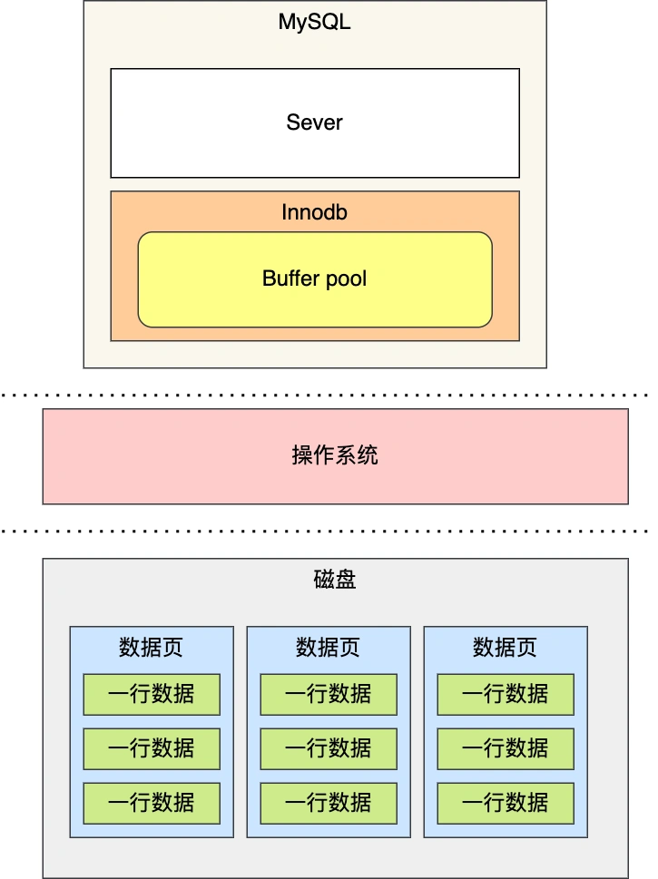
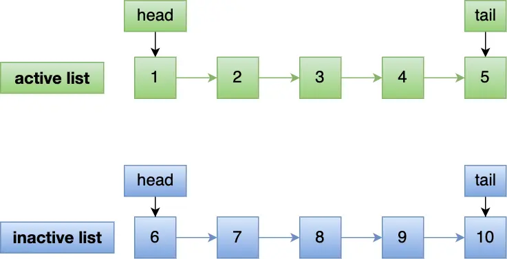
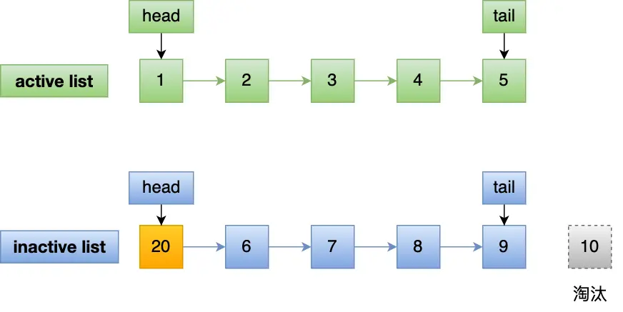
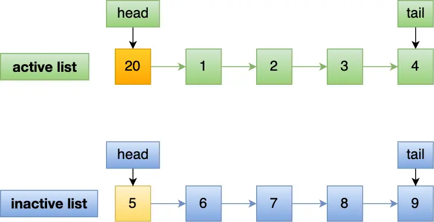
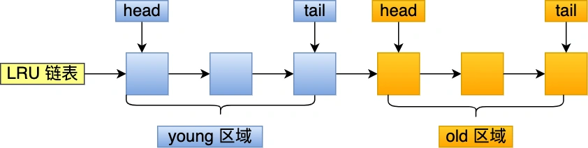

#   如何避免预读失效和缓存污染问题？

先来思考下面两个问题：
1.  操作系统在读磁盘的时候会额外多读一些到内存中，但是最后这些数据也没有用到，有什么方法改善吗？
2.  批量读数据的时候，可能会把热点数据挤出去，这个又有什么方法改善吗？

咋一看，以为是操作系统的问题，其实这两个问题都是在问如何改进LRU算法。

-   预读失效，导致缓存命中率下降(对应第一个题目)
-   缓存污染，导致缓存命中率下降(对应第二个题目)

Redis的缓存淘汰算法则是通过LFU算法来避免缓存污染而导致缓存命中率下降的问题(redis没有预读机制)。
Mysql和linux操作系统是通过改进LRU算法来避免预读失效和缓存污染而导致的缓存命中率下降的问题。

##  Linux和Mysql的缓存
在应用程序读取文件的时候，Linux操作系统会对读取的文件数据进行缓存的，会缓存在文件系统中的page cache中。

Page Cache属于内存空间的数据，由于内存访问比磁盘访问快的多，在下一次访问相同数据就不需要通过磁盘IO了，命中缓存就直接返回数据即可。

因此，Page Cache起到了加速访问数据的作用。

##  Mysql的缓存
Mysql的数据是存储在磁盘中，为了提升数据库的读写性能，innodb存储引擎设计了缓冲池(Buffer Pool)，Buffer Pool属于内存空间的数据。

有了缓冲池后：
-   当读取数据时，如果数据存在与buffer pool中，客户端就会直接读取buffer pool中的数据，否则再去磁盘中读取。
-   当修改数据时，首先修改的buffer pool中数据所在的页，然后将其页设置位脏页，最后由后台线程将脏页写入到磁盘。

##  传统的LRU是如何管理内存数据的？
Linux的Page Cache和Mysql的Buffer pool是有限的，并不能无限缓存数据，对于一些频繁访问的数据，我们希望可以一直留在内存中，而一些很少访问的内存数据在某些时机可以淘汰调，从而保证内存不会因为满了而导致无法再缓存新的数据，同时还能保证常用的数据留在内存中。

要实现这个，最容易想到的就是LRU算法。

LRU算法一般使用链表作为数据结构来实现，链表头部的数据是最近使用的， 而链表末尾的数据是最久没有使用的。那么当空间不够的时候，就淘汰最久没有被使用的节点，也就是链表末尾的数据，从而腾出内存空间。

因为Linux的page cache和mysql的Buffer pool缓存的基本数据单位就是页单位，所以后续以页名称代替数据。

传统的LRU算法是这样的：
-   当访问的页在内存里，就直接把该页对应的LRU链表节点移动到链表的头部
-   当访问的页不在内存里，出了要把该页放到LRU链表的头部，还要淘汰末尾的页。

传统的 LRU 算法并没有被 Linux 和 MySQL 使用，因为传统的 LRU 算法无法避免下面这两个问题：

预读失效导致缓存命中率下降；
缓存污染导致缓存命中率下降；

##  预读失效怎么办？
### 什么是预读机制？
Linux操作系统为基于page cache的读缓存机制提供了预读机制，一个例子是：
-   应用程序只想读取磁盘上文件A的offset位0~3Kb范围内的数据，由于磁盘的基本读写单位为block(4KB),于是操作系统至少会读0-4Kb的内容，这恰好可以在一个page中装下。
-   但是操作系统出于空间局部性原理，会选择将磁盘offset[4KB,8KB),[8KB,12KB)以及[12KB,16KB)都加载到内存中，于是额外在内存中申请了3个page。

下图代表了操作系统的预读机制：

上图中，应用程序利用read系统调用，读取4KB数据，实际上内核使用预读机制(ReadaHead)机制完成了16KB数据的读取，也就是通过一次磁盘顺序读将多个page数据装入Page cache。

这样下次读取4KB数据后面的数据的时候，就不用从磁盘读取了，直接在Page Cache即可命中数据。因此，预读机制带来的好处就是减少磁盘IO次数，提高系统磁盘的吞吐量。

Mysql Innodb存储引擎的Buffer Pool也有类似的预读机制，Mysql从磁盘加载页时，会提前把它相邻的页一并加载进来，目的就是为了减少磁盘IO。

### 预读失效会带来什么问题？
如果这些被提前加载进来的页，并没有被访问，相当于这个预读工作白做了，这个就是预读失效。

如果使用传统的LRU算法，就会把预读页放到LRU链表头部，而当内存空间不够的时候，还需要把末尾的页淘汰掉。

如果这些预读页一直不被访问到，就会出现一个很奇怪的问题，不会被访问的预读页却占用了链表前排的位置，而末尾淘汰的页，可能是热点数据，这样就大大降低了缓存的命中率。

### 如何避免预读造成的影响？
我们不能害怕预读，而将预读机制去掉，大部分情况，空间局部性原理还是生效的。

要避免预读失效带来的影响，最好就是让预读页停留在内存里的时间要尽可能的短，让真正能够被访问的页才移动到LRU链表的头部，从而保证真正被读取的热点数据留在内存中的时间尽可能长。

那到底是怎么做才能避免呢？

Linux和Mysql通过改进LRU链表来避免预读失效带来的影响，具体的改进分别如下：
-   Linux操作系统实现了两个LRU链表：活跃LRU链表(active_list)和非活跃LRU链表(inactive_list)；
-   Mysql的Innodb存储引擎是在一个LRU链表上划分出2个区域：young预期和old区域

这两个改进的方式，设计思想都是类似的，都是将数据分为了冷数据和热数据，然后进行LRU算法。不再像传统的LRU算法那样，所有数据都只用一个LRU链表管理。

>   Linux 是如何避免预读失效带来的影响？

Linux操作系统实现了两个LRU链表：活跃LRU链表(active_list)和非活跃LRU链表(inactive_list)。
-   active list活跃内存链表，这里存放的是最近被访问过(活跃)的内存页。
-   inactive list不活跃内存页链表，这里存放的是很少被访问(非活跃)的内存页。

有了这两个LRU链表后，预读页就只需要加入到inactive list区域的头部，当页真正被访问的时候，才将页插入active list的头部，如果预读的页一直没有被访问，就会从inactive list移除，这样就不会影响active list中的热点数据。

接下来，举个例子：
假设active list和inactive list的长度为5，目前内存中已经有10个页；

现在有个编号为20的页被预读了，这个页只会被插入到inactive list的头部，而inactive list末尾的页(10号)会被淘汰。

即使编号为20的预读页一直不会被访问，它页没有占用到active list的位置，而且还会比active list中的页更早被淘汰出去。

如果20号被预读后，立刻被访问了，那么就会将它插入到active list的头部，active list末尾的页(5号)，会被降级到inactive list，作为inactive list的头部，这个过程不会有数据被淘汰。

>   Mysql 是如何避免预读失效带来的影响？

Mysql的Innodb 存储引擎是在一个LRU链表上划分来2个区域，young区域和old区域。
young区域在LRU链表前半部分，old区域则是在后半部分，这两个区域都有各自头和尾节点，如下：

young 区域与 old 区域在 LRU 链表中的占比关系并不是一比一的关系，而是 63:37（默认比例）的关系。

划分这两个区域后，预读的页就只需要加入到 old 区域的头部，当页被真正访问的时候，才将页插入 young 区域的头部。如果预读的页一直没有被访问，就会从 old 区域移除，这样就不会影响 young 区域中的热点数据。

### 缓存污染怎么办？