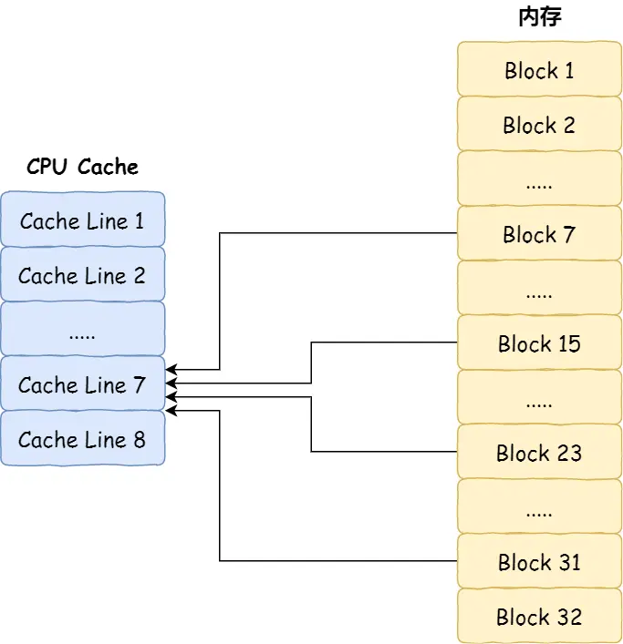
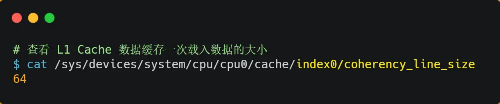

#   如何写出让 CPU 跑得更快的代码？
代码都是由CPU跑起来的，我们代码写的好与坏就决定了CPU的执行效率，特别是在编写计算机密集型的程序，更要注重CPU的执行效率，否则会大大影响系统性能。

CPU内部嵌入了高速缓存CPU Cache，它们的存储容量很小，但是里CPU核心很近，所以缓存的读写速度是极快的，那么如果CPU运算时，直接从CPU Cache中读取数据，而不是从内存的话，运算速度就会很快。

但是，大多数人都不知道CPU Cache的运行机制，以至于不知道如何才能够写出能够配合CPU Cache工作机制的代码，一旦你掌握了它，你写代码的时候，就有了新的优化思路了。

那么接下来我们看看，CPU Cache到底是什么样的，是如何工作的，又该如何让CPU执行的更快的代码呢？


##  CPU Cache有多快？
CPU Cache 通常分为大小不等的三级缓存，分别是 L1 Cache、L2 Cache 和 L3 Cache。

由于 CPU Cache 所使用的材料是 SRAM，价格比内存使用的 DRAM 高出很多，在当今每生产 1 MB 大小的 CPU Cache 需要 7 美金的成本，而内存只需要 0.015 美金的成本，成本方面相差了 466 倍，所以 CPU Cache 不像内存那样动辄以 GB 计算，它的大小是以 KB 或 MB 来计算的。

在 Linux 系统中，我们可以使用下图的方式来查看各级 CPU Cache 的大小，比如我这手上这台服务器，离 CPU 核心最近的 L1 Cache 是 32KB，其次是 L2 Cache 是 256KB，最大的 L3 Cache 则是 3MB。

其中，L1 Cache 通常会分为数据缓存和指令缓存，这意味着数据和指令在L1 Cache这一层是分开缓存的，上图中index0也就是数据缓存，而index1则是指令缓存，它俩大小通常是一样的。

另外，你会注意到，L3 Cache比L1L2 Cache大很多，这是因为L1L2 Cache都是每个CPU核心独有的，而L3 Cache是多个CPU核心共享的。

程序执行时，会现将内存中的数据加载到L3 Cache中，再加载到每个核心独有的L2 Cache中，最后进入到最快的L1 Cache，之后才会被CPU读取，他们之间的关系如下：


越靠近 CPU 核心的缓存其访问速度越快，CPU 访问 L1 Cache 只需要 2-4 个时钟周期，访问 L2 Cache 大约 10-20 个时钟周期，访问 L3 Cache 大约 2060 个时钟周期，而访问内存速度大概在 200~300 个 时钟周期之间。如下表格：

所以，CPU 从 L1 Cache 读取数据的速度，相比从内存读取的速度，会快 100 多倍。

##  CPU Cache的读取过程是怎么样的？
我们先简答了解一下CPU Cache的结构，CPU Cache是由多个Cache line组成的，Cache line是CPU从内存读取数据的基本单位，而Cache line是由各种标志Tag + 数据块data-block 组成:


CPU Cache的数据是从内存读取过来的，它是以一小块一小块读取数据的，而不是按照单个数组元素来读取的，在CPUcache中，这样一小块一小块的数据的，称为Cache line。

你可以在你的 Linux 系统，用下面这种方式来查看 CPU 的 Cache Line:
```sh
$ cat /sys/devices/system/cpu/cpu0/cache/index0/coherency_line_size
64
```

比如，有一个int array[100]的数组，当载入array[0]的时候，由于这个数组元素的大小在内存只占了4个字节，不足64，CPU就会顺序加载数组元素到array[15]，意味着array[0]~array[15]的数据已经缓存到CPU Cache中了，因此当下次访问这些数据的时候，会直接从CPU Cache中读取，而不用再去内存中读取，大大提高了CPU读取数据的性能。

事实上，CPU读取数据的时候，无论数据是否加载到Cache中，CPU都是先访问Cache，只有当Cache中找不到数据时，才回去访问内存，并把内存中的数据读入到Cache中，CPU再从Cache中读取数据。

这样的访问机制，跟我们使用内存作为硬盘的缓存的逻辑是一样的，如果内存有缓存的数据，则直接返回，否则要访问龟速一样的硬盘。

那CPU怎么知道要访问内存数据，是否在Cache里？如果在的话，如何找到Cache对应的数据呢？我们从最简单、最基础的直接映射Cache(Direct Mapped Cache)说起，来看看看整个CPUCache的数据结构和访问逻辑。

前面，我们提到CPU访问内存数据时，是一小块一小块读取的，具体者一小块数据的大小，取决于coherency_line_size的值，一般是64个字节，在内存中，这一块数据我们称为内存块，读取的时候我们要拿到数据所在内存块的地址。

对于直接映射Cache采用的策略，就是把内存块的地址始终映射在一个CPU Cacheline(缓存块)的地址，至于映射关系实现方式，就是使用取模运算，取模运算的结果就是内存块地址对应的CPU Cacheline的地址。

举个例子，内存共被划分为32个内存块，CPU Cache共有8个Cache line，假设CPU想要访问15号内存快，如果15号内存块已经缓存在CPU Cache line中的话，则是一定在7号CPU Cache line中，因为15%8的值是7。

机智的你肯定发现了，使用取模方式映射的话，就会出现多个内存块对应同一个CPU Cache line，比如上面的例子，除了15号内存块是映射在7号CPU Cache line中，还有7号，23号，31号内存都是映射在号CPU Cacheline中。

因此，为了区别不同内存块，在对应的CPU Cacheline 中我们还会存储一些组标记，这个组标记会记录当前CPU Cache line中存储的数据对应的内存块，我们可以利用这个组标记来区分不同的内存块。

出了组标记外，还有两个信息：
-   一个是，从内存加载过来的实际存放数据；
-   另一个是有效位，它是用来标记对应的CPU Cache line中的数据是否有效，如果有效位是0，无论CPU Cache line中是否有值，CPU都会直接访问内存，重新加载数据。

CPU在从CPU Cache line 读取数据的时候，并不是读取Cache Line中的整个数据块，而是读取CPU所需要的一个数据片段，这样的数据统称为一个*字*(word)。那怎么在对应的CPU Cache line中数据块中找到所需的字呢？答案是需要一个偏移量offset。

因此一个内存的访问地址，包括组标记、CPU Cache line索引、偏移量这三种信息，于是CPU就能通过这些信息，在CPU Cache中找到缓存的数据，而对于CPU Cache里的数据结构，则是有索引+有效位+组标记+数据块组成。

如果内存中的数据已经在CPU Cache中，那CPU访问一个内存地址的时候，会经历这4个步骤：
1.  根据内存地址中的索引信息，计算在CPU Cache中的索引，也就是找出对应CPU Cache line的地址；
2.  找到对应的Cache Line后，判断CPU Cache Line中的有效位，确认CPU Cache line中数据是否是有效的，如果是无效的，则直接访问内存，并从新加载数据，如果是有效的，则往下执行。
3.  对比内存地址中的组表姐和CPU Cache line 中的组标记，确认CPU Cache line中的数据是否是我们要访问的内存数据，如果不是，CPU就会直接访问内存，如果是的，则继续往下执行；
4.  根据内存地址中偏移量信息，从CPU Cache Line的数据中，读取对应的字。

到这里，相信你对直接映射Cache有了一定的认识，但其实除了直接映射Cache外，还有其他通过内存地址找到CPU Cache line中数据的策略，比如全相连Cache(Fully Associative Cache)、组相连Cache(Set Associative Cache)等，这几种策略的数据结构都比较相似，我们理解了直接映射 Cache 的工作方式，其他的策略如果你有兴趣去看，相信很快就能理解的了。

##  如何写出让CPU跑的更快的代码？
我们知道CPU访问内存你的速度，比访问CPU Cache的速度慢了100多倍，所以如果想要CPU所操作的数据在CPU Cache中的话，这样会带来很大的性能提升。访问的数据在CPU Cache中的话，意味着缓存命中，缓存命中率越高，代码性能就越好，CPU也就越快。

于是，如何写出让CPU跑的更快的代码这个问题，可以改成如何写出CPU缓存命中率高的代码？。

在前面我也提到，L1 Cache通常分为数据缓存和指令缓存，这是因为CPU会分别处理数据和指令，比如1+1=2这个运算，+就是指令，会被放在指令缓存中，而输入的1 则会放入数据缓存中。

因此，我们要分开来看数据缓存和指令缓存的命中率。

### 如何提升数据缓存的命中率？
假设要遍历二位数组，有以下两种形式，虽然代码执行结果是一样的，但是你觉得那种形式效率最高呢？为什么高呢？

经过测试，形式一array[i][j]执行时间比形式二array[j][i]快好几倍。

之所以有这么大的差距，是因为二维数组array所占用的内存是连续的，比如长度N的值是2的话，那么内存中数组元素的布局应该是这样的：

形式一用arrayp[i][j]访问数组元素的顺序，正式和内存中数组元素存放的顺序是一致的，当CPU访问array[0][0]时，由于该数据不在Cache中，于是会顺势把随后的3个元素加载到Cache中，这样当CPU访问后面3个元素时，就能在Cache 中成功找到数据，这意味着缓存命中率很高，缓存命中的数据不需要访问内存，这样便大大提高了代码的性能。

而如果形式二的array[j][i]来访问时，则访问的顺序就是：

你可以看到形式二的访问方式是跳跃的，而不是顺序的，如果N的值很大，那么操作array[j][i]没有读取到CPU Cache，那么就需要从内存读取该数据元素了。很明显，这种不连续性、跳跃式访问数据元素的方式，可能不能充分利用到CPU Cache的特性，从而代码的性能不高。

那访问array[0][0]元素时，CPU具体会一次性从内存中加载多少元素到CPU Cache中呢？这个问题，我们在前面也提到过，这根CPU Cache Line有关，它表示一次能加载数据的大小，可以在linux 里通过coherency_line_size配置查看它的大小，通常是64个字节。

也就是说，当CPU访问内存数据时，如果数据不在CPU Cache中，则会一次性会连续加载64个字节大小的数据到CPU Cache，那么当访问array[0][0]时，由于该元素不足64字节，于是会顺势读取array[0][0]~arrary[0][15]到Cache中，顺序访问的array[i][j]因为利用了这一特点，所以就会比较跳跃式的访问array[j][i]要快。

因此，遇到这种遍历数组的情况，安装内存布局顺序访问，将可以有效利用CPU Cache带来的好处，这样我们的代码性能就会得到很大的提升。

### 如何提升指令缓存的命中率？
提升数据的缓存命中的率的方式，是按照内存的布局顺序访问，那针对指令缓存该如何提升呢？
我们以一个例子来看，有一个元素0到100之间随机数字组成一组数组：

接下来做两个操作：

-   第一个操作，循环遍历数组，把小于50的数组元素置为0；
-   第二个操作，将数组排序；

那么问题来了，你觉得先遍历再排序快，还是先排序再遍历快？

在回答这个问题之前，我们先了解CPU的分支预测，对于if条件语句，意味着此时至少可以选择跳转到两段不同的指令执行，也就是if还是else中的指令，那么，如果分支预测可以预测接下来要执行if 里的指令，还是else里的指令的话，就可以提前把这些指令放在指令缓存中，这样CPU可以直接从Cache读取到指令，于是执行速度就会提高。

当数组中的元素是随机的，分支预测就无法有效，而当数组元素都是顺序的，分支预测就会动态的根据历史命中数据对未来进行预测，这样命中率就会很高。

因此，先排序在遍历速度会更快，这是因为排序后，数字是从小到大排序的，那么前几次循环命中if <50 的次数就会比较多，于是分支预测会就缓存if 里的array[i] = 0指令到Cache中，后续CPU执行该指令只需要从Cache中读取就行了。

如果你肯定代码中if中表达式判断位true的概率比较高，我们可以使用显示分支预测工具，比如在C/C++语言中提供了likely和unlikely这两种宏，如果if条件位true的概率大，则可以用likely宏把if里的表达式裹起来，反之用unlikely：

实际上，CPU自身的动态分支预测是比较准的了，所以只有当非常确信CPU预测不准，且能够知道实际的概率的情况，才建议使用这两种宏。

### 如何提升多核CPU缓存命中率？
在单核CPU，虽然只能执行一个线程，但是操作系统给每个线程分配了一个时间片，时间片用完了，就调度下一个线程，于是各个线程就按时间片交替的占用CPU，从宏观上看各个线程是同时执行的。

而现代CPU都是多核心的，线程可能在不同的CPU核心来回切换执行， 这对CPU Cache不是有利的，虽然L3 缓存是共享的，但是L1和L2Cache都是每个核心独有的，如果一个线程在不同核心来回切换，各个核心缓存命中率就会受到影响，相反如果线程都在一个核心上执行，那么其数据的L1和L2的缓存命中率可以得到有效提高，缓存命中率高就意味着可以减少内存的访问频率。

当有多个同时执行计算密集型的线程，为了防止切换到不同的核心，而导致缓存命中率下降的问题，我们可以把线程绑定到某一个CPU的核心上，这样就可以得到非常客观的提升。

在linux中提供了sched_setaffinity 方法，来实现将线程绑定到某个 CPU 核心这一功能。


##  总结
由于计算机的发展，CPU与内存的访问速度相差越来越大，如今差距已经高达几百倍，所以CPU内部嵌入了CPU Cache组件，作为内存与CPU之间的缓存层，CPUCache由于距离CPU很近，所以访问速度也非常快，但是由于所需要的材料成本较高，它不像内存动辄几个GB大小，而是仅仅只有即使kb到MB大小。

当CPU访问数据的时候，先是访问CPU Cache，如果缓存命中的话，则直接返回数据，就不用每次都去内存读取了。缓存命中率越高，代码的性能就越高。

但需要注意的是，当CPU访问数据时，如果CPU Cache没有缓存该数据，则会从内存读取，但是并不是每次只读一个数据，而是一次性读取一块一块的数据缓存到CPU Cacheline中，之后才会被CPU读取。

内存映射到CPU Cache中的策略有很多中，其中比较简单的映射是直接映射Cache，它巧妙的把内存地址拆分成索引+组标记+偏移量的方式，使得我们可以将很大的内存地址，映射到很小的CPU Cache中。

要想写出让CPU跑的更快的代码，就需要写出缓存命中率更高的代码，CPU L1 Cache分为数据缓存和指令缓存，因而需要分别提高它们的缓存命中率：
-   对于数据缓存，我们在遍历数据的时候，应该按照内存布局的顺序操作，这是因为CPUcache是根据CPU Cache line批量操作数据的，所以顺序的操作连续的内存时，性能得到有效的提升。
-   对于指令缓存，有规律的条件分支能够让CPU的分支预测发挥作用，进一步提高效率；

另外，对于多核CPU系统，线程可能在不同的CPU来回切换，这样各个核心的缓存命中率就会受到影响，于是想要提高线程的缓存命中率，可以考虑把线程绑定CPU到某一个CPU核心。
