#   CPU 是如何执行任务的？
你清楚下面几个问题吗？
-   有了内存，为什么还要CPU Cache？
-   如何让CPU读取数据更快一些？
-   CPU伪共享是如何发生的？又该如何避免？
-   CPU是如何调度任务的？如果你的任务对响应要求很高，你希望它总是能够先调度，这该怎么办？
-   ...
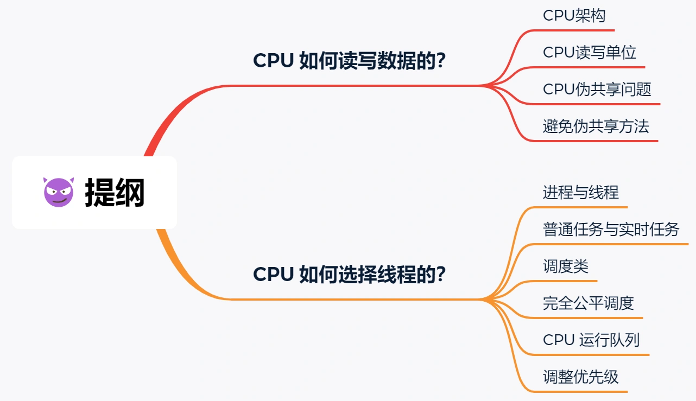

##  CPU是如何读写数据的？
先来认识一下CPU的架构，只有理解了CPU的架构，才能更好的理解CPU是如何读写数据的，对于现代的CPU架构如下图：
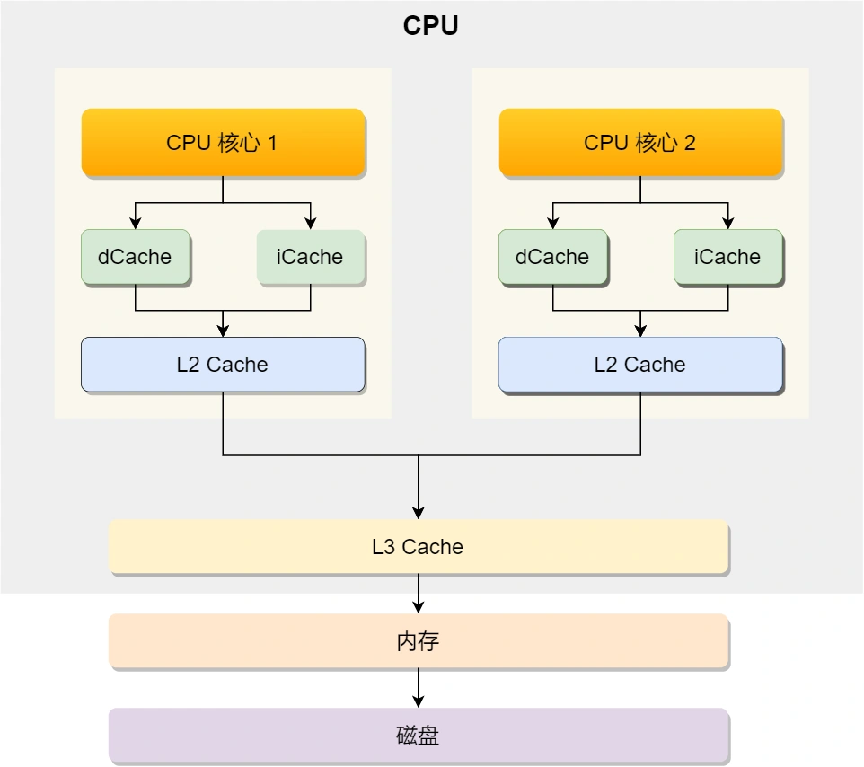
可以看到CPU通常有多个核心，比如上图的1号和2号CPU核心，并且每个CPU核心都有自己的L1 Cache和L2 Cache，而且L1 Cache通常分为数据缓存和指令缓存，L3 Cache是多核心共享的，这就是CPU典型的缓存层次。

上面提到的都是CPU内部的Cache，放眼外部的话，还会有内存和硬盘，这些存储设备共同构成了金字塔存储层次，如下图所示：
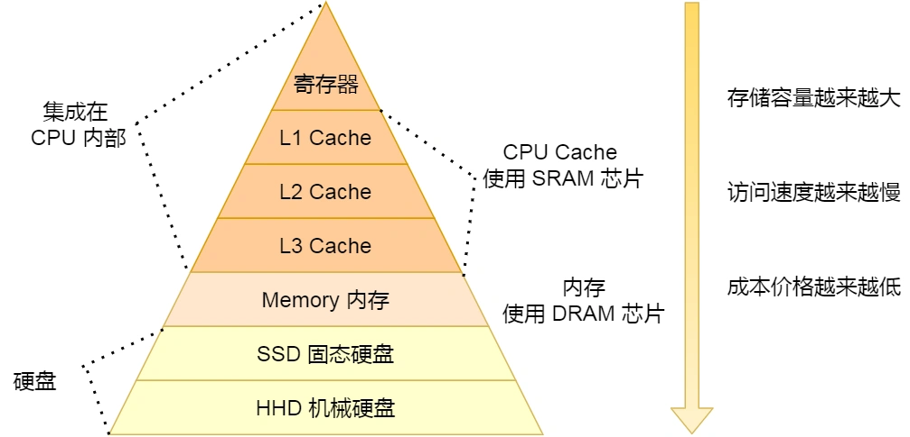
从上图也可以看到，从上往下，存储设备的容量会越大，而访问速度会越慢。至于每个存储设备的访问延时，你可以看下图的表格：
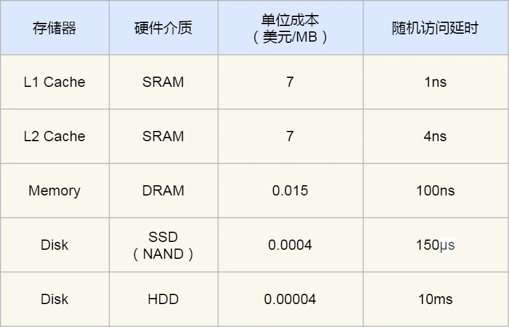
你可以看到， CPU 访问 L1 Cache 速度比访问内存快 100 倍，这就是为什么 CPU 里会有 L1~L3 Cache 的原因，目的就是把 Cache 作为 CPU 与内存之间的缓存层，以减少对内存的访问频率。

CPU从内存中读取数据到Cache中的时候，并不是一个字节一个字节读取，而是一块一块的方式来读取数据的，这一块一块的数据被称为CPU Cache line(缓存块)，所以CPU Cache line是CPU从内存读取数据到Cache 的单位。

至于Cache line的大小，在linux系统可以用下面的方式查到。
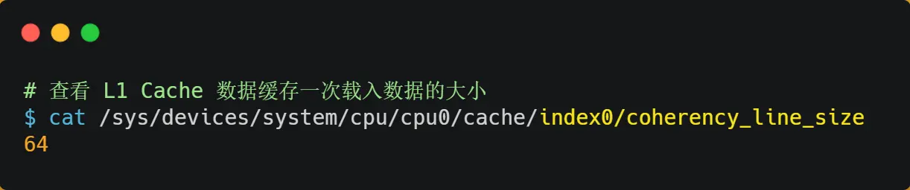

那么对数组的加载，CPU就会加载数组里面多个连续的的数据到Cache中，因此我们应该按照物理内存地址分布的顺序访问元素，这样访问数组元素的时候，Cache的命中率就会很高，于是就能减少从内存中读取数据的频率，从而可提高程序的性能。

但是，我们不使用数组，而是使用单独的变量的时候，则会有Cache 伪共享的问题，Cache伪共享问题上是一个性能杀手，我们应该要规避它。

接下来，我们来看看伪共享是什么？又该如何规避它？

假设一个CPU有两个核心，这两个核心并行这两个不同的线程，他们同时从内存中读取两个不同的数据，分别是类型位long 的变量A和B，这连个数据的地址在物理内存地址上是连续的，如果Cache line的大小是64字节，并且变量A和Cache line的开头位置，那么这两个数据就位于同一个cache Line，有因为CPU从内存加载数据是以Cache line位单位的，所以这两个数据会同时读取到两个CPU核心各自的Cache中。
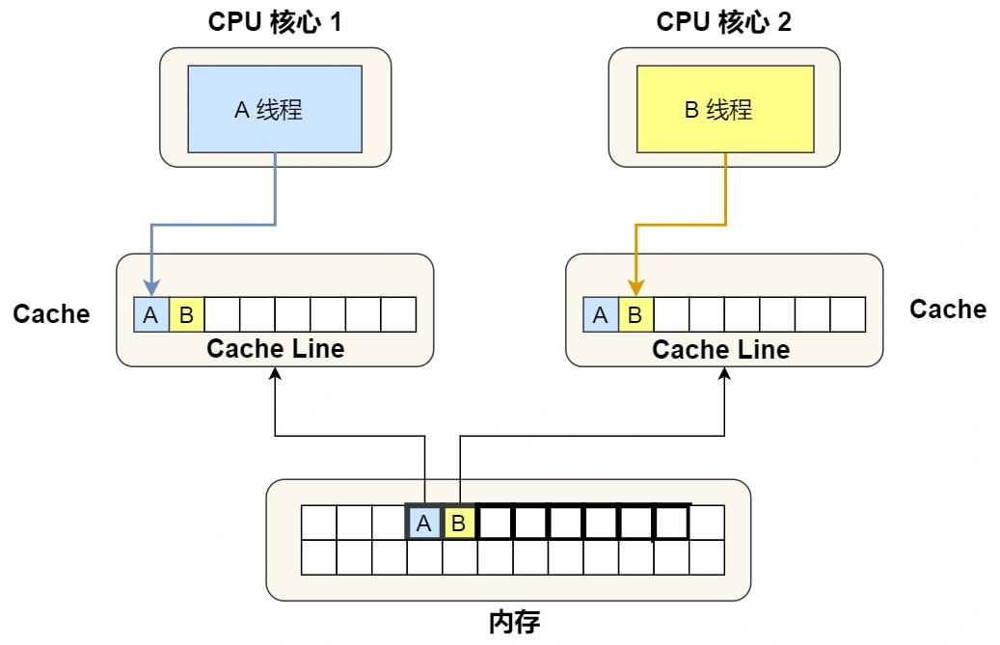

我们来思考一个问题，如果这两个不同核心的线程分别修改不同的数据，比如1号CPU核心的线程只修改了变量A，或2号核心的线程只修改了变量B，会发生什么？

### 分析伪共享问题
现在我们结合保证多核缓存一致性的EMSI协议，来说明这一整个过程：

1.  最开始变量A和B都还不在Cache里面，假设1号核心绑定了线程A，2号核心绑定了线程B，线程A只会读写变量A，线程B只会读写变量B。
2.  1号核心读取变量A，由于CPU从内存读取数据到Cache的单位是Cache line，正好变量A和变量B的数据归属与同一个Cache line，所以A和B的数据会被加载到Cache，并将此Cache line标记为独占状态。
3.  接着，2号核心从内存读取变量B，同样的也是读取 Cache Line 大小的数据到 Cache 中，此 Cache Line 中的数据也包含了变量 A 和 变量 B，此时1号核心和2号核心的Cache line 状态变为共享。
4.  1号核心需要修改变量A，发现此时Cache line的状态是共享状态，所以需要先通过总线发送消息给2号核心，通知2号核心把Cache 中对应的Cache line 变为已失效状态，然后1号核心对应的Cache Line状态变为已修改，并且修改变量A。
5.  之后，2号核心需要修改变量B，此时2号核心的Cache 中对应的Cache line是已失效状态，另外由于1号核心Cache也有此相同的数据，且状态位已修改状态，所以需要先把1号核心的Cache对应的数据先写道内存中，然后2号核心再从内存中读取Cache line大小的数据到Cache中，最后把变量B修改到2号核心的Cache中，并将状态标记为已修改状态。

所以，可以发现如果1号和2号CPU核心这样持续交替的分别修改变量A和B，就会重复4和5这两个步骤，Cache并没有起到缓存的效果，虽然变量A和B之间其实并没有任何关系，但是因为同时归属与一个Cache line，这个Cache line中的任意数据被修改后，都会互相影响，从而出现4和5这两个步骤。

因此，多个线程同时读写同一个Cache line的不同变量时，而导致CPU Cache失效的线程称为伪共享。

### 避免伪共享的方法
因此，对于多个线程共享的热点数据，即经常会修改的数据，应该避免这些数据刚好在同一个Cache line中，否则就会出现伪共享的问题。

接下来，看看实际项目中，使用什么方式来避免伪共享的？

在linux内核中存在__cacheline_aligned_in_smp宏定义，是用于解决伪共享问题的。
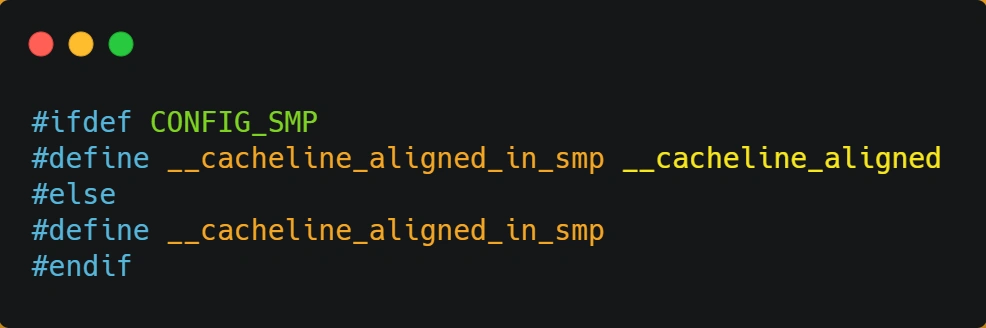
从上面的宏定义，我们可以看到：
-   如果在多核(MP)系统里，该宏定义是__cacheline_aligned, 也就是Cache line大小；
-   而如果在单核系统里，该宏定义是空的；

因此，针对在同一个Cache line中共享的数据，如果在多核之间竞争比较严重，为了防止伪共享现象的发生，可以采用上面的宏定义使得变量在Cache line是对齐的。

举个例子，有下面这个结构体：
```c
struct test{
    int a;
    int b;
}
```

结构体里面的两个成员变量a和b在物理内存地址上是连续的，于是他们可能位于同一个Cache line中.

所以为了防止前面伪共享问题，我们可以使用上面介绍的宏定义，将B的地址设置为Cache line对齐地址，如下：
```c
struct test{
    int a;
    int b __cacheline_aligned_in_smp;
}
```

这样a和b变量就不会在同一个Cache line中了，如下图：
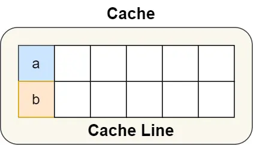
所以，避免Cache 伪共享实际上使用空间换时间的思想，浪费了一部分Cache空间，从而换来的是性能的提升。

我们再来看一个应用层面的规避方案，有一个 Java 并发框架 Disruptor 使用「字节填充 + 继承」的方式，来避免伪共享的问题。

Disruptor 中有一个 RingBuffer 类会经常被多个线程使用，代码如下：
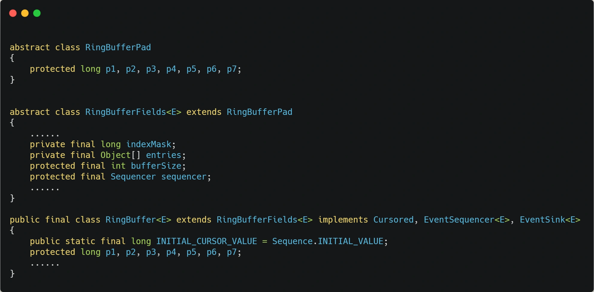
你可能会觉得RingBufferPad类里面的7个long类型的名字很奇怪，但事实上，他们虽然看起来毫无作用，却对性能的提升起到了至关重要的作用。

我们都知道，CPU Cache从内存读取数据的单位是Cache line，一般64位CPU的Cache line是64个字节，一个long类型的数据是8个字节，所以CPU会一下加载8个long类型的数据。

根据 JVM 对象继承关系中父类成员和子类成员，内存地址是连续排列布局的，因此 RingBufferPad 中的 7 个 long 类型数据作为 Cache Line 前置填充，而 RingBuffer 中的 7 个 long 类型数据则作为 Cache Line 后置填充，这 14 个 long 变量没有任何实际用途，更不会对它们进行读写操作。
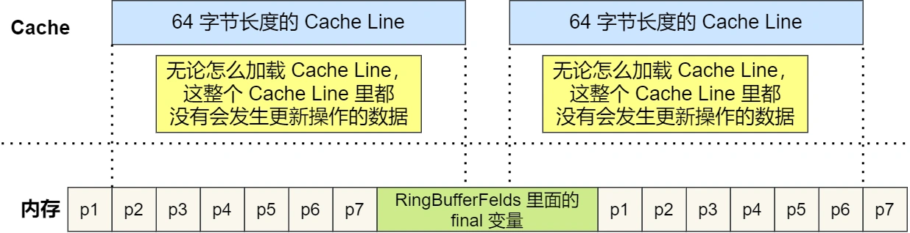
另外，RingBufferFeld里面定义的这些变量都是final修饰的，意味着第一次加载数据后不会再被修改，由由于前后填充了7个不会被读写的long类型变量，所以无论怎么加载Cache line，这整个Cache line里面都没有发生数据更新操作，于是只有数据被频繁的读取访问，自然就没有数据被换出的可能，也因此会不会产生伪共享的问题。

##  CPU是如何选择线程的？
了解完CPU读写数据后，我们再来看看CPU是根据什么来选择当前要执行的线程的、

在linux内核中，进程和线程都是用task_struct 结构体表示的，区别在于线程的task_struct结构体里部分资源是共享了进程已创建的资源，比如内存地址空间、代码段、文件描述符等等，所以linux中的线程也被称为轻量级线程，因为task_struct相比进程的task_struct承载的资源比较少，因此以轻而得名。

一般来说，没有创建线程的进程，只有单个执行流，它被称为主线程，如果想让主线程处理更多的事情，可以创建多个线程分别去处理，但是不管怎么样，他们对应到内核里都是task struct。
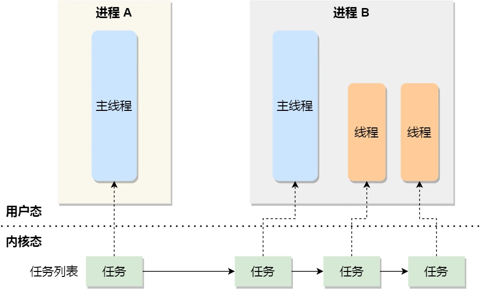

所以，内核里的调度器，调度就是这些task struct，接下来我们就把这个数据结构统称为任务。

在linux系统中，根据任务的优先级以及响应要求，主要分为两种，其中优先级的数值越小，优先级越高。
-   实时任务，对系统的响应时间要求很高，也就是尽可能快的执行实时任务，优先级在0~99范围内的就算实时任务；
-   普通任务，响应时间没有很高的要求，优先级在100~139范围都是普通任务级别；

### 调度类
由于任务有优先级之分，Linux系统为了保障高优先级的任务能够尽可能早的被执行，于是分为这几种调度类，如下图：
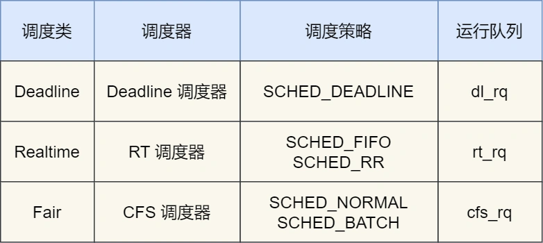
Deadline和Realtime这两个调度类，都是应用与实时任务的，这两个调度类的调度策略合起来有三种，他们的作用如下：
-   SCHED_DEADLINE：是按照deadline进行调度的，距离当前时间点最近的deadline的任务就会被优先调度。
-   SCHED_FIFO：对于相同优先级的任务，按照先来先服务的原则，但是优先级更高的任务，可以抢占优先级低的任务，也就是高优先级的任务可以插队。
-   SCHED_RR：对于相同优先级的任务，轮流这运行，每个任务都有一定的时间片，当用完时间片的任务会被放到队列尾，以保证相同优先级任务的公平性，但是高优先级的任务依然可以抢占低优先级的任务；

而Fair调度类是应用于普通任务的，都是有CFS调度管理的，分为两种调度策略：
-   SCHED_NORMAL：普通任务使用的调度策略；
-   SCHED_BATCH：后台任务的调度策略，不和终端进行交互，因此在不影响其他需要交互的任务，可以适当降低它的优先级。

### 安全公平调度
我们平日里遇到的基本都是普通任务，对于普通任务来说，公平性最重要，在Linux里面，实现了一个基于CFS的调度算法，也就是完全公平调度。

这个算法的理念就是想让分配给每个任务的时间片是一样的，于是它位每个任务安排一个虚拟运行时间vruntime，如果一个任务在运行，其运行越久，该任务的vruntime自然就越大，而没有被运行的任务，vruntime是不会变化的。

那么在CFS算法调度的时候，会优先选择vruntime少的任务，以保证每个任务的公平性。

这就好比，让你把一桶奶茶平均分到10杯奶茶茶杯里，你看看那杯奶茶少，就多倒一些，那个多了，就先不到，这样经过多伦操作，虽然不能保证每杯奶茶完全一样多，但至少是公平的。

当然，上面提到的例子没有考虑优先级的问题，虽然是普通任务，但是普通任务之间还是有优先级之分的，所以在计算虚拟运行时间vruntime还要考虑普通任务的权重值，注意权重值并不是优先级的值，内核中会有一个nice级别与权重值的置换表，nice级别越低权重值就越大，至于nice是什么，我们后面会提到。于是就有了下面的公式：


你可以不用管NICE_0_LOAD是什么，你就认为它是一个常量，那么在同样的实际运行时间里，高权重任务的vruntime比低权重任务的vruntime少，你可能会奇怪为什么？你还记得CFS调度吗？它是会优先选择vruntime少的任务进行调度，所以高权重的任务就会被优先调度了，于是高权重的获得的实际运行时间自然就多了。

### CPU运行队列
一个系统通常都会运行很多任务，多任务的数据基本都是远超CPU核心数量，因此这时候就需要排队。

事实上每个CPU都有自己的运行队列，用于描述在此CPU上所运行的所有进程，，其队列包含三个运行队列，deadline运行队列dl_rq、实时任务运行队列rt_rq和CFS运行队列cfs_rq。其中cfs_rq使用红黑树来描述的，按vruntime大小来排序的，最左侧的叶子节点，就是下次会被调度的任务。
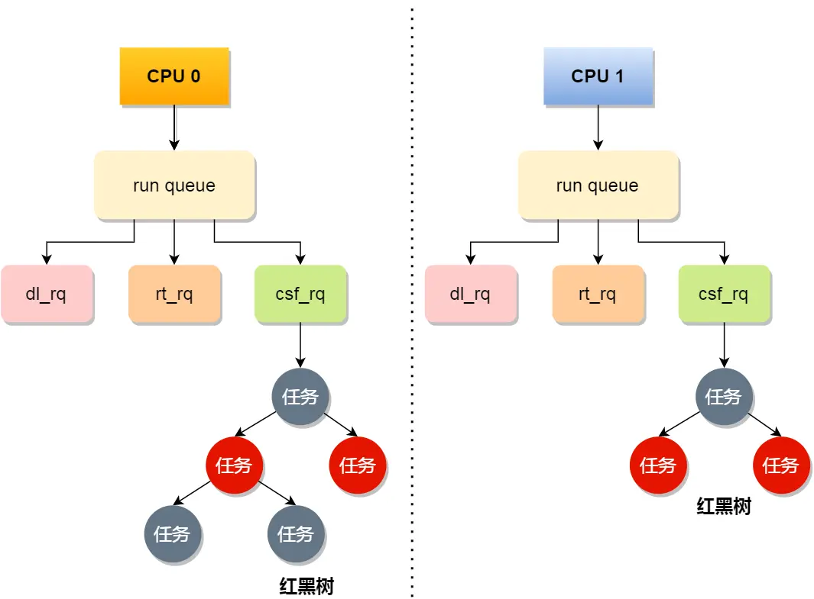
这几种调度是有优先级的，优先级如下：Deadline > Realtime > Fair，这意味着linux选择下一个任务执行的时候，会按照此优先级顺序进行选择，也就是说先从dl_rq里选择任务，然后从rt_rq里选择任务，最后从cfs_rq中选择任务，因此，实时任务总是会比普通任务优先执行。

### 调整优先级
如果我们启动任务的时候，没有特意去指定优先级的话，默认情况下都是普通任务，普通任务的调度类型是Fair，有CFS调度器来管理。CFS调度器的目的是实现任务运行的公平性，也就是保障每个任务的运行时间是差不多的。

如果你想让某个普通任务有更多的执行时间，可以调整任务的nice值，从而让优先级高一些的任务执行更多的时间，nice的值能设置的范围是-20~19，值越低表明优先级越高，因此-20的优先级最高，19则是最低优先级，默认优先级是0.

是不是觉得nice的值范围很诡异?事实上，nice值并不表示优先级，而是表示优先级的修正值，它与优先级的关系是这样的：priority(new) = priority(old) + nice；内核中priority的范围是0~139，值越低优先级越高，其中前面的 0-99范围是提供给实时任务的，而nice值是映射到100-139，这个范围是提供给普通任务的，因此nice调整的是普通任务的优先级。

在前面我们提到了，权重值与 nice 值的关系的，nice 值越低，权重值就越大，计算出来的 vruntime 就会越少，由于 CFS 算法调度的时候，就会优先选择 vruntime 少的任务进行执行，所以 nice 值越低，任务的优先级就越高。

我们可以在启动任务的时候，可以指定 nice 的值，比如将 mysqld 以 -3 优先级：
```sh
nice -n 3 /usr/sbin/mysqld
```
如果向修改已经运行任务的优先级，就可以使用renice来调整nice值：
```sh
renice -10 -p 进程名
```

nice是调整普通任务的优先级，所以不管怎么缩小nice值，任务永远是普通任务，如果某些任务要求实时性比较高，那么你可以考虑改变任务优先级以及调度策略，使得它变成实时任务，比如：
```sh
#   修改调度策略位SCHED_FIFO，并且优先级位1
chrt -f 1 -p 1996
```