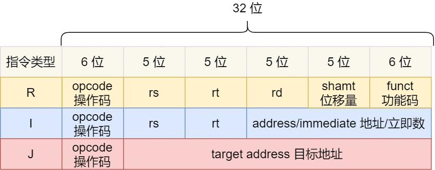

#   硬件结构
##   CPU 是如何运行程序的
代码写了那么多，你知道a=a+1这条代码是怎么被CPU执行的吗？
软件用了那么多，你知道软件的32位和64位的区别吗？再来32位操作系统可以在64位的电脑上运行吗？64位操作系统可以在32位操作系统上运行吗？如果不行，原因是什么？

CPU看了那么多，我们都知道CPU是分32位和64位的？你知道64位相比32位的优势在哪里吗？64位的CPU一定比32位的性能高很多吗？

###  冯诺依曼模型
在1945年冯诺依曼和其他计算机科学家们提出了计算机具体的实现报告，其遵循了图灵机的设计，而且还提出了用电子元件构造计算机，并约定用二进制计算和存储。

最重要的是定义了计算机基本结构的5个部分，分别是运算器、控制器、存储器、输入设备、输出设备，这5个部分也被称为分诺依曼模型。

运算器和控制器是在中央处理器里的，存储器就是我们常见的内存，输入输出设备则是计算器外接的设备，比如键盘就是输入设备，显示器就是输出设备。

存储单元和输入输出要与中央处理器打交道的话，离不开总线，所以他们之间的关系如下：

接下来分别介绍内存、中央处理器、总线、输入输出设备。

###  内存
我们的程序和数据都是存储在内存，存储的区域是线性的。

在计算机数据存储中，存储数据的基本单位是字节(byte)，1个字节是8位(bit)，每一个字节都对应一个内存地址。

内存的地址是从0开始编号的，然后自增排序，最后一个地址为内存总字节数-1，这种结构好似我们程序里的数组，所以内存的读写任何一个数据的速度都是一样的。

###  中央处理器
中央处理器也就是我们常说的CPU，32位和64位CPU最主要的区别在于一次性能计算多少字节的数据；
-   32位CPU一次可以计算4个字节；
-   64位一次可以计算8个字节；

这里的32位和64位，通常称为CPU的位宽。

之所以CPU要这样设计，是为了能计算更大的数值，如果是8位CPU，那么一次只能计算1个字节0-255范围内的数据，这样就无法一次性计算10000*5000，于是为了能一次计算大数的运算，CPU支持多个byte一起运算，所以CPU位宽越大，可以计算的数值就越大，比如说32位CPU能计算最大的整数是4294967295；

CPU内部还有一些组件，常见的有寄存器、控制单元和逻辑运算单元。其中控制单元负责控制CPU工作，逻辑运算单元负责运算，而寄存器负责种类很多，每种寄存器的功能又不尽相同。

CPU中寄存器主要作用是存储计算时的数据，你可能好奇，为什么有了内存还需要有寄存器？原因很简单，内存离CPU太远了， 而寄存器就在CPU中，还紧挨着控制单元和运算单元，自然计算的速度就很快。

常见的寄存器种类：
-   通用寄存器：用来存放需要进行运算的数据，比如需要进行加运算的两个数据。
-   程序计数器：用来存储CPU要执行下一条指令"所在的内存地址"，注意不是存储下一条要执行的指令，此时指令还在内存中，程序计数器只是存储了下一条指令的地址。
-   指令寄存器：用来存放程序计数器指向的指令，也就是指令本身，指令被执行完成之前，都存放在这里。

###  总线
总线是用于CPU和内存以及其他设备之间的通讯，总线可以分为3类：
-   地址总线：用于指定CPU将要操作的内存地址
-   数据总线：用于读写内存的数据
-   控制总线：用于接收和发送信号，比如中断、复位等信号，CPU收到信号后自然进行响应，这时也需要控制总线。

当CPU要读写内存数据的时候，一般需要通过下面这三个总线：
-   首先要通过地址总线来指定内存地址；
-   然后通过控制总线控制读和写信号；
-   最后通过数据总线来传输数据

###  输入、输出设备
输入设备向计算机输入数据，计算机经过计算后，把数据输出给输出设备。期间，如果输入设备是键盘，按下按键时是需要和CPU进行交互的，这是就需要控制总线了。

###  线路位宽和CPU位宽
数据是如何通过线路传输的？其实是通过操作电压，低电压表示0，高电压则表示1。
如果构造了高低这样的信号，其实就是101二进制数据，十进制则表示5，如果只有一条线路，就意味着每次只能传递1bit数据，即0或者1，那么传输101需要3次才能传输完成，遮掩的效率非常低。

这样一位一位的传输方式，称为串行，下一个bit必须等待上一个bit传输完成后才能进行传输，当然想一次多传送一些数据，增加线路即可，这是数据就可以并行传输。

为了避免低效率的串行传输方式，线路的位宽最好一次就能访问到所有的内存地址。

CPU想要操作的内存地址就需要地址总线：
-   如果总线地址只有1条，那么每次只能表示0和1这两种地址，所以CPU能操作的内存地址最大数据为2^1个；
-   如果地址总线有2条，那么能表示00、01、10、11这四种地址，所以CPU能操作的内存地址的最大数据为2^2个。

那么，想要CPU操作4G大的内存，那么就需要32条地址总线，因为2^32=4G;

知道了线路位宽以后，我们再来看看CPU把。

CPU的位宽最好不要小于线路位宽，比如32位CPU控制40位宽的地址总线和数据总线的话，就会非常麻烦，所以32位的CPU最好和32位位宽的线路搭配，因为32位CPU一次最多只能操作32位宽的地址总线和数据总线；

如果用32位CPU去加和两个64位大小的数据，就需要把这2个64位的数字分成2个地位32位数字和高位32位数字来计算，先加和两个地位32位的数字，算出进位，再加和2个高位的32位数字，最后再加上进位，就能计算出结果，可以发现32位CPU并不能一次性计算出加和2个64位的数字的结果。

对于64位的CPU就可以一次性计算出加和2个64位数字的结果，因为64位CPU可以一次读入64位的数字，并且64位CPU内部的逻辑运算单元也支持64位的运算。

但是并不能代表64位CPU性能比32位CPU高很多，很少应用需要算操作32位的数字，所以如果计算数额不超过32位数字的情况下，32位和64位CPU之间基本是没有区别的，只有当计算操作32位的数字时，64位的优势才能体现出来。

另外，32位CPU最大只能操作4GB内存，就算你装了8GB内存条，也没用，而64位CPU的寻址范围很大，理论最大2^64。

### 程序执行的基本过程
程序实际上是一条一条指令，所以程序的运行过程就是把指令一步一步的执行起来，负责执行指令的就是CPU了。

那CPU执行程序的过程如下：
-   第一步，CPU读取程序计数器的值，这个值是指令的内存地址，然后CPU的控制单元操作地址总线指定需要访问的内存地址，接着通知内存设备准备数据，数据准备好后通过数据总线将指令传递给CPU，CPU收到内存传来的数据后，将这个数据存储到指令寄存器中。
-   第二步，CPU分析指令寄存器中的指令，确定指令的类型和参数，如果是计算类型的指令，就把指令交给逻辑运算单元运算；如果是存储类型的指令，则交给控制单元执行。
-   第三步，CPU执行完指令后，程序计数器的值自增，表示指向下一条指令。这个自增的大小由CPU的位宽决定，比如32位CPU，指令是4个字节，需要4个内存地址存放，因此程序计数器的值会自增4.

简单总结一下就是，一个程序执行的时候，CPU会根据程序计数器里的内存地址，从内存里把需要执行的指令读取到指令寄存器中执行，然后根据指令长度自增长，开始顺序读取下一条指令。

CPU从程序计数器读取指令、到执行、再到下一条指令，这个过程会不断循环，知道程序执行结束，这个不断循环的过程叫做CPU的指令周期。

### a=1+2执行具体过程
知道了执行的具体过程后，接下来用a=1+2作为例子，进一步分析该过程在冯诺依曼模型的执行过程。

CPU是不认识a=1+2这个字符串的，这些字符串只是方便程序员认识，想要这段程序能够跑起来，还需要把整个程序翻译成汇编语言的程序，这个过程称为编译成汇编代码。

针对汇编代码，我们还需要汇编器翻译成机器码，这些机器码是有0和1组成的机器语言，这一条条机器码，就是一条条计算指令，这个才是CPU能够真正认识的东西。

下面来看看a=1+2在32位CPU的执行过程。

程序编译过程中，编译器通过分析代码，发现1和2是数据，于是程序运行时，内存会有个专门的区域来存放这些数据，这个区域就是数据段。如下图，数据1和2的区域位置：
-   数据1被存放到0x100位置；
-   数据2被存放到0x104位置；

注意，数据和指令是分开区域存放的，存放指令区域的地方被称为正文段。

编译器会把a=1+2编译成4条指令，存放到正文段中，如上图，这4条指令被存放到了0x200~0x20c的区域中：
-   0x200的内容是load指令将0x100地址中的数据1装入到寄存器R0；
-   0x204的内容是load指令将0x104地址中的数据2装入到寄存器R1;
-   0x208的内容是add指令将寄存器R0和R1的数据相加，并把结果存放到寄存器R2；
-   0x20c的内容是store指令将寄存器R2的内容存回数据段中的0x108的地址中，这个地址也就是变量a内存中的地址；

编译完成之后，具体执行程序的时候，程序计数器会被设置为0x200地址，然后依次执行这4条指令。

上面的例子中，由于是在32位CPU执行的，因此一条指令占32位大小，所以你会发现每条指令间隔4个字节。

而数据的大小是根据你在程序中指定的变量类型，比如int类型的数据则占4个字节，char占1个字节。

### 指令
上面的例子中，图中指令的内容我写的是简易的汇编代码，目的是为了方便理解指令的具体内容，事实上指令的内容是一串二进制数字的机器码，每条指令都有对应的机器码，CPU通过解析机器码来知道指令的内容。

不同的CPU有不同的指令集，也就是对应着不同的汇编语言和不同的机器码，接下来选用最简单的MIPS指令集，来看看机器码是如何生成的，这样也能明白二进制的机器码的具体含义。

MIPS的指令是一个32位的整数，高6位代表这操作码，表示这条指令是一条什么样的指令，剩下26位不同指令类型所表示的内容也不相同，主要有三种类型R、I、J。

一起看看这三种类型的具体含义：
-   R指令：用在算数和逻辑操作，里面有读取和写入数据的寄存器地址，如果是逻辑位移操作，后面还有位移操作的位移量，而最后的功能码，则是在前面操作码不够的时候，扩展操作码来表示对应具体指令。
-   I指令：用在数据传输、条件分支操作。这个类型的指令，就没有偏移量和功能码，也没有了第三个寄存器，而是把这三个部分直接合并成一个地址或者一个常数。
-   J指令：用在跳转，高6位之外的26位都是跳转后的地址；

接下来，我们把前面例子的这条指令：add指令将寄存器R0和R1的数据相加，并把结果放入到R2，翻译成机器码。

-   add 对应的MIPS指令里的操作码是000000，以及最末尾的功能吗是100000，这些数值都是固定的，查一下MIPS指令集的手册就知道。
-   rs代表第一个寄存器R0的编号，即00000；
-   rt代表第二个寄存器R1的编号，即00001；
-   rd代表第目标的临时寄存器R2的编号，即00010；
-   因为不是位移操作，所以偏移量是0；

把上面这些数字并在一起就是一条32位的MIPS加法指令了，那么用16进制表示机器码则是0x00011020.

编译器在编译程序的时候会构造指令，这个过程叫做指令的编码，CPU执行程序的时候，就会解析指令，这个过程就叫做指令的解码。

现代大多数CPU都是用流水线的方式来执行指令，所谓流水线就是把一个任务拆分成多个小任务，于是一条指令通常分为4个阶段，称为4级流水线，如下图：

四个阶段的具体含义：
1.  CPU通过指令计数器读取对应内存地址的指令，这个部分称为Fetch(取得指令)；
2.  CPU对指令解码，这个部分称为Decode(指令译码)；
3.  CPU执行指令，这个部分称为Execution(执行指令)；
4.  CPU将计算结果存回寄存器或者将寄存器的值写入内存，这个部分称为store(数据写回)；

上面这4个阶段，我们称为指令周期(Instruction Cycle)，CPU的工作就是一个周期接着一个周期，周而复始。

事实上，不同阶段其实是有CPU中的不同组件完成的。

-   取指令阶段，我们的指令是存放在存储器里面的，实际上，是通过程序计数器和指令寄存器取出指令的过程，是由控制器操作的。
-   指令的译码过程，是由控制器进行的。
-   指令执行的过程，无论是进行算术操作、逻辑操作，还是执行数据传输、条件分支操作，都是由逻辑运算单元处理的，也就是运算器。但是如果是一个简单的无条件地址跳转，则是直接在控制器中完成，不需要用到运算器。

### 指令的类型
指令从功能角度划分，可以分为5大类：
-   数据传输的类型的指令，比如load/store是寄存器与内存间数据传输的指令，move指令是将一个内存地址的内容移动到另一个内存地址。
-   运算类型指令，比如加减乘除、位运算、比较大小等等，它们最多只能处理两个寄存器的数据。
-   跳转类型的指令，通过修改程序计数器的值来达到跳转执行指令的过程，比如常见的有if-else,switch-case，函数调用等。
-   信号类型的指令，比如发生中断的指令trap。
-   闲置类型的指令，比如指令nop，执行后CPU会空转一个周期。

### 指令的执行速度
CPU硬件参数都会有GHz这个参数，比如一个1GHz的CPU，指的是时钟评论是1G，代表着1秒会产生1G此的脉冲信号，每一层脉冲信号高低电平的转换就是一个周期，称为时钟周期。

对于CPU来说，在一个时钟周期内，CPU仅能完成一个最基本的动作，时钟频率越高，时钟周期就越短，工作速度就却快。

一个时钟周期一定能完成一条指令吗？答案是不一定的，大多数指令不能在一个时钟周期内完成，通常需要若干个时钟周期。不同的指令时钟周期是不同的，加法和乘法都对应着一条CPU指令，但是乘法需要的时钟周期就要比加法多。

>   如何让程序跑的更快？

程序执行的时候，耗费CPU时间少的就说明程序是快的，对于程序的CPU执行时间，可以拆解成CPU时钟周期数(CPU cycles)和时钟周期时间(clock cycle time)的乘机。

时钟周期时间就是我们前面提及的CPU主频，主频越高说明CPU的速度就越快，

想要CPU跑的更快，自然缩短时钟周期时间，也就是提升主频。

对于CPU时钟周期数我们可以进一步拆解成：指令数*每条指令的平均时钟周期数，于是程序的CPU执行时间公式可变成如下：

因此，想要程序跑的更快，优化这三者即可：
-   指令数，表示执行程序所需要执行多少条指令，以及哪些指令。这个层面是基本靠编译器来优化的，毕竟同样的代码，在不同的编译器，编译出来的计算机指令会有各种不同的表示方式。
-   每条指令的平均时钟周期数CPI，表示一条指令需要多少个时钟周期，现在大多数CPU通过流水线技术，让一条指令需要执行的CPU时钟周期尽可能的少。
-   时钟周期时间，表示计算机主频，取决于计算机硬件，有的CPU支持超频技术，打开了超频意味着把CPU内部的时钟给调快了，于是CPU的工作速度变快了，但是也有代价的，CPU跑的越快，散热压力就越大，CPU就会容易崩溃。

##  总结
最后我们再来回答开头的问题。
>   64位相比32位CPU的优势在哪？64位CPU的计算性能一定比32位CPU高很多吗？

-   64位CPU一次性可以计算超过32位的数字，而32位CPU如果想要计算超过32位的数字，要分多步骤进行计算，效率就没那么高，但是大部分程序很少会计算那么大的数字，所以只有运算大数值时，64位的优势才能体现出来，否则和32位CPU的计算性能相差不大、
-   64位CPU可以寻址更大的空间，32位CPU最大的寻址地址4G，即使你加了8G大小的内存，也还只能寻址到4G，而64位CPU最大寻址是2^64，远超与32位CPU最大寻址。

>   你知道软件32位和64位的区别吗？再来32位的操作系统可以运行再64位的电脑上吗？64位操作系统可以运行在32位CPU上吗？如果不行，原因是什么？

64位和32位软件，实际上代表的指令是32位还是64位的：
-   如果32位指令在64位机器上执行，需要一套兼容机制，就可以做到兼容运行了。但是如果是64位指令在32位机器上执行，就比较困难了，因为32位寄存器存不下64位的指令。
-   操作系统其实也是一种程序， 我们会看到操作系统会分成32位操作系统，64位操作系统，其代表的意义就是操作指令是多少位，比如64位操作系统，指令也是64位的，因此不能再32位机器上安装。

总之，硬件的64位和32位指的是CPU的位宽，软件的64位和32位指的是指令位宽。