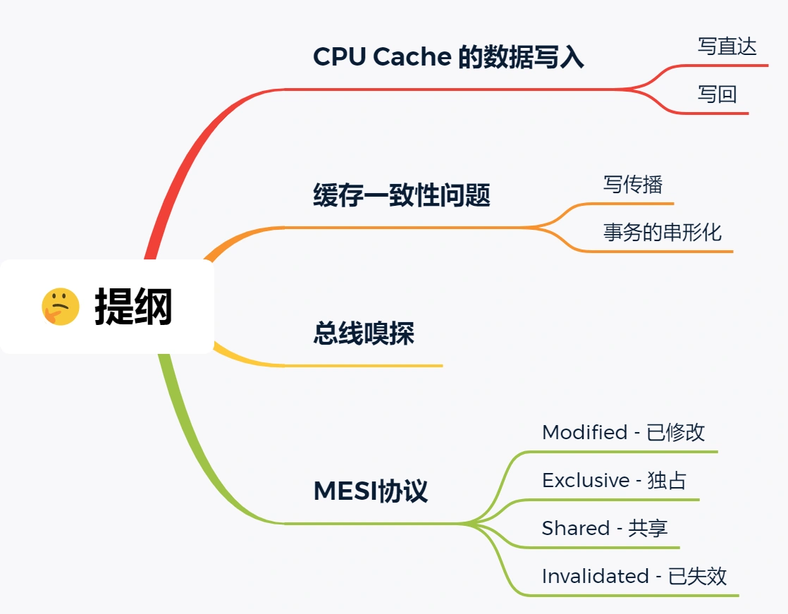
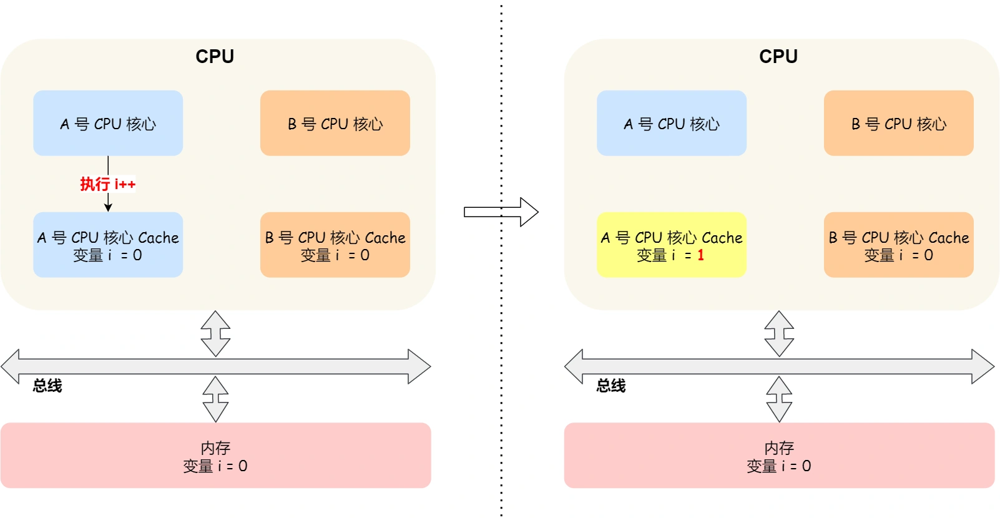

#   CPU 缓存一致性

##  CPUCache的数据写入
随着时间的推移，CPU 和内存的访问性能相差越来越大，于是就在 CPU 内部嵌入了 CPU Cache（高速缓存），CPU Cache 离 CPU 核心相当近，因此它的访问速度是很快的，于是它充当了 CPU 与内存之间的缓存角色。

CPU Cache 通常分为三级缓存：L1 Cache、L2 Cache、L3 Cache，级别越低的离 CPU 核心越近，访问速度也快，但是存储容量相对就会越小。其中，在多核心的 CPU 里，每个核心都有各自的 L1/L2 Cache，而 L3 Cache 是所有核心共享使用的。

我们先简单了解下 CPU Cache 的结构，CPU Cache 是由很多个 Cache Line 组成的，CPU Line 是 CPU 从内存读取数据的基本单位，而 CPU Line 是由各种标志（Tag）+ 数据块（Data Block）组成，你可以在下图清晰的看到：

我们当然期望 CPU 读取数据的时候，都是尽可能地从 CPU Cache 中读取，而不是每一次都要从内存中获取数据。所以，身为程序员，我们要尽可能写出缓存命中率高的代码，这样就有效提高程序的性能，具体的做法，你可以参考我上一篇文章「如何写出让 CPU 跑得更快的代码？」

事实上，数据不光是只有读操作，还有写操作，那么如果数据写入Cache之后，内存与Cache相对应的数据将会不同，这种情况下Cache和内存数据都一致了，于是我们肯定要把Cache中的数据同步到内存中。

问题来了，那在什么时机才把Cache中的数据写回到内存呢？为了应对这个问题，下面介绍两种针对写入数据的方法：
-   写直达(write through)
-   写回(write back)

### 写直达
保持内存与cache一致性最简单的方式是，把数据写入Cache的同时写入内存中，这种方式称为写直达；

在这个方法里，写入前会先判断数据是否已经在Cache中：
-   如果数据已经缓存在Cache中，现将数据更新到Cache中，再写入到内存中；
-   如果数据没有在Cache中，就直接把数据更新到内存中；

写直达法很直观，也很简答，但是问题明显，无论数据在不在Cache中，每次写操作都会写回到内存，这样写操作会将花费大量的时间，无疑性能会受到很大的影响。

### 写回
既然写直达由于每次写操作都会把数据写回到内存，而导致影响性能，于是为了要减少数据写回内存的频率，就出现了写回的方法。

在写回的机制中，当发生写操作时，新的数据仅仅被写入Cache Block中，只有当修改过得Cache Block被替换时，才需要写入到内存中，减少了数据写回的频率，这样便可以提高系统性能。

那具体如何做到的呢？下面来详细说一下：
-   如果当发生写操作时，数据已经在Cache里的话，则把数据更新到CPU Cache中，同时标记CPU Cache里这个CacheBlock为脏Dity的，这个脏的标记代表这个时候CPU Cache line里面这个Cache Block的数据和内存不一致，这种情况是不用把数据写到内存中的。
-   如果当发生写操作时，数据所对应Cache Block里存放的是别的内存地址的数据的话，就要检查这个这个Cache Block有没有被标记为脏的：
    -   如果是脏的话，我们就要把这个Cache Block里的数据写回到内存，然后再把当前要写入的数据，先从内存读取到CPU Cache Block中，然后再把当前要写入的数据写入到Cache block中，最后也把它标记为脏。
    -   如果Cache Block里面的数据没有被标记为脏，，把当前要写入的数据从内存先读入Cache中，然后将数据写入到Cache Block中，最后再把这个Cache Block标记位脏就好了。

可以发现写回这个方法，再把数据写入到Cache中的时候，只有在缓存不命中的情况，并且数据对应的Cache 中的block位脏dity的时候，才会写入到内存，而在缓存命中的情况下，则在写入Cache后，只需要把该数据对应的Cache Block标记为脏即可，而不用写到内存里。

这样的好处是，如果我们大量的操作都能够命中缓存，那么大部分时间CPU都不需要读写内存，自然性能相比写直达会高很多。

为什么缓存为命中时，还要定位Cache Block？这是因为此时要判断数据即将要写入Cache Block中的位置，是否被其他数据占用了此位置，如果这个其他数据是脏数据，那么就要帮忙把它写回到内存。

### 缓存一致性
现在CPU是多核的，由于L1/L2 Cache是多个核心各自独有的，那么会带来多核心缓存一致性问题，如果不能保证缓存一致性问题，就可能造成结果错误。

那缓存一致性问题具体是怎么发生的呢？我们以一个含有两个核心的CPU作为例子看一看。

假设A号核心和B号核心同时运行两个线程，都操作共同的变量i(初始值位0)。

这时如果A号核心执行了i++语句的时候，为了考虑性能，使用了我们前面所说的写回策略，先把值位1的执行结果写入到L1L2Cache中，然后把L1/L2Cache中对应Block标记位dity的，这个时候数据数据其实没有同步到内存中，因为写回策略，只有在A号核心中的这个Cache Block要被替换的时候才会写入到内存中。

如果这时旁边的B号核心尝试从内存中读取i变量的值，则读到的将会是错误的值，因为刚才A号核心更新i值还没写到内存中，内存中的值依然还是0。这就是所谓的缓存一致性问题，A号核心和B号核心的缓存，在这个时候是不一致的，从而会导致执行结果的错误。

那么，要解决这一致性问题，就需要一种机制，来同步两个不同核心里面的缓存数据，要实现这个机制的话，要保证做到下面这两点：
-   第一点，某个CPU核心里的Cache数据更新时，必须传播到其他核心的Cache，这个称为写传播。
-   第二点，某个CPU核心里对数据的操作顺序，必须在其他核心看起来顺序是一样的，这个称为事务的串行化。

第一点写传播很容易理解，当某个核心修改了数据，就必须传播到其他核心的Cache里，而对于第二个事务的串行化，我们举个例子来理解它。

假设我们有一个含有4个核心的CPU，这4个核心都操作共同变量i(初始值为0)，A号核心先把i的值变为100，而此时同一时间里，B号核心先把i值变为200，这里两个修改都会传播到C和D核心。

那么问题就来了，C号核心先收到了A号核心更新数据的事件，在收到B号核心更新数据的事件，因此C号核心看到的变量i先变为100，后变成200。

而如果D的收到的事件是反过来的，则D号核心看到的是变量i先变成200，再变成100，虽然是做到了写传播，但是各个Cache里面的数据还是不一致的。

所以我们要保证C号核心和D号核心都能看到相同顺序的数据变化，比如变量i都是先变成100，再变成200，这样的过程就是事务的串行化。

要实现事务的串行化，要做到2点：
-   CPU核心对于Cache中数据的操作，需要同步给其他CPU核心。
-   要引入锁的概念，如果连个CPU核心里有相同数据的Cache，那么对于这个Cache数据更新，只有拿到了这个锁，才能进行对应数据的更新。

那接下来我们看看，写传播和事务串行化具体使用什么技术实现的。

### 总线嗅探
写传播的原则就是当某个CPU核心更新了Cache中的数据，要把该事件广播通知到其他核心。最常见的实现方式是总线嗅探。

我还是以前面的i变量例子来说明总线嗅探的工作机制，当A号CPU核心修改了L1 Cache 中i变量的值，通过总线把这个事件广播通知给其他所有的核心，然后每个CPU核心都会监听总线上的广播事件，并检查是否有相同的数据在自己的L1 Cache中，如果B号核心的L1 Cache中有该数据，那么也需要把该数据更新到自己的CPU Cache中。

可以发现总线嗅探的方式很简单，CPU需要每时每刻监听总线上的一切活动，但是不管别的核心Cache是否缓存相同的数据，都需要发一个广播时间，这无疑会加重总线的负载。

另外，总线嗅探只是保证了每个CPU核心的Cache更新数据时能被其他核心知道，但是并不能保证事务的串行化。

于是有一个协议基于总线嗅探机制实现了事务串行化，也用状态机制降低了总线带宽压力，这个协议就是MESI协议，这个协议就做到了CPU缓存一致性。

### MESI协议
MESI协议其实是4个状态单词的开头字母的缩写：
-   Modified，已修改
-   EXclusive，独占
-   Shared，共享
-   Invalidated，已失效

这四个状态来标记Cache line四个不同的状态；

已修改状态就是我们前面提到的脏标记，代表该Cache Block上的数据已经被更新过，但是还没有写入到内存，而已失效状态，表示的是这个Cache Block数据已经失效了，不可以读取该数据。

独占和共享状态都表示Cache Block里的数据是干净的，也就是说，这个时候Cache Block里的数据和内存里的数据是一致性的。

独占和共享的差别在于，独占状态的时候，数据只存储在一个CPU 核心的Cache中，而其他CPU核心的Cache没有该数据，这个时候，如果要向独占的Cache写数据，就可以自由的写入，而不需要通知其他CPU核心，因为只有你这有这个数据，就不存在缓存一致性问题了，于是就可以随便操作数据。

另外，在独占状态下的数据，如果有其他核心从内存读取了相同数据到各自的Cache中，那么这个时候，独占状态下就会变成共享状态。

那么，共享状态代表这相同的数据在对个CPU核心的CPU里都有，所以当我们要更新Cache里的数据的时候，不能直接修改，而是需要先向所有的其他CPU核心广播一个请求，要求先把其他核心的Cache中对应的Cache line标记为无效状态，然后再更新当前Cache里面的数据。

我们举个例子来看看这四个状态的转换：
1.  当A号CPU核心从内存中读取变量i的值，数据被缓存在A号CPU核心自己的Cache里面，此时其他CPU核心的Cache没有缓存该数据，于是标记Cache line状态位独占，此时其Cache中数据是一致的；
2.  然后B号CPU核心也从内存中读取了i值，此时会发送消息给其他CPU核心，由于A号CPU核心已经缓存了该数据，所以会把数据返回给B号CPU核心，在这个时候A和B核心缓存了相同的数据，Cache line的状态就会变成共享， 并且其Cache中的内容和内存也是一致的。
3.  当A号CPU核心要修改Cache中i变量的值，发现数据对应的Cache line状态是共享状态，则要向所有其他的CPU核心广播一个请求，要求先把CPU Cache中对应的Cache line标记为无效状态，然后A号CPU核心才能更新Cache中的值，同时标记Cache line为已修改状态，此时CPU Cacheline中数据就跟内存数据不一致了。
4.  如果A号CPU核心继续修改Cache中i变量的值，由于此时Cache line是已修改状态，因此不需要给其他CPU核心发送消息，直接更新数据即可。
5.  如果A号CPU核心的Cache里的i变量对应的Cache line要被替换，发现Cache line状态是已修改状态，就会在替换前先把数据同步到内存。

所以，可以发现当Cache line状态是已修改或者独占状态，修改更新其数据不需要发送广播给其他CPU核心，这在一定程度上减少了总线带宽的压力。

事实上，整个MESI的状态可以用一个有限状态机表示它的状态流转。还有一点，对于不同状态触发的事件操作，可能是来自本地CPU核心发出的广播事件，也可以来自其他CPU核心通过总线发过来的广播事件，下图即是MESI协议的状态图：

MESI 协议的四种状态之间的流转过程，我汇总成了下面的表格，你可以更详细的看到每个状态转换的原因：

##  总结
CPU在读写数据的时候，都是在CPU Cache读写数据的，原因是Cache离CPU很近，读写性能相比内存高出很多，对于CPUCache里没有缓存CPU所需要读取的数据的这种情况，CPU则会从内存中读取数据，并将数据缓存到Cache里面，最后CPU再从Cache中读取数据。

而对于数据的写入，CPU都会先写入到Cache里面，然后再找个合适的时机写入到内存，那就有写直达和写回两种方法，来保证Cache和内存数据的一致性：
-   写直达：只要有数据写入，都会直接写入内存，这种方式简单直观，但是性能就会受限与内存访问速度。
-   写回：对于已经缓存在CPU Cache里的数据，只需要更新其数据就可以了，不用写入到内存，只有在需要把缓存里面的脏数据交换出去的时候，才把数据同步到内存，这种方式在缓存命中率高的情况，性能会更好。

当今CPU都是多核的，每个核心都有各自的独立的L1/L2Cache，只有L3Cache是共享的，所以我们要保证多核缓存一致性，否则会出现错误的结果。

要向实现缓存一致性，关键是要满足2点：
-   第一点是写传播，也就是当某个CPU核心发生写入操作时，需要把该事件广播给其他核心；
-   第二点是事务的串行化，这个很重要，只有保证了这个，才能保证我们的数据是一致性的，我们的程序在各个不同的核心上运行的结果是一样的；

基于总线嗅探机制的MESI协议，也就满足了上面两点，因此它是保障缓存一致性的协议。

MESI协议，是已修改、共享、独占、失效这四个状态的英文缩写的组合。整个MSI状态的变更，则是根据来自本地CPU核心的请求，或者来自其他CPU核心通过总线传输过来的请求，从而构成一个流动的状态机。另外，对于已修改或独占状态的Cache line，修改更新数据不需要广播给其他CPU核心。