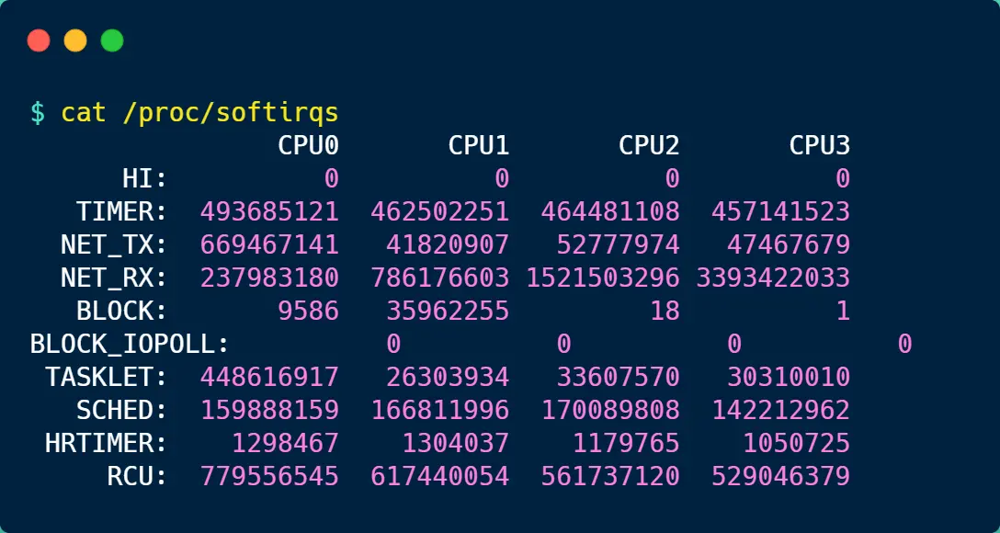
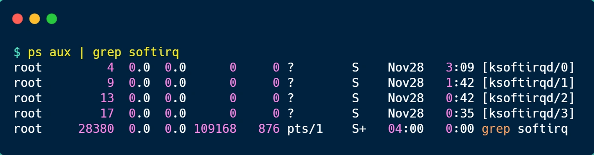

#   什么是软中断？
今日的技术主题：什么是软中断？

##  中断是什么？
先来看看什么是中断？在计算机中中断是用来响应硬件设备请求的一种机制，操作系统收到硬件设备的中断请求，会打断正在执行的进程，然后调用内核中的中断处理程序来响应请求。

这样的解释可能过于学术了，容易云里雾里，我就举个生活中取外卖的例子。

小林中午搬完砖，肚子饿了，点了份白切鸡外卖，这次我带闪了，没有被某团大数据杀熟。虽然平台上会显示配送进度，但是我也不能一直盯着呀，时间很宝贵，当然得去干别的事情，等外卖到了配送员会打电话通知我，电话响了，我就会停下手中的事情，去拿外卖。

这里的打电话，其实就是对应计算机中的中断，会打断其他进程的运行，所以中断请求的响应程序，也就是中断处理程序，要尽可能快的执行完，这样可以减少对正常进程调度的影响。

而且，中断处理程序在响应中断时，可能还会临时关闭中断，这意味着，如果当前中断处理程序没有执行完以前，系统中的其他中断请求都无法被响应，也就是说中断可能会丢失，所以中断处理程序要短且快。

还是会到外卖的例子，小林到了晚上有点起了外卖，这次为了犒劳自己，共点了两份外卖，一份小龙虾和一份奶茶，并且是由不同的配送员来配送，那么问题来了，当第一份外卖送来的时候，打了一个长长的电话，说了一些乱七八糟的话，比如给个好评等等，但如果这个时候另一位配送员也想给我打电话。

很明显，这时第二位配送员因为我在通话中(相当于关闭了中断的响应)，自然就无法打通我的电话，他可能尝试几次后就走了(相当于丢了一次中断)。

##  什么是软中断？
前面我们也提到了，中断请求的处理程序要短且快，这样才能减少对正常程序运行调度的影响，而且中断处理程序可能会短暂的关闭中断，这个时候如果中断处理程序执行时间过长，可能在还未执行完中断处理程序前，会丢失当前的其他中断请求。

那Linux为了解决中断处理程序执行过长和中断丢失的问题，将中断分成了2个阶段，分别是上半部和下半部。

-   上半部用来快速处理中断，一般会短暂关闭中断请求，主要负责处理跟硬件紧密相关或者时间敏感的事情。
-   下半部用来延迟处理上半部未完成的工作，一般以内核线程的方式运行。

前面外卖的例子，由于第一个配送员长时间和我通话，则导致第二个外卖员无法拨通我的电话，其实当我接到第一个配送员电话的时候可以告诉配送员说我在楼下，剩下的事情，等我们见面再说(上半部)，然后就可以挂断电话，到楼下后，再拿外卖，以及跟配送员说其他的事情(下半部)。

这样第一位配送员就不会占用我的手机太长时间，当第二个配送员正好过来时，会有很大的几率拨通我的电话。

再举一个计算机中的例子，常见的网卡接收网络包的例子。

网卡收到网络包后，通过DMA方式，将接收到的数据写入内存，接着会通过硬件中断通知内核有新的数据到了，于是内核就会调用对应的中断处理程序来处理该事件，这个事件的处理也是会分成上半部和下半部。

上半部处理的事情很少，会先禁止网卡中断，避免频繁硬中断，而降低内核的工作效率。接着，内核会触发一个软中断，把一些处理比较负责且耗时的事情，交给软中断处理程序去做，也就是中断的下半部，其主要是从内存中找到网络数据，在按照网络协议栈，对网络数据进行逐层解析和处理，最后把数据传递给应用程序。

所以，中断处理程序的上半部和下半部可以理解为：
-   上半部直接处理硬件请求，也就是赢中断，主要负责短暂的工作，特点是快速执行；
-   下半部是由内核触发，也就是软中断，主要负责上半部未完成的工作，通常都是比较耗时的事情，特点是延迟执行。

还有一个区别，硬中断(上半部)是会打断CPU正在执行的任务，然后立即执行中断处理程序，而软中断(下半部)是以内核线程的方式运行的，并且每一个CPU都对用对应一个软中断内核线程，名字通常为ksoftrqd/CPU编号，比如0号CPU对应软中断内核线程的名字是ksoftrqd/0。

不过，软中断不只包括硬件设备中断处理程序的下半部，一些内核自定义事件也属于软中断，比如内核调度、RCU锁(内核里常用的一种锁)。

### 系统里有那些软中断？
在linux系统中，我们可以通过/proc/softrqs的内容来知晓软中断的运行情况，以及/proc/interrupts的内容来知晓硬中断的运行情况。

接下来，就来简单解析一下/proc/softrqs文件内容:

你可以看到，每一个CPU都有自己对应的不同类型软中断的累计运行次数，有3点需要注意：
-   第一点，要注意第一列的内容，它是代表着软中断的类型，在我的系统里，软中断包含了10个类型，分别对应不同的工作类型，比如，NET_RX表示网络接收中断，NET_TX表示网络发送中断、TIMER表示定时中断，RCU表示RCU锁中断、SCHED表示内核调度中断。
-   第二点，要注意，同一种中断在不同CPU的分布情况，正常情况下，同一种中断在不同CPU上的累计次数差不多，比如我的系统里，NET_RX在CPU0、CPU1、CPU2、CPU3上的中断次数基本是同一个数量级，相差不多。
-   第三点，这些数值是系统运行以来的累计中断次数，数值大小没什么参考意义，但是系统中的中断次数的变化率才是我们要关注的，我们可以使用watch -d cat /proc/softirqs命令查看中断次数变化的速率。

前面提到过，软中断是以内核线程的方式执行的，我们可以用ps命令查看到，下面这个就是在我的服务器上查到软中断内核线程的结果：

可以发现，内核线程的名字外面都有括号，这说明ps无法获取他们的命令行执行参数，所以一般来说，名字在中括号里的都可以认为是内核线程。

