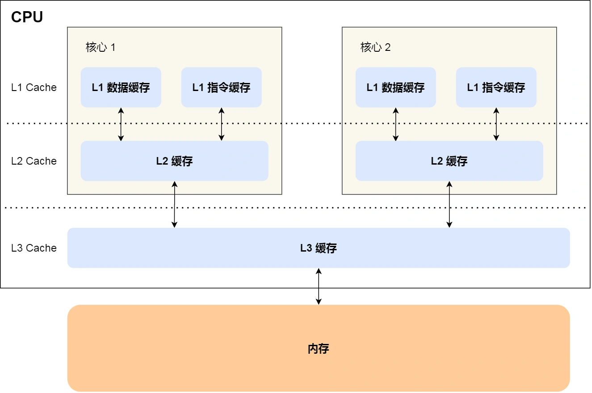
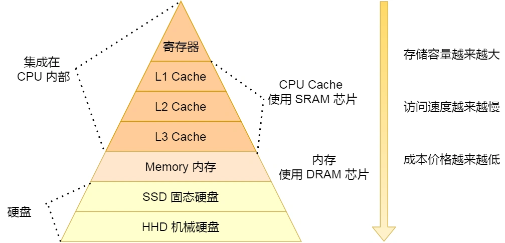

#   磁盘比内存慢几万倍？
大家如果想自己组装电脑的话，肯定需要购买一个CPU，但是存储方面的设备，分类比较多，那我们肯定不能只买一种存储设备，比如你除了要买内存、还要买硬盘，而针对于硬盘，我们可以选择是固态硬盘还是机械硬盘。

相信大家都知道内存和硬盘都属于计算机的存储设备，断电后内存的数据是会丢失的，而硬盘则不会，因为硬盘是持久化存储设备，同时也是一个I/O设备。

但是其实CPU内部也有存储数据的组件，这个应该比较少人注意到，比如寄存器、CPU L1/L2/L3 Cache也都属于存储设备，只不过他们能存储的数据非常少，但是他们因为靠近CPU核心，所以访问速度都和快，快过硬盘好几个数量级。

问题来了，那机械硬盘、固态硬盘、内存这三个存储器，到底和CPU L1Cache 相比速度差多少呢？

在回答这个问题之前，我们先来看看存储器的层次结构，好让我们对存储器有个整体的认识。

##  存储器的层次结构
我们想象中一个场景，大学期末准备考试了，你前去图书馆临时抱佛脚，那么在看书的时候，我们的大脑会思考问题。也会记忆知识点，另外，我们也会通常把常用的数放到自己的桌子上，当我们要找一本不常用的数，则会去图书馆的书架上找。

就是这么一个小小的场景，已经把计算机的存储结构都涵盖了。

我们可以把CPU比喻成我们的大脑，大脑正在思考的东西，就好比CPU中的寄存器，处理速度是最快的，但是能存储的数据量也是最少的，毕竟我们也不能一下同时思考太多东西。

我们大脑中的记忆，就好比CPU cache，中文称为CPU高速缓存，处理速度相比CPU慢了一点，但是能存储的数据量多了一点。

CPU Cache通常会分为L1L2L3三层，其中L1Cache通常分成数据缓存和指令缓存，L1是距离CPU最近的，因此它比L2L3的读写速度都快、存储空间都小。我们大脑中的短期记忆，就好比L1Cache，而长期记忆就好比L2L3Cache。

寄存器和CPU Cache都是在CPU内部，跟CPU挨的很紧，因此它们的读写速度非常快，但是能存储的数据非常少，毕竟CPU就那么丁点大。

知道CPU内存的存储的层次分布，我们放眼看看CPU外部的存储器。

当我们大脑记忆中没有资料的时候，可以从书桌或者书架上拿书来阅读，那我们桌子上的书，就好比内存，我们虽然可以一伸手就拿到，但是读写速度肯定远慢于寄存器，那图书馆书架上的书，就好比硬盘，能存储的数据非常大，但是读写的速度相比内存差好几个数量级，更别说寄存器了。


存储器通常可以分为这么几个级别：

-   寄存器；
-   CPU Cache；
    -   L1 Cache
    -   L2 Cache
    -   L3 Cache
-   内存
-   SSD/HDD硬盘

###  寄存器
最靠近CPU的控制单元和逻辑计算单元的存储器，就是寄存器了，它使用的材质也是最快的，因此加个也是最贵的，那么数量不是很多。

寄存器的数量通常在几十到几百之间，每个寄存器可以用来存储一定字节的数据，比如：
-   32位CPU中大多数寄存器可以存储4个字节；
-   64位CPU中大多数寄存器可以存储8个字节；

寄存器的访问速度非常快，一般要求在半个CPU时钟周期内完成读写，CPU时钟周期跟CPU主频息息相关，比如2.4GHz的CPU那么它的时钟周期就是1/2G，也就是0.5ns。

CPU处理一条指令的时候，除了读写寄存器，还需要解码指令、控制指令执行和计算。如果寄存器的速度太慢，则会拉长指令的处理周期，从而给用户的感觉，就是电脑很慢。

###  CPU Cache
CPU Cache用的是一种叫SRAM(Static Random-Access Memory, 静态随机存储)的芯片。
SRAM之所以叫静态存储器，是因为只要有电，数据就可以保持存在，而一旦断电，数据就会丢失了。

在SMAR里面，一个bit的数据，通常需要6个晶体管，所以SMAR的存储密度不高，同样的物理空间，能存储的数据是有限的，不过也因为SMAR的电路简答，所以访问速度非常快。

CPU的高速缓存，通常可以分为L1/L2/L3这样的三层高速缓存，也称为1级缓存二级缓存三级缓存。


####    L1 Cache
L1高速缓存的访问速度几乎和寄存器一样快，通常只需要2~4个时钟周期，而大小在几十Kb到几百Kb不等。

每个CPU核心都有一块属于自己的L1高速缓存，指令和数据在L1是分开存放的，所以L1高速缓存通常分成指令缓存和数据缓存。

在Linux系统里，我们可以通过这条命令， 查看CPU中L1 Cache数据缓存的容量大小；
```sh
$ cat /sys/devices/system/cpu/cpu0/cache/index0/size
32K
```

而查看L1 Cache指令缓存容量的大小，则是：
```sh
$ cat /sys/devices/system/cpu/cpu0/cache/index1/size
32K
```

####    L2 Cache
L2 高速缓存同样每个CPU核心都有，但是L2 Cache位置比L1 Cache距离CPU核心更远，它大小比L1 Cache更大，CPU型号不同大小也就不同，通常在几百KB到几MB不等，访问速度则更慢，速度在10~20个时钟周期。

在linux系统中，我们可以通过这条命名，查看CPU中L2 Cache的容量大小：
```sh
$ cat /sys/devices/system/cpu/cpu0/cache/index2/size
256K
```

####    L3 Cache
L3 Cache通常是多个CPU核心公用的，位置比L2 Cache距离CPU核心更远，大小也会更大些，通常在几MB到几十MB不等，具体更加CPU型号而定。
访问速度相对也比较慢一些，访问速度在20~60个时钟周期

在linux系统中，我们可以使用这条命令，查看CPU里L3 Cache的容量大小
```sh
$ cat /sys/devices/system/cpu/cpu0/cache/index3/size 
3072K
```

### 内存
内存用的芯片和CPU Cache有所不同，它使用的是一种叫做DRAM(Dynamic Random Accecss Memory)的芯片。
相比SRAM，DRAM的精度更高，功耗更低，有更大的容量，而且造价比SRAM便宜。

DRAM存储一个bit数据，只需要一个晶体管和一个电容就能存储，但是数据会被存储在电容里，电容会不断漏电，所以需要不断定时刷新电容，才能保证数据不会丢失，这就是DRAM被称为动态存储的原因，只有不断刷新，数据才能被存储起来。

DRAM的数据访问电路和刷新电路都比SRAM复杂，所以访问速度会更慢，内存速度大改在200~300个时钟周期之间。

### SSD/HDD 硬盘
SSD(Solid-State disk)就是我们常说的固态硬盘，结构和内存类似，但是它相比内存的优点是断电后数据还是在的，而内存、寄存器、CPU Cache断电后数据都会丢失。内存的读写速度比SSD大改快10~1000倍。

当然，还有一款传统硬盘，也就是我们常说的机械硬盘(Hard disk drive),它是通过物理读写的方式来访问数据的，因此它的访问速度非常慢， 它的速度比内存慢10w倍左右。

由于SSD的加个快接近机械硬盘了，因此机械硬盘已经逐渐被SSD替代了。

##  存储器的层次关系
现代的一台计算机，都用上了CPU Cache、内存、到SSD或HDD硬盘这些存储设备了。   

其中，存储空间越大的设备，其访问速度越慢，所需要的成本也相对越少。

CPU并不会直接和每一种存储设备直接打交道， 而是每一种存储器设备只和它相邻的存储器设备打交道。

比如，CPU Cache的数据是从内存加载过来的，写回数据的时候也只是写回到内存，CPU Cache不会直接把数据写到硬盘，也不会直接从硬盘加载数据，而是先加载到内存，再从内存加载到CPU Cache中。

所以，每个存储器只和相邻的一层存储器设备打交道，并且存储设备为了追求更快的速度，所需要的材料的成本也必然是更高，也正因为成本太高，所以CPU内部的寄存器、L1L2L3 Cache只好用较小的容量，相反，内存、硬盘则可以用更大的容量，这就是我们今天所说的存储器层次结构。

另外，当CPU需要访问内存中某个数据的时候，如果寄存器有这个数据，CPU就直接从寄存器去数据即可，如果寄存器没有这个数据，CPU就会查询L1 Cache，如果L1没有，则查询L2 Cache，L2还是没有的话，就查询L3 Cache，L3 Cache依然没有的话，就去内存查询。

所以，存储层次结构也形成了缓存的体系。

##  存储器之间的实际价格和性能差距
前面我们知道了，速度越快的存储器，造价成本往往也越高，那我们就以实际的数据来看，不同层级的存储器之间的性能和价格差异。

下面这张表格是不同层级的存储器之间的成本对比图：

你可以看到L1 Cache的访问延迟时间是1ns，而内存已经是100纳秒了，相比L1 Cache速度慢了100倍。

##  总结
各种存储器之间的关系，可以用我们在图书馆学习这个场景来理解。

CPU可以比喻成我们的大脑，我们当前正在思考和处理的思考的过程，就好比CPU中寄存器处理数据的过程，速度极快，但是容量极小，而CPU中L1-L3 Cache就好比我们大脑中的短期记忆和长期记忆，需要小小花费点时间来调取数据并处理。

我们前面的桌子就相当于内存，能放下更多的数(数据)，但是找起来和看起来就要花费一些时间，相比CPU Cache慢不少，而图书馆书架相当于硬盘，能放下比内存更多的数据，单找起来更费时间，可以说是最慢的存储器。

从寄存器、CPU Cache，到内存、硬盘，这样一层层下来的存储器，访问速度越来越慢，存储容量越来越大，价格越来越便宜，而且每个存储器只和相邻的一层存储器打交道，于是这样就形成了存储器的层次结构。

再来回答，开头的问题：那机械硬盘、固态硬盘、内存这个三个存储器，到底和L1 Cache相比速度差多少呢？

CPU L1Cache随机访问延时是1纳秒，内存则是100纳秒，所以CPU L1Cache比内存快100倍左右。

SSD随机访问的延时是150微秒，所以CPU L1 Cache 比SSD快150000倍左右。

