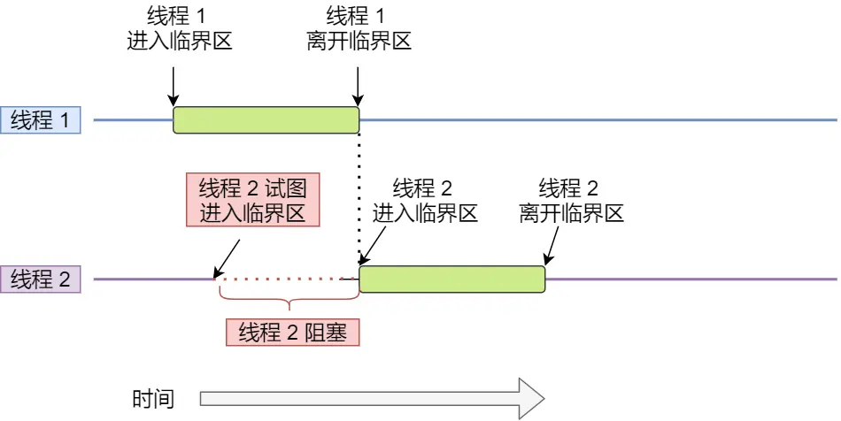

# 多线程

## 多线程冲突了怎么办？
> 先来看看一个虚拟的小故事

已经晚上11点了，程序员小明的双手还在键盘上飞舞，眼神依然注释这电脑屏幕。

没办法这段时间公司业绩增长中，需求自然也多了起来，加班自然也少不了。

天气变化莫测，这是窗外下起了蓬勃大雨，同时闪电轰鸣。

但这一丝没有影响到小明，始料未及，突然一道巨大的雷一闪而过，办公楼就这么停电了，随后整栋楼都在回荡着小明那一声撕心裂肺的卧槽。

此时求小明的心理阴影面积...

等小明心里平复后，突然肚子非常的痛，想上厕所，小明心想肯定是晚上吃的某宝王有问题。

整栋楼都停了电，小明两眼一抹黑，啥都看不见，只能靠摸墙的方法，一步一步来到厕所门口。

到了厕所(共享资源)，由于实在太急，小明直接重进了厕所，用手摸索这着刚好第一个门没锁，便夺门而入。

这就荒唐了，这个门里正好小红在上厕所，正好这个厕所门是坏了的，没办法锁门。

黑暗中，小红虽然看不见，但靠着声音，发现自己这扇门前有动静，觉得不对劲，于是铆足了力气，用她穿着高跟鞋的脚用力踹了过去。

小明很幸运，没有踢中命根子，撕心裂肺喊了一声痛。

故事说完了，扯了那么多，实际上就是为了说明，对于共享资源，如果没有上锁，在多线程环境里，那就可能会发生翻车现场。
.webp)

### 竞争与协作
在单核CPU里，为了实现多个程序同时运行的假象，操作系统通常以时间片调度方式，让每个进程每次执行一个时间片，时间片用完了，就切换下一个进程运行，由于这个时间片的时间很短，于是就造成了并发的假象。

另外，操作系统也为每个进程创建巨大、私有的虚拟空间的假象，这种地址空间的抽象让每个程序好像拥有自己的内存，而实际上操作系统在背后秘密的让多个地址空间复用物理内存或者磁盘。

如果一个程序只有一个执行流程，也代表它是单线程的。当然一个程序可以有多个执行流程，也就是所谓的多线程程序，线程是调度的基本单位，进程则是资源分配的基本单位。

所以，线程之间是可以共享进程的资源，比如代码段、堆空间、数据段、打开的文件等资源。但是每个线程拥有自己独立的栈空间。

那么问题就来了，多个线程如果竞争共享资源，如果不采取有效的措施，则会造成共享数据的混乱。

我们做个小实验，创建两个线程，他们分别对共享变量i自增1执行10000次，如下代码：

按理说，i变量最后的值应该是20000，但很不幸并不是如此，我们对上面的程序执行一下：

运行了两次，发现出现了 i 值的结果是 15173，也会出现 20000 的 i 值结果。

每次运行不但会产生错误，而且得到不同的结果。在计算机里是不能容忍的，虽然是小概率出现的错误，但是小概率事件它一定是会发生的，「墨菲定律」大家都懂吧。

> 为什么会发生这种情况？

为了解释为什么会发生这汇总情况，我们必须了解编译器为更新计数器i变量生成的代码序列，也就是要了解汇编指令的执行顺序。

在这个例子中，我们只是想给i加上数字1，那么它对应的汇编指令执行的过程是这样的：

可以发现，只是单纯给i加上数字1，在CPU运行的时候，实际上要执行3条指令。

设想我们的线程1进入这个代码区域，他将i的值(假设此时是50)从内存加载到它的寄存器中，然后他向寄存器加1，此时寄存器中的i值是51。

现在发生了一件很不幸的事情，始终终端发生。因此操作系统将当前正在运行的线程状态保存到线程的线程控制块(TCB)。

现在更糟糕的事情发生了，线程2被调度运行，并进入同一段代码，它也执行了第一条指令，从内存获取i值并将其放入到寄存器中，此时内存中i的值仍为50，因此线程2寄存器中的i值也是50。假设线程2执行接下来两条指令，将寄存器中i值加1，然后将寄存器中的值保存到内存中，于是此时全局变量i变成51.

最后，又发生一次上下文切换，线程1回复执行。还记得它已经执行了两条汇编指令，现在准备执行最后一条指令。会议一下，线程1寄存器中i的值是51，因此，执行最后一条指令后，并保存到内存中，全局变量i的值再次被设置为51.

简单来说，增加i（值为50）的代码被执行两次，按理来说，最后i的值应该是52，但是由于不可控的调度，导致最后i值却是51.

针对上面线程1和线程2的执行过程，我画了一张流程图，会更明确一些：

#### 互斥的概念
上面展示情况成为竞争条件，当多线程互相竞争操作共享变量时，由于运气不好，即在执行过程中发生了上下文切换，我们得到了错误的结果，事实上每次运行都可能得到不同的结果，因此输出结果存在不确定性。

由于多线程执行操作共享变量的这段代码可能会导致竞争状态，因此我们将此段代码成为临界区，它是访问共享资源的代码片段，一定不能给多线程同步执行。

我们希望这段代码是互斥的，也就是说保证一个线程在临界区执行时，其他线程应该被阻止进入临界区。

另外说一下，互斥也不一定只针对多线程，在多进程竞争共享资源的时候，也同样是使用互斥的方式来避免竞争所造成的资源混乱。

#### 同步的概念
互斥解决了并发进程/线程对临界区的使用问题，这种给予临界区控制的交互作用是比较简单的，只要一个进程/线程进入了临界区，其他试图想进入临界区的线程/进程都会被阻塞者，直到当前访问临界区的进程/线程离开临界区。

我们都知道在多线程里，每个线程并不一定是顺序执行的，他们基本是以各自独立的、不可预知的速度向前推进，但有时候我们有希望多线程能密切合作，以实现一个共同的任务。

例子，线程1是负责读入数据的，而线程2是负责处理数据的，这两个线程是相互合作、相互依赖的。线程2在没有收到线程1的唤醒通知时，就会一直阻塞等待，当线程1读完数据需要吧数据传给线程2时，线程1会唤醒线程2，并把数据交给线程2处理。

所谓同步，就是并发进程/线程在一些关键点上可能需要互相等待与互通消息，这种互相制约的等待与互通消息称为进程/线程同步。

举个生活的同步例子，你肚子饿了想要吃饭，你叫妈妈早点做菜，妈妈听到后就开始做菜，但是在妈妈没有做完饭之前，你必须阻塞等待，等妈妈做完饭后，自然会通知你，接着你吃饭的事情就可以进行了。

注意，互斥和同步是两个不同的概念：
- 同步就好比：操作A应在操作B之前执行，操作C必须在操作A和操作B都万成之后才能执行等；
- 互斥就好比：操作A和操作B不能同时执行；

### 互斥与同步的实现和使用
在进程/线程并发执行的过程中，进程/线程之间存在协作的关系，例如有互斥、同步的关系。

为了实现进程/线程间正确的协作，操作系统必须提供实现进程协作的措施和办法，主要方法有两种：
- 锁：加锁/解锁操作；
- 信号量：P、V操作；

这两个都可以方便的实现进程线程互斥，而信号量比锁的功能更强一些，它还可以方便的实现进程线程同步。

#### 锁
使用加锁和解锁操作可以解决并发线程/进程的互斥问题。
任何想进入临界区的进程/线程，必须先执行加锁操作，若加锁顺利通过，则线程可以进入临界区；在完成对临界资源的访问后，在执行解锁操作，以释放改临资源。

根据锁的实现不同，可以分为忙等待锁和无忙等待锁。
> 我们先来看看忙等待锁

在说明忙等待锁的实现之前，先介绍现代CPU体系结构提供的特殊原子操作指令-- 测试和位置指令。

如果用C代码表示test-and-set指令，形式如下：

测试并设置指令做了下述事情：
- 把old_ptr更新为new的新值；
- 返回old_ptr的旧值

当然，关键是这些代码是原子执行。因为既可以测试旧值，又可以设置新值，所以我们把这条指令叫做测试并设置。

那什么是原子操作呢？原子操作就是要么全部执行，要么都不执行，不能出现执行到一半的中间状态

我们可以运用 Test-and-Set 指令来实现「忙等待锁」，代码如下：

我们来解释为什么这个锁能工作：
- 第一个场景是，首先假设一个线程在运行，调用lock()，没有其他线程持有锁，所以flag = 0。当调用TestAndSet(flag,1)方法，返回0，线程会跳出while循环，获取锁。同时也会原子的设置flag为1，标志锁已经被持有。当线程离开临界区，调用unlock()将flag清理为0.
- 第二种场景，当某一个线程已经持有锁(即flag为1)。本线程调用lock()，然后调用testandset(flag,1)，这一次返回1。只要另一个线程一直持有锁，TestAndSet()会重复返回1，本线程一直忙等。当flag终于被改为0，本线程会调用TestAndSet()，返回0并且原子地设置为1，从而获取锁，进入临界区。

很明显，当获取不到锁时，线程会一直while循环，不做任何事情，所以就被称为忙等待锁，也被称为自旋锁。

这是最简单的一种锁，一直自旋，利用CPU周期，直到锁可用。在单处理器上，需要抢占式的调度CPU(即不断通过时钟中断一个线程，运行其他线程)。否则，自旋锁无法在CPU上使用，因为一个自旋锁的线程永远不会放弃CPU。

> 再来看看无等待锁

无等待锁顾明思议就是获取不到锁的时候，不用自旋。

既然不想自旋，那么当没有获取到锁的，就把当前线程放入到锁的等待队列，然后执行调度程序，把CPU让给其他线程执行。

本次只提出了两种简单锁的实现方式。当然在操作系统实现中，会更复杂，单也离不开本例子两个进本元素。

#### 信号量
信号量是操作系统提供的一种协调共享资源的方法。

通常信号量表示资源的数量，对应的变量是一个整形(sem)变量。
另外还有两个原子操作的系统调用来控制信号量，分别是：
- P操作：将sem减1，相减后，如果sem<0, 则线程/进程进入阻塞等待，否则继续，表明P操作可能会阻塞。
- V操作：将sem加1，相加后，如果sem<=0,唤醒一个等待的线程，表明V不会阻塞。

> TIP
> 很多人问，V操作中sem<=0是不是写反了？
> 没有写反，我举个例子，如果sem=1，有三个线程进行P操作：
> - 第一个线程P操作后，sem=0；
> - 第二个线程P操作后，sem=-1；
> - 第三个线程P操作后，sem=-2；
> 这时，第一个线程执行V操作后，sem是-1，因为sem<=0，所以要唤醒第二或第三个线程。

P操作是用在进入临界区之前，V操作是作用在离开临界区之后，这两操作是成对出现的。

> 操作系统是如何实现PV操作的呢？

信号量结构和PV操作的算法如下图：

PV操作的函数是由操作系统实现和管理的，所以操作系统已经使得执行PV函数时具有原子性的。

> PV操作如何使用的呢？
信号量不仅可以实现临界区的互斥访问控制，还可以线程间的事件同步。

我们先来说说如何使用信号量实现临界区的互斥访问。

为每类共享资源设置一个信号量s,其初始值为1，表示该临界资源未被占用。

只要把进入临界区的操作置于P(s)和V(s)之间，即可实现进程/线程的互斥。

此时，任何想进入临界区的线程，必须在互斥信号量上执行P操作，在完成对临界区资源的访问再执行V操作。由于互斥信号量的初始值为1，故在第一个线程执行P操作后s值变为0，表示临界资源空闲，可分配给该线程，使之进入临界区。

若此时又有第二个线程想进入临界区，也应先执行P操作，结果使s变为负数，这就意味着临界资源已被占用，因此第二个线程被阻塞。

并且直到第一个线程执行V操作，释放临界资源而恢复s值为0后，才唤醒第二个线程，使之进入临界区，待它完成临界资源的访问后，用执行了V操作，使s恢复初始值为1.

对于两个并发的线程，互斥信号量的值仅取1、0和-1三个值，分别表示：
- 如果互斥信号量为1，表示没有线程进入临界区；
- 如果互斥信号量为0，表示有一个线程进入临界区；
- 如果互斥信号量为-1，表示有一个线程进入临界区，同时有一个线程等待进入。

通过互斥信号量的方式，就能保证临界资源在任意时刻只有一个线程在执行，就达到了互斥的效果。

再来，我们说说如何使用信号量事件同步。

同步的方式是设置一个信号量，其初始值为0.

#### 生产者-消费者

生产者-消费者问题描述：
- 生产者在生成数据后，放在一个缓冲区中；
- 消费者从缓冲区取出数据处理；
- 任何时刻，只有一个生产者或者消费者可以访问缓冲区；

我们对问题分析可以得出：
- 任何时刻只能有一个线程操作缓冲区，说明操作缓冲区是临界代码，需要互斥；
- 缓冲区空时，消费者必须等待生产者生成数据；缓冲区满时，生产者必须等待消费者取出数据。说明生产者和消费者需要同步。

那么我们需要三个信号量，分别是：
- 互斥信号量mutex：用于互斥访问缓冲区，初始化值为1；
- 资源信号量fullbuffers：用于消费者询问缓冲区是否有数据，有数据则读取数据，初始化值为0.
- 资源信号量emptyBuffers：用于生产询问缓冲区是否有空位，有空位则生成数据，初始化值为n.

具体代码：

如果消费者线程一开始执行 P(fullBuffers)，由于信号量 fullBuffers 初始值为 0，则此时 fullBuffers 的值从 0 变为 -1，说明缓冲区里没有数据，消费者只能等待。

接着，轮到生产者执行 P(emptyBuffers)，表示减少 1 个空槽，如果当前没有其他生产者线程在临界区执行代码，那么该生产者线程就可以把数据放到缓冲区，放完后，执行 V(fullBuffers) ，信号量 fullBuffers 从 -1 变成 0，表明有「消费者」线程正在阻塞等待数据，于是阻塞等待的消费者线程会被唤醒。

消费者线程被唤醒后，如果此时没有其他消费者线程在读数据，那么就可以直接进入临界区，从缓冲区读取数据。最后，离开临界区后，把空槽的个数 + 1。

