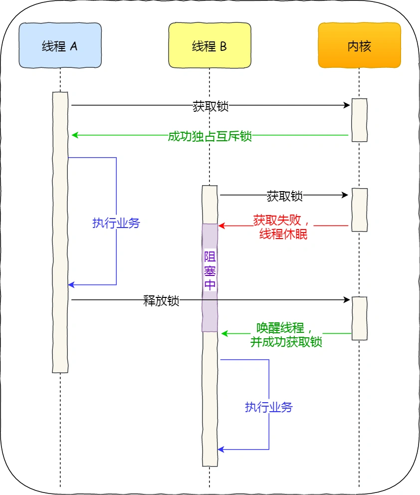

# 多线程

## 多线程冲突了怎么办？
> 先来看看一个虚拟的小故事

已经晚上11点了，程序员小明的双手还在键盘上飞舞，眼神依然注释这电脑屏幕。

没办法这段时间公司业绩增长中，需求自然也多了起来，加班自然也少不了。

天气变化莫测，这是窗外下起了蓬勃大雨，同时闪电轰鸣。

但这一丝没有影响到小明，始料未及，突然一道巨大的雷一闪而过，办公楼就这么停电了，随后整栋楼都在回荡着小明那一声撕心裂肺的卧槽。

此时求小明的心理阴影面积...

等小明心里平复后，突然肚子非常的痛，想上厕所，小明心想肯定是晚上吃的某宝王有问题。

整栋楼都停了电，小明两眼一抹黑，啥都看不见，只能靠摸墙的方法，一步一步来到厕所门口。

到了厕所(共享资源)，由于实在太急，小明直接重进了厕所，用手摸索这着刚好第一个门没锁，便夺门而入。

这就荒唐了，这个门里正好小红在上厕所，正好这个厕所门是坏了的，没办法锁门。

黑暗中，小红虽然看不见，但靠着声音，发现自己这扇门前有动静，觉得不对劲，于是铆足了力气，用她穿着高跟鞋的脚用力踹了过去。

小明很幸运，没有踢中命根子，撕心裂肺喊了一声痛。

故事说完了，扯了那么多，实际上就是为了说明，对于共享资源，如果没有上锁，在多线程环境里，那就可能会发生翻车现场。
.webp)

### 竞争与协作
在单核CPU里，为了实现多个程序同时运行的假象，操作系统通常以时间片调度方式，让每个进程每次执行一个时间片，时间片用完了，就切换下一个进程运行，由于这个时间片的时间很短，于是就造成了并发的假象。

另外，操作系统也为每个进程创建巨大、私有的虚拟空间的假象，这种地址空间的抽象让每个程序好像拥有自己的内存，而实际上操作系统在背后秘密的让多个地址空间复用物理内存或者磁盘。

如果一个程序只有一个执行流程，也代表它是单线程的。当然一个程序可以有多个执行流程，也就是所谓的多线程程序，线程是调度的基本单位，进程则是资源分配的基本单位。

所以，线程之间是可以共享进程的资源，比如代码段、堆空间、数据段、打开的文件等资源。但是每个线程拥有自己独立的栈空间。

那么问题就来了，多个线程如果竞争共享资源，如果不采取有效的措施，则会造成共享数据的混乱。

我们做个小实验，创建两个线程，他们分别对共享变量i自增1执行10000次，如下代码：

按理说，i变量最后的值应该是20000，但很不幸并不是如此，我们对上面的程序执行一下：

运行了两次，发现出现了 i 值的结果是 15173，也会出现 20000 的 i 值结果。

每次运行不但会产生错误，而且得到不同的结果。在计算机里是不能容忍的，虽然是小概率出现的错误，但是小概率事件它一定是会发生的，「墨菲定律」大家都懂吧。

> 为什么会发生这种情况？

为了解释为什么会发生这汇总情况，我们必须了解编译器为更新计数器i变量生成的代码序列，也就是要了解汇编指令的执行顺序。

在这个例子中，我们只是想给i加上数字1，那么它对应的汇编指令执行的过程是这样的：

可以发现，只是单纯给i加上数字1，在CPU运行的时候，实际上要执行3条指令。

设想我们的线程1进入这个代码区域，他将i的值(假设此时是50)从内存加载到它的寄存器中，然后他向寄存器加1，此时寄存器中的i值是51。

现在发生了一件很不幸的事情，始终终端发生。因此操作系统将当前正在运行的线程状态保存到线程的线程控制块(TCB)。

现在更糟糕的事情发生了，线程2被调度运行，并进入同一段代码，它也执行了第一条指令，从内存获取i值并将其放入到寄存器中，此时内存中i的值仍为50，因此线程2寄存器中的i值也是50。假设线程2执行接下来两条指令，将寄存器中i值加1，然后将寄存器中的值保存到内存中，于是此时全局变量i变成51.

最后，又发生一次上下文切换，线程1回复执行。还记得它已经执行了两条汇编指令，现在准备执行最后一条指令。会议一下，线程1寄存器中i的值是51，因此，执行最后一条指令后，并保存到内存中，全局变量i的值再次被设置为51.

简单来说，增加i（值为50）的代码被执行两次，按理来说，最后i的值应该是52，但是由于不可控的调度，导致最后i值却是51.

针对上面线程1和线程2的执行过程，我画了一张流程图，会更明确一些：


#### 互斥的概念
上面展示情况成为竞争条件，当多线程互相竞争操作共享变量时，由于运气不好，即在执行过程中发生了上下文切换，我们得到了错误的结果，事实上每次运行都可能得到不同的结果，因此输出结果存在不确定性。

由于多线程执行操作共享变量的这段代码可能会导致竞争状态，因此我们将此段代码成为临界区，它是访问共享资源的代码片段，一定不能给多线程同步执行。

我们希望这段代码是互斥的，也就是说保证一个线程在临界区执行时，其他线程应该被阻止进入临界区。

另外说一下，互斥也不一定只针对多线程，在多进程竞争共享资源的时候，也同样是使用互斥的方式来避免竞争所造成的资源混乱。

#### 同步的概念
互斥解决了并发进程/线程对临界区的使用问题，这种给予临界区控制的交互作用是比较简单的，只要一个进程/线程进入了临界区，其他试图想进入临界区的线程/进程都会被阻塞者，直到当前访问临界区的进程/线程离开临界区。

我们都知道在多线程里，每个线程并不一定是顺序执行的，他们基本是以各自独立的、不可预知的速度向前推进，但有时候我们有希望多线程能密切合作，以实现一个共同的任务。

例子，线程1是负责读入数据的，而线程2是负责处理数据的，这两个线程是相互合作、相互依赖的。线程2在没有收到线程1的唤醒通知时，就会一直阻塞等待，当线程1读完数据需要吧数据传给线程2时，线程1会唤醒线程2，并把数据交给线程2处理。

所谓同步，就是并发进程/线程在一些关键点上可能需要互相等待与互通消息，这种互相制约的等待与互通消息称为进程/线程同步。

举个生活的同步例子，你肚子饿了想要吃饭，你叫妈妈早点做菜，妈妈听到后就开始做菜，但是在妈妈没有做完饭之前，你必须阻塞等待，等妈妈做完饭后，自然会通知你，接着你吃饭的事情就可以进行了。

注意，互斥和同步是两个不同的概念：
- 同步就好比：操作A应在操作B之前执行，操作C必须在操作A和操作B都万成之后才能执行等；
- 互斥就好比：操作A和操作B不能同时执行；

### 互斥与同步的实现和使用
在进程/线程并发执行的过程中，进程/线程之间存在协作的关系，例如有互斥、同步的关系。

为了实现进程/线程间正确的协作，操作系统必须提供实现进程协作的措施和办法，主要方法有两种：
- 锁：加锁/解锁操作；
- 信号量：P、V操作；

这两个都可以方便的实现进程线程互斥，而信号量比锁的功能更强一些，它还可以方便的实现进程线程同步。

#### 锁
使用加锁和解锁操作可以解决并发线程/进程的互斥问题。
任何想进入临界区的进程/线程，必须先执行加锁操作，若加锁顺利通过，则线程可以进入临界区；在完成对临界资源的访问后，在执行解锁操作，以释放改临资源。

根据锁的实现不同，可以分为忙等待锁和无忙等待锁。
> 我们先来看看忙等待锁

在说明忙等待锁的实现之前，先介绍现代CPU体系结构提供的特殊原子操作指令-- 测试和位置指令。

如果用C代码表示test-and-set指令，形式如下：

测试并设置指令做了下述事情：
- 把old_ptr更新为new的新值；
- 返回old_ptr的旧值

当然，关键是这些代码是原子执行。因为既可以测试旧值，又可以设置新值，所以我们把这条指令叫做测试并设置。

那什么是原子操作呢？原子操作就是要么全部执行，要么都不执行，不能出现执行到一半的中间状态

我们可以运用 Test-and-Set 指令来实现「忙等待锁」，代码如下：

我们来解释为什么这个锁能工作：
- 第一个场景是，首先假设一个线程在运行，调用lock()，没有其他线程持有锁，所以flag = 0。当调用TestAndSet(flag,1)方法，返回0，线程会跳出while循环，获取锁。同时也会原子的设置flag为1，标志锁已经被持有。当线程离开临界区，调用unlock()将flag清理为0.
- 第二种场景，当某一个线程已经持有锁(即flag为1)。本线程调用lock()，然后调用testandset(flag,1)，这一次返回1。只要另一个线程一直持有锁，TestAndSet()会重复返回1，本线程一直忙等。当flag终于被改为0，本线程会调用TestAndSet()，返回0并且原子地设置为1，从而获取锁，进入临界区。

很明显，当获取不到锁时，线程会一直while循环，不做任何事情，所以就被称为忙等待锁，也被称为自旋锁。

这是最简单的一种锁，一直自旋，利用CPU周期，直到锁可用。在单处理器上，需要抢占式的调度CPU(即不断通过时钟中断一个线程，运行其他线程)。否则，自旋锁无法在CPU上使用，因为一个自旋锁的线程永远不会放弃CPU。

> 再来看看无等待锁

无等待锁顾明思议就是获取不到锁的时候，不用自旋。

既然不想自旋，那么当没有获取到锁的，就把当前线程放入到锁的等待队列，然后执行调度程序，把CPU让给其他线程执行。


本次只提出了两种简单锁的实现方式。当然在操作系统实现中，会更复杂，单也离不开本例子两个进本元素。

#### 信号量
信号量是操作系统提供的一种协调共享资源的方法。

通常信号量表示资源的数量，对应的变量是一个整形(sem)变量。
另外还有两个原子操作的系统调用来控制信号量，分别是：
- P操作：将sem减1，相减后，如果sem<0, 则线程/进程进入阻塞等待，否则继续，表明P操作可能会阻塞。
- V操作：将sem加1，相加后，如果sem<=0,唤醒一个等待的线程，表明V不会阻塞。

> TIP
> 很多人问，V操作中sem<=0是不是写反了？
> 没有写反，我举个例子，如果sem=1，有三个线程进行P操作：
> - 第一个线程P操作后，sem=0；
> - 第二个线程P操作后，sem=-1；
> - 第三个线程P操作后，sem=-2；
> 这时，第一个线程执行V操作后，sem是-1，因为sem<=0，所以要唤醒第二或第三个线程。

P操作是用在进入临界区之前，V操作是作用在离开临界区之后，这两操作是成对出现的。

> 操作系统是如何实现PV操作的呢？

信号量结构和PV操作的算法如下图：

PV操作的函数是由操作系统实现和管理的，所以操作系统已经使得执行PV函数时具有原子性的。

> PV操作如何使用的呢？
信号量不仅可以实现临界区的互斥访问控制，还可以线程间的事件同步。

我们先来说说如何使用信号量实现临界区的互斥访问。

为每类共享资源设置一个信号量s,其初始值为1，表示该临界资源未被占用。

只要把进入临界区的操作置于P(s)和V(s)之间，即可实现进程/线程的互斥。

此时，任何想进入临界区的线程，必须在互斥信号量上执行P操作，在完成对临界区资源的访问再执行V操作。由于互斥信号量的初始值为1，故在第一个线程执行P操作后s值变为0，表示临界资源空闲，可分配给该线程，使之进入临界区。

若此时又有第二个线程想进入临界区，也应先执行P操作，结果使s变为负数，这就意味着临界资源已被占用，因此第二个线程被阻塞。

并且直到第一个线程执行V操作，释放临界资源而恢复s值为0后，才唤醒第二个线程，使之进入临界区，待它完成临界资源的访问后，用执行了V操作，使s恢复初始值为1.

对于两个并发的线程，互斥信号量的值仅取1、0和-1三个值，分别表示：
- 如果互斥信号量为1，表示没有线程进入临界区；
- 如果互斥信号量为0，表示有一个线程进入临界区；
- 如果互斥信号量为-1，表示有一个线程进入临界区，同时有一个线程等待进入。

通过互斥信号量的方式，就能保证临界资源在任意时刻只有一个线程在执行，就达到了互斥的效果。

再来，我们说说如何使用信号量事件同步。

同步的方式是设置一个信号量，其初始值为0.

#### 生产者-消费者

生产者-消费者问题描述：
- 生产者在生成数据后，放在一个缓冲区中；
- 消费者从缓冲区取出数据处理；
- 任何时刻，只有一个生产者或者消费者可以访问缓冲区；

我们对问题分析可以得出：
- 任何时刻只能有一个线程操作缓冲区，说明操作缓冲区是临界代码，需要互斥；
- 缓冲区空时，消费者必须等待生产者生成数据；缓冲区满时，生产者必须等待消费者取出数据。说明生产者和消费者需要同步。

那么我们需要三个信号量，分别是：
- 互斥信号量mutex：用于互斥访问缓冲区，初始化值为1；
- 资源信号量fullbuffers：用于消费者询问缓冲区是否有数据，有数据则读取数据，初始化值为0.
- 资源信号量emptyBuffers：用于生产询问缓冲区是否有空位，有空位则生成数据，初始化值为n.

具体代码：

如果消费者线程一开始执行 P(fullBuffers)，由于信号量 fullBuffers 初始值为 0，则此时 fullBuffers 的值从 0 变为 -1，说明缓冲区里没有数据，消费者只能等待。

接着，轮到生产者执行 P(emptyBuffers)，表示减少 1 个空槽，如果当前没有其他生产者线程在临界区执行代码，那么该生产者线程就可以把数据放到缓冲区，放完后，执行 V(fullBuffers) ，信号量 fullBuffers 从 -1 变成 0，表明有「消费者」线程正在阻塞等待数据，于是阻塞等待的消费者线程会被唤醒。

消费者线程被唤醒后，如果此时没有其他消费者线程在读数据，那么就可以直接进入临界区，从缓冲区读取数据。最后，离开临界区后，把空槽的个数 + 1。

## 怎么避免死锁
面试过程中，死锁也是高频的考点，因为如果线上环境真多发生死锁，那真的出大事了。

这次，我们就来聊聊系统死锁的问题。
- 死锁的概念；
- 模拟死锁问题的产生；
- 利用工具排查死锁问题；
- 避免死锁问题的发生；

### 死锁的概念
在多线程编程中，我们为了防止多线程竞争共享资源而导致数据错乱，都会在操作共享资源之前加上互斥锁，只有成功获得到锁的线程，才能操作共享资源，获取不到锁的线程只能等待，直到锁被释放。

那么两个线程为了保护不同的共享资源而使用了两个互斥锁，那么这两个互斥锁应用不当时候，可能会造成两个线程都在等待对方释放锁，在没有外力的作用下，这些线程会一直互相等待，就没办法继续运行，这种情况就发生了死锁。

举个例子，小林拿了小美房间的钥匙，而小林在自己的房间，小美拿了小林房间的钥匙，小美也在自己的房间，如果小林想要从自己的房间出去，必须拿到小美手中的钥匙，但是小美要出去，就必须拿到小林手中的钥匙，这就形成了死锁。

死锁只有同时满足以下四个条件才能发生：
- 互斥条件；
- 持有并等待条件；
- 不可剥夺条件；
- 环路等待条件；

#### 互斥条件
互斥条件是指多个线程不能同时使用同一个资源。

比如下图，如果线程A已经持有的资源，不能再同时被线程B持有，如果线程B请求获取线程A已经占用的资源，那线程B只能等待，直到线程A释放资源。


#### 持有并等待条件
持有并等待条件是指，当前线程A已经持有了资源1，又想申请资源2，而资源2已经被线程C持有，所以线程A就会处于等待状态，但是线程A在等待资源2的同时并不会释放自己已持有的资源1.

#### 不可剥夺资源
不可剥夺资源是指，当线程已经持有了资源，在自己使用完之前不能被其他线程获取，线程B如果也想获取使用此资源，则只能在线程A使用完并释放后才能获取。

#### 环路等待条件
环路等待条件是指，在死锁发生的时候，两个线程获取资源的顺序构成了环形链。

比如线程A已经持有了资源2，而想请求资源1，线程B已经获取了资源1，而想请求资源2，这就形成了资源请求的环形图。


### 模拟死锁问题的产生
Talk is cheap. Show me the code.
下面，我们用代码来模拟死锁问题的产生。

首先，我们先创建 2 个线程，分别为线程 A 和 线程 B，然后有两个互斥锁，分别是 mutex_A 和 mutex_B，代码如下：
```c
pthread_mutex_t mutex_A = PTHREAD_MUTEX_INITIALIZER;
pthread_mutex_t mutex_B = PTHREAD_MUTEX_INITIALIZER;

int main()
{
    pthread_t tidA, tidB;
    
    //创建两个线程
    pthread_create(&tidA, NULL, threadA_proc, NULL);
    pthread_create(&tidB, NULL, threadB_proc, NULL);
    
    pthread_join(tidA, NULL);
    pthread_join(tidB, NULL);
    
    printf("exit\n");
    
    return 0;
}
```

接下来，我们看看线程A做了什么？
```c
//线程函数 A
void *threadA_proc(void *data)
{
    printf("thread A waiting get ResourceA \n");
    pthread_mutex_lock(&mutex_A);
    printf("thread A got ResourceA \n");
    
    sleep(1);
    
    printf("thread A waiting get ResourceB \n");
    pthread_mutex_lock(&mutex_B);
    printf("thread A got ResourceB \n");

    pthread_mutex_unlock(&mutex_B);
    pthread_mutex_unlock(&mutex_A);
    return (void *)0;
}
```
可以看到，线程A函数的过程：
- 先获取互斥锁A，然后随眠1秒；
- 在获取互斥B，然后释放互斥锁B；
- 最后释放互斥锁A；

```c
//线程函数 B
void *threadB_proc(void *data)
{
    printf("thread B waiting get ResourceB \n");
    pthread_mutex_lock(&mutex_B);
    printf("thread B got ResourceB \n");
    
    sleep(1);
    
    printf("thread B waiting  get ResourceA \n");
    pthread_mutex_lock(&mutex_A);
    printf("thread B got ResourceA \n");
    
    pthread_mutex_unlock(&mutex_A);
    pthread_mutex_unlock(&mutex_B);
    return (void *)0;
}
```
可以看到，线程B函数的过程：
- 先获取互斥锁B，然后随眠1秒；
- 再获取资源互斥锁A，然后释放互斥锁A；
- 最后释放互斥锁B；

然后，我们运行这个程序，运行结果如下：
```bash
thread B waiting get ResourceB 
thread B got ResourceB 
thread A waiting get ResourceA 
thread A got ResourceA 
thread B waiting get ResourceA 
thread A waiting get ResourceB 
// 阻塞中。。。
```

可以看到线程B在等待互斥锁A的释放，线程A在等待互斥锁的B的释放，双方都在等待对方资源的释放，很明显，产生了死锁问题。

### 利用工具排查死锁问题
在 Linux 下，我们可以使用 pstack + gdb 工具来定位死锁问题。

pstack 命令可以显示每个线程的栈跟踪信息（函数调用过程），它的使用方式也很简单，只需要 pstack <pid> 就可以了。

那么，在定位死锁问题时，我们可以多次执行 pstack 命令查看线程的函数调用过程，多次对比结果，确认哪几个线程一直没有变化，且是因为在等待锁，那么大概率是由于死锁问题导致的。

我用 pstack 输出了我前面模拟死锁问题的进程的所有线程的情况，我多次执行命令后，其结果都一样，如下：
可以看到，Thread 2 和 Thread 3 一直阻塞获取锁（pthread_mutex_lock）的过程，而且 pstack 多次输出信息都没有变化，那么可能大概率发生了死锁。

但是，还不能够确认这两个线程是在互相等待对方的锁的释放，因为我们看不到它们是等在哪个锁对象，于是我们可以使用 gdb 工具进一步确认。

整个 gdb 调试过程，如下：
```sh
// gdb 命令
$ gdb -p 87746

// 打印所有的线程信息
(gdb) info thread
  3 Thread 0x7f60a610a700 (LWP 87747)  0x0000003720e0da1d in __lll_lock_wait () from /lib64/libpthread.so.0
  2 Thread 0x7f60a5709700 (LWP 87748)  0x0000003720e0da1d in __lll_lock_wait () from /lib64/libpthread.so.0
* 1 Thread 0x7f60a610c700 (LWP 87746)  0x0000003720e080e5 in pthread_join () from /lib64/libpthread.so.0
//最左边的 * 表示 gdb 锁定的线程，切换到第二个线程去查看

// 切换到第2个线程
(gdb) thread 2
[Switching to thread 2 (Thread 0x7f60a5709700 (LWP 87748))]#0  0x0000003720e0da1d in __lll_lock_wait () from /lib64/libpthread.so.0 

// bt 可以打印函数堆栈，却无法看到函数参数，跟 pstack 命令一样 
(gdb) bt
#0  0x0000003720e0da1d in __lll_lock_wait () from /lib64/libpthread.so.0
#1  0x0000003720e093ca in _L_lock_829 () from /lib64/libpthread.so.0
#2  0x0000003720e09298 in pthread_mutex_lock () from /lib64/libpthread.so.0
#3  0x0000000000400792 in threadB_proc (data=0x0) at dead_lock.c:25
#4  0x0000003720e07893 in start_thread () from /lib64/libpthread.so.0
#5  0x00000037206f4bfd in clone () from /lib64/libc.so.6

// 打印第三帧信息，每次函数调用都会有压栈的过程，而 frame 则记录栈中的帧信息
(gdb) frame 3
#3  0x0000000000400792 in threadB_proc (data=0x0) at dead_lock.c:25
27    printf("thread B waiting get ResourceA \n");
28    pthread_mutex_lock(&mutex_A);

// 打印mutex_A的值 ,  __owner表示gdb中标示线程的值，即LWP
(gdb) p mutex_A
$1 = {__data = {__lock = 2, __count = 0, __owner = 87747, __nusers = 1, __kind = 0, __spins = 0, __list = {__prev = 0x0, __next = 0x0}}, 
  __size = "\002\000\000\000\000\000\000\000\303V\001\000\001", '\000' <repeats 26 times>, __align = 2}

// 打印mutex_B的值 ,  __owner表示gdb中标示线程的值，即LWP
(gdb) p mutex_B
$2 = {__data = {__lock = 2, __count = 0, __owner = 87748, __nusers = 1, __kind = 0, __spins = 0, __list = {__prev = 0x0, __next = 0x0}}, 
  __size = "\002\000\000\000\000\000\000\000\304V\001\000\001", '\000' <repeats 26 times>, __align = 2}  
```
我来解释下，上面的调试过程：

通过 info thread 打印了所有的线程信息，可以看到有 3 个线程，一个是主线程（LWP 87746），另外两个都是我们自己创建的线程（LWP 87747 和 87748）；
通过 thread 2，将切换到第 2 个线程（LWP 87748）；
通过 bt，打印线程的调用栈信息，可以看到有 threadB_proc 函数，说明这个是线程 B 函数，也就说 LWP 87748 是线程 B;
通过 frame 3，打印调用栈中的第三个帧的信息，可以看到线程 B 函数，在获取互斥锁 A 的时候阻塞了；
通过 p mutex_A，打印互斥锁 A 对象信息，可以看到它被 LWP 为 87747（线程 A） 的线程持有着；
通过 p mutex_B，打印互斥锁 B 对象信息，可以看到他被 LWP 为 87748 （线程 B） 的线程持有着；
因为线程 B 在等待线程 A 所持有的 mutex_A, 而同时线程 A 又在等待线程 B 所拥有的mutex_B, 所以可以断定该程序发生了死锁。

### 避免死锁的发生
前面我们提到，产生死锁的四个必要条件，互斥条件、持有并等待条件、不可剥夺条件、环路等待条件。

那么避免死锁问题只需要破坏其中一个条件即可，最常见的并且可行的就是使用资源有序分配法，来破坏环路等待条件。

那什么是资源有序分配法呢？

线程A和线程B获取资源的顺序要一样，当线程A是先尝试获取资源A，然后尝试获取资源B的时候，线程B同样也是先尝试获取资源A，然后尝试获取资源B。也就是说，线程A和线程B总是已相同的顺序申请自己想要的资源。

我们使用资源有序分配的方法来修改前面发生死锁的代码，我们可以不改动线程A的代码。

我们先要清楚线程A获取资源的顺序，它是先获取互斥锁A，然后获取互斥锁B。

所以我们只需要将线程B改成相同顺序的获取资源，就可以打破死锁了。

线程B函数改进后的代码如下：
```c
//线程 B 函数，同线程 A 一样，先获取互斥锁 A，然后获取互斥锁 B
void *threadB_proc(void *data)
{
    printf("thread B waiting get ResourceA \n");
    pthread_mutex_lock(&mutex_A);
    printf("thread B got ResourceA \n");
    
    sleep(1);
    
    printf("thread B waiting  get ResourceB \n");
    pthread_mutex_lock(&mutex_B);
    printf("thread B got ResourceB \n");
    
    pthread_mutex_unlock(&mutex_B);
    pthread_mutex_unlock(&mutex_A);
    return (void *)0;
}
```
执行结果如下，可以看，没有发生死锁。
```
thread B waiting get ResourceA 
thread B got ResourceA 
thread A waiting get ResourceA 
thread B waiting  get ResourceB 
thread B got ResourceB 
thread A got ResourceA 
thread A waiting get ResourceB 
thread A got ResourceB
exit
```

## 悲观锁和乐观锁

多线程访问共享资源的时候，避免不了资源竞争而导致数据错乱的问题，所以我们通常为了解决这一问题，都会在访问共享资源前加锁。

最常用的就是互斥锁，当然还有很多种不同的锁，比如自旋锁、读写锁、乐观锁等。不同种类的锁自然适用不同场景。

如果选择了错误的锁，那么在一些高并发的场景，可能会降低系统的性能，这样用户体验就非常差了。

所以，为了选择合适的锁，我们不仅要清楚知道加锁的成本开销有多大，还需要分析业务场景中访问的共享资源的方式，再来还要考虑并发访问共享资源时的冲突概率。

对症下药，才能减少锁对高并发性能的影响。

那接下来，针对不同的应用场景，谈一谈互斥锁、自旋锁、读写锁、乐观锁、悲观锁的选择和使用。

### 互斥锁和自旋锁
最底层的两种就会是互斥锁和自旋锁，有很多高级锁都是基于他们实现的，你可以认为他们是各种锁的地基，所以我们必须搞清楚他俩之间的区别和应用。

加锁的目的是保证共享资源在任意时间里，只有一个线程访问，这样就可以避免多线程导致共享数据错乱的问题。

当已经有一个线程加锁后，其他线程加锁则就会失败，互斥锁和自旋锁对于加锁失败后的处理方式是不一样的：
- 互斥锁加锁失败后，线程会释放CPU，给其他线程；
- 自旋锁加锁失败后，线程会忙等待，直到它拿到锁；

互斥锁是一种独占锁，比如当线程A加锁成功后，此时互斥锁已经被线程A独占了，只要线程A没有释放手中的锁，线程B就会加锁失败，于是就会释放CPU让给其他线程，既然线程B释放掉了CPU，自然线程B加锁的代码就会被阻塞。

对于互斥锁加锁失败而阻塞的现象，是有操作系统内核实现的。当加锁失败时，内核会将线程置为睡眠状态，等到锁被释放后，内核会在合适的时机唤醒线程，当这个线程获取到锁后，于是就继续执行：

所以，互斥锁加锁失败时，会从用户态陷入到内核态，让内核帮我们切换线程，虽然简化了使用锁的难度，但是存在一定的性能开销成本。

那这个开销成本是什么呢？会有两次线程上下文切换的成本：
- 当线程加速失败时，内核会把线程从运行状态设置为睡眠状态，然后把CPU切换给其他线程运行；
- 接着，当锁被释放时，之前睡眠状态的线程会变为就绪状态，然后内核会在合适的时间，把CPU切换给该线程运行。

线程上下文切换的是什么？当两个线程属于同一个进程，因为虚拟内存是共享的，所以在切换时，虚拟内存这些资源就保持不动，只切换线程的私有数据、寄存器等不共享的数据。

上下文切换的耗时有大佬统计过，大概在几十纳秒到几微妙之间，如果你锁住的代码执行时间比较短，那可能上下文切换的时间都比你锁住的代码执行时间还要长。

所以，如果你能确定被锁住的代码执行时间很短，就不应该用互斥锁，而应该选用自旋锁，否则选用互斥锁。

自旋锁是通过CPU提供的CAS函数(Compare And Swap)，在用户态完成加锁和解锁操作，不会主动产生线程上下文切换，所以相比互斥锁来说，会快一些，开销也小一些。

一般加锁的过程，包含两个步骤：
- 第一步，查看加锁的状态，如果锁是空闲的，则执行第二步；
- 第二步，将锁设置为当前线程持有；

CAS函数就把这两个步骤合并成一条指令，形成原子指令，这样就保证了这两个步骤是不可分割的，要么一次执行完两个步骤，要么两个步骤都不执行。

比如，设锁为变量lock，整数0就表示锁是空闲状态，整数pid表示线程ID，那么CAS(lock,0,pid)就表示自旋的加锁操作，CAS(lock,pid,0)则表示解锁操作。

使用自旋锁的时候，当发生多线程竞争的情况，加锁失败的线程会忙等待，直到它拿到锁。这里的忙等待可以用while循环等待实现，不过最好是使用CPU提供的PAUSE指令来实现忙等待，因为可以减少循环等待时的耗电量。

自旋锁是最简单的一种锁，一直自旋，利用CPU周期，直到锁可用。需要注意，在单核CPU上，需要抢占式的调度器(即不断通过始终中断一个线程，运行其线程)。否则，自旋锁在单CPU上无法使用，因为一个自旋的线程永远不会放弃CPU。

自旋锁开销少，在多核系统下一般不会主动产生线程切换，适合异步、协程等在用户切换请求的编程方式，但如果被锁住的代码执行时间过长，自旋的线程会长时间占用CPU资源，所以自旋的时间和被锁住的代码执行的时间是成正比的关系，我们需要清楚的知道这一点。

自旋锁与互斥锁使用层面比较相似，但实现层面上完全不同：当加锁失败时，互斥锁用线程切换来应对，自旋锁用忙等待来应对。

他俩是锁的最基本处理方式，更高级的锁都会选择其中一个来实现，比如读写锁既可以选择互斥锁实现，也可以基于自旋锁实现。

### 读写锁
读写锁从字面意思我们也可以知道，它由读锁和写锁两部分构成，如果只读取共享资源用读锁加锁，如果要修改共享资源用写锁加锁。

所以，读写所适用于能明确区分读操作和写操作的场景。

读写锁的工作原理是：
- 当写锁没有被线程持有时，多个线程能够并发的持有读锁，这大大提高了共享资源的访问效率，因为读锁适用于读取共享资源的场景，所以多个线程同时持有读锁也不会破坏共享资源的数据。
- 但是，一旦写锁被线程持有，读线程的获取读锁的操作会被阻塞，而且其他线程的获取写锁的操作也会被阻塞。

所以所，写锁是独占锁，因为任何时刻只能有一个线程持有写锁，类似互斥锁和自旋锁，而读锁是共享锁，因为读锁可以被多个线程同时持有。

知道了读写锁的工作原理后，我们可以发现，读写锁在读多写少的场景，能发挥出优势。

另外根据实现的不同，读写锁可以分为读优先锁和写优先锁。

读优先锁的期望是，读锁能被更多的线程持有，以便提高读线程的并发性，他的工作方式是：当读线程A先持有了读锁，写线程B在获取写锁的时候，会被阻塞，并且在阻塞过程中，后续来的线程C仍然可以成功获取读锁，最后直到读线程A和C释放读锁后，写线程B才可以成功获取写锁。如下图：

而写优先锁是优先写服务，其工作方式是：当读线程A先持有了读锁，写线程B在获取写锁的时候，会被阻塞，并且在阻塞过程中，后续来的读线程C获取读锁失败，于是读线程C将被阻塞在获取读锁的操作，这样只要读线程A释放读锁后，写线程B就可以成功获取写锁，如下图


读优先锁对于读线程锁并发性更好，但也不是没有问题。我们试想一下，如果一直有线程获取读锁，那么写线程将永远不会获取到写锁，这就造成了写线程饥饿的现象。

互斥锁和自旋锁都是最基本的锁，读写锁可以根据场景来选择这两种锁其中的一个进行实现。

### 乐观锁和悲观锁
前面提到的互斥锁、自旋锁、读写锁，都是属于悲观锁。

悲观锁比较悲观，他认为多线程同时修改共享资源的概率比较高，于是何容易出现冲突，所以访问资源之前先要上锁。

那相反的，如果多线程同时修改共享资源的概率比较低，就可以采用乐观锁。

乐观锁做事比较乐观，它假定的概率很低，它的工作方式是：先修改完共享资源，再验证这段时间内有没有发生冲突，如果没有其他线程在修改资源，那么操作完成，如果发现有其他线程已经修改过这个资源，就放弃本次操作。

放弃后如何重试？这根业务场景息息相关，虽然重试的成本很高，但是冲突的概率足够低的话，还是可以接受的。

可见，乐观锁的心态是，不管三七二十一，先改了资源再说。另外，你会发现乐观锁全程并没有加锁，所以它也叫无锁编程。

这里举一个场景例子：在线文档。

我们都知道在线文档可以同时多人编程的，如果使用了悲观锁，那么只要有一个用户正在编辑文档，此时其他用户就无法打开相同的文档了，这用户体验当然不好了。

那实现多人同时编辑，实际上用了乐观锁，它允许多个用户打开同一个文档进行编辑，编辑完提交之后才验证修改的内容是否有冲突。

怎么样才算发生冲突？这里举个例子，比如用户A先在浏览器编辑文档，之后用户B在浏览器业打开了相同的文档进行编辑，但是用户B比用户A提交早，这一过程用户A是不知道的，当A提交完修改的内容时，那么A和B之间并行修改的地方就会发生冲突。

服务端要怎么验证是否冲突了呢？通常方案如下：
- 由于发生冲突的概率比较低，所以先让用户编辑文档，但是浏览器在下载文档时会记录下服务端返回的文档版本号；
- 用户用提交修改时，发给服务端的请求会带上原始的版本号，服务器收到后将它与前版本号进行比较，如果版本号不一致则提交失效，如果版本号一致则修改成功，然后服务端版本号更新到最新的版本号。

实际上，我们常见的SVN和Git也是用了乐观锁的思想，先让用户编辑代码，然后提交的时候，通过版本号来判断是否产生了冲突，发生了冲突的地方，需要我们自己修改后，在重新提交。

乐观锁虽然去除了加锁解锁的操作，但是一旦发生冲突，重试的版本非常高，所以只有在冲突概率非常低，且加锁成本非常高的场景时，才考虑使用乐观锁。
