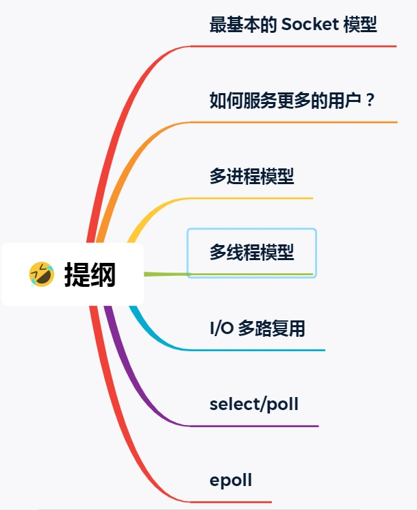

# IO多路复用：select/poll/epoll

我们以最简单的socket模型，一步一步得到IO多路复用。

## 最基本的SOCKET模型
想要客户端和服务器能在网咯中通信，那必须得使用SOCKET编程，它是进程间通信里比较特别的方式，特别之处在于它是可以跨主机间通信。

SOCKET的中文名叫插口，咋一看还挺迷惑。事实上，双方要进行网络通信前，各自得创建一个socket，这相当于客户端服务器各开了一个口子，双方读取和发送数据的时候，都是通过这个口子，这样一看，是不是觉得很像弄了一根网线，一头插在客户端，一头插在服务端，然后进行通信。

创建SOCKET的时候， 可以指定网络层使用的是IPV4还是IPV6，传输层使用的是TCP还是UDP。

UDP的socket编程相对简单一些，这里我们只介绍TCP的编程。

服务器的程序要先跑起来，然后等待客户端的连接和数据，我们先来看看服务端的socket编程是怎么样的。

服务端首先通过socket函数，创建网络协议位IPV4，以及传输协议位TCP的socket，接着调用bind函数，给这个socket绑定一个IP地址和端口，绑定这两个的目前是什么？

- 绑定端口的目的：当内核收到TCP报文，通过TCP里面的端口号，来找到我们的应用程序，然后把数据传递给我们。
- 绑定IP地址目的：一台机器是可以有多个网卡，每个网卡都有对应的IP地址，当绑定一个网卡时，内核在收到对应网卡的包，才会发给我们。

绑定完IP地址和端口后，就可以调用listen函数进行监听，此时对应TCP状态图中的listen。如果我们要判定服务器中一个网络程序有没有启动，可以通过netstat命令查看对应端口号是否有被监听。

服务端进入了监听状态后，通过调用accept函数，来从内核获取客户端的连接，如果没有客户端连接，则会阻塞等待客户端连接的到来。

那客户端是怎么发起连接的呢？客户端在创建好SOCKET后，调用connect函数发起连接，该函数的参数要指明服务端的IP地址和端口号，然后万众期待的三次握手开始了。

在TCP连接过程中，服务器的内核实际上为每个socket维护了两个队列：
- 一个是还没有完全建立连接的队列，称为TCP半连接队列，这个队列都是没有完成三次握手的连接，此时服务端处于syn_rcvd状态。
- 一个是已经建立连接的队列，称为TCP全连接队列，这个队列都是完成三次握手的连接，此时服务端处于established状态；

当TCP全连接队列不为空后，服务端的accept函数，就会从内核中的TCP全连接队列拿出一个已经完成连接的socket返回应用程序，后续数据传输都用这个socket。

注意，监听的socket和真正用来传数据的socket是两个：
- 一个叫做监听socket
- 一个叫做已连接socket；

连接建立后，客户端和服务端就开始互相传输数据了，双方都可以通过read()和write()函数来读写数据。

基于 Linux 一切皆文件的理念，在内核中 Socket 也是以「文件」的形式存在的，也是有对应的文件描述符。

### 文件描述符
文件描述符的作用是什么？每一个进程都有一个数据结构 task_struct，该结构体里有一个指向文件描述符数组的成员指针。该数组里列出这个进程打开的所有文件的文件描述符。数组下标是文件描述符，是一个整数，而数组的内容是一个指针，指向内核中所有打开文件的列表，也就是说内核可以通过文件描述符找到对应打开的文件。

然后每个文件都有一个inode，socket文件的iNode指向内核中的socket结构，在这个结构体里有两个队列，分别是发送队列和接收队列，这个两个队列里保存的是一个个struct sk_buff，用链表的组织形式串起来。

sk_buff可以表示各个层的数据包，在应用层的数据包叫data，在TCP层我们称为segment，在IP层我们叫packge，在数据链路层叫frame。

你可能会好奇，为什么全部数据包只用一个结构体来描述呢？协议栈采用的分层结构，上层向下层传递时需要增加包头，下层向上层传递时又需要去掉包头，如果每一层用一个结构体，那在层之间传递数据的时候，就要发生多次拷贝，这将大大降低CPU效率。

于是，为了在层级之间传递数据时，不发生拷贝，只用sk_buff一个结构体来描述所有的网络包，那他是如何做到的呢？是通过调整sk_buff中的data指针。

## 如何服务更多的用户？
前面提到的TCP socket调用流程是最简单、最基本的，它基本只能一对一通信，因为使用的是同步阻塞的方式，当服务端在还没处理完一个客户端的网络IO时，或者读写操作发生阻塞时，其他客户端是无法与服务端连接的。

可是如果我们的服务端只能服务一个客户，那这样太浪费资源，于是我们要改进这个网路IO模型，以支持更多的客户端。

在改进网络IO模型前，我们先来提一个问题，你知道服务器单机理论最大能连接多少个客户端？

相信你知道TCP连接是由四元组唯一确认的，这个四元组就是：本机IP、本机端口号，对端IP，对端端口号。

服务器作为服务方，通常会在本地固定监听一个端口，等待客户端的连接。因此服务器的本地IP和端口是固定的，于是的、