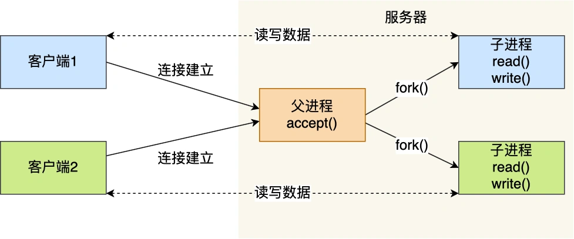
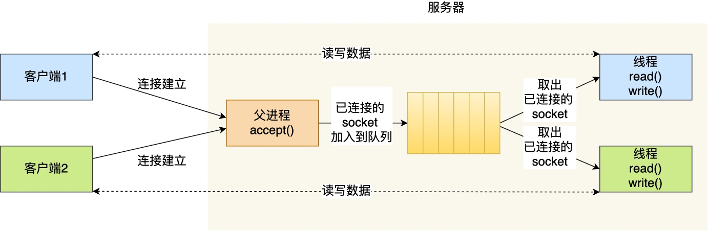
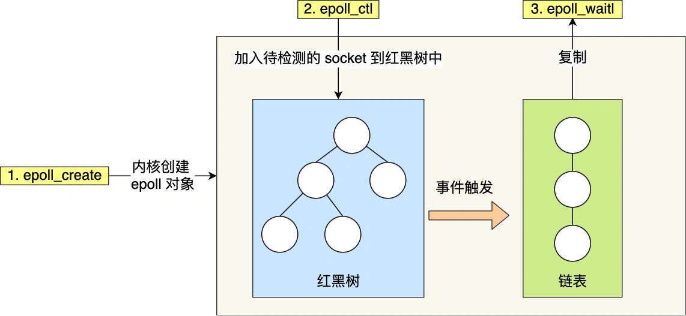
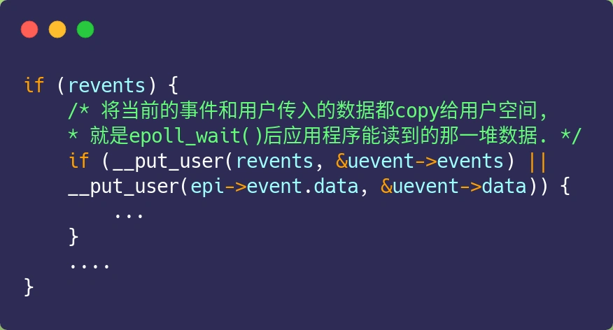

# IO多路复用：select/poll/epoll

我们以最简单的socket模型，一步一步得到IO多路复用。


## 最基本的SOCKET模型
想要客户端和服务器能在网咯中通信，那必须得使用SOCKET编程，它是进程间通信里比较特别的方式，特别之处在于它是可以跨主机间通信。

SOCKET的中文名叫插口，咋一看还挺迷惑。事实上，双方要进行网络通信前，各自得创建一个socket，这相当于客户端服务器各开了一个口子，双方读取和发送数据的时候，都是通过这个口子，这样一看，是不是觉得很像弄了一根网线，一头插在客户端，一头插在服务端，然后进行通信。

创建SOCKET的时候， 可以指定网络层使用的是IPV4还是IPV6，传输层使用的是TCP还是UDP。

UDP的socket编程相对简单一些，这里我们只介绍TCP的编程。

服务器的程序要先跑起来，然后等待客户端的连接和数据，我们先来看看服务端的socket编程是怎么样的。

服务端首先通过socket函数，创建网络协议位IPV4，以及传输协议位TCP的socket，接着调用bind函数，给这个socket绑定一个IP地址和端口，绑定这两个的目前是什么？

- 绑定端口的目的：当内核收到TCP报文，通过TCP里面的端口号，来找到我们的应用程序，然后把数据传递给我们。
- 绑定IP地址目的：一台机器是可以有多个网卡，每个网卡都有对应的IP地址，当绑定一个网卡时，内核在收到对应网卡的包，才会发给我们。

绑定完IP地址和端口后，就可以调用listen函数进行监听，此时对应TCP状态图中的listen。如果我们要判定服务器中一个网络程序有没有启动，可以通过netstat命令查看对应端口号是否有被监听。

服务端进入了监听状态后，通过调用accept函数，来从内核获取客户端的连接，如果没有客户端连接，则会阻塞等待客户端连接的到来。

那客户端是怎么发起连接的呢？客户端在创建好SOCKET后，调用connect函数发起连接，该函数的参数要指明服务端的IP地址和端口号，然后万众期待的三次握手开始了。

在TCP连接过程中，服务器的内核实际上为每个socket维护了两个队列：
- 一个是还没有完全建立连接的队列，称为TCP半连接队列，这个队列都是没有完成三次握手的连接，此时服务端处于syn_rcvd状态。
- 一个是已经建立连接的队列，称为TCP全连接队列，这个队列都是完成三次握手的连接，此时服务端处于established状态；

当TCP全连接队列不为空后，服务端的accept函数，就会从内核中的TCP全连接队列拿出一个已经完成连接的socket返回应用程序，后续数据传输都用这个socket。

注意，监听的socket和真正用来传数据的socket是两个：
- 一个叫做监听socket
- 一个叫做已连接socket；

连接建立后，客户端和服务端就开始互相传输数据了，双方都可以通过read()和write()函数来读写数据。

基于 Linux 一切皆文件的理念，在内核中 Socket 也是以「文件」的形式存在的，也是有对应的文件描述符。

### 文件描述符
文件描述符的作用是什么？每一个进程都有一个数据结构 task_struct，该结构体里有一个指向文件描述符数组的成员指针。该数组里列出这个进程打开的所有文件的文件描述符。数组下标是文件描述符，是一个整数，而数组的内容是一个指针，指向内核中所有打开文件的列表，也就是说内核可以通过文件描述符找到对应打开的文件。

然后每个文件都有一个inode，socket文件的iNode指向内核中的socket结构，在这个结构体里有两个队列，分别是发送队列和接收队列，这个两个队列里保存的是一个个struct sk_buff，用链表的组织形式串起来。

sk_buff可以表示各个层的数据包，在应用层的数据包叫data，在TCP层我们称为segment，在IP层我们叫packge，在数据链路层叫frame。

你可能会好奇，为什么全部数据包只用一个结构体来描述呢？协议栈采用的分层结构，上层向下层传递时需要增加包头，下层向上层传递时又需要去掉包头，如果每一层用一个结构体，那在层之间传递数据的时候，就要发生多次拷贝，这将大大降低CPU效率。

于是，为了在层级之间传递数据时，不发生拷贝，只用sk_buff一个结构体来描述所有的网络包，那他是如何做到的呢？是通过调整sk_buff中的data指针。

## 如何服务更多的用户？
前面提到的TCP socket调用流程是最简单、最基本的，它基本只能一对一通信，因为使用的是同步阻塞的方式，当服务端在还没处理完一个客户端的网络IO时，或者读写操作发生阻塞时，其他客户端是无法与服务端连接的。

可是如果我们的服务端只能服务一个客户，那这样太浪费资源，于是我们要改进这个网路IO模型，以支持更多的客户端。

在改进网络IO模型前，我们先来提一个问题，你知道服务器单机理论最大能连接多少个客户端？

相信你知道TCP连接是由四元组唯一确认的，这个四元组就是：本机IP、本机端口号，对端IP，对端端口号。

服务器作为服务方，通常会在本地固定监听一个端口，等待客户端的连接。因此服务器的本地IP和端口是固定的，于是对于服务端TCP连接的四元组只有对端的IP和端口是变化的，所以最大TCP连接数=客户端IP*客户端端口数。

对于IPV4，客户端的IP数最多为2的32次方，客户端的端口号最多位2的16次方，也就是服务端单级最大TCP连接数位2的48次方。

这个理论值相当丰满，但是服务器肯定承载不了那么大的连接数，主要会受两个方面限制：
- 文件描述符，Socket实际上是一个文件，也就会对应一个文件描述符。在Linux下，单个进程打开的文件描述符数是有限的，没有经过修改的值一般是1024，不过我们可以通过ulimit增大描述符的数目；
- 系统内存：每个TCP连接在内核中都有对应的数据结构，意味着每个连接都是会占用一定内存的；

那如果服务器的内存只有2GB，网卡是千兆的，能支持一万并发请求吗？

并发1万请求，也就是经典的C10K问题，C是client单词首字母缩写，C10K就是单机同时处理1万个请求的问题。

从硬件资源角度看，对于2GB内存千兆的服务器，如果每个请求处理占用不到200KB的内存和100Bit的网络宽带就可以满足1W个请求。

不过，要真正实现C10K的服务器，要考虑的地方在于服务器的网络I/O模型，效率低的模型，会加重系统开销，从而会离C10K的目标越来越远。

## 多进程模型
基于最原始的阻塞网络I/O，如果服务器要支持多个客户端，其中比较传统的方式，就是使用多进程模型，也就是为每个客户端分配一个进程来处理请求。

服务器的主进程负责监听客户端的连接，一旦与客户端连接完成，accept()函数就会返回一个“已连接socket”，这时就通过fork()函数创建一个子进程，实际上就是把父进程所有相关的东西都复制一份，包括文件描述符、内存地址空间、程序计数器、执行的代码等。

这两个进程刚复制完的时候，几乎一模一样。不过，会根据返回值来区分是父进程还是子进程，如果返回值是0，则是子进程；如果返回的是其他整数，就是父进程。

正因为子进程会复制父进程的文件描述符，于是就可以直接使用“Socket”和客户端通信了。

可以发现，子进程不需要关心“监听Socket”，只需要关心“已连接的Socket”；父进程则相反，将客户服务交给子进程来处理，因此父进程不需要关心“已连接Socket”，只需要关心“监听Socket”。

下面这张图描述了从连接请求到连接建立，父进程创建子进程位客户服务。


另外，当子进程退出时，实际上内核里还会保留该进程的一些信息，也是会占用内存的，如果不做好回收工作，就会变成僵尸进程，随着僵尸进程越多，会慢慢耗尽我们的系统资源。

因此，父进程要善后好自己的孩子，怎么善后呢？那么有两种方式可以在子进程退出后回收资源，分别是wait()和waitpid()函数。

这种用多个进程应付多个客户端的方式，在对应100个客户端还是可行的，但是当客户端数量一旦高达一万时，肯定是扛不住的，因为没产生一个进程，必会占据一定的系统资源，而且进程上下文切换的包袱是很重的，性能会大打折扣。

进程的上下文切换不仅包含了虚拟内存、栈、全局变量等用户空间的资源，还包括内核堆栈、寄存器等内核资源。

## 多线程模型
既然进程上下文切换的包袱很重，那我们就搞个比较轻量级的模型来应对多用户的请求 --- 多线程模型

线程是运行在进程中的一个逻辑流，单进程可以运行多个线程，同进程里的线程可以共享进程的部分资源，比如文件描述符列表、进程空间、代码、全局数据、堆、共享库等。这些共享资源在上下文切换时不需要切换，而只需要切换线程的私有数据、寄存器等不共享的数据，因此同一个进程下的线程上下文切换的开销比进程小的多。

当服务器与客户端TCP完成连接以后，通过pthead_create()函数创建线程，然后将已连接socket的文件描述符传递给线程函数，接着在线程里和客户端进行通信，从而达到并发的目的。

如果每来一个连接都创建一个线程，线程运行完后，还得操作系统销毁线程，虽说线程上下文切换的开销不大，但是如果频繁创建和销毁线程，系统开销也不小。

那么我们可以用线程池的方式来避免线程等频繁创建和销毁，所谓的线程池，就是提前创建若干个线程，这样当有新连接建立时，将这个已连接的socket放入到一个队列里，然后线程池里的线程负责从队列里取出“已连接socket”进行处理。


需要注意的是，这个队列是全局队列，每个线程都会操作，为了避免多线程的竞争，线程在操作这个队列的时候需要加锁。

上面基于进程或者线程模型的，其实还是有问题的。新到来一个TCP连接，就需要分配一个进程或者线程，那么如果要达到C10K，意味着一台机器维护1万个连接，相当于要维护1万个线程/进程，  操作系统就算是死扛也是扛不住的。

## I/O多路复用
既然位每个请求分配一个进程/线程的方式不合适，那么有没有可能只使用一个进程来维护多个Socket呢？

答案是有的，那就是IO多路复用。

一个进程虽然任意时刻只能处理一个请求，但是处理每个请求的事件时，耗时控制在1毫秒以内，这样一秒内就可以处理上千个请求，把时间拉长来看，多个请求复用一个进程，这就是多路复用，这种思想很类似一个CPU并发多个进程，所以也叫做时分多路复用。

我们熟悉的select/poll/epoll内核提供给用户态的多路复用的系统调用，进程可以通过一个系统调用函数从内核中获取多个事件。

select/poll/epoll是如何获取网络事件的呢？在获取事件时，先把所有连接(文件描述符)传给内核，再由内核返回产生了事件的连接，然后在用户态中再处理这些连接对应的请求即可。

select/poll/epoll这是三个多路复用接口，都能实现C10K吗？接下来，我们分别说说。

### Select/poll
select实现多路复用的方式是，将已经连接的socket都放到一个文件描述符集合，然后调用select函数将文件描述符拷贝到内核，让内核来检查是否有网络事件产生，检查的方式很粗暴，就是通过遍历文件描述符的方式，当检查到有事件产生后，将此socket标记为可读或者可写，接着再把整个文件描述符集合拷贝到用户态，然后用户态还需要通过遍历的方法找到可读或者可写的socket，然后再对其进行处理。

所以对于select的方式，需要进行2次遍历文件描述符集合，一次是在内核态，一次是在用户态里，而且还会发生两次拷贝文件描述符集合，先从用户空间传入内核空间中，有内核修改后，在传出到用户空间。

select 使用固定长度的bitsmap，表示文件描述符集合，而且所支持的文件描述符的个数是有限制的，在linux系统中，由内核中的fd_setsize限制，默认最大值位1024，只能监听0~1023的文件描述符。

poll不在用bitsmap来存储所关注的文件描述符，取而代之用动态数组，以链表的形式来组织，突破了select的文件描述符的限制的个数，当然还是会受到系统文件描述符限制。

但是poll和select并没有太大的本质区别，都是使用线性结构存储进程关注的socket集合，因此需要遍历文件描述符集合来找到可读或者可写的socket，时间复杂度是O(n)，而且也需要在内核态和用户态拷贝文件描述符集合，这种方式随着并发数量上来，性能的损耗会呈指数级增长。

### epoll
先复习一下epoll的用法，如下代码中，先用epoll_create创建一个epoll对象epfd,在通过epoll_ctl将需要监视的socket添加到epfd中，最后调用epoll_wait等待数据。
```c
int s = socket(AF_INET, SOCK_STREAM, 0);
bind(s, ...);
listen(s, ...)

int epfd = epoll_create(...);
epoll_ctl(epfd, ...); //将所有需要监听的socket添加到epfd中

while(1) {
    int n = epoll_wait(...);
    for(接收到数据的socket){
        //处理
    }
}
```

epoll通过这两个方面，很好的解决了select/poll的问题。
- 第一点：epoll在内核里使用红黑树来跟踪进程所有待检查的文件描述符，把需要监控的socket通过epoll_ctl函数加入到内核中的红黑树里，红黑树是个高效的数据结构，增删改一般的时间复杂度是O(logn)。而select/poll内核里没有类似epoll红黑树这种保存所有待检查socket的数据结构，所以select/poll每次操作时，都传入整个socket描述符集合给内核，而epoll因为在内核维护红黑树，可以保存所有待检测的socket，所以只需要传入一个待检测的socket，减少了内核和用户空间大量的数据拷贝和内存分配。
- 第二点：epoll使用事件驱动机制，内核里维护了一个链表来记录就绪事件，当某个socket有事件发生时，通过回调函数内核会将其加入到这个就绪事件列表中，当用户调用epoll_wait()函数时，只返回有事件发生的文件描述符的个数，不需要像select/poll那样轮询扫描整个socket集合，大大提高了检测的效率。

从下图可以看到epoll相关的接口的作用：


epoll的方式即使监听的socket数量越多的时候，效率不会大幅度降低，能够同时监听的socket的数目页非常多，上限就是系统定义的进程打开的最大的文件描述符的个数。而且，epoll被称为解决C10K问题的利器。

插个题外话，网上文章不少说，epoll_wait返回时，对于就绪事件，epoll使用的是共享内存的方法，即用户态和内核态都指向了就绪链表，所以就避免了内存拷贝的消耗。

这是错误的，看过epoll内核源码的都知道，压根就没有使用共享内存这玩意。你可以从下面这份代码看到，epoll_wait实现了内核代码中调用了__put_user函数，这个函数就是就是将数据从内核拷贝到用户空间。


#### 边沿触发和水平触发
epoll支持两种事件触发模式，分别是边沿触发和水平触发。

这两个术语还是听抽象的， 其实他们的区别还是很好理解的。
- 使用边沿触发模式时，当被监控的socket描述符上有可读事件发生时，服务器端只会从epoll_wait中苏醒一次，即使进程没有调用read函数从内核读取数据，也依然只会苏醒一次，因此我们要保证一次性将内核缓冲区的数据读取完。
- 使用水平触发模式时，当被监控的socket上有可读事件发生时，服务器不断地从epoll_wait中苏醒，知道内核缓冲区数据被read函数读取完才结束，目的是告诉我们有数据需要读取。

举个例子，你的快递被放到了一个快递箱里，如果快递箱只会通过短信通知你一次，即使你一直没有去读取，它也不会再发送第二条短信提醒你，这个方式就是边沿触发；如果你的快递箱发现你的快递没有取出，它就会不停的发短信通知你，直到你取出了快递，它才消停，这个就是水平触发的方式。

这就是两者的区别，水平触发的意识是只要满足事件的条件，比如内核中有数据需要读，就会一直不断的把这个事件传递给用户；而边沿触发的意思是只有一次满足条件的时候才会触发，之后就不会在传递同样的事件了。

如果使用水平触发模式，当内核通知文件描述符可读写时，接下来还可以继续检查它的状态，看他是否依然可读写，所以在收到通知后，没必要一次性执行尽可能多的读写操作。

如果使用边沿触发模式，IO事件发生时只会通知一次，而且我们不知道到底能读写多少数据，所以在收到通知后应尽可能的读写数据，以免错失读写的机会。因此，我们会循环从文件描述符循环读写数据，那么如果文件描述符是阻塞的，没有数据可以读写时，进程会阻塞在读写函数那里，程序就没有办法继续往下执行。所以，边沿触发模式一般和非阻塞IO搭配使用，程序会一直执行IO操作，知道系统调用返回错误，错误类型位EAGAIN或EWOULDBLOCK。

一般来说，边沿触发的效率比水平触发的效率要高，因为边沿触发可以减少epoll_wait的系统调用，系统调用也是有一定开销的，毕竟页存在上下文切换。

select/poll只有水平触发模式，epoll默认的触发模式是水平触发，但是可以根据应用场景设置边沿触发模式。

另外，使用IO多路复用时，最好搭配非阻塞IO一起使用。多路复用API返回的事件并不一定是可读写的，如果使用阻塞IO，那么在read/write调用时，则会发生程序阻塞，因此最好搭配非阻塞IO，一遍应对极少数的特殊情况。

## 总结
最基础的 TCP 的 Socket 编程，它是阻塞 I/O 模型，基本上只能一对一通信，那为了服务更多的客户端，我们需要改进网络 I/O 模型。

比较传统的方式是使用多进程/线程模型，每来一个客户端连接，就分配一个进程/线程，然后后续的读写都在对应的进程/线程，这种方式处理 100 个客户端没问题，但是当客户端增大到 10000 个时，10000 个进程/线程的调度、上下文切换以及它们占用的内存，都会成为瓶颈。

为了解决上面这个问题，就出现了 I/O 的多路复用，可以只在一个进程里处理多个文件的 I/O，Linux 下有三种提供 I/O 多路复用的 API，分别是：select、poll、epoll。

select 和 poll 并没有本质区别，它们内部都是使用「线性结构」来存储进程关注的 Socket 集合。

在使用的时候，首先需要把关注的 Socket 集合通过 select/poll 系统调用从用户态拷贝到内核态，然后由内核检测事件，当有网络事件产生时，内核需要遍历进程关注 Socket 集合，找到对应的 Socket，并设置其状态为可读/可写，然后把整个 Socket 集合从内核态拷贝到用户态，用户态还要继续遍历整个 Socket 集合找到可读/可写的 Socket，然后对其处理。

很明显发现，select 和 poll 的缺陷在于，当客户端越多，也就是 Socket 集合越大，Socket 集合的遍历和拷贝会带来很大的开销，因此也很难应对 C10K。

epoll 是解决 C10K 问题的利器，通过两个方面解决了 select/poll 的问题。

epoll 在内核里使用「红黑树」来关注进程所有待检测的 Socket，红黑树是个高效的数据结构，增删改一般时间复杂度是 O(logn)，通过对这棵黑红树的管理，不需要像 select/poll 在每次操作时都传入整个 Socket 集合，减少了内核和用户空间大量的数据拷贝和内存分配。
epoll 使用事件驱动的机制，内核里维护了一个「链表」来记录就绪事件，只将有事件发生的 Socket 集合传递给应用程序，不需要像 select/poll 那样轮询扫描整个集合（包含有和无事件的 Socket ），大大提高了检测的效率。
而且，epoll 支持边缘触发和水平触发的方式，而 select/poll 只支持水平触发，一般而言，边缘触发的方式会比水平触发的效率高。