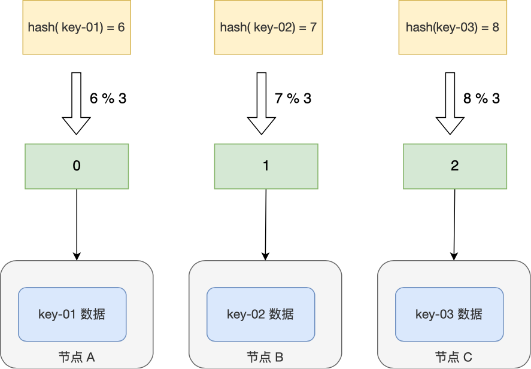
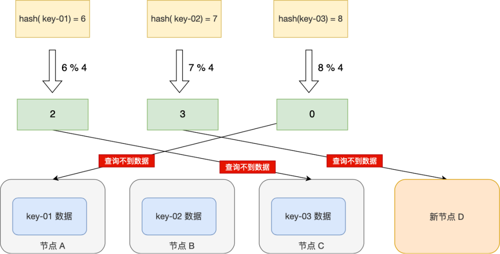

# 什么是一致性hash

一致性哈希是什么？使用场景，解决了什么问题？


## 如何分配请求？
大多数网站背后肯定不是只有一台服务器提供服务，因为单机的并发量和数据量都是有限的，所以都会用多台服务器构成集群来对外提供服务。

但是问题来了，现在有那么多节点，要如何分配客户端请求呢？


其实这个问题就是负载均衡问题。解决负载均衡的算法有很多，不同的负载均衡算法，对应的就是不同的分配策略，适应的业务场景也不同。

最简单的方式，引入一个中间的负载均衡层，让它对外界的请求轮流的转发给内部的集群。比如集群有3个节点，外界请求有3个，那么每个节点都会处理1个请求，达到了分配请求的目的。


考虑到每个节点的硬件配置有所区别，我们可以引入权重值，将硬件配置更好的节点的权重值设高，然后根据各个节点的权重值，按照一定的比重分配在不同的节点上，让硬件配置更好的节点承担更多的请求，这种算法叫做加权轮询。

加权轮询算法使用场景是建立在每个节点存储的数据都是相同的前提。所以，每次读取的请求，访问任意一个节点都能得到结果。

但是，加权轮询算法是无法应对“分布式系统(数据分片系统)”的，因为分布式系统中，每个节点存储的数据是不同的。

当我们想提高的系统的容量，就会将数据水平分到不同不同的节点来存储，也就是将数据分布到了不同的节点。比如一个分布式kv(key-value)缓存系统，某个key应该到哪个或者哪些节点上获得，应该是确定的，不是说任意访问一个节点都可以得到缓存结果的。

因此，我们要想一个能应对分布式系统的负载均衡算法。

## 使用哈希算法有什么问题？
有的同学和快就想到了：哈希算法。因为对同一个关键字进行哈希算法，每次计算都是相同的值，这样就可以将某个key确定到一个节点了，可以满足分布式系统的负载均衡需求。

哈希算法最简单的做法就是进行取模运算，比如分布式系统中有3个节点，基于hash(key)%3公式对数据进行了映射。

如果客户端要获取指定key的数据，通过下面的公式可以定位节点：
```
hash(key)%3
```

如果经过上面这个公式计算后得到的值是0，就说明该key就需要去第一个节点获取。

但是有了一个很致命的问题，如果节点数量发生了变化，也就是在对系统做扩容或者缩容的时候，必须迁移改变映射关系的数据，否则会出现查询不到数据的问题。

举个例子，假设我们有一个由A、B、C三个节点组成分布式KV缓存系统，基于计算公司hash(key)%3将数据进行了映射，每个节点存储了不同的数据：

现在有3个查询key的请求，分别查询了key-01，key-02，key-03的数据，这三个key分别经过hash()函数计算后的值为hash(key-01)=6、hash(key-02)=7、hash(key-02)=8，然后再对这些值进行取模运算。

通过这样的哈希算法，每个key都可以定位到对应的节点。

当3个节点不能满足业务需求了，这是我们增加一个节点，节点的数量从3变化为4，意味取模hash函数中基数的变化，这样会导致大部分映射关系改变，如下图：

比如，之前的hash(key-01)%3=0，就变成了hash(key-02)%4=2，查询key-01数据时，寻址到了节点C，而key-01的数据是存储在节点A上的，不是在节点C，所以会查询不到数据。

同样的道理，如果我们对分布式系统进行缩容，比如移除一个节点，也会因为取模哈希函数中的基数改变，可能查询不到数据的问题。

要解决这个问题的办法，就需要我们进行迁移数据，比如节点的数量从3变成4，要基于新的计算公式hash(key)%4，重新对数据和节点做映射。

假设总数据调数位M，哈希算法在面对节点数量变化时，最坏情况下所有数据都需要迁移，所以它的数据迁移规模是O(M)，这样的迁移成本太高了。

所以，我们应该要重新想一个新的算法，来避免分布式系统在扩容或者缩容时，发生过多的数据迁移。

## 使用一致性哈希算法有什么问题？
一致性哈希算法就很好的解决了分布式系统再扩容或者缩容时，发生过多迁移的问题。

一致性哈希算法也用了取模运算，但是与哈希算法不同的是，哈希算法是对节点的数据进行取模运算，而一致性哈希算法是对2^32进行取模运算，是一个固定的值。

我们可以把一致性哈希算法是对2^32进行取模运算的结果值组织成一个环，就像钟表一样，钟表的圆可以理解成有60个点组成的园，而此处我们把这个圆想象成由2^32个点组成的圆，这个圆环被称为哈希环，如下图：

一致性哈希环要进行两步哈希：
- 第一步：对存储节点进行哈希计算，也就是对存储节点做哈希映射，比如根据节点的IP地址进行哈希；
- 第二步：当对数据进行存储和访问时，对数据进行哈希映射；

所以，一致性哈希试讲存储节点和数据都映射到一个收尾相连的哈希环上。

问题来了，对数据哈希进行哈希映射得到一个结果要怎么找到存储该数据的节点呢？

答案是，映射的结果值往顺时针的方向找到第一个节点，就是存储该数据的节点。

举个例子，有3个节点经过哈希计算，映射到了如下位置：


接着，对要查询的key-01进行哈希计算，确定此key-01映射在哈希环上的位置，然后从这个位置顺时针方向找到第一个节点，就是存储该key-01数据的节点。

比如，下图中的key-01映射的位置，往顺时针的方向找到第一个节点就是节点A。

所以，当需要指定key的值进行读写的时候，要通过下面2不进行寻址：
- 首先，对key进行哈希计算，确定此key在换上的位置。
- 然后从这个位置沿着顺时针方向走，遇到第一个节点就是存储key的节点。

知道了一致性哈希寻址的方式，我们来看看，如果增加一个节点或者减少一个节点会发生大量的数据迁移吗？

假设节点数量从3增加到了4，新的节点D经过哈希算法后映射到了下图中的位置：

你可以看到，key-01、key-03都不受影响，只有key-02需要被迁移到节点D。

假设节点数量从3减到2，比如将节点A移除：

你可以看到，key-02和key-03都不受影响，只有key-01需要被迁移到节点B。

因此，在一致性哈希算法中，如果增加或者移除一个节点，仅影响该节点在哈希环上顺时针相邻的后继节点，其他数据也不会收到影响。

上面这些图中3个节点映射在哈希环上还是比较分散的，所以看起来请求都会均衡到每个节点上。

但是一致性哈希算法并不保证节点能够在哈希环上均匀分布，这样就会带来一个问题，会有大量的请求集中在一个节点上。比如，下图中3个节点映射位置都在哈希环的右半边：

这个时候有一半以上的数据的寻址都会找节点A，也就是访问请求主要集中在节点A上，这肯定是不行的呀，说好的负载均衡的呢？这种情况一点都不负载均衡。

另外，在这种节点分布不均匀的情况下，进行容灾与扩容时，哈希环上的响铃节点容易受到过大影响，容易发生雪崩式连锁效应。

比如，上图中的节点A如果移除了，当节点A宕机后，根据一致性哈希算法的规则，其上的数据应该全部都迁移到B上，这样B的数据量、访问量都会迅速增加很多倍，一旦增加的压力超过了节点B的处理能力的上限，就会导致节点B的崩溃，进而形成雪崩式的连锁反应。

所以一致性哈希算法虽然减少了数据迁移量，但是存在节点部分不均匀的问题。

## 如何通过虚拟节点提高均衡度？
要想解决节点在哈希环上分配不均匀的问题，就是要有大量的节点，节点数量越多，哈希环上的节点分布就越均匀。

单问题是，实际中我们没有那么多节点。所以这个时候我们就要加入虚拟节点，也就是对一个真实的节点做多个副本。

具体的做法是，不再将真实的节点映射到哈希环上，而是将虚拟的节点映射到哈希环上，并将虚拟的节点映射到实际的节点上，所以这里有两层映射关系。

比如对每个节点分别设置3个虚拟节点：
- 对节点A加上编号来作为虚拟节点：A-01、A-02、A-03
- 对节点B加上编号来作为虚拟节点：B-01、B-02、B-03
- 对节点C加上编号来作为虚拟节点：C-01、C-02、C-03

引入虚拟节点后，原本哈希环上只有3个节点的情况，就会变成有9个虚拟节点映射到哈希环上，哈希环上的节点数量增多了3倍。


你可以看到，节点数量增多了后，节点在哈希环上的分布就相对均匀了，这时候，如果有访问请求寻址到A-01这个虚拟节点上，接着再通过A-01虚拟节点找到实际的节点A，这样请求就能访问到真实的节点A了。

上面为了方便你能理解，每个真实的节点仅包含3个虚拟节点，这样能起到的均衡效果其实很有限。而在实际的工程中，虚拟节点的数据会大很多，比如Nginx的一致性哈希算法， 每个权重位1的真实节点就有160个虚拟节点。

另外虚拟节点出了会提高节点的均衡度，还会提高系统的稳定性。当节点变化时，会有不同的节点共同分担系统的变化，因此稳定性更高。

比如，当某个节点被移除时，对应该节点的多个虚拟节点均会移除，而这些虚拟节点按顺时针方向的下一个虚拟节点，可能会对应不同的真实节点，即这些不同真实的节点共同分担了节点变化导致的压力。

而且有了虚拟节点后，还可以为硬件配置更好的节点增加权重，比如权重更高的节点增加更多的虚拟节点即可。

因此，待虚拟节点的一致性哈希算法不仅适合硬件配置不同的节点的场景，而且适合节点规模发生变化的场景。

## 总结
不同的负载均衡算法适用的业务场景也不同的。

轮询这类的策略只能适用与每个节点的数据都是相同的场景，访问任意节点都能请求到数据。但是不适用分布式系统，因为分布式系统意味着数据水平切分到了不同的节点上，访问数据的时候，一定要寻址存储该数据的节点。

哈希算法虽然能建立数据和节点的映射关系，但是每次在节点数量发生变化的时候，最坏情况下所有数据都需要迁移，这样太麻烦了，所以不适用节点数量变化的场景。

为了减少迁移的数据量，就出现了一致性哈希算法。

一致性哈希是指将「存储节点」和「数据」都映射到一个首尾相连的哈希环上，如果增加或者移除一个节点，仅影响该节点在哈希环上顺时针相邻的后继节点，其它数据也不会受到影响。

但是一致性哈希算法不能够均匀的分布节点，会出现大量请求都集中在一个节点的情况，在这种情况下进行容灾与扩容时，容易出现雪崩的连锁反应。

为了解决一致性哈希算法不能够均匀的分布节点的问题，就需要引入虚拟节点，对一个真实节点做多个副本。不再将真实节点映射到哈希环上，而是将虚拟节点映射到哈希环上，并将虚拟节点映射到实际节点，所以这里有「两层」映射关系。

引入虚拟节点后，可以会提高节点的均衡度，还会提高系统的稳定性。所以，带虚拟节点的一致性哈希方法不仅适合硬件配置不同的节点的场景，而且适合节点规模会发生变化的场景。

完！