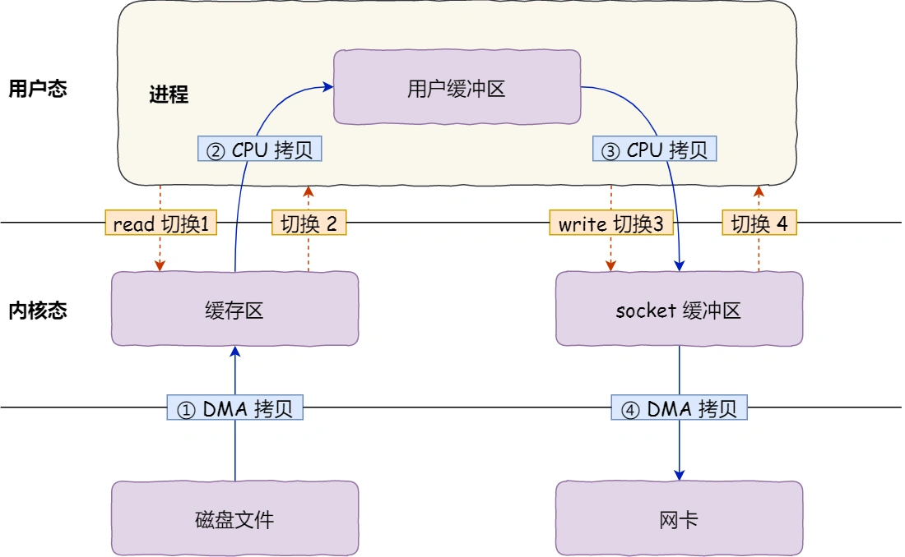
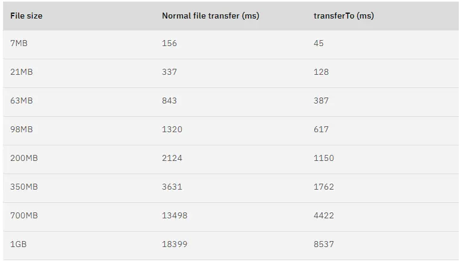

# 什么是零拷贝技术

磁盘可以说是计算机系统最慢的硬件之一，读写速度差内存10倍以上，所以针对优化磁盘的技术非常的多，比如，直接零拷贝、直接IO、异步IO等等，这些优化的目的就是为了提高系统的吞吐量，另外操作系统内核中的磁盘高速缓存区，可以有效的减少磁盘的访问速度。

这次我们就以文件传输作为切入点，来分析IO工作方式，以及如何优化文件传输性能。
.webp)

## 为什么要有DMA技术？
在没有DMA技术之前，IO过程是这样的：
- CPU发出对应的指令给磁盘控制器，然后返回；
- 磁盘控制器收到指令后，于是就开始准备数据，会把数据放入到磁盘控制器的内部缓冲区中，然后产生一个中断；
- CPU收到中断信号后，停下手头的工作，接着把磁盘控制器的缓冲区的数据一次一个字节地读进自己的寄存器，然后再把寄存的内容写入到内存，而在数据传输期间CPU是无法执行其他任务的。

为了方便理解，我花了一副图：


可以看到整个传输过程中，都需要CPU亲自参与搬运数据的过程，而且这个过程，CPU是不能做其他事情的。

简单的搬运几个字符数据那没问题，但是如果我们用千兆网卡或者硬盘传输大量数据的适合，都用CPU搬运的化，肯定忙不过来。

计算机科学家们发现了事情的严重性后，于是就发明的DMA技术，也就是直接内存访问技术。

什么是DMA技术？简单理解就是，在进行IO设备和内存的数据传输的时候，数据搬运的工作全部交给DMA控制器，而CPU不再参与任何数据搬运相关的事情，这样CPU就可以去处理别的事情。

那使用DMA控制器进行数据传输的过程究竟是什么样的呢？下面我们来具体看看。

具体过程：
- 用户进程用read的方法，向操作系统发出IO请求，请求读取数据到自己的缓冲区中，进程进入阻塞状态；
- 操作系统收到请求后，进一步将IO请求发送DMA，然后让CPU执行其他任务。
- DMA进一步IO请求发送给磁盘。
- 磁盘收到DMA的请求后，把数据从磁盘读取到磁盘控制器的缓冲区中，当磁盘控制器的缓冲区被读满后，向DMA发起中断信号，告知自己缓冲区已满。
- DMA收到磁盘的信号，将磁盘控制器缓冲区中的数据拷贝到内核缓冲区中，此时不占用CPU，CPU可以执行其他任务。
- 当DMA读取了足够多的数据，就会发送信号给CPU。
- CPU收到DMA信号，知道数据已经准备好了，于是将数据从内核拷贝到用户空间，系统调用返回。

可以看到，CPU不再参与将数据从磁盘控制器缓冲区搬运到内核空间的工作，这部分工作会有DMA完成。但是CPU在这个过程中也是必不可少的，因为传输数据，从哪传输到哪里，都需要CPU来告诉DMA控制器。

早期DMA控制器只存在在主板上，如今IO越来越多，数据传输的需求也不尽相同，所以每个IO设备里都有自己的DMA控制器。

## 传统的文件传输有多糟糕？
如果服务端要提供文件传输的功能，我们能想到的最简单的方式是：将磁盘上的文件读取出来，然后通过网络协议发送给客户端。

传统的IO的工作方式是：数据读取和写入是从用户空间到内核空间来回复制，而内核空间的数据是通过操作系统层面的IO接口从磁盘读取或写入。

代码如下：
```c
read(file, tmp_buf, len);
write(socket, tmp_buf, len);
```
代码很简单，虽然就两行代码，但是这里发生不少事情：

首先，期间发生了4次用户态和内核态的切换，因为发生了两次调用，一次是read(),一次是write()，每次调用都得先从用户态切换到内核态，等内核完成任务以后，再从内核态切换到用户态。

上下文切换的成本并不小，一次切换需要消耗几十纳秒到几微妙，虽然看上去时间很短，但是在高并发的场景下，这类时间容易被累计和放大，从而影响系统性能。

其次，是发生了4次内存拷贝，其中两次是DMA的拷贝，另外两次则是通过CPU拷贝的，下面说一些这个拷贝的过程：
- 第一次拷贝：把磁盘上的数据拷贝到操作系统的缓冲区里，这个拷贝的过程是通过DMA搬运的。
- 第二次拷贝：把内核缓冲区的数据拷贝到用户的缓冲区中，于是我们应用程序就可以使用这部分数据了，这个拷贝过程是由CPU完成的。
- 第三次拷贝：把刚刚拷贝到用户缓冲区里的数据，再拷贝到内核socket的缓冲区里，这个过程还由CPU搬运的，。
- 第四次拷贝：把内核缓冲区的数据，拷贝到网卡的缓冲区里，这个过程又是有DMA搬运的。

我们回过头看这个文件传输的过程，我们只是搬运一份数据，结果却搬运了4次，过多的数据拷贝无疑会消耗CPU资源，大大降低了系统性能。

这种简单又传统的文件传输方式，存在冗余的上下文切换和数据拷贝，在高并发系统里是非常糟糕的，多了很多不必要的开销，会严重影响系统性能。

所以，想要提高文件传输的性能，就要减少用户态和内核态的切换和内存拷贝的次数。

## 如何优化文件传输的性能？
> 先来看看如何减少用户态与内核态的上下文切换的次数呢？

读取磁盘数据的时候，之所以要发生上下文切换，这是因为用户空间没有权限操作磁盘和网卡，内核的权限最高，这些操作设备的过程都需要交由操作系统来完成，所以一般要通过内核去完成某些任务的时候，就需要操作系统提供的系统调用函数。

而一次系统调用必然会发生两次上下文切换，首先从用户态切换到内核态，当内核完成任务后，再切换到用户态，由进程代码执行。

所以，要想减少上下文切换到次数，就要减少系统调用的次数。

> 再来看看如果减少数据拷贝的次数？

在前面我们知道了，传统的文件传输方式会经历4次数据拷贝，而且这里面，从内核的读缓冲区拷贝到用户缓冲区，再从用户缓冲区拷贝到内核socket缓冲区，这个过程是没有必要的。

因为文件传输的应用场景中，在用户空间我们并不会对数据再加工，所以数据实际上可以不用搬运到用户空间，因此用户缓冲区是没有必要存在的。

## 如何实现零拷贝
零拷贝的数据实现方式有两种：
- mmap+write
- snedfile

下面就谈一谈它们是如何减少上下文切换和零拷贝次数的。

### mmap+write
前面，我们知道read()系统调用的过程中会把内核缓冲区的数据拷贝到用户的缓冲区中，于是为了减少这一步开销，我们可以用mmap替换系统调用函数。
```c
buf = mmap(file, len);
write(sockfd, buf, len);
```
mmap()系统调用函数会直接把内核缓冲区里的数据映射到用户空间，这样操作系统内核与用户空间就不需要再进行任何的数据拷贝操作。

具体过程如下：
- 应用进程调用mmap后，DMA会把磁盘的数据拷贝到内核缓冲区里。接着，应用进程跟操作系统内核共享这个缓冲区。
- 应用再调用write()，操作系统直接将内核缓冲区拷贝到socket缓冲区中，这一切都发生在内核态，有CPU来搬运数据。
- 最后，把内核的socket缓冲区数据拷贝到网卡的数据缓冲区中，这个过程有DMA搬运的。

我们可以看到，通过使用mmap来代替read，可以减少一次数据拷贝的过程。

但这还不是最理想的零拷贝，因为仍然需要通过CPU把内核缓冲区的数据拷贝到socket缓冲区，而且仍然需要4次上下文切换，因为还是2次系统调用。

### sendfile
在Linux内核版本2.1中，提供了一个专门发送文件的系统调用sendfile，函数形式如下：
```c
#include <sys/socket.h>
ssize_t sendfile(int out_fd, int in_fd, off_t *offset, size_t count);
```
它前面两个参数分别是目的端和源端的文件描述符，后面两个参数是源端的偏移量和复制数据长度，返回值是实际复制数据的长度。

首先，他可以替代前面的read和write两个函数，这样就可以少了一次系统调用，也就是减少了2次上下文切换的开销。

其次，该系统调用，可以直接把内核缓冲区的数据拷贝到socket缓冲区，不再拷贝到用户空间，这样就只有2次上下文切换，和3次数据拷贝。

但这还不是真正的零拷贝技术，如果网卡支持SG-DMA技术，我们可以进一步减少CPU把内核缓冲区里的数据拷贝到socket缓冲区的过程。

你可以在你的Linux系统下面调用这个命令查看网卡是否支持SG-DMA技术：
```shell
$ ethtool -k eth0 | grep scatter-gather
scatter-gather: on
```

于是，从 Linux 内核 2.4 版本开始起，对于支持网卡支持 SG-DMA 技术的情况下， sendfile() 系统调用的过程发生了点变化，具体过程如下：
- 第一步:通过DMA将磁盘上的数据拷贝到内核缓冲区里;
- 第二步:缓冲区描述符和数据长度传到socket缓冲区,这样网卡SG-DMA控制器就可以直接将内核缓存中的数据直接拷贝到网卡缓冲区中,此过程不需要将数据从操作系统内核缓冲区拷贝到socket缓冲区中,这样就减少了一次拷贝.

所以,这个过程之中,只进行了2次数据拷贝,如下图:

这就是所谓的零拷贝技术，因为我们没有在内存层面去拷贝数据，也就是说全程没有通过CPU来搬运数据，所有的数据都是通过DMA来进行传输的。

零拷贝技术的文件传输方式相比传统的传统的传统的传输方式，减少了2次上下文切换和数据拷贝次数，就可以完成文件的传输，而且2次的数据拷贝过程，都不需要CPU,2次都是有DMA来搬运的。

## 使用零拷贝技术的项目
事实上，kafka这个开源项目，就利用了零拷贝技术，从而大幅度提升了IO的吞吐率，这也是kafka处理海量数据为什么这么快的原因之一。

如果你追溯到kafka文件传输的代码，你会发现，最终它会调用java NIO库里的transerTo方法：
```java
@Overridepublic 
long transferFrom(FileChannel fileChannel, long position, long count) throws IOException { 
    return fileChannel.transferTo(position, count, socketChannel);
}
```
如果 Linux 系统支持 sendfile() 系统调用，那么 transferTo() 实际上最后就会使用到 sendfile() 系统调用函数。

曾经有大佬专门写过程序测试过，在同样的硬件条件下，传统文件传输和零拷拷贝文件传输的性能差异，你可以看到下面这张测试数据图，使用了零拷贝能够缩短 65% 的时间，大幅度提升了机器传输数据的吞吐量。

另外，Nginx 也支持零拷贝技术，一般默认是开启零拷贝技术，这样有利于提高文件传输的效率，是否开启零拷贝技术的配置如下：
```
http {
...
    sendfile on
...
}
```
sendfile 配置的具体意思:

设置为 on 表示，使用零拷贝技术来传输文件：sendfile ，这样只需要 2 次上下文切换，和 2 次数据拷贝。
设置为 off 表示，使用传统的文件传输技术：read + write，这时就需要 4 次上下文切换，和 4 次数据拷贝。
当然，要使用 sendfile，Linux 内核版本必须要 2.1 以上的版本。

## PageCahce有什么作用？
回顾前面的文件传输的过程，其中第一步都是先要把磁盘文件数据拷贝到内核缓冲区区中，这个内存缓冲区实际上是磁盘高速缓存。

由于零拷贝技术使用了pagecache技术，可以使得零拷贝进一步提升了性能，我们接下来看看pageCahce是如何做到这一点的。

读写磁盘相比读写内存的速度慢太多了，所以我们应该想办法把读写磁盘替换成读写内存，于是，我们会通过DMA把磁盘里的数据搬运到内存里，这样就可以用读内存替换读磁盘。

但是，内存空间远比磁盘要小，内存注定要拷贝到磁盘里一小部分数据。

那问题来了，选择哪些数据拷贝到内存呢？

我们都知道程序运行的时候，具有局部性，所以通常，刚被访问的数据短时间内再次被访问的概率很高，于是我们可以用pagecache来缓存最近被访问的数据，当内存不足时淘汰最久未被访问的缓存。

所以，读磁盘数据的时候，优先在pageCahce中找，如果数据存在则可以直接返回，如果没有，则从磁盘中读取，然后缓存pagecache中。

还由一点，读取磁盘数据的时候，需要找到数据所在的位置，但是对于磁盘来说，就是通过磁头旋转到数据所在的扇区，再开始顺序读取数据，但是旋转头这个物理动作是非常耗时的，为了降低影响，pageCahce使用了预读功能。

比如，假设read方法每次只读32kb的字节，虽然read刚开始只会读0～32KB个字节，但内核会把其后面的32kb～64kb也读取到PageCache中，这样后面读取到32kb～64kb的成本就很低，如果在32～64kb淘汰出PageCache前，进程督导了他，收益就非常大。

所以，PageCache的有点主要是两个：
- 缓存最近被访问的数据；
- 预读功能；

这两个做法，将大大提高读写磁盘的性能。

但是在传输大文件(GB级别的文件)的时候，PageCache会不起作用，那就白白浪费DMA多做的一次数据拷贝，造成性能降低，即使使用了零拷贝也会损失性能。

这是因为如果你有很多GB级别文件需要传输，每当用户访问这些大文件的时候，内核就会把他们载入到pageCache中，内核就会把它们载入pageCache中，于是PageCache空间很快被这些大文件占满。

另外，由于文件太大，可能某些部分的文件数据被再次访问的概率比较低，这样会带来2个问题：
- PageCache由于长时间被大文件占据，其他热点的小文件无法充分使用到PageCache，于是这样磁盘读写性能就下降了。
- PageCache中的大文件数据，由于没享受到缓存带来的好处，但却耗费DMA多拷贝到PageCache一次。

所以，针对大文件的传输，不应该使用 PageCache，也就是说不应该使用零拷贝技术，因为可能由于 PageCache 被大文件占据，而导致「热点」小文件无法利用到 PageCache，这样在高并发的环境下，会带来严重的性能问题。

## 大文件传输用什么方式实现？
那针对大文件传输，我们应该使用什么方式实现呢？

我们先来看看最初的样子，当调用read方法读取文件时，进程实际上会阻塞在read方法调用上，因为要等待磁盘数据的返回，如下图：


具体过程如下：
- 当调用read方法时，会阻塞着，此时内核会向磁盘发起IO请求。磁盘收到请求后，便会寻址，当磁盘数据准备好后，就会向内核发起中断，告知内核数据已经准备好。
- 内核收到IO中断后，就将磁盘控制缓冲区拷贝到PageCache中；
- 最后，内核再把PageCache中的数据拷贝到用户空间，于是read调用就正常返回了。

对于阻塞的问题，可以用异步IO来解决，它的工作方式如下：

它把操作分为两部分：
- 前半部分，内核向磁盘发起请求。但是可以不等待数据就会就可以返回，于是进程此时可以处理其他任务；
- 后半部分，当内核将磁盘中的数据拷贝到进程缓冲区后，进程接收到内核的通知，再去处理数据；

而且，我们可以发现，异步IO并没有涉及到PageCache，所以使用异步IO就意味着要绕开PageCache。

绕开PageCache的IO叫直接IO，使用PageCache的IO则叫缓存IO，通常，对于磁盘，异步IO只支持直接IO。

前面页提到，大文件的传输不应该使用PageCache，因为可能由于PageCache被大文件占据，而导致热点小文件无法利用到PageCache。

于是，在高并发场景下，针对大文件的传输方式，应该使用异步IO+直接IO来替代零拷贝技术。

直接IO应用场景常见的两种：
- 应用程序已经实现了磁盘数据的缓存，那么不需要PageCache再次缓存，减少额外的性能损耗。在Mysql数据库中，可以通过参数设置开启直接IO，默认是不开启的。
- 传输大文件的时候，由于大文件难以命中PageCache缓存，而且还会占满PageCache导致热点文件无法被充分利用缓存，从而增大了性能开销，因此，这是应该使用直接IO。

另外由于绕过了PageCache，就无法享受内核的这两点优化：
- 内核的IO调度算法会缓存尽可能多的IO请求在PageCache中，最后合并成一个更大的IO请求发给磁盘，这样做是为了减少磁盘的寻址操作。
- 内核也会预读后续的IO请求放在PageCache中，一样是为了减少对磁盘的操作。

于是，传输大文件的时候，使用了异步IO+直接IO了，就可以无阻塞的读取文件了。

所以传输文件的时候，我们需要根据文件的大小来使用不同的方式：
- 传输大文件的时候，使用异步IO+直接IO；
- 传输小文件的时候，则使用零拷贝技术；

在Nginx，我们可以用如下配置，来根据文件大小来使用不同的方式：
```
location /video/ { 
    sendfile on; 
    aio on; 
    directio 1024m; 
}
```

当文件大小大于 directio 值后，使用「异步 I/O + 直接 I/O」，否则使用「零拷贝技术」。
