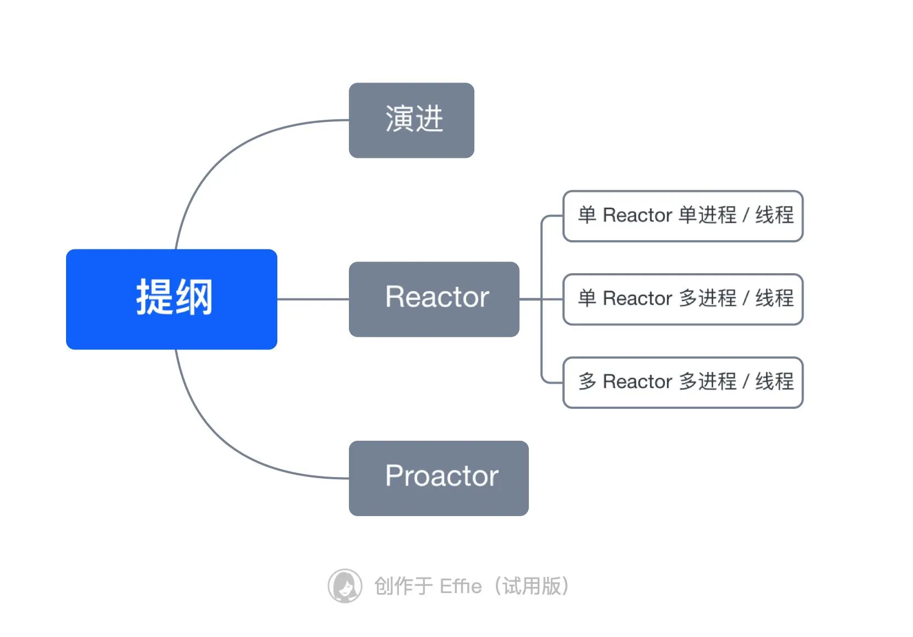
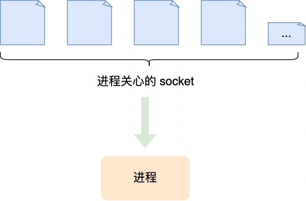
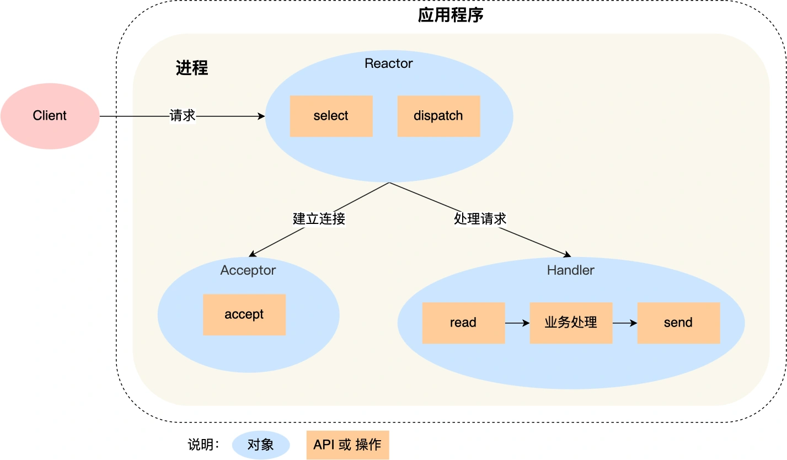
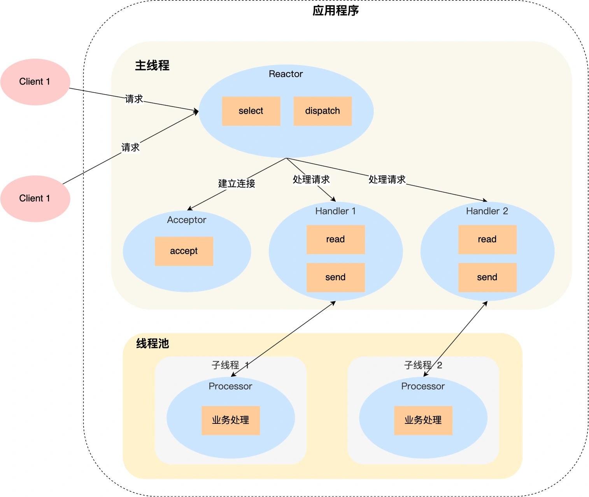
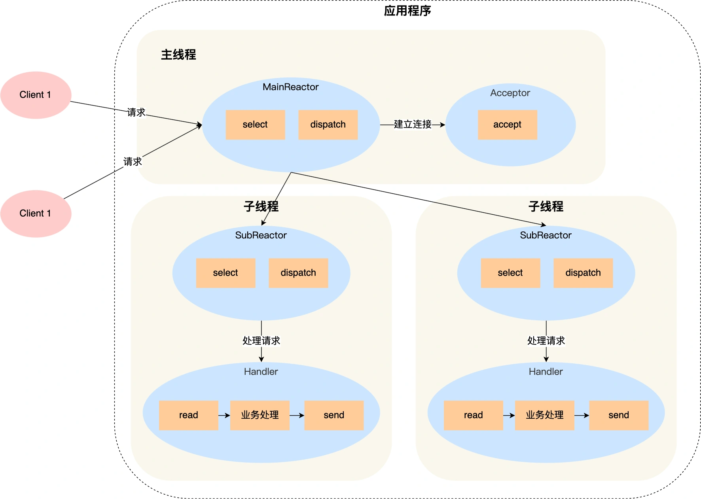
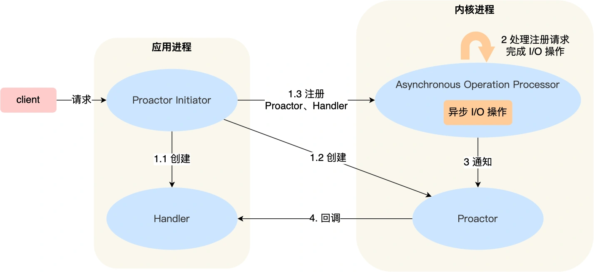

# 高性能网络模型：reactor和proactor
这次就来图解reactor和proactor这两个高性能网络模式。

别小看这两个东西，特别是reactor模式，市面上常见的开源软件很多都采用了这个方案，比如redis、nginx、netty等等，所以学好这个设计模式思想，有助于我们理解很多开源软件。

## 演进
如果要让服务器服务多个客户端，那么最直接的方式就是位每一条连接创建一个线程。

其实创建进行也是可以的，原理是一样的，进程和线程的区别在于线程比较轻量一些，线程的创建和线程的切换的成本要小一些，为了描述简述，后面都已线程为例。

处理完业务逻辑后，随着连接关闭后线程也同样要销毁，但是这样不停的创建和销毁，不仅会带来性能的开销，也会造成资源的浪费，而且如果要连接几万调连接，创建几万个线程也不现实。

要怎么解决这个问题？我们可以使用资源复用的方式。

也就是不用再为每个连接创建线程，而是创见一个线程池，将连接分配给线程，然后一个线程可以处理多个连接业务。

不过这样有引来一个新的问题，线程怎么样才能高效的处理多个连接业务呢？

当一个连接对应一个线程时，线程一般采用read->业务处理->send的处理流程，如果当前没有连接数据可读，那么线程会阻塞在read操作上(socket默认情况是阻塞IO)，不过这种阻塞方式并不影响其他线程。

但是引入了线程池，那么一个线程要处理多个连接业务，线程在处理某个连接的read操作时，如果遇到没有数据可读，就会发生阻塞，那么线程就没办法继续处理其他连接业务。

要解决这个问题，最简单的方法就是将socket改成非阻塞，然后线程不断轮询调用read操作来判断是否数据，这种方式虽然能够解决阻塞问题，但是解决问题的方式比较粗暴，因为轮询是要消耗CPU的，而且一个线程处理的连接越多，轮询的效率就会越低。

上面的问题在于，线程并不知道当前连接是否有数据可读，从而需要每次通过read去试探。

那有没有办法只有当连接上有数据的时候，线程才去发起请求呢？答案是有的，实现这一技术的就是IO多路复用。

IO多路复用技术会用一个系统调用函数来监听我们所有关心的连接，也就是说可以在一个监控线程里面监控很多连接。

我们属性的select/poll/epoll就是内核提供给用户态的多路复用系统调用，线程可以通过一个系统调用函数从内核中获取多个事件。

select/poll/epoll是如何获取网络事件的呢？
在获取事件时，先把我们要关心的连接传给内核，再由内核检测：
- 如果没有发生事件，线程只需阻塞在这个系统调用，而无需像前面的线程池那样轮询调用read操作判断是否有数据。
- 如果有事件发生，内核会返回产生了事件的连接，线程就会从阻塞状态返回，然后在用户态中处理这些连接对应的业务即可。

当下开源软件能做到网络高性能的原因就是IO多路复用吗？

是的，基本是基于IO多路复用，用过IO多路复用写网络接口的同学，肯定知道是通过面向过程的方式写代码的，这样开发的效率并不高。

于是，大佬门基于面向对象的思想，对IO多路复用做了一层封装，让使用者不用考虑底层网络API的细节，只需要关注应用代码的编写。

大佬们还为这种模式取了个让人第一时间难以理解的名字：Reactor模式。

Reactor翻译过来的意思是反应堆，可能大家会想到物理中的核反应堆，实际上并不是一个意思。

这里的反应是对事件的反应，也就是来了一个事件，Reactor就会做出响应的反应。

事实上，Reactor模式也叫做Dispatcher模式，我觉得这个名字更贴合该模式的含义，即IO多路复用监听事件，收到事件后，根据事件类型给配(dispatch)给某个进程/线程。

Reactor模式主要由Reactor和资源处理这两个核心部分组成，他俩负责的事情如下：
- Reactor负责监听和分发事件，事件类型包含连接事件、读写事件；
- 处理资源池负责处理事件，如read->业务逻辑->send;

Reactor模式是灵活多变的，可以应对不同的业务场景，灵活在于：
- Reactor的数量可以有多个也可以有一个；
- 处理资源池可以是单个线程/进程，也可以是多个线程/进程；

将上面的两个因素排列组合一下，理论上可以有4个方案选择：
- 单Reactor单进程/线程；
- 单Reactor多进程/线程；
- 多Reactor单进程/线程；
- 多Reactor多进程/线程；

其中，「多 Reactor 单进程 / 线程」实现方案相比「单 Reactor 单进程 / 线程」方案，不仅复杂而且也没有性能优势，因此实际中并没有应用。

剩下的 3 个方案都是比较经典的，且都有应用在实际的项目中：

- 单 Reactor 单进程 / 线程；
- 单 Reactor 多线程 / 进程；
- 多 Reactor 多进程 / 线程；

方案具体使用进程还是线程，要看使用的编程语言以及平台有关：

- Java 语言一般使用线程，比如 Netty;
- C 语言使用进程和线程都可以，例如 Nginx 使用的是进程，Memcache 使用的是线程。

接下来，分别介绍这三个经典的 Reactor 方案。

## Reactor
### 单 Reactor 单进程 / 线程

一般来说，C语言实现的是“单Reactor单进程”的方案，因为C语言编写完的程序，运行后就是一个独立的进程，不需要再创先线程。

而Java语言实现的是“单Reactor单线程”，因为Java程序是泡在Java虚拟机这个进程上面的，虚拟机中有很多线程，我们写的Java程序只是其中的一个线程而已。

我们来看看「单 Reactor 单进程」的方案示意图：

可以看到进程里有Reactor、Acceptor、Handler这三个对象：
- Reactor对象的作用是监听和分发事件；
- Acceptor对象的作用是获取连接；
- Handler对象的作用是处理业务；

对象里的select、Accept、read、send是系统调用函数，dispatch和“业务处理”是需要完成的操作。

接下来介绍一下单Reactor单进程这个方案：
- Reactor对象通过select(IO多路复用接口)监听事件，收到事件后通过dispatch进行分发，具体分发给Acceptor还是发给Handler对象，还要看收到的事件的类型；
- 如果是建立连接事件，则交由Accept对象进行处理，Acceptor对象会通过Accept方法获取连接，并创建一个Handler对象来处理后续的响应事件；
- 如果不是连接建立事件，则交由当前连接对应的Handler对象来进行响应；
- Handler对象通过read->业务处理->send的流程来完成完整的业务流程.

单Reactor单进程的方法因为全部工作都在同一个进程内完成,所以实现起来比较简单，不需要考虑进程间通信，也不用担心多进程竞争。

但是，这种方案存在2个缺点：
- 第一个缺点，因为只有一个进程，无法充分利用多核CPU的性能；
- 第二个缺点，Handler对象在处理业务时，整个进程无法处理其他事件，如果业务耗时较长，那么就会造成延迟卡顿。

所以，单Reactor单进程不适用计算机密集型的场景，只适用于业务处理非常快的场景。

Redis是有C语言实现的，在Redis6.0版本之前采用的正式单Reactor单进程的方案，因为redis业务处理主要是在内存中完成的，操作的速度是很快的，性能瓶颈不在CPU上，所以Redis对于命令的处理是单进程的方案。

### 单Reactor多线程/进程
如果要克服“单Reactor单线程/进程”方案的缺点，那么就需要引入多进程/线程，这样就产生了单Reactor多线程/多进程的方案。

详细说一下这个方案：
- Reactor对象通过select(IO多路复用)监听事件，收到事件后通过dispatch进行分发，具体分发给Acceptor对象还是Handler对象，还是要看收到事件的类型；
- 如果是建立连接事件，则交由Acceptor对象进行处理，Acceptor对象会通过Accept方法  获取连接，并创建一个Handler对象来处理后续的响应事件；
- 如果不是连接建立事件，则交由当前连接对应Handler对象来进行响应。

上面的三个步骤和单 Reactor 单线程方案是一样的，接下来的步骤就开始不一样了：

- Handler对象不在负责业务处理，只负责数据的接收和发送，Handler对象通过read读取到数据后，会将数据发送给子线程里的processor对象进行业务处理。
- 子线程里的processor对象就进行业务处理，处理完后，将结果发送给主线程中的handler对象，接着由handler通过send方法将响应发送给client；

单Reactor多线程的方案优势在于能够充分利用多核CPU的性能，那既然引入多线程，那么自然就带来了多线程竞争的问题。

例如：子线程完成业务处理后，要把结果传递给主线程的Handler进行发送，这里涉及共享数据的竞争。

要避免多线程由于竞争共享资源而导致数据错乱的问题，就需要在操作共享资源前加上互斥锁，以保证任意时间里只有一个线程在操作共享资源，待该线程操作完释放互斥锁后，其他线程才有机会操作共享数据。

聊完单 Reactor 多线程的方案，接着来看看单 Reactor 多进程的方案。

事实上，单 Reactor 多进程相比单 Reactor 多线程实现起来很麻烦，主要因为要考虑子进程 <-> 父进程的双向通信，并且父进程还得知道子进程要将数据发送给哪个客户端。

而多线程间可以共享数据，虽然要额外考虑并发问题，但是这远比进程间通信的复杂度低得多，因此实际应用中也看不到单 Reactor 多进程的模式。

另外，「单 Reactor」的模式还有个问题，因为一个 Reactor 对象承担所有事件的监听和响应，而且只在主线程中运行，在面对瞬间高并发的场景时，容易成为性能的瓶颈的地方。

### 多 Reactor 多进程 / 线程
要解决「单 Reactor」的问题，就是将「单 Reactor」实现成「多 Reactor」，这样就产生了第 多 Reactor 多进程 / 线程的方案。

老规矩，闻其名不如看其图。多 Reactor 多进程 / 线程方案的示意图如下（以线程为例）：

方案详细说明如下：

- 主线程中的 MainReactor 对象通过 select 监控连接建立事件，收到事件后通过 Acceptor 对象中的 accept 获取连接，将新的连接分配给某个子线程；
- 子线程中的 SubReactor 对象将 MainReactor 对象分配的连接加入 select 继续进行监听，并创建一个 Handler 用于处理连接的响应事件。
- 如果有新的事件发生时，SubReactor 对象会调用当前连接对应的 Handler 对象来进行响应。
- Handler 对象通过 read -> 业务处理 -> send 的流程来完成完整的业务流程。

多 Reactor 多线程的方案虽然看起来复杂的，但是实际实现时比单 Reactor 多线程的方案要简单的多，原因如下：

- 主线程和子线程分工明确，主线程只负责接收新连接，子线程负责完成后续的业务处理。
- 主线程和子线程的交互很简单，主线程只需要把新连接传给子线程，子线程无须返回数据，直接就可以在子线程将处理结果发送给客户端。

大名鼎鼎的两个开源软件 Netty 和 Memcache 都采用了「多 Reactor 多线程」的方案。

采用了「多 Reactor 多进程」方案的开源软件是 Nginx，不过方案与标准的多 Reactor 多进程有些差异。

具体差异表现在主进程中仅仅用来初始化 socket，并没有创建 mainReactor 来 accept 连接，而是由子进程的 Reactor 来 accept 连接，通过锁来控制一次只有一个子进程进行 accept（防止出现惊群现象），子进程 accept 新连接后就放到自己的 Reactor 进行处理，不会再分配给其他子进程。

## Proactor
前面提到的 Reactor 是非阻塞同步网络模式，而 Proactor 是异步网络模式。

这里先给大家复习下阻塞、非阻塞、同步、异步 I/O 的概念。

先来看看阻塞 I/O，当用户程序执行 read ，线程会被阻塞，一直等到内核数据准备好，并把数据从内核缓冲区拷贝到应用程序的缓冲区中，当拷贝过程完成，read 才会返回。

注意，阻塞等待的是「内核数据准备好」和「数据从内核态拷贝到用户态」这两个过程。过程如下图：

知道了阻塞 I/O ，来看看非阻塞 I/O，非阻塞的 read 请求在数据未准备好的情况下立即返回，可以继续往下执行，此时应用程序不断轮询内核，直到数据准备好，内核将数据拷贝到应用程序缓冲区，read 调用才可以获取到结果。过程如下图：

注意，这里最后一次 read 调用，获取数据的过程，是一个同步的过程，是需要等待的过程。这里的同步指的是内核态的数据拷贝到用户程序的缓存区这个过程。

举个例子，如果 socket 设置了 O_NONBLOCK 标志，那么就表示使用的是非阻塞 I/O 的方式访问，而不做任何设置的话，默认是阻塞 I/O。

因此，无论 read 和 send 是阻塞 I/O，还是非阻塞 I/O 都是同步调用。因为在 read 调用时，内核将数据从内核空间拷贝到用户空间的过程都是需要等待的，也就是说这个过程是同步的，如果内核实现的拷贝效率不高，read 调用就会在这个同步过程中等待比较长的时间。

而真正的异步 I/O 是「内核数据准备好」和「数据从内核态拷贝到用户态」这两个过程都不用等待。

当我们发起 aio_read （异步 I/O） 之后，就立即返回，内核自动将数据从内核空间拷贝到用户空间，这个拷贝过程同样是异步的，内核自动完成的，和前面的同步操作不一样，应用程序并不需要主动发起拷贝动作。过程如下图：

举个你去饭堂吃饭的例子，你好比应用程序，饭堂好比操作系统。

阻塞 I/O 好比，你去饭堂吃饭，但是饭堂的菜还没做好，然后你就一直在那里等啊等，等了好长一段时间终于等到饭堂阿姨把菜端了出来（数据准备的过程），但是你还得继续等阿姨把菜（内核空间）打到你的饭盒里（用户空间），经历完这两个过程，你才可以离开。

非阻塞 I/O 好比，你去了饭堂，问阿姨菜做好了没有，阿姨告诉你没，你就离开了，过几十分钟，你又来饭堂问阿姨，阿姨说做好了，于是阿姨帮你把菜打到你的饭盒里，这个过程你是得等待的。

异步 I/O 好比，你让饭堂阿姨将菜做好并把菜打到饭盒里后，把饭盒送到你面前，整个过程你都不需要任何等待。

很明显，异步 I/O 比同步 I/O 性能更好，因为异步 I/O 在「内核数据准备好」和「数据从内核空间拷贝到用户空间」这两个过程都不用等待。

Proactor 正是采用了异步 I/O 技术，所以被称为异步网络模型。

现在我们再来理解 Reactor 和 Proactor 的区别，就比较清晰了。

- Reactor 是非阻塞同步网络模式，感知的是就绪可读写事件。在每次感知到有事件发生（比如可读就绪事件）后，就需要应用进程主动调用 read 方法来完成数据的读取，也就是要应用进程主动将 socket 接收缓存中的数据读到应用进程内存中，这个过程是同步的，读取完数据后应用进程才能处理数据。
- Proactor 是异步网络模式， 感知的是已完成的读写事件。在发起异步读写请求时，需要传入数据缓冲区的地址（用来存放结果数据）等信息，这样系统内核才可以自动帮我们把数据的读写工作完成，这里的读写工作全程由操作系统来做，并不需要像 Reactor 那样还需要应用进程主动发起 read/write 来读写数据，操作系统完成读写工作后，就会通知应用进程直接处理数据。

因此，Reactor 可以理解为「来了事件操作系统通知应用进程，让应用进程来处理」，而 Proactor 可以理解为「来了事件操作系统来处理，处理完再通知应用进程」。这里的「事件」就是有新连接、有数据可读、有数据可写的这些 I/O 事件这里的「处理」包含从驱动读取到内核以及从内核读取到用户空间。

举个实际生活中的例子，Reactor 模式就是快递员在楼下，给你打电话告诉你快递到你家小区了，你需要自己下楼来拿快递。而在 Proactor 模式下，快递员直接将快递送到你家门口，然后通知你。

无论是 Reactor，还是 Proactor，都是一种基于「事件分发」的网络编程模式，区别在于 Reactor 模式是基于「待完成」的 I/O 事件，而 Proactor 模式则是基于「已完成」的 I/O 事件。

接下来，一起看看 Proactor 模式的示意图：

介绍一下 Proactor 模式的工作流程：

- Proactor Initiator 负责创建 Proactor 和 Handler 对象，并将 Proactor 和 Handler 都通过 Asynchronous Operation Processor 注册到内核；
- Asynchronous Operation Processor 负责处理注册请求，并处理 I/O 操作；
- Asynchronous Operation Processor 完成 I/O 操作后通知 Proactor；
- Proactor 根据不同的事件类型回调不同的 Handler 进行业务处理；
- Handler 完成业务处理；

可惜的是，在 Linux 下的异步 I/O 是不完善的， aio 系列函数是由 POSIX 定义的异步操作接口，不是真正的操作系统级别支持的，而是在用户空间模拟出来的异步，并且仅仅支持基于本地文件的 aio 异步操作，网络编程中的 socket 是不支持的，这也使得基于 Linux 的高性能网络程序都是使用 Reactor 方案。

而 Windows 里实现了一套完整的支持 socket 的异步编程接口，这套接口就是 IOCP，是由操作系统级别实现的异步 I/O，真正意义上异步 I/O，因此在 Windows 里实现高性能网络程序可以使用效率更高的 Proactor 方案。

#总结
常见的 Reactor 实现方案有三种。

第一种方案单 Reactor 单进程 / 线程，不用考虑进程间通信以及数据同步的问题，因此实现起来比较简单，这种方案的缺陷在于无法充分利用多核 CPU，而且处理业务逻辑的时间不能太长，否则会延迟响应，所以不适用于计算机密集型的场景，适用于业务处理快速的场景，比如 Redis（6.0之前 ） 采用的是单 Reactor 单进程的方案。

第二种方案单 Reactor 多线程，通过多线程的方式解决了方案一的缺陷，但它离高并发还差一点距离，差在只有一个 Reactor 对象来承担所有事件的监听和响应，而且只在主线程中运行，在面对瞬间高并发的场景时，容易成为性能的瓶颈的地方。

第三种方案多 Reactor 多进程 / 线程，通过多个 Reactor 来解决了方案二的缺陷，主 Reactor 只负责监听事件，响应事件的工作交给了从 Reactor，Netty 和 Memcache 都采用了「多 Reactor 多线程」的方案，Nginx 则采用了类似于 「多 Reactor 多进程」的方案。

Reactor 可以理解为「来了事件操作系统通知应用进程，让应用进程来处理」，而 Proactor 可以理解为「来了事件操作系统来处理，处理完再通知应用进程」。

因此，真正的大杀器还是 Proactor，它是采用异步 I/O 实现的异步网络模型，感知的是已完成的读写事件，而不需要像 Reactor 感知到事件后，还需要调用 read 来从内核中获取数据。

不过，无论是 Reactor，还是 Proactor，都是一种基于「事件分发」的网络编程模式，区别在于 Reactor 模式是基于「待完成」的 I/O 事件，而 Proactor 模式则是基于「已完成」的 I/O 事件。
