# 进程线程基础知识

>   先来看看一个小故事

我们写好的一行行代码，为了让其工作起来，我们还得把它送进城(进程)里，那既然进了城里，那肯定就不能胡作非为了。

城里人有城里人的规矩，城中有个专门管辖你们的城管(操作系统)，人家让你休息就休息，让你工作就工作，毕竟摊位不多，每个人都要占这个摊位工作，城里要工作的人多着呢。

所以为了公平起见，它使用一种策略(调度)方式，给给个人一个固定的工作时间(时间片),时间到了，就会通知你去休息让另外一个人工作。

另外，在休息的时候你也不能偷懒，要记住工作到哪了，不然下次到你工作了，你忘记工作到哪了，那怎么还继续。

有的人，可能还进入了县城(线程)工作，这里工作相对轻松一些，在休息的时候，要记住的东西相对较少，而且还能共享城里的资源。


##  进程
我们编写的代码只是一个存储在磁盘的静态文件，通过编译后会生成可执行的二进制文件，当我们运行这个程序的时候，它会被装载到内存中，接着CPU就会执行程序中的每一条指令，那么这个运行中的程序，就被称为进程。

现在我们考虑有一个会读取硬盘文件数据的程序被执行了，那么当运行到读取文件的指令时，就会从硬盘读取数据，但是硬盘的读写速度是非常慢的，这个时候如果CPU傻傻的等待硬盘返回数据的话，那么效率是非常低的。

做个类比，你去烧开水，你会傻傻的等水壶烧开吗？和明显，小孩也不会傻等，我们可以在水壶烧水的过程中做其他事情，当水壶烧开水了，我们自然就会听到滴滴滴的声音，于是再把开水倒入水杯里就可以了。

所以，当进程要读取硬盘数据的时候，CPU不需要阻塞等待数据的返回，而是去执行另外的进程， 当硬盘返回数据时，CPU会收到这个中断，于是CPU再继续运行这个进程。

这种多个程序、交替执行的思想，就有CPU管理多个进程的初步想法。

对于一个支持多个进程的系统，CPU会从一个进程快速切换到另一个进程，期间每个进程个运行几十或几百毫秒。

虽然单核CPU在某个瞬间，只能运行一个进程，但在1秒中，它可能会运行多个进程，这样就产生了并行的错觉，实际上是并发。

>   并行和并发有什么区别

一图胜千言
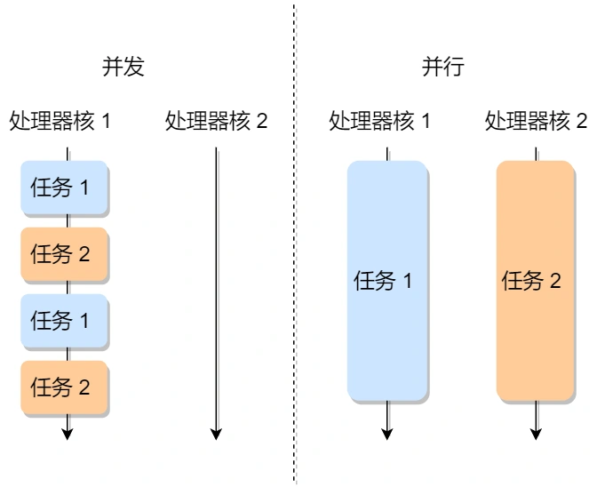

>   进程和程序的关系类比

到了晚饭期间，一对小情侣肚子都咕咕交了，于是男生见机行事，就像给女生做晚饭，所以他就在网上找了辣子鸡的菜谱，接着买了一些鸡肉辣椒香料等。然后边看边学做这道蔡。
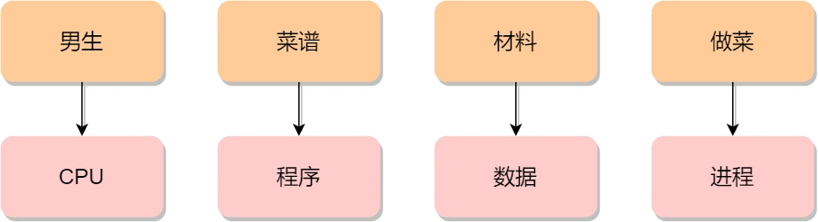
突然，女生说想喝可乐了，那么男生只好把做菜的事情暂停一下，并在手机菜谱标记做到哪一个步骤，把状态信息记录下来。

然后男生听了女生的指令，跑去楼下买了一瓶冰可乐后，又回到厨房继续做菜。

这体现了，CPU可以从一个进程(做菜)切换到另一个进程(买可乐)，在切换前必须要记录当前进程的状态信息，以备下次切换回来的时候可以恢复执行。

所以，可以发现进程有着运行暂停运行的活动规律。

###  进程的状态
在上面我们知道了进程有着运行暂停运行的活动规律。一般来说，一个进程并不是自始至终连续不停地运行， 它与并发执行中的其他进程的执行相互制约的。

它有时处于运行状态，有时又由于某种原因处于等待状态，当使他暂停的原因消失后，它又进入了准备运行状态。

所以，在一个进程运行的期间至少具备三种基本状态，即运行状态、就绪状态、阻塞状态。
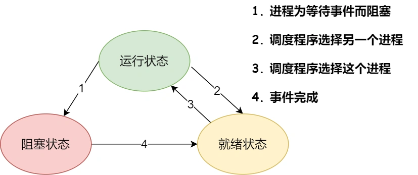
上图中各个状态的意义：
- 运行状态(Running)：该时刻进程占用CPU；
- 就绪状态(Ready)：可运行，由于其他进程处于云状态而暂时停止运行；
- 阻塞状态(Block):该进程一直等待某一事件的发生(如等待输入输出操作的完成)而暂时停止运行，这时，即使给它CPU控制权，它也无法运行；

当然，还有两个基本状态：
- 创建状态(New)：进程正在被创建的状态；
- 结束状态(Exit)：进程正在从系统中消失的状态；

于是一个完整的进程状态变迁如下图：
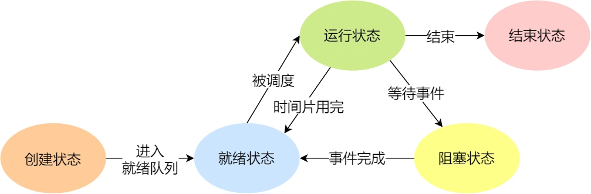
再来详细说明一下进程状态的变迁：
- NULL-> 创建状态:一个新进程被创建时的第一个状态
- 创建状态-> 就绪状态：当进程被创建完成并完成初始化后，一切准备就绪后，就变为就绪状态，这个过程是很快的。
- 就绪装填-> 运行状态：处于就绪状态的进被操作系统的进程调度器选中后，就分配给CPU正式运行该进程。
- 运行状态-> 结束状态：当进程已经运行完成或者出错时，会被操作系统座结束状态处理。
- 运行状态-> 就绪状态：处于运行状态的进程在运行中，由于分配给它的运行时间片用完，操作系统会把这个状态变为就绪状态，接着从就绪状态中选择一个进程运行。
- 运行状态-> 阻塞状态: 当进程请求某个事件必须等待时，例如请求IO事件；
- 阻塞状态-> 就绪状态：当进程要等待的事情完成了，就进入就绪状态；

如果有大量处于阻塞状态的进程，进程可能会占用这物理内存空间，显然不是我们所希望的，毕竟物理内存空间是有限的，被阻塞的进程占用着物理内存就是一种很浪费物理内存的行为。

所以，在虚拟内存管理的操作系统中，通常会把阻塞状态的进程的物理空间换出到硬盘，等需要再次运行的时候，再从磁盘换入到物理内存。
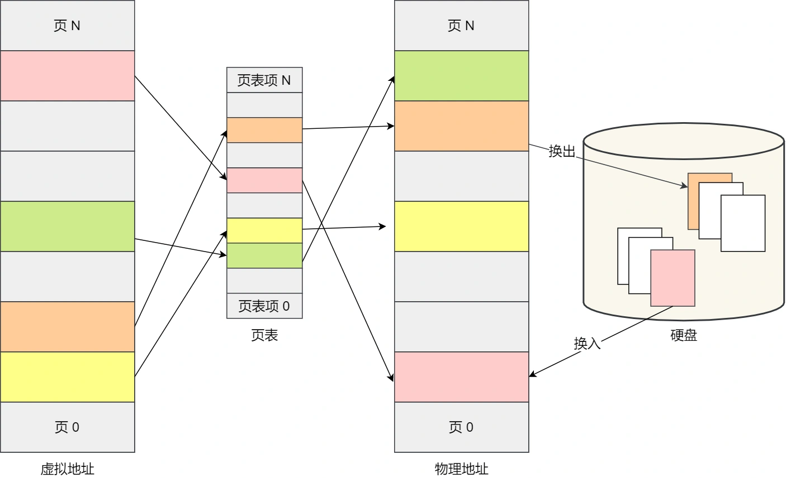
那么就需要一个新的状态，来描述进程没有占用实际物理内存空间的情况，这个状态就是挂起状态。这个跟阻塞状态不一样，阻塞状态是等待某个事件的返回。

另外，挂起状态可以分为两种：
- 阻塞挂起状态：进程在外存(硬盘)并等待某个事件的出现
- 就绪挂起状态：进程在外存(硬盘)，单只要进入内存，就能立刻运行。

这两种状态加上前面的五种状态，就变成了七种状态的变迁，见如下图：

导致进程挂起的原因不只是因为进程所使用的内存空间不在物理内存，还包括如下情况：
- 通过sleep让进程间歇性挂起，其工作原理是设置一个定时器，到后期唤起进程。
- 用户希望挂起一个程序的执行，比如在Linux中Ctrl+z 挂起进程。

### 进程的控制结构
在操作系统中，使用进程控制块(process control block，PCB)数据接口来描述进程的。
PCB是进程存在的唯一标识，这意味着一个进程的存在，必然会有一个PCB，如果进程消失了，那么PCB也会随之消失。

>   PCB具体包含那些信息呢？

进程描述信息：
- 进程标识符：标识各个进程，每个进程都有一个并且唯一的标识符；
- 用户标识符：进程归属的用户，用户标识符主要为共享和保护服务。

进程控制和信息管理：
- 进程当前状态：如new、ready、running、waiting、或Blocked等。
- 进程优先级：进程抢占CPU的优先级；

资源分配清单：
- 有关内存地址空间或虚拟地址空间信息，所打开文件列表和所使用的IO设备信息。

CPU相关信息：
- CPU中各个寄存器的值，当进程被切换时，CPU的状态信息都会被保存在相应的PCB中，一遍进程重新执行的时候，能从断点出继续执行。

可见，PCB包含的信息还是蛮多的。

>   每个PCB是如何组织的呢？

通常是通过链表的方式进行组织，把具有相同状态的进程连在一起，组成各种队列。比如：
- 将所有处于就绪状态的进程链接在一起，称为就绪状态。
- 把所有因等待某件事而处于等待状态的进程链接在一起就组成了各种阻塞队列、
- 另外，对于运行队列在单核CPU系统中则只有一个运行指针了，因为单核CPU在某个时间，只能运行一个程序。

那么，就绪队列和阻塞队列链表的组织形式如下图：
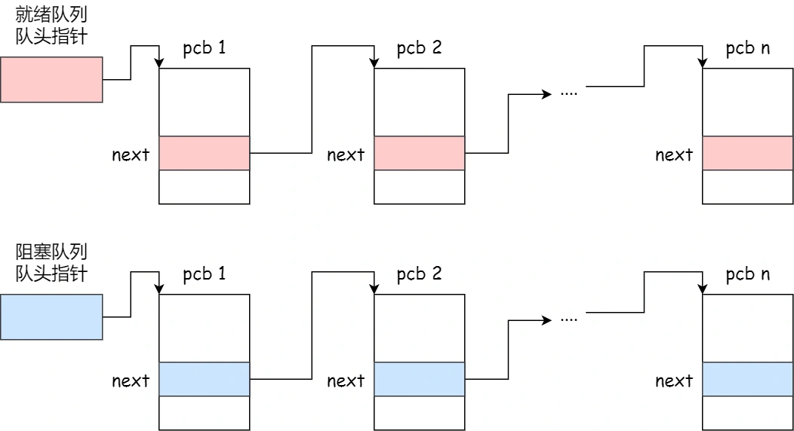
除了链接的组织方式，还有索引方式，它的工作原理：将同一状态的进程组织在一个索引中，索引表项指向响应的PCB，不同状态对应不同的索引、

一般会选择链表，因为可能面临进程创建，销毁等调度导致进程状态发生变化，所以链表能够更加灵活的插入和删除。

### 进程的控制
我们熟知了进程的状态变迁和进程的数据结构PCB后，再来看看进程的创建、终止、阻塞、唤醒等过程，这些过程也就是进程的控制。

1. 创建进程
操作系统允许一个进程创建另一个进程，而且允许子进程继承父进程的所有资源。

创建进程的过程如下：
- 申请一个空白的PCB，并向PCB中填写一些控制和管理进程的信息，比如进程的唯一标识等。
- 为该进程分配运行时所必须的资源，比如内存资源。
- 将PCB插入到就绪队列中，等待被调度运行。

2. 终止进程
进程可以有3种终止方式：正常结束，异常结束以及外界干扰(信号Kill等)。、

当子进程被终止时，其在父进程处继承的资源应当还给父进程，而当父进程被终止时，该父进程的子进程就变为了孤儿进程，会被1号进程收养，并由1号进程对他们完成状态收集工作。

终止进程的过程如下：
- 查找需要终止进程的PCB；
- 如果处于执行状态，则立刻终止该进程的执行，然后将CPU的资源分配个其他进程；
- 如果其还有子进程，则将该进程的子进程交给1号进程接管；
- 将该进程所拥有的全部资源归还给操作系统；
- 将其从PCB所在队列中删除；

3. 阻塞进程
当进程需要等待某一事件完成时，它可以调用阻塞语句把自己阻塞等待。而一旦被阻塞等待，它只能由另一个进程唤醒。

阻塞进程的过程如下：
- 找到将要被阻塞进程标识号对应的PCB
- 如果该进程位运行状态，则保护其现场，将其状态转为阻塞状态，停止运行；
- 将该PCB插入到阻塞队列中去；

4. 唤醒进程
进程由运行转变阻塞状态是由于进程必须等待某一事件的完成，所处于阻塞状态的进程是绝对不能唤醒自己的。

如果某进程正在等待IO事件，需由别的进程发消息给他，则只有当该进程所希望的事件出现时，才由发现者进程用唤醒者语句唤醒它。

唤醒的过程如下：
- 在该事件的阻塞队列中找到相应的进程PCB；
- 将其从阻塞队列中移除，并置其状态为就绪状态；
- 把PCB插入到就绪队列中，等待调度程序调度。

进程的阻塞和唤醒是一对反义词，如果进程调用了阻塞语句，则必有一个预支对应的唤醒语句。

### 进程的上下文切换
各个进程之间是共享CPU资源的，在不同的时候进程之间是需要切换的，让不同的进程可以在CPU执行；
那么这个一个进程切换到另一个进程运行的过程，就叫做进程的上下文切换。

> 再详细说进程上下文切换前，我们先来看看CPU上下文切换

大多数操作系统都是多任务，通常支持大于CPU数量的任务同时运行。实际上，这些任务不是同时运行的，只是因为在操作系统很短的时间内，让各个任务分别在CPU运行，于是就造成同时运行的错觉。

任务是交给CPU运行的，那么在每个任务运行前，CPU需要知道任务从哪里加载，又从哪里开始运行。

所以操作系统需要先帮CPU设置好CPU寄存器和程序计数器。

CPU寄存器是CPU内存一个容量小，但是速度极快的内存(缓存)。程序计数器则是用来存储CPU正在执行的指令、或者即将执行的下一条指令。

所以说，CPU寄存器和程序计数器是CPU在执行任何任务前，所必须的依赖环境，这些环境就叫做CPU的上下文。

既然知道了什么是CPU的上下文，那么理解CPU的上下文切换就不难了。

CPU的上下文切换就是把先前一个任务的CPU上下文(CPU 寄存器和CPU计数器)保存起来，然后加载新任务的上下文到这些寄存器和程序计数器，最后再跳转到程序计数器所指的新位置，运行新的任务。

系统内核会存储保存下来的上下文信息，当此任务在此被分配给CPU运行时，CPU会重新加载这些上下文，这样能保证原来的任务不被影响，让任务看起来的是连续运行的。

上面说道所谓的任务，主要包含进程、线程和中断。所以，根据任务的不同，把CPU上下文切换分成：进程上下文切换、线程上下文切换、中断上下文切换。

> 进程的上下文切换到时是切换的什么？

进程是由内核管理和调度的，所以进程切换只能发生在内核。

所以进程的上下文切换不仅包含了虚拟内存、栈、全局变量等用户空间的资源，还包括了内核堆栈、寄存器等内核空间资源。

通常，会把交换的信息保存在进程的PCB，当要运行另外一个进程的时候，我们需要从这个进程的PCB取出上下文，然后恢复到CPU中，这使得这个进程可以继续执行：

大家需要注意，进程的上下文切换的开销是很关键的，我们希望它的开销越小越好，这样可以使得进程可以把更多的时间花费在执行程序上，而不是耗费在上下文切换。

> 发生进程上下文有哪些场景？

- 为了保证所有进程可以得到公平的调度，CPU时间划分为一段段的时间片，这些时间片在被轮流分配给各个进程。这样，当某个进程的时间片耗尽了，进程就从运行状态变成就绪状态，系统从就绪队列选择另一个进程运行。
- 进程在系统资源不足(比如内存不足)时，要等到资源满足后才可以运行，这个时候进程也会被挂起，并由系统调度其他进程运行。
- 当进程通过睡眠函数sleep这样的方法将自己主动挂起时，自然也需要重新调度。
- 当有优先级更高的程序运行时，为了保证更高的优先级程序运行，当前程序会被挂起，有高优先级进程来运行；
- 发生硬中断时，CPU上的进程会被中断挂起，转而执行内核中的中断服务进程

以上就是进程上下文切换的场景了。

## 线程
在早期的操作系统都是已进程作为独立运行的基本单位的，知道后面，计算机科学家们有提出了更小的能独立运行的基本单位。也就是线程。

### 为什么使用线程？
我们举个例子：假设你要写一个适配播放器软件，那么该软件的核心模块有三个：
- 从视频文件读取数据；
- 对读取的数据进行解压缩；
- 把解压后的视频数据播放出来。

对于单进程的实现方式，我想大家都会是以下这个方式：
```c
main()
{
    while(1)
    {
        Read();
        Decompose();
        Play();
    }
}
```

对于单进程的这种方式，存在以下问题：
- 播放出来的视频不连贯，因为当CPU能力不够强的时候，Read的时候可能就等在这了，这样就会导致等半天才进行数据解压和播放。
- 各个函数之间不是并发执行的，影响资源的使用效率。

那改进成多进程的方式：
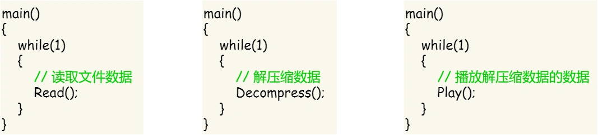
对于多进程这种方式依然会存在问题：
- 进程之间如何通讯，共享数据？
- 维护进程的系统开销较大，如创建进程时，分配资源，建立PCB；终止进程时，回收资源，撤销PCB，进程切换时，保存当前进程的状态信息。

那到底如何解决呢？需要有一种新的实体，满足如下特性：
- 实体之间可以并发执行；
- 实体之间共享相同的地址空间；

这个新的实体，就是线程，线程之间可以并发运行且共享相同的地址空间。

什么是线程？
线程是进程当中的一条执行流程。

同一个进程内多个线程之间可以共享代码段、数据段、打开的文件等资源，单每个线程都各自有一套独立的寄存器和栈，这样可以确保线程的控制流是相对独立的。


> 线程的缺点

- 当进程中的一个线程崩溃时，会导致其所属进程的所有线程崩溃(这里是针对C/C++语言，Java语言中的线程崩溃不会造成进程崩溃)

举个例子，对于游戏的用户设计，则不应该使用多线程的方式，否则一个用户挂了，会影响其他同个进程的线程。

### 线程与进程的比较
线程与进程的比较如下：
- 进程是资源(包括内存、打开的文件等)分配的单位，线程是CPU调度的单位。
- 进程拥有一个完整的资源平台，而线程只独享不可少的资源，如寄存器和栈。
- 线程同样有运行、就绪和阻塞三种状态，同样具有状态之间的转换关系。
- 线程能减少并发执行的时间和空间开销。

对与，线程相比进程能减少的开销体现在：
- 线程的创建时间比进程快，因为进程在创建过程中，还需要资源管理信息，比如内存管理信息、文件管理信息，而线程在创建的过程中，不会涉及这些管理信息，而是共享他们。
- 线程终止时间比进程快，因为线程释放的资源比进程少很多；
- 同一个进程内的线程切换比进程切换快，因为线程具有相同的地址空间(虚拟内存共享)，这意味这同一个进程的线程都具有同一个页表，那么在切换的时候不需要切换页表。而对于进程之间的切换，切换的时候要把页表切换调，而页表切换的过程开销是比较大的。
- 由于同一个进程的各个线程共享内存和文件资源，那么在线程之间数据传递的时候，就不需要经过内核了，这就使得线程之间的数据交互效率更高了；

所以不管是时间效率，还是空间效率线程比进程都高了；

### 线程的上下文切换
在前面我们知道，线程与进程的最大区别在于：线程是调度的基本单位，而进程是资源拥有者的基本单位。

所以所谓的系统调度，实际上调度的对象是线程，而进程只是个线程提供了虚拟内存、全局变量等资源。

对于线程和进程，我们可以这么理解：
- 当进程只有一个线程时，可以认为进程就是线程；
- 当进程拥有多个线程时，这些线程会共享相同的虚拟内存和全局变量等资源，这些资源在上下文切换时不需要修改的。

另外，线程也拥有自己的资源，比如栈和寄存器，这些在上下文切换时，也是需要保存的。

> 线程上下文切换是什么？

这还的看线程是不是属于同一个进程了：
- 当两个线程不是属于同一个进程，则切换的过程就跟进程上下文切换是一样的了
- 当两个线程是属于同一个进程，因为线程虚拟内存是共享的，所以在切换时，虚拟内存这些资源就保持不动，只需要切换线程的私有数据、寄存器等不共享的资源。

所以线程的上下文切换比进程开销小的多。

### 线程的实现
主要有三种线程实现方式：
- 用户线程(user thread)：在用户空间实现的线程，不是有内核管理的线程，是有用户态线程库来完成的管理。
- 内核线程(kernel thread)：在内核中实现的线程，是由内核管理的线程；
- 轻量级线程(LightWeight thread)：在内核中支持用户线程；

那么，这个还需要考虑一个问题，用户线程和内核线程的对应关系。
首先，第一种关系是多对一关系，也就是多个用户线程对一个内核线程：
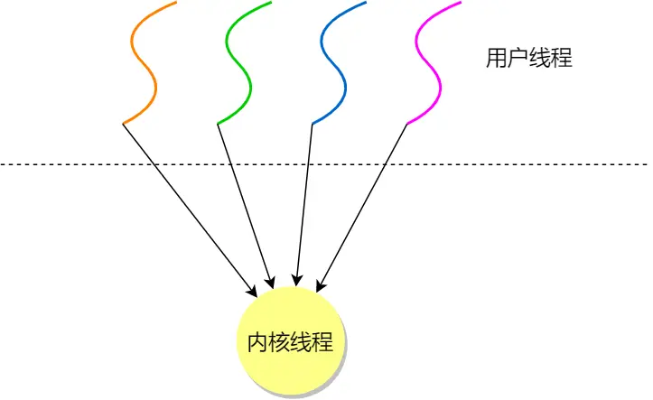
第二种是一对一关系，也就是一个内核线程对应一个用户线程；
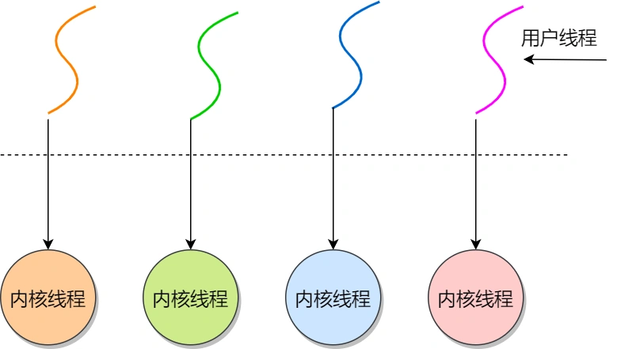
第三种是多对多关系，也就是多个用户线程对应多个内核线程：
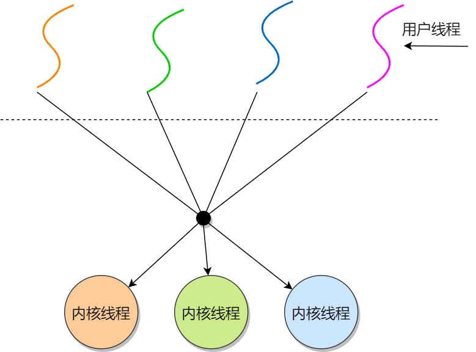

> 用户线程如何理解，存在什么优势和缺陷

用户线程基本都是在用户态的线程库来管理的，那么线程控制块(thread control block, TCB)，也是在库里面实现的，对于操作系统而言是看不到这个TCB的，它只能看到整个进程的PCB。

所以用户整个线程的管理和调度，操作系统是不直接参与的，而是由用户级线程库函数来完成线程的管理，包括线程的创建、终止、同步和调度等。

用户级线程的模型，也就类似前面提到的多对一关系，即多个用户线程对应一个内核线程。

用户级线程的有点：
- 每个进程都需要有它私有的线程块控制列表，用来跟踪记录它各个线程状态的信息(PC、栈指针、寄存器等)，TCB由由用户级线程库函数来维护，可用于不支持线程技术的操作系统。
- 用户线程的切换也是由线程库函数来控制的，无需用户态与内核态的切换，所以速度特别快。

用户线程的缺点：
- 由于操作系统不参与线程的调度，如果一个线程发起了系统调用而阻塞，那进程所包含的用户线程都不能执行了。
- 当一个线程开始运行后，除非它主动的交出CPU的使用权，否则它所在的进程当中的其他线程无法运行，因为用户态的线程，没法打断当前运行中的线程，它没有这个特权，只有操作系统才有，但是用户线程不是由操作系统管理的。
- 由于时间片分配给了进程，故与其他进程比，在多线程执行时，每个线程得到的时间片较少，执行会比较慢。

以上就是线程的优缺点了。

> 那内核线程如何理解？存在什么优缺点？

内核线程是由操作系统管理的，线程对应的TCB自然是放在操作系统里的，这样线程的创建、终止和管理都是操作系统负责的。

内核线程的模型，也就是前面提到的一对一的关系，即一个用户线程对应一个内核线程。

内核线程的优点：
- 在一个进程当中，如果某个内核线程发起系统调用而被阻塞，并不会影响其他线程的运行。
- 分配给线程，多线程的进程获得更多的CPU时间。

内核的缺点:
- 在支持内核线程的操作系统中，有内核来维护进程和线程的上下文信息，如PCB和TCP；
- 线程的创建、终止和切换都是通过系统调用的方式来进行，因此对于系统来说，系统的开销比较大；

以上就是内核线程的有缺点了。

> 最后轻量级线程如何理解？

轻量级线程是内核支持的用户级线程，一个进程可以有多个轻量级线程，每个轻量级线程跟内核线程是一对一映射的，也就是说轻量级线程都是由一个内核线程支持，而且轻量级线程是有内核管理并像普通线程一样调度。

在大多数系统中轻量级线程和进程的区别在于它只有一个最小的执行上下文和调度程序所需的统计信息，一般来说，一个进程代表一个程序的实例，而轻量级线程代表程序的执行线程，因为一个执行线程不像进程那样需要那么多状态信息，所以轻量级线程也不待有这些信息。

在 LWP 之上也是可以使用用户线程的，那么 LWP 与用户线程的对应关系就有三种：

1 : 1，即一个 LWP 对应 一个用户线程；
N : 1，即一个 LWP 对应多个用户线程；
M : N，即多个 LWP 对应多个用户线程；
接下来针对上面这三种对应关系说明它们优缺点。先看下图的 LWP 模型：
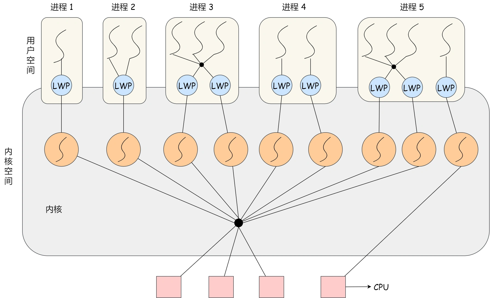
#### 1:1 模式
一个线程对于应到一个轻量级线程在对应到一个内核线程
- 优点： 实现并行，当一个LWP阻塞，不会影响其他LWP。
- 缺点：每一个用户线程，就产生一个内核线程，创建线程的开销较大。

#### N:1 模式
多个用户线程对应一个LWP线程再对应一个内核线程，线程管理是在用户空间完成，此模式中用户线程对操作系统不可见。

- 优点：用户线程要开几个都没问题，且上下文切换发生在用户空间，切换效率较高。
- 缺点：一个用户线程阻塞了，则整个进程都将会阻塞，另外在多核CPU中，是没办法充分利用的。

#### M:N 模式
根据前面的混搭在一起，就形成了M:N 模型，该模型提供了两级控制，首先多个用户线程对应到多个LWP，LWP在一一对应到内核线程。

- 优点：综合了前面两种的优点，大部分线程上下文切换发生在用户态，且多个线程又可以充分利用多核CPU的资源。

#### 组合模式
此进程结合1：1 模型和M:N 模型。开发人员可以针对不同的应用特点调节内核线程的目的数目来达到物理并行和逻辑并行的最佳方案。

## 调度
进程都希望自己能够占用CPU进行工作，那么这涉及到前面说说的进程上下文切换。

一旦操作系统把进城切换到运行状态,也就意味着该进程占用着CPU在执行,但是当操作系统把进程切换到其他状态时,那就不能在CPU中执行了,于是操作系统会选择下一个要运行的进程。

选择一个进程这一功能是在操作系统中完成的，通常称为调度程序。

那到底什么时候调度程序呢？或以什么原则来调度程序呢？

>   TIP
> 我们知道很多人会问，线程不是操作系统的调度单位么？为什么这里参与调度的是进程？
> 
> 先提前说明，这里的进程指只有主线程的进程，所以调度主线程就等于调度了整个进程
> 
> 那为什么不直接取名进程调度？主要是操作系统相关度额书籍，都是用进程调度这个名字，所以我们也沿用了这个名字、

### 调度时机
在进程的生命周期中，当进程从一个运行状态到另一个状态变化的时候，其实会触发一次调度。

比如，以下状态的变化都会触发操作系统的调度。
- 从就绪状态->运行状态：当进程被创建时，就会进入到就绪队列，操作系统会从就绪队列选择一个进程运行；
- 从运行状态->阻塞状态：当进程发生IO事件而发生阻塞时，操作系统必须选择另外一个进程运行；
- 从运行状态->结束状态：当进程退出结束后，操作系统就得从就绪队列选择另一个进程运行；

因为，这些状态的变化的时候，操作系统需要考虑是否让新的进程给CPU运行，或者是否让当前进程从CPU中退出来而换另一个进程运行。

另外，如果硬件时钟提供某个平率周期的中断，那么可以根据如何处理时钟中断，把调度算法分为两类：
- 非抢占式调度算法挑选一个进程，然后让进程运行知道被阻塞，或者直到该进程被退出，才会调用另一个进程，也就是说不会理会中断这个事情。
- 抢占式调度算法挑选一个进程，然后让进程只运行某段时间，如果该时间段结束时，该进程仍然在运行，则会把它挂起，接着调度程序会从就绪队列挑选另一个进程，这种抢占式调度处理，需要在时间间隔的末端发生时钟中断，以便把CPU控制返回给调度程序进行调度，也就是常说的时间片机制。

### 调度原则：
原则一：如果运行的程序发生了IO事件的请求，那CPU使用率必然会很低，因为此时进程在阻塞等待硬盘的数据返回。这样的过程，势必会造成CPU突然的空闲。所以，为了提高CPU利用率，着这种发生IO事件致使CPU空闲的情况下，调度程序需要从就绪队列选择一个新的进程来运行。

原则二：有的程序执行某个任务花费的时间会比较长，如果这个进程一直占用CPU，会造成系统吞吐量(CPU 在单位时间内完成的进程数量)的降低，所以要提高系统的吞吐量，调度程序需要权衡长任务和短任务进程的运行完成数量。

原则三：从进程开始到结束的过程中，实际上是包含两个时间，分别是进程运行时间和进程的等待时间，这两个时间的总和就是进程的周转时间。进程的周转时间越小越好，如果进程的等待时间长而运行时间短，那周转时间很长，这不是我们所期望的，调度程序应该避免这种情况发生。

原则四：处于就绪的队列，也不能等太久，当然希望这个时间越短越好，这样使得进程更快的在CPU中执行，所以，就绪队列中进程的等待时间也是调度程序所要考虑的原则。

原则五：对于鼠标、键盘这种响应式较强的应用，我们当然希望它的相应时间越快越好，否则就会影响用户体验了。所以，对于交互式比较强的应用，响应时间也是调度程序需要考虑的原则。


针对上面的五种调度原则，总结成如下：
- CPU利用率：调度程序应确保CPU是始终忙碌的状态，这可以提高CPU利用率。
- 系统吞吐量：吞吐量表示的是单位时间内CPU完成进程的数量，长作业的进程会占用较长的CPU资源，因为会降低吞吐量，相反，短作业的进程会提升系统吞吐量。
- 周转时间：周转时间是进程运行+进程阻塞+等待时间的总和，一个进程的周转时间越小越好。
- 等待时间：这个等待时间不是阻塞状态的时间，而是进程处于就绪状态的时间，等待的时间越长，用户越不满意。
- 响应时间：用户提交请求到系统第一次产生响应所花费的时间，在交互式系统中，响应时间是均衡调度算法的好坏的主要标准。

说白了，这么多调度原则，目的就是要使进程要快。

### 调度算法
不同的调度算法适用的场景也是不同的。

接下来，说说在单核系统中常见的调度算法：
> 01先来先服务调度算法

最简单的一个调度算法，就是非抢占式的先来先服务(First Come First Serve, FCFS)算法了。


顾名思义，先来后到，每次从就绪队列选择最先进入队列的进程，然后一直运行，知道进程退出或者被阻塞，才会继续从就绪队列中选择第一个进程运行。

这似乎很公平，但是当一个长作业的先运行了，那么后面的短作业等待时间就会很长，不利于短作业。

FCFS对长作业有利，适用于CPU繁忙型作业的系统，而不使用于IO繁忙型作业的系统。

> 02最短作业优先调度算法

最短作业优先(Shortest Job First, SJF)调度算法同样也是顾名思义，它会优先选择运行时间最短的进程来运行，这有助于提高系统吞吐量。


这显然对长作业不利，很容易造成一种极端现象。

比如，一个长作业在就绪队列中等待运行，而这个就绪队列有非常多的短作业，那么就会使得长作业不断往后推，周转时间变长，致使长作业长期不会被运行。

> 03高响应比优先调度算法

前面的先来先服务算法和最短作业优先调度算法，都没有很好的权衡短作业和长作业。

那么，高响应比调度算法(Hightest Response Ratio Next,HRRN)主要是权衡了短作业和长作业。

每次进程调度时，先计算响应比优先级，然后把响应比优先级高的进程投入运行，响应比优先级的计算公示：
优先权 = (等待时间 + 要求服务时间)/要求服务时间

从上面的公式，可以发现：
- 如果两个进程的等待时间相同，要求服务的时间越短，相应比越高，这样短作业的进程容易被选中运行。
- 如果两个要求服务的时间相同，等待的时间越长，相应比越高，这样就兼顾到了长作业进程，因为进程的响应比可以随等待时间的增加而提高，当其等待时间足够长时，其相应比便可以升到很高，从而获得运行的机会。

> TIP 
>
> 很多人问怎么才能知道一个进程要求服务的时间？这不是不可预知的吗？
>
> 对的，这是不可预估的，所以，高响应比优先调度算法是理想型的调度算法， 现实中是实现不了的。

> 04时间片轮转调度算法

最古老、最简单、最公平且适用最广的算法就是时间片轮转(Round Robin,RR)调度算法。


每个进程被分配一个时间段，称为时间片，即允许该进程在该时间段中运行。
- 如果时间片用完，进程还在运行，那么将会把次进程从CPU中释放出来，并把CPU分配给另一个进程。
- 如果该进程在时间片结束前阻塞或结束，则CPU立即进行切换；

另外，时间片的长度就是一个很关键的点：
- 如果时间片设的太短，就会导致过多的进程上下文切换，降低了CPU的效率；
- 如果时间片设的太长有可能引起短作业进程的响应时间变长。

一般来说，时间片设为20ms-50ms通常是一个比较合理的折衷值。

> 05最高优先级调度算法
前面的时间片轮转算法做了个假设，即让所有的进程同等重要，也不偏袒谁，大家的运行时间都一样。

但是对于多用户计算机系统，就有不同的看法了，他们希望调度是有优先级的，即希望调度程序能从就绪队列中选择最高优先级的进程运行，这称为最高优先级(Highest Proiority First, HPF)调度算法。

进程的优先级可以分为，静态优先级和动态优先级：
- 静态优先级：创建进程的时候，就已经确定了优先级了，然后整个运行时间优先级都不会发生变化；
- 动态优先级：根据进程的动态变化调整优先级，比如如果进程的运行时间增加，则降低其优先级，如果进程等待时间(就绪队列的等待时间)增加，则升高其优先级，也就是随着时间的推移增加等待进程的优先级。

该算法也有两种处理优先级高的方法，非抢占式和抢占式：
- 非抢占式： 当就绪队列出现优先级高的进程，运行完当前进程，在选择高优先级高的进程。
- 抢占式：当就绪队列出现优先级高的进程，当前进程挂起，调度优先级高的进程运行。

但是依然有缺点，可能会导致优先级低的进程永远不会运行。

> 06多级反馈队列调度算法

多级反馈队列调度算法(MutiLevel FeedBack Queue)是时间片轮转算法和最高优先级算法的综合和发展。

顾名思义：
- 多级表示有多个队列，每个队列优先级从高到低，同时优先级越高的时间片越短。
- 反馈表示如果有新的进程加入优先级高的队列时，立刻停止当前正在运行的进程，转而去运行优先级高的进程。


来看看它是如何工作的：
- 设置了多个队列，赋予每个队列不同的优先级，每个队列优先级从高到低，同时优先级越高时间片越短；
- 新的进程会被放入到第一级队列的末尾，按先来先服务的原则排队等待被调度，如果在第一级队列规定的时间片没运行完成，则将其转入到第二级队列的末尾，以此类推，直至完成；
- 当较高优先级的队列为空，才调度较低优先级的队列中的进程运行，如果进程运行时，有新进程进入高优先级队列，则停止当前与运行的进程并将其移入到原队列的末尾，接着让高优先级的进程运行。

可以发现，对于短作业可能可以在第一级队列很快被处理完，对于长作业，如果在第一级处理不完，可以移入下次队列等待被执行，虽然等待时间变长了，但是运行时间也变更长了，所以该算法很好的兼顾了长短作业，同时有很好的响应时间。

> 看的迷迷糊糊的？那我拿去银行办业务的例子，把上面的调度算法串起来

办理业务的客户相当于进程，银行窗口工作人员相当与CPU。

现在假设这个银行只有一个窗口(单核CPU)，那么工作人员一次只能处理一个业务。

那么最简单的处理方式，就是先来先处理，后面来的就乖乖排队，这就是先来先服务调度算法。但是万一先来的这位老哥是来贷款的，这一谈就好几个小时，一直占用着窗口，这样后面的只能干等这，或许后面的只是想取个钱，几分钟就能搞定，却因为前面老哥办长业务而要等几个小时。

由客户抱怨了，那我们就改进，我们干脆优先给那些几分钟就能搞定的人办理业务，这就是短作业优先调度算法。听起来不错，但是依然还有个极端情况，万一办理短作业的人非常多，这会导致长作业的人一直得不到服务，万一这个长业务是大客户，那不就见了芝麻丢了西瓜。

那就公平起见，现在窗口工作人员规定，每个人我只处理10分钟。如果10分钟之内处理完，就马上换下一个人，如果没有处理完，依然换下一个人，但是客户自己得记住办理到哪个步骤了。这也就是时间片轮转算法，但是时间片设置过短，那么就会造成大量的上下文切换，增大了系统开销。如果时间片过长，那么就相当于退化成了FCFS算法了。

既然公平也可能存在问题，那银行就对客户分等级，分为普通客户、VIP客户、SVIP客户。只要高优先级的客户一来，就第一时间处理这个客户，这就是最高优先级调度算法。但依然会有极端的问题，万一当天来的全是高级客户，那么普通客户就没有被服务的机会了，不把普通客户当人是吧，那我们把优先级改成动态的，如果客户办理业务时间增加，则降低其优先级，如果客户等待时间增加，则提高其优先级。

那有没有兼顾到公平和效率的方式呢？这里介绍一种算法，考虑的还算充分的，多级反馈队列（MFQ）调度算法，它是时间片轮转算法和优先级算法的综合和发展。它的工作方式：
- 银行设置了多个排队(就绪)队列，每个队列都有不同的优先级，各个队列的优先级从高到低，同时每个队列执行的时间片也不同，优先级越高的时间越短。
- 新客户来了，先进入第一级队列的末尾，按先来先服务的原则等待被叫号。如果时间片用完业务还没被处理完成，则让客户进入到下一级队列的末尾，以此类推，直至客户业务办理完成。
- 当第一级队列没人排队时，就会叫号二级队列的客户，如果客户办理业务的过程中，有新的客户加入到较高优先级队列中，那么此时办理中的客户需要停止办理，回到原队列的末尾等待再次叫号，因为要把窗口让给刚进入较高优先级队列的客户。

可以发现，对于要办理短业务的客户来说，可以很快的轮训到并解决。对于要办理长业务的酷户，一下子解决不了，就可以放入到下一个队列，虽然等待的时间稍微变长了，但轮到自己的办理时间也变长了，也可以接受，不会造成极端的现象，可以说是综合上面几种算法的优点。
