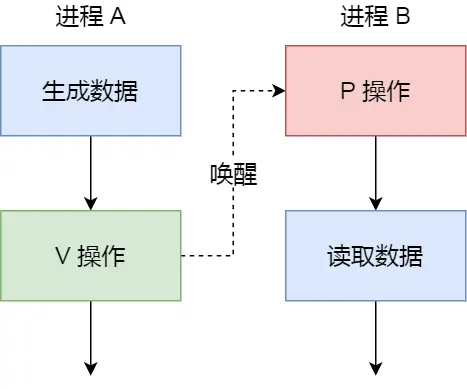

# 进程间有哪些通信方式？


每个进程的用户地址空间都是独立的，一般而言是不能互相访问的，但内核空间是每个进程共享的，所以进程之间通信必须要经过内核。

Linux提供了不少的进程之间通信的机制，我们来看看有哪些？

## 管道
如果你学过linux命令，那你肯定很熟悉" | "这个竖线。
```sh
$ps -ef|grep mysql
```
上面命令行里的"|"竖线就是一个管道，它的功能是将前一个命令(ps -ef)的输出，作为后一个命令(grep mysql)的输入，从这个功能描述，可以看出管道传输数据是单向的，如果想相互通信，我们需要创建两个管道才行。

同时，我们得知上面这种管道是没有名字的，所以"|"表示的管道成为匿名管道，用完了就销毁。

管道还有另外一个类型的是命名管道，也叫FIFO，因为数据是先进现出的传输方式。

在使用命名管道前，先需要通过mkfifo命令来创建，并且制定管道的名字:
```sh
$mkfifo myPipe
```

myPipe就是管道的名称，给予Linux一切皆文件的理念，所以管道也是以文件的方式存在，我们可以用ls看一下，这个文件的类型是p， 也就是pipe的意思:
```sh
$ls -l
prw-r--r--.  1 uos  uos        0 11月 28 14:55  myPipe
```
接下来，我们往管道中写数据：
```sh
$ echo "hello" > myPipe  // 将数据写进管道
                         // 停住了 ...
```
你操作了之后发现命令执行后就会停在这了，这是因为管道里的内容没有被读取，只有当管道里面的数据被读取完后，命令才可以正常退出。

于是，我们执行另外一个命令来读取管道中的数据：
```sh
$ cat < myPipe  // 读取管道里的数据
hello
```
可以看到管道里面的数据被读取出来了，并打印在终端上，另外一方面，echo哪个命令也正常退出了。

我们可以看出，管道这种通信方式效率十分底下，不适合进程间频繁的交互数据。当然，它的好处就是简单，同时我们也很容易知道管道里的数据是否被另外一端读取了。

> 那管道是如何创建的呢？背后的原理是什么？

匿名管道的创建，需要通过下面这个系统调用：
```c
int pipe(int fd[2])
```
这里表示创建一个匿名管道，并返回了两个描述符，一个是管道读取的描述符方的fd[0]，另一个是写入端描述符fd[1]，注意这个匿名管道是个特殊的文件，只存在于内存，不存在于文件系统中。

其实，所谓的管道就是内核里面的一串缓存。从管道的一端写入数据，实际上是缓存在内核中，另一端读取数据，也就是从内核中读取这段数据。另外，管道传输的数据是无格式的流，且大小受限。

看到这，你可能会有疑问了，这两个描述符都是再一个进程里面，并没有起到进程间通信的作用，怎么样才能使得管道是跨过两个进程的呢？

我们可以使用fork创建子进程，创建的子进程会复制父进程的文件描述符，这样就做到了两个进程各有两个fd[0]和fd[1],两个进程可以通过各自的fd写入和读取同一管道文件实现跨进程通信了。

管道只能一端写入，另一端读取，所以上面的这种模式容易造成混乱，因为父进程和子进程都可以同时读写，那么为了避免这种情况，通常的做法是：
- 父进程关闭读取的fd[0]，只保留写入的fd[1];
- 子进程关闭写入的fd[1]，只保留读取的fd[0];

所以说如果需要双向通信，则应该创建两个管道。
到这里，我们仅仅解析了使用管道进行父进程与子进程之间的通信，但是我们在shell里不是这样的。

在shell里执行的是A|B命令的时候，A进程和B进程是shell创建出来的子进程，A|B不存在父子关系，他俩的父进程都是shell。

所以说，在shell里通过"|"匿名管道将多个命令连接在一起，实际也就是创建多个子进程，那么我们在编写shell时，能使一个管道搞定的事情，就不要多用一个管道，这样可以减少创建子进程的系统开销。

我们可以得知，对于匿名管道，它的通信范围是存在父子关系的进程。因为管道没有实体，也就是没有管道文件，只能通过fork来复制父进程fd文件描述符，来达到通信的目的。

不管是匿名管道还是命名管道，进程写入的数据都是缓存在内核中，另一个进程读取数据时自然也是从内核读取数据，同时通讯数据都是遵循先进先出原则，不支持lseek之类的文件定位操作。

## 消息队列
前面说过管道的通信效率低，因此管道不适合进程间频繁的交换数据。

对于这个问题，消息队列的通信模式就可以解决。比如，A进程要给B进程发送消息，A进程把数据放在对应的消息队列就可以正常返回了，B进程需要的时候再去读取数据就可以了。同理，B进程要给A进程发送消息也是如此。

再来，消息队列是保存在内核中的消息链表，在发送数据时，会分成一个一个独立的数据单元，也就是消息体，消息体是用户自定义的数据类型，消息的发送放和接收方要约定好消息体的数据类型，所以每个消息体都是固定大小的存储快，不像管道是无格式的字节流数据。如果进程从消息队列中读取了消息体，内核就会把这个消息体删除。

消息队列生命周期随内核，如果没有释放消息队列或者关闭操作系统，消息队列会一直存在，而前面提到的管道的生命周期是随着进程的创建而建立，随进程的结束而销毁。

消息这种模型，两个进程之间的通信就像平时发邮件一样，你来一封，我回一封，可以频繁沟通了。

但邮件的通信方式存在不足的地方有两点：一是通信不及时，二是附件有大小限制，这同样是消息队列通信不足的点。

消息队列不适合比较大的数据传输，因为在内核中每个消息体都有一个最大长度的限制，同时所有队列所包含的全部消息体总长度也是有上限。在Linux内核中，会有两个宏定义MSGMAX和MSGMNB，他们已字节为单位，分别定一个了一个消息体的最大长度和一个队列的最大长度。

消息队列通信过程中，存在用户态和内核态之间的数据拷贝开销，因为进程写入数据到内核中的消息队列，会发生从用户态到内核态的数据拷贝的过程，同理另一进程读取数据会发生从内核态到用户态的数据拷贝的过程。

## 共享内存
消息队列的读取和写入的过程，都会有用户态和内核态之间的数据拷贝过程。那共享内存的方式，就很好的解决了这一个问题。

现代操作系统，对于内存管理，采用的是虚拟内存技术，也就是每个进程都有自己独立的内存空间，不同进程的虚拟内存映射到不同的物理内存中，所以即使进程A和进程B的虚拟地址是一样的，其实访问的是不同的物理内存地址，对于数据的增删改互补影响。

共享内存的机制，就是拿出一块虚拟地址空间来，映射到相同的物理内存中，这样这个内存写入的东西，另外一个进程马上能看到，都不需要拷贝来拷贝去，传来传去，大大提高了进程间通讯的速度。


## 信号量
用了共享内存通信方式，带了新的问题，那就是如果多个进程同时修改同一个共享内存，很有可能就冲突了。例如两个进程都同时写入同一个地址，那先写的那个进程就会发现内容被别人覆盖了。

为了防止多进程竞争共享资源，而造成数据错乱，所以需要保护机制，使得共享内存资源，在任意时刻只能被一个进程访问。正好，信号量就实现了这一保护机制。

信号量其实是一个整形的计数器，主要用于实现进程之间的互斥同步，而不是用于缓存进程间通信的数据。

信号量表示资源的数量，控制信号量的方式有两种原子操作：
- 一个是P操作，这个操作会把信号量减去1，相减后，如果信号量<0,则表明资源已经被占用，进程需阻塞等待；相减后如果>=0，则表明还有资源可用，进程可以正常访问。
- 一个是V操作，这个操作会把信号量加上1，相加后，如果信号量<=0，则表明当前有阻塞中的进程，于是会将该进程唤醒运行；相加后如果信号量>0，则表明当前没有阻塞中的进程；

P操作是用户进入共享资源之前，V操作是用在离开共享资源之后，这两个操作必须是成对出现的。

接下来举个例子，如果要使两个进程互斥访问共享内存，我们可以初始化信号量为1.

具体过程如下：
- 进程A在访问共享内存之前，先执行了P操作，由于信号量的初始值为1，故在进程A 执行P操作后信号量变成了0，表示共享资源可用，于是进程A就可以访问共享资源了。
- 若此时，进程B也想访问共享内存，执行了P操作，结果信号量变为-1，这就意味着临界资源已经被占用，因此进程B被阻塞。
- 知道进程A访问完共享内存，才会执行V操作，使得信号量回复为0，接着就会唤醒阻塞中的线程B，使得进程B可以访问共享资源，最后完成共享内存的访问后，执行V操作，使信号量回复到初始值1.

可以发现，信号初始化为1，就代表着互斥信号量，它可以保证共享内存在任何时刻只有一个进程在访问，这就很好的保护了共享内存。

另外，在多进程里，每个进程不一定是顺序执行的，他们基本是以各自独立的、不可预知的速度向前推进，但有时我们有希望多个进程能密切合作，以实现一个共同的任务。

例如，进程A是负责生产数据，而进程B是负责读取数据，这两个进程是相互合作、相互依赖的，进程A必须先产生了数据，进程B才能得到数据，所以执行是有先后顺序的。

那么这时候，就可以用信号量来实现多进程同步的方式，我们可以初始化信号量为0 。。。

具体过程：
- 如果进程B比进程A先执行了，那么执行到P操作时，由于信号量初始化为0，故信号量变为-1，表示进程A还没生产数据，于是进程B就阻塞等待；
- 接着，当进程A生产完数据后，执行了V操作，就会使得信号量变为0，于是就会唤醒阻塞在P操作的进程B；
- 最后，进程B被唤醒后，意味着进程A 已经产生了数据，于是进程B就可以正常读取数据了。

可以发现，信号初始化为0，就代表着是同步信号，它可以保证进程A应在进程B之前执行。

## 信号
上面说的进程间通信，都是常规状态下工作模式，对于异常情况下的工作模式，就需要用信号的方式来通知进程：

信号跟信号量虽然名字现相似，但是两者用途完全不一样。就好像Java和JavaScript的区别。

在Linux操作系统中，为了响应这种各样的事件，提供了几十种信号，分别代表不同的意义，我们可以通过kill -l 命令，查看所有信号：
```sh
$ kill -l
 1) SIGHUP       2) SIGINT       3) SIGQUIT      4) SIGILL       5) SIGTRAP
 6) SIGABRT      7) SIGBUS       8) SIGFPE       9) SIGKILL     10) SIGUSR1
11) SIGSEGV     12) SIGUSR2     13) SIGPIPE     14) SIGALRM     15) SIGTERM
16) SIGSTKFLT   17) SIGCHLD     18) SIGCONT     19) SIGSTOP     20) SIGTSTP
21) SIGTTIN     22) SIGTTOU     23) SIGURG      24) SIGXCPU     25) SIGXFSZ
26) SIGVTALRM   27) SIGPROF     28) SIGWINCH    29) SIGIO       30) SIGPWR
31) SIGSYS      34) SIGRTMIN    35) SIGRTMIN+1  36) SIGRTMIN+2  37) SIGRTMIN+3
38) SIGRTMIN+4  39) SIGRTMIN+5  40) SIGRTMIN+6  41) SIGRTMIN+7  42) SIGRTMIN+8
43) SIGRTMIN+9  44) SIGRTMIN+10 45) SIGRTMIN+11 46) SIGRTMIN+12 47) SIGRTMIN+13
48) SIGRTMIN+14 49) SIGRTMIN+15 50) SIGRTMAX-14 51) SIGRTMAX-13 52) SIGRTMAX-12
53) SIGRTMAX-11 54) SIGRTMAX-10 55) SIGRTMAX-9  56) SIGRTMAX-8  57) SIGRTMAX-7
58) SIGRTMAX-6  59) SIGRTMAX-5  60) SIGRTMAX-4  61) SIGRTMAX-3  62) SIGRTMAX-2
63) SIGRTMAX-1  64) SIGRTMAX
```
运行在shell终端的进程，我们可以通过键盘键入某些组合键的时候，给进程发送信号。例如：
- CTRL+C产生SIGINT信号，表示终止该进程；
- CTRL+Z产生SIGTSTP信号，表示停止该进程，但还未结束。

如果进程在后台运行，可以通过kill命令的方式给进程发送信号，但前提是需要知道运行中进程的PID号，例如：
- kill -9 1050 , 表示给PID为1050的进程发送SIGKILL信号，用来立即结束该进程。

所以，信号事件的来源主要有硬件来源（如键盘 Cltr+C ）和软件来源（如 kill 命令）。

信号是进程间通信机制中唯一的异步通信机制，因为可以在任何时候发送信号给某一进程，一旦有信号产生，我们就有下面这几种，用户进程对信号的处理方式。

1.执行默认操作。Linux 对每种信号都规定了默认操作，例如，上面列表中的 SIGTERM 信号，就是终止进程的意思。

2.捕捉信号。我们可以为信号定义一个信号处理函数。当信号发生时，我们就执行相应的信号处理函数。

3.忽略信号。当我们不希望处理某些信号的时候，就可以忽略该信号，不做任何处理。有两个信号是应用进程无法捕捉和忽略的，即 SIGKILL 和 SEGSTOP，它们用于在任何时候中断或结束某一进程。

## Socket
前面提到的管道、消息队列、共享内存、信号量和信号都是在同一台主机上进行进程间通信，那要想跨网络与不同主机上的进程之间通信，就需要 Socket 通信了。

实际上，Socket 通信不仅可以跨网络与不同主机的进程间通信，还可以在同主机上进程间通信。

我们来看看创建 socket 的系统调用：
```c
int socket(int domain, int type, int protocal)
```
三个参数分别代表：

domain 参数用来指定协议族，比如 AF_INET 用于 IPV4、AF_INET6 用于 IPV6、AF_LOCAL/AF_UNIX 用于本机；
type 参数用来指定通信特性，比如 SOCK_STREAM 表示的是字节流，对应 TCP、SOCK_DGRAM 表示的是数据报，对应 UDP、SOCK_RAW 表示的是原始套接字；
protocal 参数原本是用来指定通信协议的，但现在基本废弃。因为协议已经通过前面两个参数指定完成，protocol 目前一般写成 0 即可；
根据创建 socket 类型的不同，通信的方式也就不同：

实现 TCP 字节流通信： socket 类型是 AF_INET 和 SOCK_STREAM；
实现 UDP 数据报通信：socket 类型是 AF_INET 和 SOCK_DGRAM；
实现本地进程间通信： 「本地字节流 socket 」类型是 AF_LOCAL 和 SOCK_STREAM，「本地数据报 socket 」类型是 AF_LOCAL 和 SOCK_DGRAM。另外，AF_UNIX 和 AF_LOCAL 是等价的，所以 AF_UNIX 也属于本地 socket；